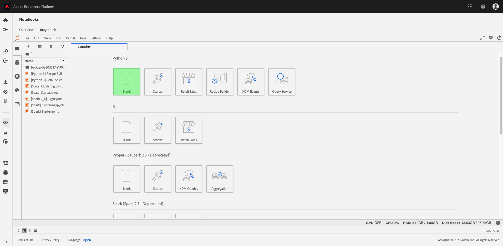
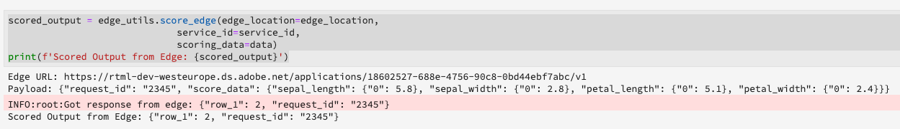

# Score a Real-time Machine Learning model

>[!IMPORTANT]
>Real-time Machine Learning is not available to all users yet. This feature is in alpha and still being tested. This document is subject to change.

This tutorial shows you how to use Real-time Machine Learning nodes to pre-process incoming data and score it against your ONNX model.

>[!IMPORTANT]
> - Functions used in nodes cannot be serialized. For example, a lambda function used in a pandas node.
> - There is a 60 second sleep after edge deployment is done manually. This can be transferred to the score_edge method of EdgeUtils.

>[!NOTE]
>In order to score a model for use in Real-time Machine Learning, you need to have completed the previous tutorial on [training a model for Real-time Machine Learning](./training-ml-model.md)

## Create a new notebook

In the Adobe Experience Platform UI, select **[!UICONTROL Notebooks]** from within *Data Science*. Next, select **[!UICONTROL JupyterLab]** and allow some time for the environment to load.


Start by selecting the **blank Python 3 notebook** from within the JupyterLab launcher.



## Import and discover nodes

Start by importing all the required packages for your model. Make sure any packages you plan on using for node authoring are imported.

>[!NOTE]
>Your list of imports might differ based on what model you made.

```python
import uuid
import json
from pprint import pprint

from rtml_nodelibs.core.nodefactory import NodeFactory as nf
from rtml_sdk.graph.utils import GraphBuilder
from rtml_sdk.edge.utils import EdgeUtils
from rtml_nodelibs.nodes.standard.preprocessing.pandasnode import Pandas
from rtml_nodelibs.nodes.standard.ml.onnx import ONNXNode
from rtml_nodelibs.nodes.standard.preprocessing.json_to_df import JsonToDataframe
from rtml_nodelibs.core.datamsg import DataMsg
```

To see the list of available nodes, copy and paste the following example in your notebook.

```python
# Discover Nodes
pprint(nf.discover_nodes())
```

The response received is a list of nodes.


## Node authoring for edge scoring

Next, you need to define and author a node for edge scoring. Replace the `model_id` in the example with your model ID that you received from completing training in the [previous tutorial](./training-ml-model.md). This example uses the Pandas node to import a pd.DataDrame method or general pandas top level function. The map function is imported and used to create two nodes. For more information on the available nodes and how to use them, visit the [node reference guide](./node-reference.md).

```python
model_id = '{your_model_id}' # Get Model ID from Training Notebook.

data = {'sepal_length': {0: 5.8},
        'sepal_width': {0: 2.8},
        'petal_length': {0: 5.1},
        'petal_width': {0: 2.4}}

json2DF_node = JsonToDataframe(params={"json_payload":json.dumps(data)})
fill_na_node = Pandas(params={"import": "fillna", "kwargs":{"value":0}})
model_score_node = ONNXNode(params={"features": ['sepal_length', 'sepal_width', 'petal_length', 'petal_width'],
                                    "model_id": model_id})
```

## Build Graph DSL

With your nodes created, the next step is to chain the nodes together to create a graph. 

Start by listing all the nodes that are a part of the graph.

```python
nodes = [node_device_apply, node_browser_apply, node_model_score]
```

Next, connect the nodes with edges. Each tuple is an edge connection.

```python
edges = [ (node_device_apply, node_browser_apply), (node_browser_apply, node_model_score)]
```

Once your nodes are connected, build the graph.

```python
dsl = GraphBuilder.generate_dsl(nodes=nodes, edges=edges)
```

## Publish to edge

Now that you have created a graph you can deploy your graph to the edge.

>[!IMPORTANT]
>Do not publish to edge often, this can overload the edge nodes. Publishing the same model multiple times is not recommended.

```python
edge_utils = EdgeUtils()
(edge_location, service_id) = edge_utils.publish_to_edge(dsl=dsl)
```

## Edge client

After publishing to edge, scoring is done by a POST request from a client. Typically, this can be done from a client application that needs ML scores. You can also do it from Postman. Here, EdgeUtils is used to demonstrate the process.

```python
import time
time.sleep(600)
```

```python
data = {"sepal_length": {0: 5.8}, "sepal_width": {0: 2.8}, "petal_length": {0: 5.1}, "petal_width": {0: 2.4}}
```

```python
scored_output = edge_utils.score_edge(edge_location=edge_location,
                              service_id=service_id,
                              scoring_data=data)
print(f'Scored Output from Edge: {scored_output}')
```

Once scoring is complete, the edge URL, Payload, and scored output from edge are returned.



## Deleting a deployed app from edge (optional)

>![CAUTION]
>This cell is used to delete your deployed edge application. Do not use the following cell unless you need to delete a deployed edge application. 

```python
if edge_utils.delete_from_edge(service_id=service_id):
    print(f"Deleted service id {service_id} successfully")
else:
    print(f"Failed to delete service id {service_id}")
```

## Next steps

By following the tutorial above, you have successfully scored and deployed your Real-time Machine Learning model. If you wish to learn more about the nodes available for model authoring, visit the [node reference guide](./node-reference.md).
