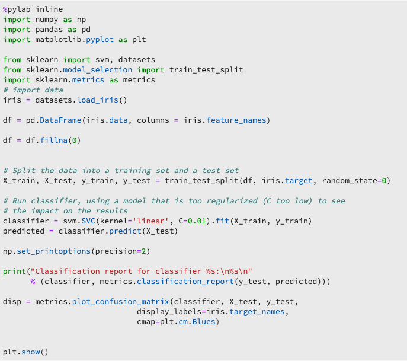
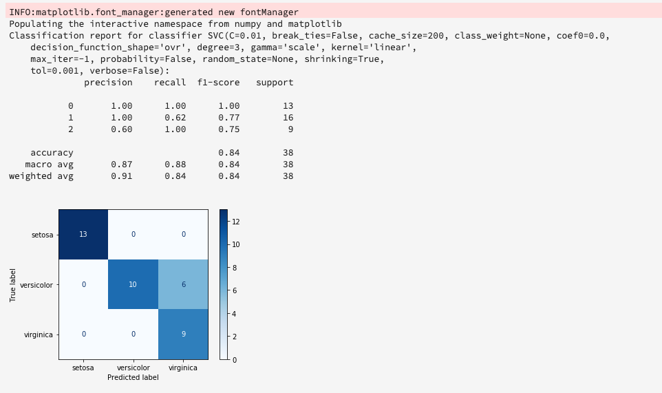
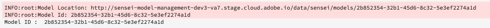

# Training a model for Real-time Machine Learning

This document provides a tutorial for uploading an ONNX model to the Real-time Machine Learning model store. 

Using one of the following options, you are going to write python code to read, preprocess, and analyze data. Next, you are going to train your own ML model, serialize it into ONNX format, and finally upload it to Real-time Machine Learning model store. Additionally, by the end of the tutorial, you are given a model ID that identifies the trained model for use in subsequent tutorials.

* [Training a model using a Python notebook](#training-model-python-notebook)
* [Training a model using your own ONNX model](#train-using-own-onnx-model)
* [Training a model using the recipe-builder template](#train-using-recipe-builder)
* [Training a model using the Data Science Workplace recipe workflow](#recipe-workflow-train-model)


## Train a model using a Python notebook {#training-model-python-notebook}

In the Adobe Experience Platform UI, select **[!UICONTROL Notebooks]** from within *Data Science*. Next, select **[!UICONTROL JupyterLab]** and allow some time for the environment to load.


Start by selecting the **blank Python 3 notebook** from within the JupyterLab launcher.


### Access data {#access-data}

Next, select the dataset you wish to use. To access your dataset in your JupyterLab notebook, select the **Data** tab in the left-navigation of JupyterLab. The *Datasets* and *Schemas* directories appear. Select **[!UICONTROL Datasets]** and right-click, then select the **[!UICONTROL Explore Data in Notebook]** option from the dropdown menu on the ingested dataset you wish to use. An executable code entry appears in your notebook.


### Prepare your model

Use the following template to analyze, pre-process, train, and evaluate your ML model. For a complete example, use the screenshots provided below this template: 

```python
from sklearn import svm, metrics
from sklearn.model_selection import train_test_split


data = df[input_columns]
target = df[target_column]
# Create a classifier: a support vector classifier
classifier = svm.SVC(gamma=0.001)

# Split data into train and test subsets
X_train, X_test, y_train, y_test = train_test_split(
    data, target, test_size=0.5, shuffle=False)

# We train the classifier
classifier.fit(X_train, y_train)

# Now do predictions
predicted = classifier.predict(X_test)


print("Classification report for classifier %s:\n%s\n"
      % (classifier, metrics.classification_report(y_test, predicted)))
disp = metrics.plot_confusion_matrix(classifier, X_test, y_test)
disp.figure_.suptitle("Confusion Matrix")
print("Confusion matrix:\n%s" % disp.confusion_matrix)
```

>[!NOTE]
>The example below uses the scikit-learn library instead of loading the data from an ingested Adobe Experience Platform dataset.




**Output**



### Upload your model

Once you have completed the previous step, you need to serialize your model into an ONNX format and upload it to the Real-time Machine Learning store. This returns the `model_id` used in the [next tutorial](#next-steps).

Use the following template to convert to ONNX and upload your dataset:

```python
from rtml_nodelibs.nodes.standard.ml.artifact_utils import ModelUpload
from rtml_nodelibs.core.nodefactory import NodeFactory as nf
from skl2onnx.common.data_types import FloatTensorType
from skl2onnx import convert_sklearn

#------ Save sklearn model in ONNX format at model_path ------
inputs = [('features', FloatTensorType([None, X_train.shape[1]]))]
model_onnx = convert_sklearn(classifier, 'ScikitLearnModel', inputs)

model_path = "model.onnx"
os.environ["ONNX_MODEL_PATH"] = model_path

with open(model_path, "wb") as f:
	f.write(model_onnx.SerializeToString())

#------- Upload the model from model_path to RTML model store -------
model = ModelUpload(params={'model_path': model_path})

msg_model = model.process(None, 1)

model_id = msg_model.model['model_id']

print("Model ID : ", model_id)
```

**Response**



Once you have received your `model_id`, copy it and proceed to the [next steps](#next-steps).


## Training a model using your own ONNX model {#train-using-own-onnx-model}

In the Adobe Experience Platform UI, select **[!UICONTROL Notebooks]** from within *Data Science*. Next, select **[!UICONTROL JupyterLab]** and allow some time for the environment to load.


Using the upload button located in JupyterLab notebooks, upload your ONNX model to the Data Science Workspace notebooks environment.


Next, create a new blank notebook by selecting the blank notebook icon under Python 3 in the JupyterLab launcher.


Within the blank notebook, copy and paste the following:

>[!NOTE]
> Make sure to provide the `model_path` of the ONNX model you uploaded.

```python
from rtml_nodelibs.nodes.standard.ml.artifact_utils import ModelUpload
from rtml_nodelibs.core.nodefactory import NodeFactory as nf
 
model_path = <path/to/onnx_model>
#------- Upload the model from model_path to RTML model store -------
model = ModelUpload(params={'model_path': model_path})
 
msg_model = model.process(None, 1)
 
model_id = msg_model.model['model_id']
 
print("Model ID : ", model_id)
```

After running the cell above, a `model_id` is returned. Copy the model_id to be used in the [next tutorial](#next-steps)

## Train a model using a pre-built recipe template {#train-using-recipe-builder}

In the Adobe Experience Platform UI, select **[!UICONTROL Notebooks]** from within *Data Science*. Next, select **[!UICONTROL JupyterLab]** and allow some time for the environment to load.


Next, follow the [create a recipe using Jupyter notebooks](../jupyterlab/create-a-recipe.md) tutorial. Once complete, you need to modify the pipeline.py file for real time inferencing to work.

Make sure you save your model in the ONNX format and set the environment variable to `ONNX_MODEL_PATH`. Use the example below to modify the pipeline file.

```python
def train(configProperties, data):

    print("Train Start")

    #########################################
    # Extract fields from configProperties
    #########################################
    learning_rate = float(configProperties['learning_rate'])
    n_estimators = int(configProperties['n_estimators'])
    max_depth = int(configProperties['max_depth'])


    #########################################
    # Fit model
    #########################################
    X_train = data.drop('weeklySalesAhead', axis=1).values
    y_train = data['weeklySalesAhead'].values

    seed = 1234
    model = GradientBoostingRegressor(learning_rate=learning_rate,
                                      n_estimators=n_estimators,
                                      max_depth=max_depth,
                                      random_state=seed)

    model.fit(X_train, y_train)
	
	#------ Save sklearn model in ONNX format at model_path ------
    inputs = [('features', FloatTensorType([None, X_train.shape[1]]))]
	model_onnx = convert_sklearn(model, 'ScikitLearnModel', inputs)

	model_path = "retail_sales_model.onnx"
	os.environ["ONNX_MODEL_PATH"] = model_path

	with open(model_path, "wb") as f:
		f.write(model_onnx.SerializeToString())

    print("Train Complete")

    return model
```

After modifying the pipeline.py file, run **[!UICONTROL Training]** and **[!UICONTROL Scoring]**. Once complete, select the **[!UICONTROL Create Recipe]** button.


A recipe  is created and can be viewed by navigating to **[!UICONTROL Models]** then selecting **[!UICONTROL Recipes]** in the top-left navigation. A list of recipes sorted by creation date appear. Confirm your new recipe is at the top.

 

## Training a model using the Data Science Workplace recipe workflow {#recipe-workflow-train-model}

This is the best method to use if you are familiar with Docker, git and/or packaging python code. It gives you the most amount of flexibility and freedom in creating your recipes on DSW. You can pull our base docker image and build your own docker environment, debug your recipe with more ease,  clone some of our prebuillt recipes to play around with any DSW services, schedule the recipe runs and much more. 

You need a data-schema for your dataset.  (**If you already have data ingested into AEP, skip to next step.) 
* [Create a schema using the schema editor UI tutorial](../../xdm/tutorials/create-schema-ui.md)
* [Create a schema using the schema editor API tutorial](../../xdm/tutorials/create-schema-api.md)

You need to ingest data using the schema that you just created. (** If you already have data ingested into AEP, skip to next step.)
* [Ingest data into Adobe Experience Platform UI tutorial](../../ingestion/tutorials/ingest-batch-data.md)
* [Ingest data into Adobe Experience Platform API tutorial](../../ingestion/batch-ingestion/api-overview.md)

Create a Python recipe 
* [Create a Python recipe](../models-recipes/package-source-files-recipe.md)

Create a training run 
* [Train and evaluate a model in the UI](../models-recipes/train-evaluate-model-ui.md)
* [Train and evaluate a model in the API](../models-recipes/train-evaluate-model-api.md)

In the pipeline.py file for your recipe, make sure to save the model in ONNX format and set the environment variable ONNX_MODEL_PATH.

```python
def train(configProperties, data):
 
    print("Train Start")
 
    #########################################
    # Extract fields from configProperties
    #########################################
    learning_rate = float(configProperties['learning_rate'])
    n_estimators = int(configProperties['n_estimators'])
    max_depth = int(configProperties['max_depth'])
 
 
    #########################################
    # Fit model
    #########################################
    X_train = data.drop('weeklySalesAhead', axis=1).values
    y_train = data['weeklySalesAhead'].values
 
    seed = 1234
    model = GradientBoostingRegressor(learning_rate=learning_rate,
                                      n_estimators=n_estimators,
                                      max_depth=max_depth,
                                      random_state=seed)
 
    model.fit(X_train, y_train)
     
    #------ Save sklearn model in ONNX format at model_path ------
    inputs = [('features', FloatTensorType([None, X_train.shape[1]]))]
    model_onnx = convert_sklearn(model, 'ScikitLearnModel', inputs)
 
    model_path = "retail_sales_model.onnx"
    os.environ["ONNX_MODEL_PATH"] = model_path
 
    with open(model_path, "wb") as f:
        f.write(model_onnx.SerializeToString())
 
    print("Train Complete")
 
    return model
```

Wait for your training run to complete. Once done, click on a specific training run to view the details of that run.


Click on View Activity Logs in the top right corner and download stderr logs to see the details of the run. Logs are particularly useful for failed runs to see what went wrong. But, In our case we are looking for a model-id corresponding to our onnx model.


You do not have to run a scoring job in the recipe. Real-time Machine Learning edge scoring is covered in the [next step](#next-steps).

## Next steps {#next-steps}

By following one of the tutorials above, you have successfully trained and uploaded an ONNX model to the Real-time Machine Learning model store, and have a `model_id` that identifies your model. Continue to the next tutorial to learn how you can [Score your Real-time Machine Learning model](./scoring-ml-model.md).