# Recipe and notebook migration guides

>[!NOTE]
>Notebooks and recipes using [!DNL Python]/R remain unaffected. The migration only applies to PySpark/[!DNL Spark] (2.3) recipes and notebooks.

The following guides outline the steps and information required for migrating existing recipes and notebooks. 

- [Recipe migration guides](#recipe-migration)
- [Notebook migration guides](#notebook-migration)

## Recipe migration guides {#recipe-migration}

Recent changes to [!DNL Data Science Workspace] require that existing [!DNL Spark] and PySpark recipes be updated. Use the following workflows to assist in transitioning your recipes.

- [Spark migration guide](#spark-migration-guide)
  - [Modify how you read and write datasets](#read-write-recipe-spark)
  - [Download the sample recipe](#download-sample-spark)
  - [Add the docker file](#add-dockerfile-spark)
  - [Check dependencies](#change-dependencies-spark)
  - [Prepare docker scripts](#prepare-docker-spark)
  - [create the recipe with docker](#create-recipe-spark)
- [PySpark migration guide](#pyspark-migration-guide)
  - [Modify how you read and write datasets](#pyspark-read-write)
  - [Download the sample recipe](#pyspark-download-sample)
  - [Add the docker file](#pyspark-add-dockerfile)
  - [Prepare docker scripts](#pyspark-prepare-docker)
  - [create the recipe with docker](#pyspark-create-recipe)

## [!DNL Spark] migration guide {#spark-migration-guide}

The recipe artifact that is generated by the build steps is now a Docker image which contains your .jar binary file. Additionally, the syntax used to read and write datasets using the [!DNL Platform] SDK has changed and requires you to modify your recipe code.

The following video is designed to further assist in understanding the changes that are required for [!DNL Spark] recipes:

>[!VIDEO](https://video.tv.adobe.com/v/33243)

### Read and write datasets ([!DNL Spark]) {#read-write-recipe-spark}

Before you build the Docker image, review the examples for reading and writing datasets in the [!DNL Platform] SDK, provided in the sections below. If you are converting existing recipes, your [!DNL Platform] SDK code needs to be updated.

#### Read a dataset

This section outlines the changes that are needed for reading a dataset and uses the [helper.scala](https://github.com/adobe/experience-platform-dsw-reference/blob/master/recipes/scala/src/main/scala/com/adobe/platform/ml/helper/Helper.scala) example, provided by Adobe.

**Old way of reading a dataset**

```scala
 var df = sparkSession.read.format("com.adobe.platform.dataset")
    .option(DataSetOptions.orgId, orgId)
    .option(DataSetOptions.serviceToken, serviceToken)
    .option(DataSetOptions.userToken, userToken)
    .option(DataSetOptions.serviceApiKey, apiKey)
    .load(dataSetId)
```

**New way of reading a dataset**

With the updates to [!DNL Spark] recipes, a number of values need to be added and changed. First, `DataSetOptions` is no longer used. Replace `DataSetOptions` with `QSOption`. Additionally, new `option` parameters are required. Both `QSOption.mode` and `QSOption.datasetId` are needed. Lastly, `orgId` and `serviceApiKey` need to be changed to `imsOrg` and `apiKey`. Review the following example for a comparison on reading datasets:

```scala
import com.adobe.platform.query.QSOption
var df = sparkSession.read.format("com.adobe.platform.query")
  .option(QSOption.userToken", {userToken})
  .option(QSOption.serviceToken, {serviceToken})
  .option(QSOption.imsOrg, {orgId})
  .option(QSOption.apiKey, {apiKey})
  .option(QSOption.mode, "interactive")
  .option(QSOption.datasetId, {dataSetId})
  .load()
```

>[!TIP]
> Interactive mode times out if queries are running longer than 10 minutes. If you are ingesting more than a few gigabytes of data, it is recommended that you switch to "batch" mode. Batch mode takes longer to start up but can handle larger sets of data.

#### Write to a dataset

This section outlines the changes needed for writing a dataset by using the [ScoringDataSaver.scala](https://github.com/adobe/experience-platform-dsw-reference/blob/master/recipes/scala/src/main/scala/com/adobe/platform/ml/ScoringDataSaver.scala) example, provided by Adobe.

**Old way of writing a dataset**

```scala
df.write.format("com.adobe.platform.dataset")
    .option(DataSetOptions.orgId, orgId)
    .option(DataSetOptions.serviceToken, serviceToken)
    .option(DataSetOptions.userToken, userToken)
    .option(DataSetOptions.serviceApiKey, apiKey)
    .save(scoringResultsDataSetId)
```

**New way of writing a dataset**

With the updates to [!DNL Spark] recipes, a number of values need to be added and changed. First, `DataSetOptions` is no longer used. Replace `DataSetOptions` with `QSOption`. Additionally, new `option` parameters are required. `QSOption.datasetId` is needed and replaces the need to load the `{dataSetId}` in `.save()`. Lastly, `orgId` and `serviceApiKey` need to be changed to `imsOrg` and `apiKey`. Review the following example for a comparison on writing datasets:

```scala
import com.adobe.platform.query.QSOption
df.write.format("com.adobe.platform.query")
  .option(QSOption.userToken", {userToken})
  .option(QSOption.serviceToken, {serviceToken})
  .option(QSOption.imsOrg, {orgId})
  .option(QSOption.apiKey, {apiKey})
  .option(QSOption.datasetId, {dataSetId})
  .save()
```

### Package Docker-based source files ([!DNL Spark]) {#package-docker-spark}

Start by navigating to the directory where your recipe is located. 

The following sections use the new Scala Retail Sales recipe which can be found in the [Data Science Workspace public Github repository](https://github.com/adobe/experience-platform-dsw-reference).

### Download the sample recipe ([!DNL Spark]) {#download-sample-spark}

The sample recipe contains files that need to be copied over to your existing recipe. To clone the public Github that contains all the sample recipes, enter the following in terminal:

```BASH
git clone https://github.com/adobe/experience-platform-dsw-reference.git
```

The Scala recipe is located in the following directory `experience-platform-dsw-reference/recipes/scala/retail`.

### Add the Dockerfile ([!DNL Spark]) {#add-dockerfile-spark}

A new file is needed in your recipe folder in order to use the docker based workflow. Copy and paste the Dockerfile from the the recipes folder located at `experience-platform-dsw-reference/recipes/scala/Dockerfile`. Optionally, you can also copy and paste the code below in a new file called `Dockerfile`. 

>[!IMPORTANT]
> The example jar file shown below `ml-retail-sample-spark-*-jar-with-dependencies.jar` should be replaced with the name of your recipe's jar file.

```scala
FROM adobe/acp-dsw-ml-runtime-spark:0.0.1

COPY target/ml-retail-sample-spark-*-jar-with-dependencies.jar /application.jar
```

### Change dependencies ([!DNL Spark]) {#change-dependencies-spark}

If you are using an existing recipe, changes are required in the pom.xml file for dependencies. Change the model-authoring-sdk dependency version to 2.0.0. Next, update the [!DNL Spark] version in the pom file to 2.4.3 and the Scala version to 2.11.12.

```json
<groupId>com.adobe.platform.ml</groupId>
<artifactId>authoring-sdk_2.11</artifactId>
<version>2.0.0</version>
<classifier>jar-with-dependencies</classifier>
```

### Prepare your Docker scripts ([!DNL Spark]) {#prepare-docker-spark}

[!DNL Spark] recipes no longer use Binary Artifacts and instead require building a Docker image. If you have not done so, [download and install Docker](https://www.docker.com/products/docker-desktop).

In the provided Scala sample recipe, you can find the scripts `login.sh` and `build.sh` located at `experience-platform-dsw-reference/recipes/scala/` . Copy and paste these files into your existing recipe. 

Your folder structure should now look similar to the following example (newly added files are highlighted):

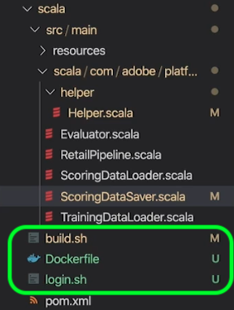

The next step is to follow the [package source files into a recipe](./models-recipes/package-source-files-recipe.md) tutorial. This tutorial has a section that outlines building a docker image for a Scala (Spark) recipe. Once complete, you are provided with the Docker image in an Azure Container Registry along with the corresponding image URL.

### Create a recipe ([!DNL Spark]) {#create-recipe-spark}

In order to create a recipe, you must first complete the [package source files](./models-recipes/package-source-files-recipe.md) tutorial and have your docker image URL ready. You can create a recipe with the UI or API.

To build your recipe using the UI, follow the [import a packaged recipe (UI)](./models-recipes/import-packaged-recipe-ui.md) tutorial for Scala.

To build your recipe using the API, follow the [import a packaged recipe (API)](./models-recipes/import-packaged-recipe-api.md) tutorial for Scala.

## PySpark migration guide {#pyspark-migration-guide}

The recipe artifact that is generated by the build steps is now a Docker image which contains your .egg binary file. Additionally, the syntax used to read and write datasets using the [!DNL Platform] SDK has changed and requires you to modify your recipe code.

The following video is designed to further assist in understanding the changes that are required for PySpark recipes:

>[!VIDEO](https://video.tv.adobe.com/v/33048?learn=on&quality=12)

### Read and write datasets (PySpark) {#pyspark-read-write}

Before you build the Docker image, review the examples for reading and writing datasets in the [!DNL Platform] SDK, provided in the sections below. If you are converting existing recipes, your [!DNL Platform] SDK code needs to be updated.

#### Read a dataset

This section outlines the changes needed for reading a dataset by using the [helper.py](https://github.com/adobe/experience-platform-dsw-reference/blob/master/recipes/pyspark/pysparkretailapp/helper.py) example, provided by Adobe.

**Old way of reading a dataset**

```python
dataset_options = get_dataset_options(spark.sparkContext)
pd = spark.read.format("com.adobe.platform.dataset") 
  .option(dataset_options.serviceToken(), service_token) 
  .option(dataset_options.userToken(), user_token) 
  .option(dataset_options.orgId(), org_id) 
  .option(dataset_options.serviceApiKey(), api_key)
  .load(dataset_id)
```

**New way of reading a dataset**

With the updates to [!DNL Spark] recipes, a number of values need to be added and changed. First, `DataSetOptions` is no longer used. Replace `DataSetOptions` with `qs_option`. Additionally, new `option` parameters are required. Both `qs_option.mode` and `qs_option.datasetId` are needed. Lastly, `orgId` and `serviceApiKey` need to be changed to `imsOrg` and `apiKey`. Review the following example for a comparison on reading datasets:

```python
qs_option = spark_context._jvm.com.adobe.platform.query.QSOption
pd = sparkSession.read.format("com.adobe.platform.query") 
  .option(qs_option.userToken, {userToken}) 
  .option(qs_option.serviceToken, {serviceToken}) 
  .option(qs_option.imsOrg, {orgId}) 
  .option(qs_option.apiKey, {apiKey}) 
  .option(qs_option.mode, "interactive") 
  .option(qs_option.datasetId, {dataSetId}) 
  .load()
```

>[!TIP]
> Interactive mode times out if queries are running longer than 10 minutes. If you are ingesting more than a few gigabytes of data, it is recommended that you switch to "batch" mode. Batch mode takes longer to start up but can handle larger sets of data.

#### Write to a dataset

This section outlines the changes needed for writing a dataset by using the [data_saver.py](https://github.com/adobe/experience-platform-dsw-reference/blob/master/recipes/pyspark/pysparkretailapp/data_saver.py) example, provided by Adobe.

**Old way of writing a dataset**

```python
df.write.format("com.adobe.platform.dataset")
  .option(DataSetOptions.orgId, orgId)
  .option(DataSetOptions.serviceToken, serviceToken)
  .option(DataSetOptions.userToken, userToken)
  .option(DataSetOptions.serviceApiKey, apiKey)
  .save(scoringResultsDataSetId)
```

**New way of writing a dataset**

With the updates to PySpark recipes, a number of values need to be added and changed. First, `DataSetOptions` is no longer used. Replace `DataSetOptions` with `qs_option`. Additionally, new `option` parameters are required.  `qs_option.datasetId` is needed and replaces the need to load the `{dataSetId}` in `.save()` . Lastly, `orgId` and `serviceApiKey` need to be changed to `imsOrg` and `apiKey`. Review the following example for a comparison on reading datasets:

```python
qs_option = spark_context._jvm.com.adobe.platform.query.QSOption
scored_df.write.format("com.adobe.platform.query") 
  .option(qs_option.userToken, {userToken}) 
  .option(qs_option.serviceToken, {serviceToken}) 
  .option(qs_option.imsOrg, {orgId}) 
  .option(qs_option.apiKey, {apiKey}) 
  .option(qs_option.datasetId, {dataSetId}) 
  .save()
```

### Package Docker-based source files (PySpark) {#pyspark-package-docker}

Start by navigating to the directory where your recipe is located. 

For this example the new PySpark Retail Sales recipe is used and can be found in the [Data Science Workspace public Github repository](https://github.com/adobe/experience-platform-dsw-reference).

### Download the sample recipe (PySpark) {#pyspark-download-sample}

The sample recipe contains files that need to be copied over to your existing recipe. To clone the public [!DNL Github] that contains all the sample recipes, enter the following in terminal.

```BASH
git clone https://github.com/adobe/experience-platform-dsw-reference.git
```

The PySpark recipe is located in the following directory `experience-platform-dsw-reference/recipes/pyspark`.

### Add the Dockerfile (PySpark) {#pyspark-add-dockerfile}

A new file is needed in your recipe folder in order to use the docker based workflow. Copy and paste the Dockerfile from the the recipes folder located at `experience-platform-dsw-reference/recipes/pyspark/Dockerfile`. Optionally, you can also copy and paste the code below and make a new file called `Dockerfile`.

>[!IMPORTANT]
> The example egg file shown below `pysparkretailapp-*.egg` should be replaced with the name of your recipe's egg file.

```scala
FROM adobe/acp-dsw-ml-runtime-pyspark:0.0.1
RUN mkdir /recipe

COPY . /recipe

RUN cd /recipe && \
    ${PYTHON} setup.py clean install && \
    rm -rf /recipe

RUN cp /databricks/conda/envs/${DEFAULT_DATABRICKS_ROOT_CONDA_ENV}/lib/python3.6/site-packages/pysparkretailapp-*.egg /application.egg
```

### Prepare your Docker scripts (PySpark) {#pyspark-prepare-docker}

PySpark recipes no longer use Binary Artifacts and instead require building a Docker image. If you have not done so, download and install [Docker](https://www.docker.com/products/docker-desktop).

In the provided PySpark sample recipe, you can find the scripts `login.sh` and `build.sh` located at `experience-platform-dsw-reference/recipes/pyspark` . Copy and paste these files into your existing recipe. 

Your folder structure should now look similar to the following example (newly added files are highlighted):

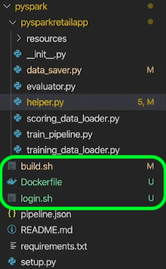

Your recipe is now ready to be built using a Docker image. The next step is to follow the [package source files into a recipe](./models-recipes/package-source-files-recipe.md) tutorial. This tutorial has a section that outlines building a docker image for a PySpark (Spark 2.4) recipe. Once complete, you are provided with the Docker image in an Azure Container Registry along with the corresponding image URL.

### Create a recipe (PySpark) {#pyspark-create-recipe}

In order to create a recipe, you must first complete the [package source files](./models-recipes/package-source-files-recipe.md) tutorial and have your docker image URL ready. You can create a recipe with the UI or API.

To build your recipe using the UI, follow the [import a packaged recipe (UI)](./models-recipes/import-packaged-recipe-ui.md) tutorial for PySpark.

To build your recipe using the API, follow the [import a packaged recipe (API)](./models-recipes/import-packaged-recipe-api.md) tutorial for PySpark.

## Notebook migration guides {#notebook-migration}

Recent changes to [!DNL JupyterLab] notebooks require that you update your existing PySpark and [!DNL Spark] 2.3 notebooks to 2.4. With this change, [!DNL JupyterLab Launcher] has been updated with new starter notebooks. For a step-by-step guide on how to convert your notebooks, select one of the following guides:

- [PySpark 2.3 to 2.4 migration guide](#pyspark-notebook-migration)
- [Spark 2.3 to Spark 2.4 (Scala) migration guide](#spark-notebook-migration)

The following video is designed to further assist in understanding the changes that are required for [!DNL JupyterLab Notebooks]:

>[!VIDEO](https://video.tv.adobe.com/v/33444?quality=12&learn=on)

## PySpark 2.3 to 2.4 notebook migration guide {#pyspark-notebook-migration}

With the introduction of PySpark 2.4 to [!DNL JupyterLab Notebooks], new [!DNL Python] notebooks with PySpark 2.4 are now using the [!DNL Python] 3 kernel instead of the PySpark 3 kernel. This means existing code running on PySpark 2.3 is not supported in PySpark 2.4.

>[!IMPORTANT]
>
>PySpark 2.3 is deprecated and set to be removed in a subsequent release. All existing examples are set to be replaced with PySpark 2.4 examples.

To convert your existing PySpark 3 ([!DNL Spark] 2.3) notebooks to [!DNL Spark] 2.4, follow the examples outlined below:

### Kernel

PySpark 3 ([!DNL Spark] 2.4) notebooks use the Python 3 Kernel instead of the deprecated PySpark kernel used in PySpark 3 (Spark 2.3 - deprecated) notebooks.

To confirm or change the kernel in the [!DNL JupyterLab] UI, select the kernel button located in the top right navigation bar of your notebook. If you are using a one of the predefined launcher notebooks, the kernel is pre-selected. The example below uses the PySpark 3 ([!DNL Spark] 2.4) *Aggregation* notebook starter. 

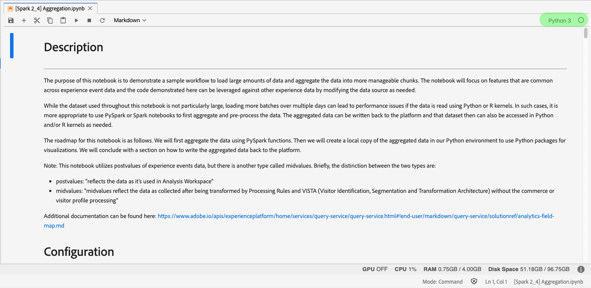

Selecting the drop down menu opens up a list of available kernels.

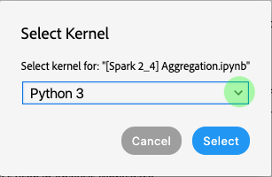

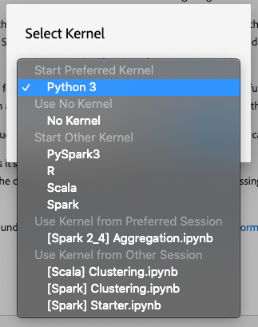

For PySpark 3 ([!DNL Spark] 2.4) notebooks, select the Python 3 kernel and confirm by clicking the **Select** button.

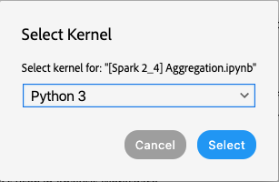

## Initializing sparkSession

All [!DNL Spark] 2.4 notebooks require that you initialize the session with the new boilerplate code.

<table>
  <th>Notebook</th>
  <th>PySpark 3 ([!DNL Spark] 2.3 - deprecated)</th>
  <th>PySpark 3 ([!DNL Spark] 2.4)</th>
  <tr>
  <th>Kernel</th>
  <td align="center">PySpark 3</td>
  <td align="center">Python 3</td>
  </tr>
  <tr>
  <th>Code</th>
  <td>
  <pre class="JSON language-JSON hljs">
  [!DNL spark]
</pre>
  </td>
  <td>
  <pre class="JSON language-JSON hljs">
from pyspark.sql import SparkSession
spark = SparkSession.builder.getOrCreate()
</pre>
  </td>
  </tr>
</table>

The following images highlight the differences in configuration for PySpark 2.3 and PySpark 2.4. This example uses the *Aggregation* starter notebooks provided in [!DNL JupyterLab Launcher].

**Configuration example for 2.3 (deprecated)**

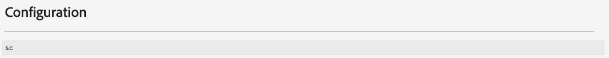


**Configuration example for 2.4**


## Using %dataset magic {#magic}

With the introduction of [!DNL Spark] 2.4, `%dataset` custom magic is supplied for use in new PySpark 3 ([!DNL Spark] 2.4) notebooks ([!DNL Python] 3 kernel).

**Usage**

`%dataset {action} --datasetId {id} --dataFrame {df}`

**Description**

A custom [!DNL Data Science Workspace] magic command for reading or writing a dataset from a [!DNL Python] notebook ([!DNL Python] 3 kernel).

- **{action}**: The type of action to perform on the dataset. Two actions are available "read" or "write".
- **--datasetId {id}**: Used to supply the id of the dataset to read or write. This is a required argument.
- **--dataFrame {df}**: The pandas dataframe. This is a required argument.
  - When the action is "read", {df} is the variable where results of the dataset read operation are available.
  - When the action is "write", this dataframe {df} is written to the dataset.
- **--mode (optional)**: Allowed parameters are "batch", and "interactive". By default the mode is set to "interactive". It is recommended to use "batch" mode when reading large amounts of data.

**Examples**

- **Read example**: `%dataset read --datasetId 5e68141134492718af974841 --dataFrame pd0`
- **Write example**: `%dataset write --datasetId 5e68141134492718af974842 --dataFrame pd0`

## Load into a dataframe in LocalContext

With the introduction of [!DNL Spark] 2.4, [`%dataset`](#magic) custom magic is supplied. The following example highlights the key differences for loading dataframe in PySpark ([!DNL Spark] 2.3) and PySpark ([!DNL Spark] 2.4) notebooks:

**Using PySpark 3 ([!DNL Spark] 2.3 - deprecated) - PySpark 3 Kernel**

```python
dataset_options = sc._jvm.com.adobe.platform.dataset.DataSetOptions
pd0 = spark.read.format("com.adobe.platform.dataset")
  .option(dataset_options.orgId(), "310C6D375BA5248F0A494212@AdobeOrg")
  .load("5e68141134492718af974844")
```

**Using PySpark 3 ([!DNL Spark] 2.4) - Python 3 Kernel**

```python
%dataset read --datasetId 5e68141134492718af974844 --dataFrame pd0
```

| Element | Description |
| ------- | ----------- |
pd0 | Name of pandas dataframe object to use or create. |
[%dataset](#magic) | Custom magic for data access in [!DNL Python] 3 kernel. |

The following images highlight the key differences in loading data for PySpark 2.3 and PySpark 2.4. This example uses the *Aggregation* starter notebooks provided in [!DNL JupyterLab Launcher].

**Loading data in PySpark 2.3 (Luma dataset) - deprecated**

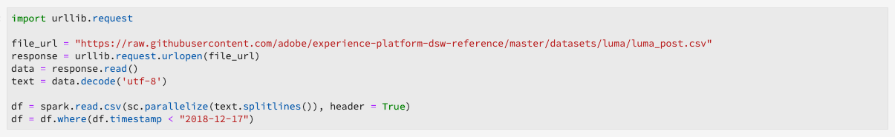

**Loading data in PySpark 2.4 (Luma dataset)**

With PySpark 3 (Spark 2.4) `sc = spark.sparkContext` is defined in loading.

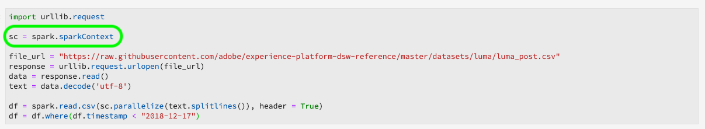

**Loading [!DNL Experience Cloud Platform] data in PySpark 2.3 - deprecated**

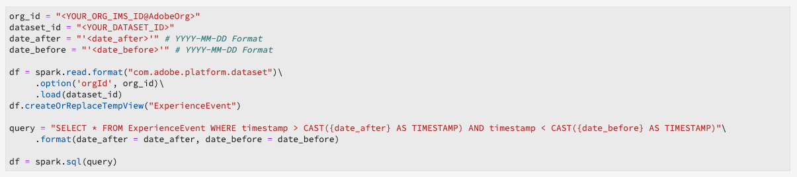

**Loading [!DNL Experience Cloud Platform] data in PySpark 2.4**

With PySpark 3 ([!DNL Spark] 2.4) the `org_id` and `dataset_id` no longer need to be defined. Additionally, `df = spark.read.format` has been replaced with a custom magic [`%dataset`](#magic) to make reading and writing datasets easier.

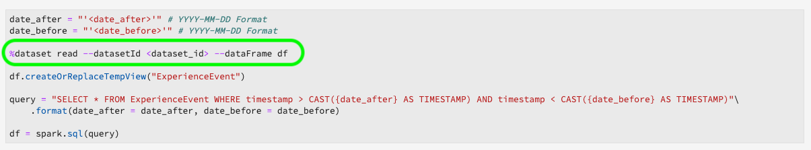

| Element | description |
| ------- | ----------- |
[%dataset](#magic) | Custom magic for data access in [!DNL Python] 3 kernel. |

>[!TIP]
>
>--mode can be set to `interactive` or `batch`. The default for --mode is `interactive`. It is recommended to use `batch` mode when reading large amounts of data.

## Creating a local dataframe

With PySpark 3 ([!DNL Spark] 2.4) `%%` sparkmagic is no longer supported. The following operations can no longer be utilized:

- `%%help`
- `%%info`
- `%%cleanup`
- `%%delete`
- `%%configure`
- `%%local`

The following table outlines the changes needed to convert `%%sql` sparkmagic queries:

<table>
  <th>Notebook</th>
  <th>PySpark 3 ([!DNL Spark] 2.3 - deprecated)</th>
  <th>PySpark 3 ([!DNL Spark] 2.4)</th>
  <tr>
  <th>Kernel</th>
  <td align="center">PySpark 3</td>
  <td align="center">[!DNL Python] 3</td>
  </tr>
  <tr>
  <th>Code</th>
      <td>
         <pre class="JSON language-JSON hljs">%%sql -o df
select * from sparkdf
</pre>
         <pre class="JSON language-JSON hljs"> %%sql -o df -n limit
select * from sparkdf
</pre>
         <pre class="JSON language-JSON hljs">%%sql -o df -q
select * from sparkdf
</pre>
         <pre class="JSON language-JSON hljs"> %%sql -o df -r fraction
select * from sparkdf
</pre>
      </td>
      <td>
         <pre class="JSON language-JSON hljs">
df = spark.sql('''
  SELECT *
  FROM sparkdf
''')
</pre>
         <pre class="JSON language-JSON hljs">
df = spark.sql('''
  SELECT *
  FROM sparkdf
  LIMIT limit
''')
</pre>
         <pre class="JSON language-JSON hljs">
df = spark.sql('''
  SELECT *
  FROM sparkdf
  LIMIT limit
''')
</pre>
         <pre class="JSON language-JSON hljs">
sample_df = df.sample(fraction)
</pre>
      </td>
   </tr>
</table>

>[!TIP]
>
>You can also specify an optional seed sample such as a boolean withReplacement, double fraction, or a long seed.

The following images highlight the key differences for creating a local dataframe in PySpark 2.3 and PySpark 2.4. This example uses the *Aggregation* starter notebooks provided in [!DNL JupyterLab Launcher].

**Create local dataframe PySpark 2.3 - deprecated**

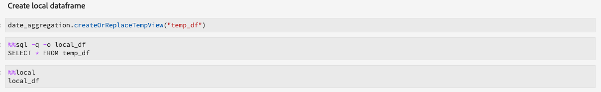

**Create local dataframe PySpark 2.4**

With PySpark 3 ([!DNL Spark] 2.4) `%%sql` Sparkmagic is not longer supported and has been replaced with the following:

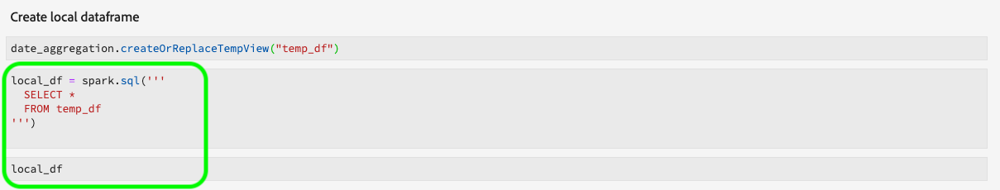

## Write to a dataset

With the introduction of [!DNL Spark] 2.4, [`%dataset`](#magic) custom magic is supplied which makes writing datasets cleaner. To write to a dataset, use the following [!DNL Spark] 2.4 example:

**Using PySpark 3 ([!DNL Spark] 2.3 - deprecated) - PySpark 3 Kernel**

```python
userToken = spark.sparkContext.getConf().get("spark.yarn.appMasterEnv.USER_TOKEN")
serviceToken = spark.sparkContext.getConf().get("spark.yarn.appMasterEnv.SERVICE_TOKEN")
serviceApiKey = spark.sparkContext.getConf().get("spark.yarn.appMasterEnv.SERVICE_API_KEY")

dataset_options = sc._jvm.com.adobe.platform.dataset.DataSetOptions

pd0.write.format("com.adobe.platform.dataset")
  .option(dataset_options.orgId(), "310C6D375BA5248F0A494212@AdobeOrg")
  .option(dataset_options.userToken(), userToken)
  .option(dataset_options.serviceToken(), serviceToken)
  .option(dataset_options.serviceApiKey(), serviceApiKey)
  .save("5e68141134492718af974844")
```

**Using PySpark 3 ([!DNL Spark] 2.4) - [!DNL Python] 3 Kernel**

```python
%dataset write --datasetId 5e68141134492718af974844 --dataFrame pd0
pd0.describe()
pd0.show(10, False)
```

| Element | description |
| ------- | ----------- |
pd0 | Name of pandas dataframe object to use or create. |
[%dataset](#magic) | Custom magic for data access in [!DNL Python] 3 kernel. |

>[!TIP]
>
>--mode can be set to `interactive` or `batch`. The default for --mode is `interactive`. It is recommended to use `batch` mode when reading large amounts of data.

The following images highlight the key differences for writing data back to [!DNL Platform] in PySpark 2.3 and PySpark 2.4. This example uses the *Aggregation* starter notebooks provided in [!DNL JupyterLab Launcher].

**Writing data back to [!DNL Platform] PySpark 2.3 - deprecated**

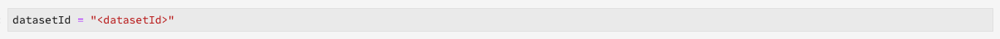
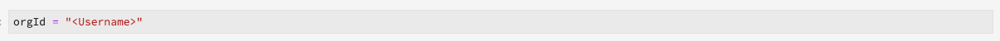
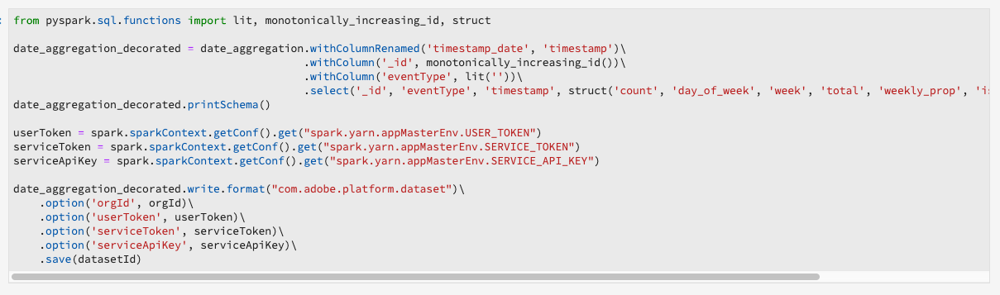

**Writing data back to [!DNL Platform] PySpark 2.4**

With PySpark 3 ([!DNL Spark] 2.4) the `%dataset` custom magic removes the need to define values such as `userToken`, `serviceToken`, `serviceApiKey`, and `.option`. Additionally, `orgId` no longer needs to be defined.

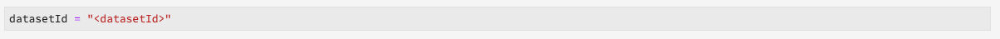
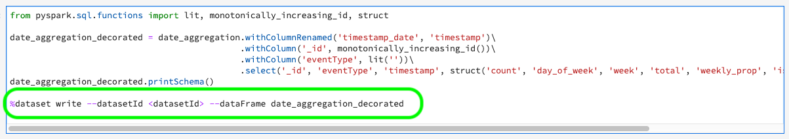

## [!DNL Spark] 2.3 to [!DNL Spark] 2.4 (Scala) notebook migration guide {#spark-notebook-migration}

With the introduction of [!DNL Spark] 2.4 to [!DNL JupyterLab Notebooks], existing [!DNL Spark] ([!DNL Spark] 2.3) notebooks are now using the Scala kernel instead of the [!DNL Spark] kernel. This means existing code running on [!DNL Spark] ([!DNL Spark] 2.3) is not supported in Scala ([!DNL Spark] 2.4). Additionally, all new [!DNL Spark] notebooks should use Scala ([!DNL Spark] 2.4) in the [!DNL JupyterLab Launcher].

>[!IMPORTANT]
>
>[!DNL Spark] ([!DNL Spark] 2.3) is deprecated and set to be removed in a subsequent release. All existing examples are set to be replaced with Scala ([!DNL Spark] 2.4) examples.

To convert your existing [!DNL Spark] ([!DNL Spark] 2.3) notebooks to Scala ([!DNL Spark] 2.4), follow the examples outlined below:

## Kernel

Scala (Spark 2.4) notebooks use the Scala Kernel instead of the deprecated [!DNL Spark] kernel used in [!DNL Spark] ([!DNL Spark] 2.3 - deprecated) notebooks.

To confirm or change the kernel in the [!DNL JupyterLab] UI, select the kernel button located in the top right navigation bar of your notebook. The *Select Kernel* popover appears. If you are using one of the predefined launcher notebooks, the kernel is pre-selected. The example below uses the Scala *Clustering* notebook in [!DNL JupyterLab Launcher].

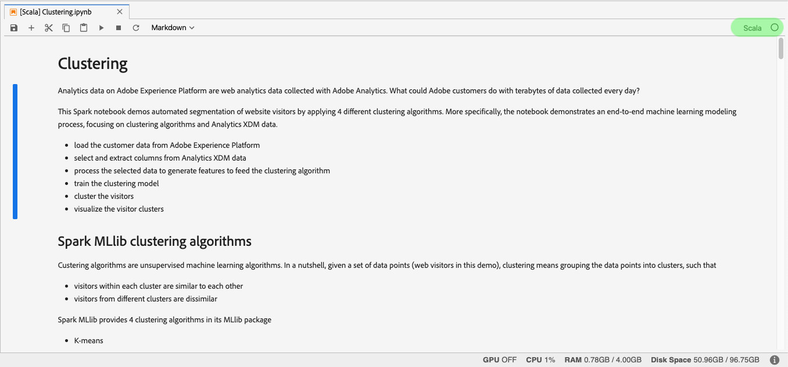

Selecting the drop down menu opens up a list of available kernels.

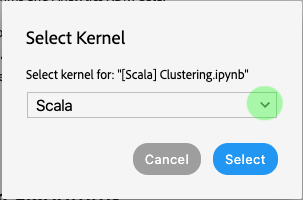

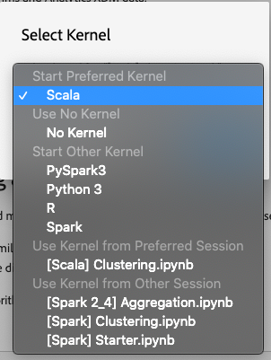

For Scala (Spark 2.4) notebooks, select the Scala kernel and confirm by clicking the **Select** button.

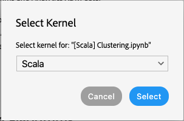

## Initializing SparkSession {#initialize-sparksession-scala}

All Scala ([!DNL Spark] 2.4) notebooks require that you initialize the session with the following boilerplate code:

<table>
  <th>Notebook</th>
  <th>Spark ([!DNL Spark] 2.3 - deprecated)</th>
  <th>Scala ([!DNL Spark] 2.4)</th>
  <tr>
  <th>Kernel</th>
  <td align="center">[!DNL Spark]</td>
  <td align="center">Scala</td>
  </tr>
  <tr>
  <th>code</th>
  <td align="center">
  no code required
  </td>
  <td>
  <pre class="JSON language-JSON hljs">
import org.apache.spark.sql.{ SparkSession }
val spark = SparkSession
  .builder()
  .master("local")
  .getOrCreate()
</pre>
  </td>
  </tr>
</table>

The Scala ([!DNL Spark] 2.4) image below highlights the key difference in initializing sparkSession with the [!DNL Spark] 2.3 [!DNL Spark] kernel and [!DNL Spark] 2.4 Scala kernel. This example uses the *Clustering* starter notebooks provided in [!DNL JupyterLab Launcher].

**[!DNL Spark] ([!DNL Spark] 2.3 - deprecated)**

[!DNL Spark] ([!DNL Spark] 2.3 - deprecated) uses the [!DNL Spark] kernel, and therefore, you were not required to define [!DNL Spark].

**Scala ([!DNL Spark] 2.4)**

Using [!DNL Spark] 2.4 with the Scala kernel requires that you define `val spark` and import `SparkSesson` in order to read or write:

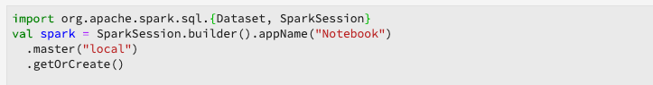

## Query data

With Scala ([!DNL Spark] 2.4) `%%` sparkmagic is no longer supported. The following operations can no longer be utilized:

- `%%help`
- `%%info`
- `%%cleanup`
- `%%delete`
- `%%configure`
- `%%local`

The following table outlines the changes needed to convert `%%sql` sparkmagic queries:

<table>
  <th>Notebook</th>
  <th>[!DNL Spark] ([!DNL Spark] 2.3 - deprecated)</th>
  <th>Scala ([!DNL Spark] 2.4)</th>
  <tr>
  <th>Kernel</th>
  <td align="center">[!DNL Spark]</td>
  <td align="center">Scala</td>
  </tr>
  <tr>
  <th>code</th>
    <td>
       <pre class="JSON language-JSON hljs">
%%sql -o df
select * from sparkdf
</pre>
         <pre class="JSON language-JSON hljs">
%%sql -o df -n limit
select * from sparkdf
</pre>
         <pre class="JSON language-JSON hljs">
%%sql -o df -q
select * from sparkdf
</pre>
         <pre class="JSON language-JSON hljs">
%%sql -o df -r fraction
select * from sparkdf
</pre>
      </td>
      <td>
         <pre class="JSON language-JSON hljs">
val df = spark.sql('''
  SELECT *
  FROM sparkdf
''')
</pre>
         <pre class="JSON language-JSON hljs">
val df = spark.sql('''
  SELECT *
  FROM sparkdf
  LIMIT limit
''')
</pre>
         <pre class="JSON language-JSON hljs">
val df = spark.sql('''
  SELECT *
  FROM sparkdf
  LIMIT limit
''')
</pre>
         <pre class="JSON language-JSON hljs">
val sample_df = df.sample(fraction) </pre>
      </td>
   </tr>
</table>

The Scala ([!DNL Spark] 2.4) image below highlights the key differences in making queries with the [!DNL Spark] 2.3 [!DNL Spark] kernel and Spark 2.4 Scala kernel. This example uses the *Clustering* starter notebooks provided in [!DNL JupyterLab Launcher].

**[!DNL Spark] ([!DNL Spark] 2.3 - deprecated)**

The [!DNL Spark] ([!DNL Spark] 2.3 - deprecated) notebook uses the [!DNL Spark] kernel. The [!DNL Spark] kernel supports and uses `%%sql` sparkmagic.

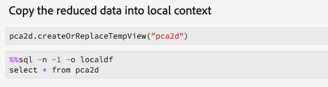

**Scala ([!DNL Spark] 2.4)**

The Scala kernel no longer supports `%%sql` sparkmagic. Existing sparkmagic code needs to be converted.

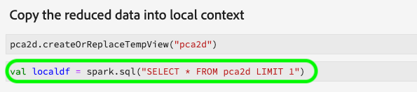

## Read a dataset {#notebook-read-dataset-spark}

In [!DNL Spark] 2.3 you needed define variables for `option` values used to read data or use the raw values in the code cell. In Scala, you can use `sys.env("PYDASDK_IMS_USER_TOKEN")` to declare and return a value, this eliminates the need to define variables such as `var userToken`. In the Scala (Spark 2.4) example below, `sys.env` is used to define and return all the required values needed for reading a dataset.

**Using [!DNL Spark] ([!DNL Spark] 2.3 - deprecated) - [!DNL Spark] Kernel**

```scala
import com.adobe.platform.dataset.DataSetOptions
var df1 = spark.read.format("com.adobe.platform.dataset")
  .option(DataSetOptions.orgId, "310C6D375BA5248F0A494212@AdobeOrg")
  .option(DataSetOptions.batchId, "dbe154d3-197a-4e6c-80f8-9b7025eea2b9")
  .load("5e68141134492718af974844")
```

**Using Scala ([!DNL Spark] 2.4) - Scala Kernel**

```scala
import org.apache.spark.sql.{Dataset, SparkSession}
val spark = SparkSession.builder().master("local").getOrCreate()
val df1 = spark.read.format("com.adobe.platform.query")
  .option("user-token", sys.env("PYDASDK_IMS_USER_TOKEN"))
  .option("ims-org", sys.env("IMS_ORG_ID"))
  .option("api-key", sys.env("PYDASDK_IMS_CLIENT_ID"))
  .option("service-token", sys.env("PYDASDK_IMS_SERVICE_TOKEN"))
  .option("mode", "interactive")
  .option("dataset-id", "5e68141134492718af974844")
  .load()
```

| element | description |
| ------- | ----------- |
| df1 | A variable that represents the Pandas dataframe used to read and write data. |
| user-token | Your user token that is automatically fetched using `sys.env("PYDASDK_IMS_USER_TOKEN")`.  |
| service-token | Your service token that is automatically fetched using `sys.env("PYDASDK_IMS_SERVICE_TOKEN")`. |
| ims-org | Your ims-org id that is automatically fetched using `sys.env("IMS_ORG_ID")`. |
| api-key | Your api key that is automatically fetched using `sys.env("PYDASDK_IMS_CLIENT_ID")`. |

The images below highlight the key differences in loading data with the [!DNL Spark] 2.3 and [!DNL Spark] 2.4. This example uses the *Clustering* starter notebooks provided in [!DNL JupyterLab Launcher].

**[!DNL Spark] ([!DNL Spark] 2.3 - deprecated)**

The [!DNL Spark] ([!DNL Spark] 2.3 - deprecated) notebook uses the [!DNL Spark] kernel. The following two cells shows an example of loading the dataset with a specified dataset id in the date range of (2019-3-21, 2019-3-29).

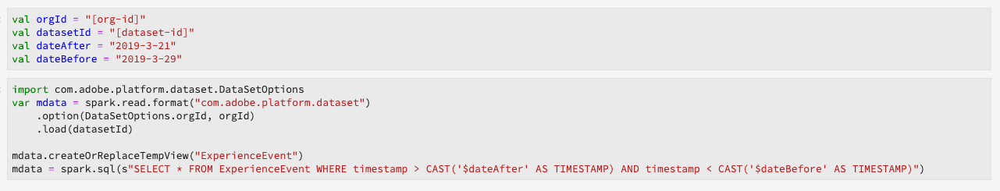

**Scala ([!DNL Spark] 2.4)**

The Scala ([!DNL Spark] 2.4) notebook uses the Scala kernel which requires more values upon setup as highlighted in the first code cell. Additionally, `var mdata` requires more `option` values to be filled. In this notebook, the previously mentioned code for [initializing SparkSession](#initialize-sparksession-scala) is included within the `var mdata` code cell.

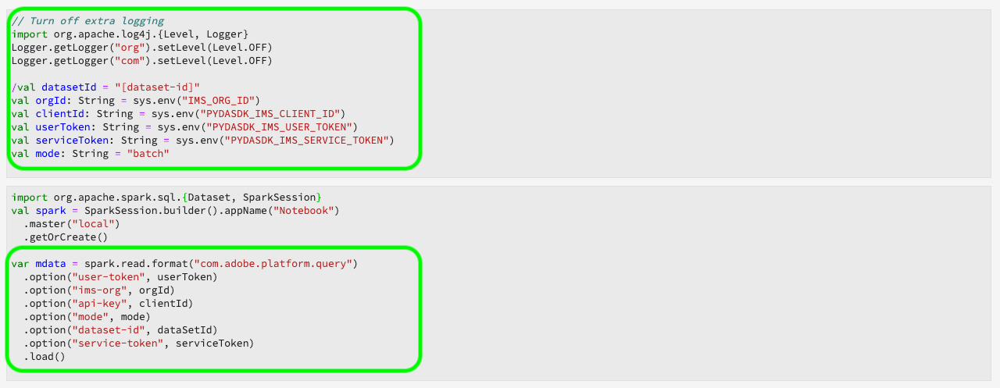

>[!TIP]
>
>In Scala, you can use `sys.env()` to declare and return a value from within `option`. This eliminates the need to define variables if you know they are only going to be used a single time. The following example takes `val userToken` in the above example and declares it in-line within `option`:
> `.option("user-token", sys.env("PYDASDK_IMS_USER_TOKEN"))`

## Write to a dataset

 Similar to [reading a dataset](#notebook-read-dataset-spark), writing to a dataset requires additional `option` values outlined in the example below. In Scala, you can use `sys.env("PYDASDK_IMS_USER_TOKEN")` to declare and return a value, this eliminates the need to define variables such as `var userToken`. In the Scala example below, `sys.env` is used to define and return all the required values needed for writing to a dataset.

**Using [!DNL Spark] ([!DNL Spark] 2.3 - deprecated) - [!DNL Spark] Kernel**

```scala
import com.adobe.platform.dataset.DataSetOptions

var userToken = spark.sparkContext.getConf.getOption("spark.yarn.appMasterEnv.USER_TOKEN").get
var serviceToken = spark.sparkContext.getConf.getOption("spark.yarn.appMasterEnv.SERVICE_TOKEN").get
var serviceApiKey = spark.sparkContext.getConf.getOption("spark.yarn.appMasterEnv.SERVICE_API_KEY").get

df1.write.format("com.adobe.platform.dataset")
  .option(DataSetOptions.orgId, "310C6D375BA5248F0A494212@AdobeOrg")
  .option(DataSetOptions.userToken, userToken)
  .option(DataSetOptions.serviceToken, serviceToken)
  .option(DataSetOptions.serviceApiKey, serviceApiKey)
  .save("5e68141134492718af974844")
```

**Using Scala ([!DNL Spark] 2.4) - Scala Kernel**

```scala
import org.apache.spark.sql.{Dataset, SparkSession}

val spark = SparkSession.builder().master("local").getOrCreate()

df1.write.format("com.adobe.platform.query")
  .option("user-token", sys.env("PYDASDK_IMS_USER_TOKEN"))
  .option("service-token", sys.env("PYDASDK_IMS_SERVICE_TOKEN"))
  .option("ims-org", sys.env("IMS_ORG_ID"))
  .option("api-key", sys.env("PYDASDK_IMS_CLIENT_ID"))
  .option("mode", "interactive")
  .option("dataset-id", "5e68141134492718af974844")
  .save()
```

| element | description |
| ------- | ----------- |
| df1 | A variable that represents the Pandas dataframe used to read and write data. |
| user-token | Your user token that is automatically fetched using `sys.env("PYDASDK_IMS_USER_TOKEN")`.  |
| service-token | Your service token that is automatically fetched using `sys.env("PYDASDK_IMS_SERVICE_TOKEN")`. |
| ims-org | Your ims-org id that is automatically fetched using `sys.env("IMS_ORG_ID")`. |
| api-key | Your api key that is automatically fetched using `sys.env("PYDASDK_IMS_CLIENT_ID")`. |