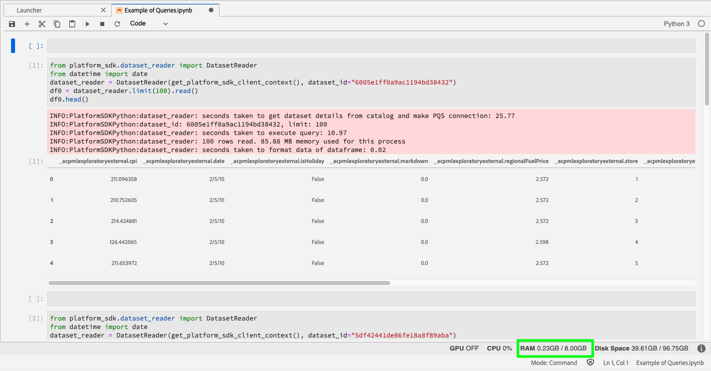
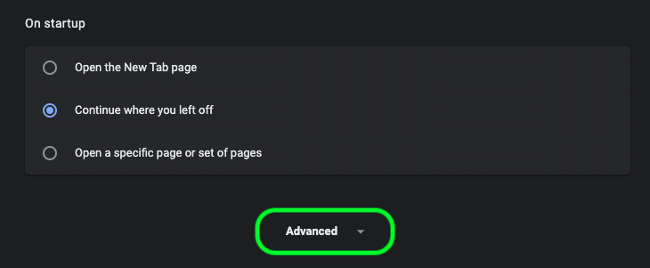
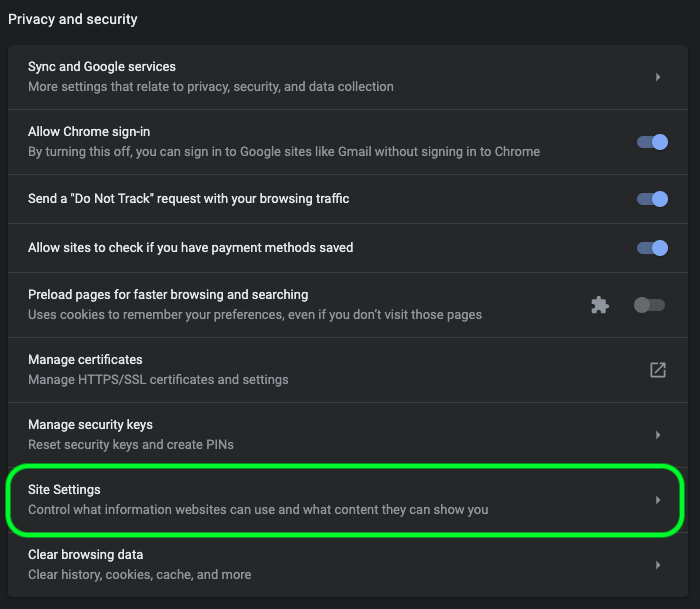
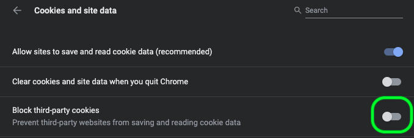
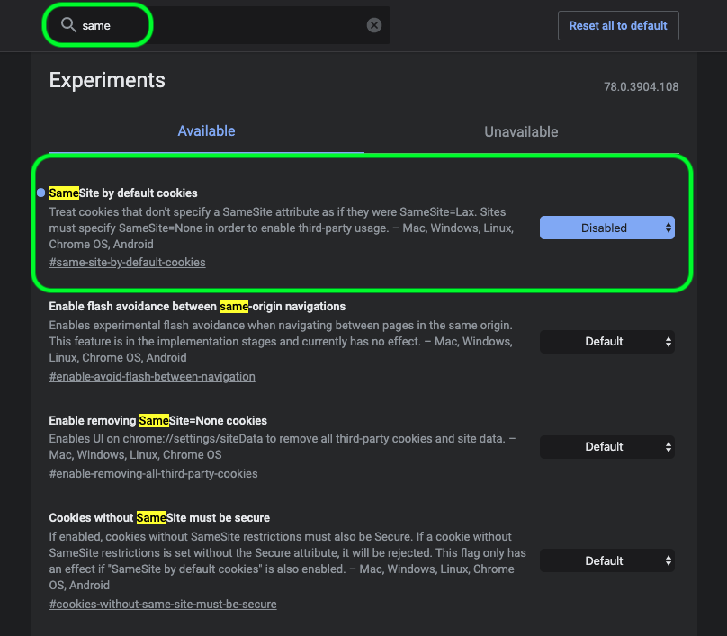
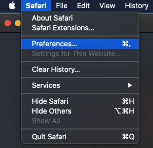
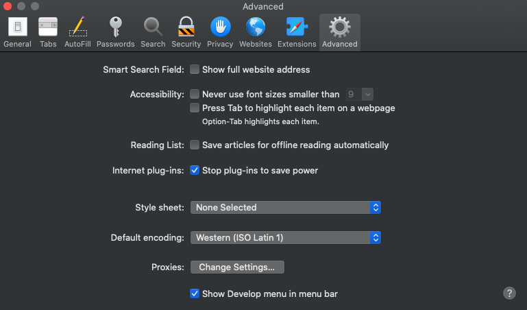
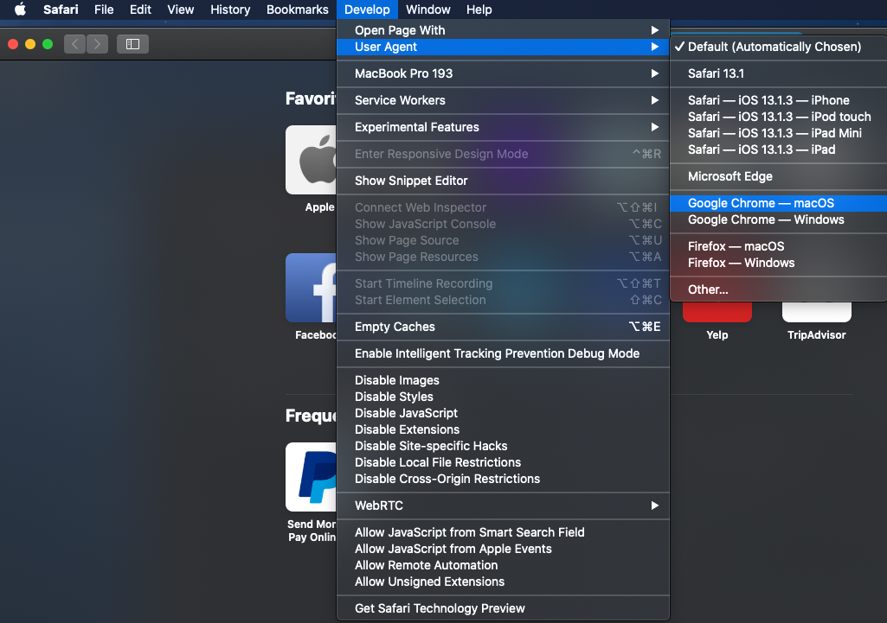
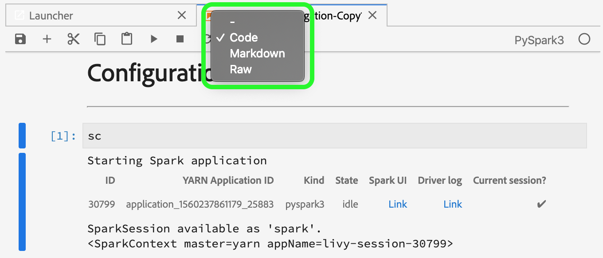

# [!DNL Data Science Workspace] troubleshooting guide

This document provides answers to frequently asked questions about Adobe Experience Platform [!DNL Data Science Workspace]. For questions and troubleshooting regarding [!DNL Platform] APIs in general, see the [Adobe Experience Platform API troubleshooting guide](../landing/troubleshooting.md).

## JupyterLab Notebook query status stuck in execution state

A JupyterLab Notebook may indicate a cell is in the executing state, indefinitely, in some out of memory conditions. For example, when querying a large dataset or performing multiple subsequent queries the JupyterLab Notebook can run out of available memory to store the resulting dataframe object. There are a few indicators which can be seen in this situation. First, the kernel enters the idle state even though the cell shows as executing indicated by the [`*`] icon next to the cell. In addition, the bottom bar indicates the amount of RAM used/available.



During the data read, the memory may grow until it hits your maximum amount of allocated memory. The memory is freed as soon as the max memory is reached and the kernel restarts. This means the used memory in this scenario may show as very low due to the kernel restart whereas just before the restart, the memory would have been very close to the maximum allocated RAM.

To resolve this issue, select the gear icon in the top right of JupyterLab and slide the slider to the right followed by selecting **[!UICONTROL Update configs]** to allocate more RAM. Additionally, if you are running multiple queries and your RAM value is nearing the maximum allocated amount, unless you need the results from previous queries, restart the kernel to reset the available amount of RAM. This ensures that you have the maximum amount of RAM available to the current query.


In the event you are allocating the maximum amount of memory (RAM) and still encountering this issue, you can  modify your query to operate on a smaller dataset size by reducing the columns or range of data. To use the full amount of data, it is recommended you leverage a Spark notebook.

## [!DNL JupyterLab] environment is not loading in [!DNL Google Chrome]

>[!IMPORTANT]
>
>This issue has been resolved but could still be present in the Google Chrome 80.x browser. Please ensure your Chrome browser is up-to-date. 

With the [!DNL Google Chrome] browser version 80.x, all third-party cookies are blocked by default. This policy can prevent [!DNL JupyterLab] from loading within Adobe Experience Platform.

To remedy this issue use the following steps: 

 In your [!DNL Chrome] browser, navigate to the top-right and select **Settings** (alternatively you can copy and paste "chrome://settings/" in the address bar). Next, scroll to the bottom of the page and click the **Advanced** dropdown.
   


The **Privacy and security** section appears. Next, click on **Site settings** followed by **Cookies and site data**.
   



Lastly, toggle "Block third-party cookies" to "OFF". 



>[!NOTE]
>
>Alternatively, you could disable third-party cookies and add [*.]ds.adobe.net to the allow list.

Navigate to "chrome://flags/" in your address bar. Search for and disable the flag titled *"SameSite by default cookies"* by using the dropdown menu on the right.
   
   

After Step 2, you are prompted to relaunch your browser. After you relaunch, [!DNL Jupyterlab] should be accessible.

## Why am I unable to access [!DNL JupyterLab] in Safari?

Safari disables third-party cookies by default in Safari < 12. Because your [!DNL Jupyter] virtual machine instance resides on a different domain than its parent frame, Adobe Experience Platform currently requires that third-party cookies be enabled. Please enable third-party cookies or switch to a different browser such as [!DNL Google Chrome].

For Safari 12, you need to switch your User Agent to '[!DNL Chrome]' or '[!DNL Firefox]'. To switch your User Agent, start by opening the *Safari* menu and select **Preferences**. The preferences window appears.



Within the Safari preferences window, select **Advanced**. Then check the *Show Develop menu in menu bar* box. You can close the preferences window after this step is complete.



Next, from the top navigation bar select the **Develop** menu. From within the **Develop** dropdown, hover over **User Agent**. You can select the **[!DNL Chrome]** or **[!DNL Firefox]** User Agent string you would like to use.



## Why am I seeing a '403 Forbidden' message when trying to upload or delete a file in [!DNL JupyterLab]?

If your browser is enabled with advertisement blocking software such as [!DNL Ghostery] or [!DNL AdBlock] Plus, the domain "\*.adobe.net" must be allowed in each advertisement blocking software for [!DNL JupyterLab] to operate normally. This is because [!DNL JupyterLab] virtual machines run on a different domain than the [!DNL Experience Platform] domain.

## Why do some parts of my [!DNL Jupyter Notebook] look scrambled or do not render as code?

This can happen if the cell in question is accidentally changed from "Code" to "Markdown". While a code cell is focused, pressing the key combination **ESC+M** changes the type of the cell to Markdown. A cell's type can be changed by the dropdown indicator at the top of the notebook for the selected cell(s). To change a cell type to code, start by selecting the given cell you want to change. Next, click the dropdown that indicates the cell's current type, then select "Code".



## How do I install custom [!DNL Python] libraries?

The [!DNL Python] kernel comes pre-installed with many popular machine learning libraries. However, you can install additional custom libraries by executing the following command within a code cell:

```shell
!pip install {LIBRARY_NAME}
```

For a complete list of pre-installed [!DNL Python] libraries, see the [appendix section of the JupyterLab User Guide](./jupyterlab/overview.md#supported-libraries).

## Can I install custom PySpark libraries?

Unfortunately, you cannot install additional libraries for the PySpark kernel. However, you can contact your Adobe customer service representative to have custom PySpark libraries installed for you.

For a list of pre-installed PySpark libraries, see the [appendix section of the JupyterLab User Guide](./jupyterlab/overview.md#supported-libraries). 

## Is it possible to configure [!DNL Spark] cluster resources for [!DNL JupyterLab] [!DNL Spark] or PySpark kernel?

You can configure resources by adding the following block to the first cell of your notebook:

```python
%%configure -f 
{
    "numExecutors": 10,
    "executorMemory": "8G",
    "executorCores":4,
    "driverMemory":"2G",
    "driverCores":2,
    "conf": {
        "spark.cores.max": "40"
    }
}
```

For more information on [!DNL Spark] cluster resource configuration, including the complete list of configurable properties, see the [JupyterLab User Guide](./jupyterlab/overview.md#kernels).

## Why am I receiving an error when trying execute certain tasks for larger datasets?

If you are receiving an error with a reason such as `Reason: Remote RPC client disassociated. Likely due to containers exceeding thresholds, or network issues.` This typically means the driver or an executor is running out of memory. See the JupyterLab Notebooks [data access](./jupyterlab/access-notebook-data.md) documentation for more information on data limits and how to execute tasks on large datasets. Typically this error can be solved by changing the `mode` from `interactive` to `batch`.

Additionally, while writing large Spark/PySpark datasets, caching your data (`df.cache()`) before executing the write code can greatly improve performance. 

<!-- remove this paragraph at a later date once the sdk is updated -->

If you are experiencing problem while reading data and are applying transformations to the data, try caching your data before the transformations. Caching your data prevents multiple reads across the network. Start by reading the data. Next, cache (`df.cache()`) the data. Lastly, perform a your transformations.

## Why are my Spark/PySpark notebooks taking so long to read and write data?

If you are performing transformations on data, such as using `fit()`, the transformations may be executing multiple times. To increase performance, cache your data using `df.cache()` before performing the `fit()`. This ensures that the transformations are only executed a single time and prevents multiple reads across the network.

**Recommended order:** Start by reading the data. Next, perform transformations followed by caching (`df.cache()`) the data. Lastly, perform a `fit()`.

## Why are my Spark/PySpark notebooks failing to run?

If you are receiving any of the following errors: 

- Job aborted due to stage failure ... Can only zip RDDs with same number of elements in each partition.
- Remote RPC client disassociated and other memory errors.
- Poor performance when reading and writing datasets.

Check to make sure you are caching the data (`df.cache()`) before writing the data. When executing code in notebooks, using `df.cache()` before an action such as `fit()` can greatly improve notebook performance. Using `df.cache()` before writing a dataset ensures that the transformations are only executed a single time instead of multiple times.

## [!DNL Docker Hub] limit restrictions in Data Science Workspace

As of November 20, 2020, rate limits for anonymous and free authenticated use of Docker Hub went into effect. Anonymous and Free [!DNL Docker Hub] users are limited to 100 container image pull requests every six hours. If you are affected by these changes you will receive this error message: `ERROR: toomanyrequests: Too Many Requests.` or `You have reached your pull rate limit. You may increase the limit by authenticating and upgrading: https://www.docker.com/increase-rate-limits.`.

Currently, this limit will only affect your organization if you are attempting to build 100 Notebook to Recipes within the six hour timeframe or if you are using Spark based Notebooks within Data Science Workspace that are frequently scaling up and down. However, this is unlikely, since the cluster these run on remain active for two hours before idling out. This reduces the number of pulls required when the cluster is active. If you receive any of the above errors, you will need to wait until your [!DNL Docker] limit is reset.

For more information about [!DNL Docker Hub] rate limits, visit the [DockerHub documentation](https://www.docker.com/increase-rate-limits). A solution for this is being worked on and expected in a subsequent release.
