# [!DNL Data Science Workspace] walkthrough

This document provides a walkthrough for Adobe Experience Platform [!DNL Data Science Workspace]. This tutorial outlines a general data scientist workflow and how they might approach and solve a problem using machine learning.

## Prerequisites

- A registered Adobe ID account
    - The Adobe ID account must have been added to an Organization with access to Adobe Experience Platform and [!DNL Data Science Workspace].

## Retail use case

A retailer faces many challenges to stay competitive in the current market. One of the retailer's main concerns is to decide on the optimal pricing of a product and to predict sale trends. With an accurate prediction model, a retailer would be able to find the relationship between demand and pricing policies and make optimized pricing decisions to maximize sales and revenue.

## Data scientist's solution

A data scientist's solution is to leverage the wealth of historical information provided by a retailer, to predict future trends and to optimize pricing decisions. This walkthrough uses past sales data to train a machine learning model and uses the model to predict future sale trends. With this, you can generate insights to help make optimal pricing changes.

This overview mirrors the steps a data scientist would go through to take a dataset and to create a model to predict weekly sales. This tutorial covers the following sections in the Sample Retail Sales Notebook on Adobe Experience Platform [!DNL Data Science Workspace]:

- [Setup](#setup)
- [Exploring Data](#exploring-data)
- [Feature Engineering](#feature-engineering)
- [Training and Verification](#training-and-verification)

### Notebooks in [!DNL Data Science Workspace]

In the Adobe Experience Platform UI, select **[!UICONTROL Notebooks]** from within the **[!UICONTROL Data Science]** tab, to bring you to the [!UICONTROL Notebooks] overview page. From this page, select the [!DNL JupyterLab] tab to launch your [!DNL JupyterLab] environment. The default landing page for [!DNL JupyterLab] is the **[!UICONTROL Launcher]**.

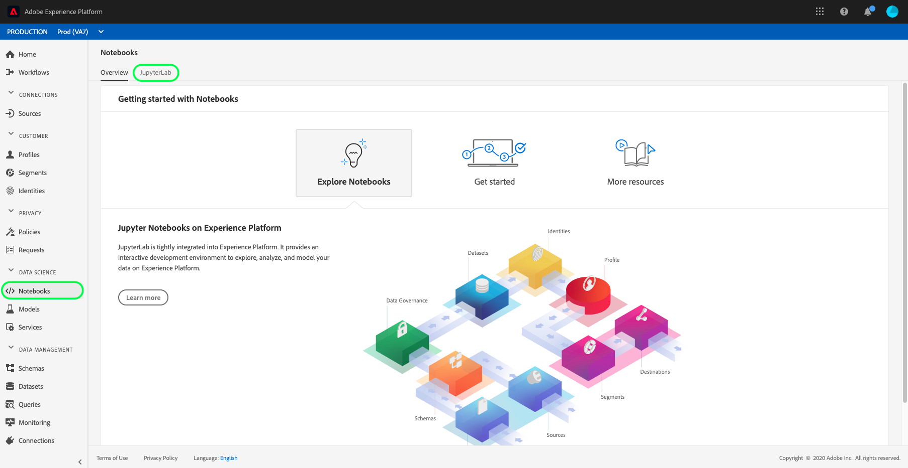

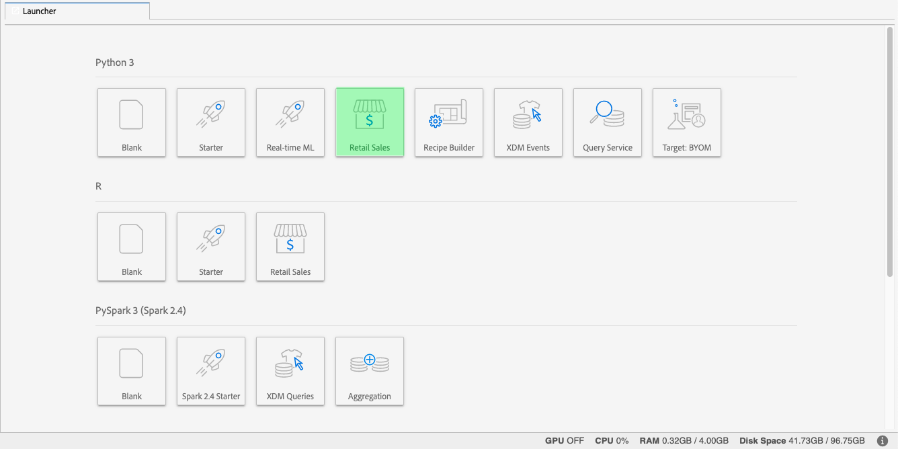

This tutorial uses [!DNL Python] 3 in [!DNL JupyterLab Notebooks] to show how to access and explore the data. In the Launcher page there are sample notebooks provided. The **[!UICONTROL Retail Sales]** sample notebook is used in the examples provided below.

### Setup {#setup}

With the Retail Sales notebook opened, the first thing you should do is to load the libraries required for your workflow. The following list gives a short description for each of the libraries used in the examples in later steps.

- **numpy**: Scientific computing library that adds support for large, multi-dimensional arrays and matrices
- **pandas**: Library that offers data structures and operations used for data manipulation and analysis
- **matplotlib.pyplot**: Plotting library that provides a MATLAB-like experience when plotting
- **seaborn** : High-level interface data visualization library based on matplotlib
- **sklearn**: Machine learning library that features classification, regression, support vector, and cluster algorithms
- **warnings**: Library that controls warning messages

### Explore data {#exploring-data}

#### Load data

After the libraries are loaded, you can start looking at the data. The following [!DNL Python] code uses pandas' `DataFrame` data structure and the [read_csv()](https://pandas.pydata.org/pandas-docs/stable/generated/pandas.read_csv.html#pandas.read_csv) function to read the CSV hosted on [!DNL Github] into the pandas DataFrame:

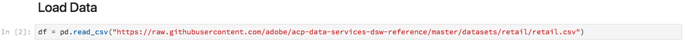

Pandas' DataFrame data structure is a two-dimensional labeled data structure. To quickly see the dimensions of your data, you can use `df.shape`. This returns a tuple that represents the dimensionality of the DataFrame:

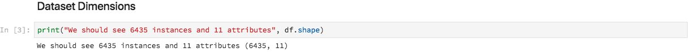

Finally, you can preview what your data looks like. You can use `df.head(n)` to view the first `n` rows of the DataFrame:


#### Statistical summary

We can leverage [!DNL Python's] pandas library to get the data type of each attribute. The output of the following call will give us information about the number of entries and the data type for each of the columns:

```PYTHON
df.info()
```


This information is useful since knowing the data type for each column will enable us to know how to treat the data.

Now let's look at the statistical summary. Only the numeric data types will be shown so `date`, `storeType`, and `isHoliday` will not be outputted:

```PYTHON
df.describe()
```

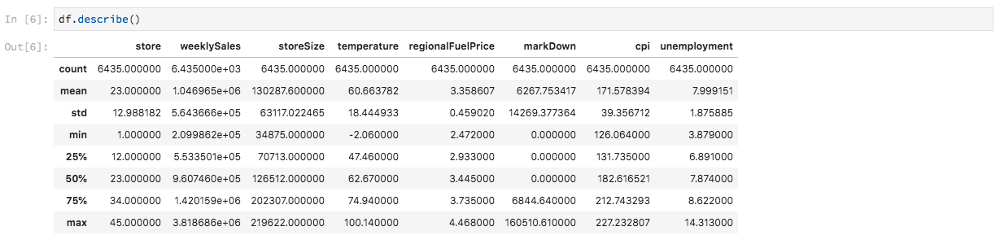

With this, you can see there are 6435 instances for each characteristic. Additionally, statistical information such as mean, standard deviation (std), min, max, and interquartiles are given. This gives us information about the deviation for the data. In the next section, you will go over visualization which works together with this information to give us a complete understanding of your data. 

Looking at the minimum and maximum values for `store`, you can see that there are 45 unique stores the data represents. There are also `storeTypes` which differentiate what a store is. you can see the distribution of `storeTypes` by doing the following:


This means 22 stores are of `storeType A` , 17 are `storeType B`, and 6 are `storeType C`.

#### Visualize data

Now that you know your data frame values, you want to supplement this with visualizations to make things clearer and easier to identify patterns. These graphs are also useful when conveying results to an audience. 

#### Univariate graphs 

Univariate graphs are plots of an individual variable. A common univariate graph used to visualize your data are box and whisker plots.

Using your retail dataset from before, you can generate the box and whisker plot for each of the 45 stores and their weekly sales. The plot is generated using the `seaborn.boxplot` function.

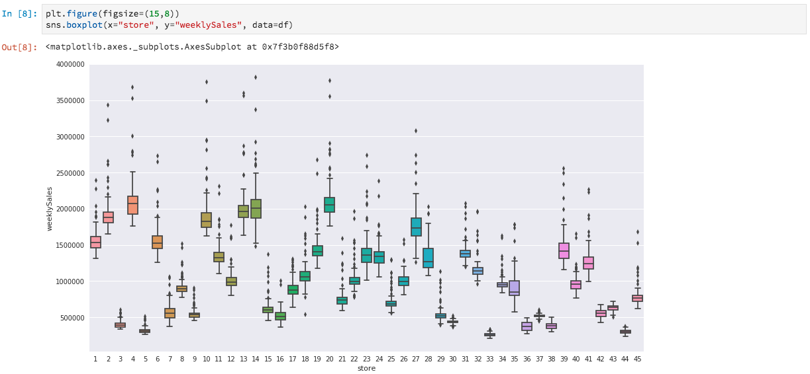

A box and whisker plot is used to show the distribution of data. The outer lines of the plot show the upper and lower quartiles while the box spans the interquartile range. The line in the box marks the median. Any points of data more than 1.5 times the upper or lower quartile are marked as a circle. These points are considered outliers.

Next, you can plot the weekly sales with time. You will only show the output of the first store. The code in the notebook generates 6 plots corresponding to 6 of the 45 stores in our dataset.

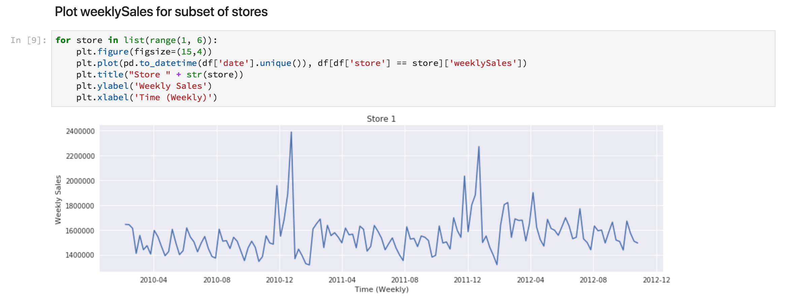

With this diagram, you can compare the weekly sales over a period of 2 years. It is easy to see sale peaks and trough patterns over time.

#### Multivariate graphs

Multivariate plots are used to see the interaction between variables. With the visualization, data scientists can see if there are any correlations or patterns between the variables. A common multivariate graph used is a correlation matrix. With a correlation matrix, dependencies between multiple variables are quantified with the correlation coefficient. 

Using the same retail dataset, you can generate the correlation matrix.


Notice the diagonal of ones down the center. This shows that when comparing a variable to itself, it has complete positive correlation. Strong positive correlation will have a magnitude closer to 1 while weak correlations will be closer to 0. Negative correlation is shown with a negative coefficient showing an inverse trend.

### Feature engineering {#feature-engineering}

In this section, feature engineering is used to make modifications to your Retail dataset by performing the following operations:

- Add week and year columns
- Convert storeType to an indicator variable
- Convert isHoliday to a numeric variable
- Predict weeklySales of next week

#### Add week and year columns

The current format for date (`2010-02-05`) can make it hard to differentiate that the data is for every week. Because of this, you should convert the date to contain week and year.

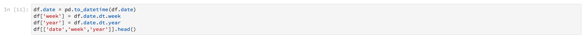

Now the week and date are as follows:

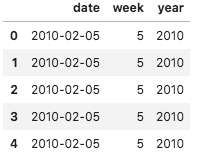

#### Convert storeType to indicator variable

Next, you want to convert the storeType column to columns representing each `storeType`. There are 3 store types, (`A`, `B`, `C`), from which you are creating 3 new columns. The value set in each is a boolean value where a '1' is set depending on what the `storeType` was and `0` for the other 2 columns.

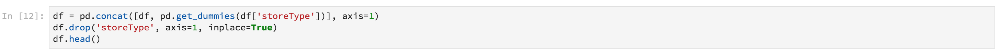

The current `storeType` column is dropped.

#### Convert isHoliday to numeric type

The next modification is to change the `isHoliday` boolean to a numerical representation.

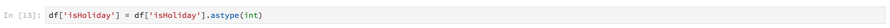

#### Predict weeklySales of next week

Now you want to add previous and future weekly sales to each of your datasets. You can do this by offsetting your `weeklySales`. Additionally, the `weeklySales` difference is calculated. This is done by subtracting `weeklySales` with the previous week's `weeklySales`.

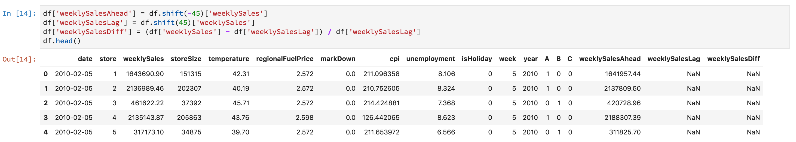

Since you are offsetting the `weeklySales` data 45 datasets forwards and 45 datasets backwards to create new columns, the first and last 45 data points have NaN values. You can remove these points from your dataset by using the `df.dropna()` function which removes all rows that have NaN values.

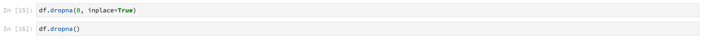

A summary of the dataset after your modifications is shown below:

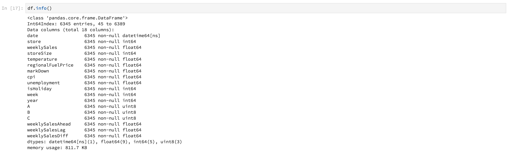

### Training and verification {#training-and-verification}

Now, it is time to create some models of the data and select which model is the best performer for predicting future sales. You will evaluate the 5 following algorithms:

- Linear Regression
- Decision Tree
- Random Forest
- Gradient Boosting
- K Neighbors

#### Split dataset to training and testing subsets

You need a way to know how accurate your model will be able to predict values. This evaluation can be done by allocating part of dataset to use as validation and the rest as training data. Since `weeklySalesAhead` is the actual future values of `weeklySales`, you can use this to evaluate how accurate the model is at predicting the value. The splitting is done below:

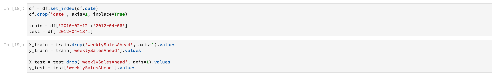

You now have `X_train` and `y_train` for preparing the models and `X_test` and `y_test` for evaluation later.

#### Spot check algorithms

In this section, you declare all the algorithms into an array called `model`. Next, you iterate through this array and for each algorithm, input your training data with `model.fit()` which creates a model `mdl`. Using this model, you can predict `weeklySalesAhead` with your `X_test` data.

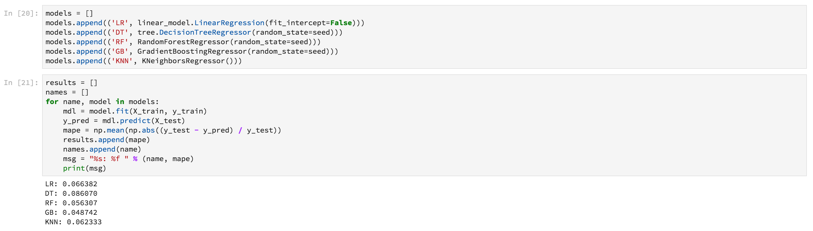

For the scoring, you are taking the mean percentage difference between the predicted `weeklySalesAhead` with the actual values in the `y_test` data. Since you want to minimize the difference between your prediction and the actual outcome, Gradient Boosting Regressor is the best performing model.

#### Visualize predictions

Finally, you visualize your prediction model with the actual weekly sales values. The blue line represents the actual numbers, while the green represents your prediction using Gradient Boosting. The following code generates 6 plots which represent 6 of the 45 stores in your dataset. Only `Store 1` is shown here:

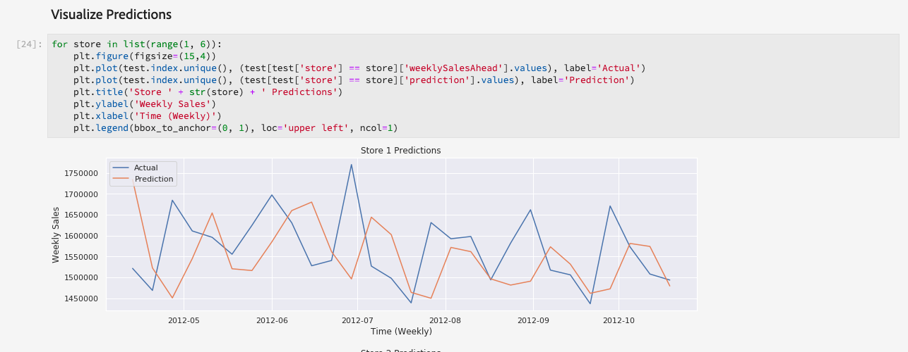

## Next steps

This document covered a general data scientist workflow to solve a retail sales problem. To summarize:

- Load the libraries required for your workflow.
- After the libraries are loaded, you can start looking at the data using statistical summaries, visualizations, and graphs.
- Next, feature engineering is used to make modifications to your retail dataset.
- Lastly, create models of the data and select which model is the best performer for predicting future sales.

Once you are ready, start by reading the [JupyterLab user guide](./jupyterlab/overview.md) for a quick overview of notebooks in Adobe Experience Platform Data Science Workspace. Additionally, if you are interested in learning about Models and Recipes, start by reading the [retail sales schema and dataset](./models-recipes/create-retails-sales-dataset.md) tutorial. This tutorial prepares you for subsequent Data Science Workspace tutorials which can be viewed in the Data Science Workspace [tutorials page](../tutorials/data-science-workspace.md).
