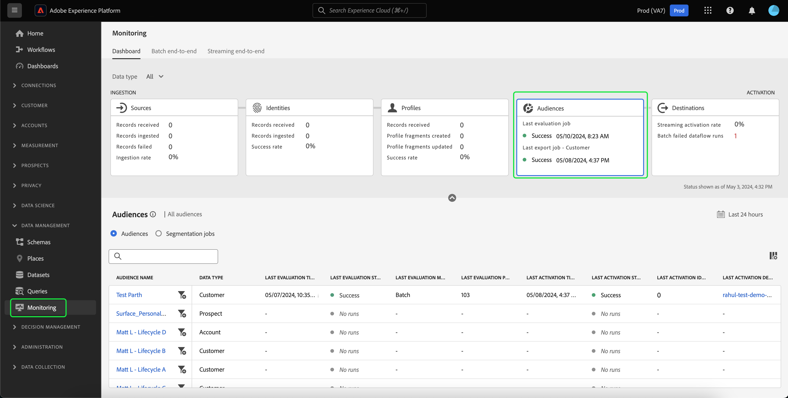
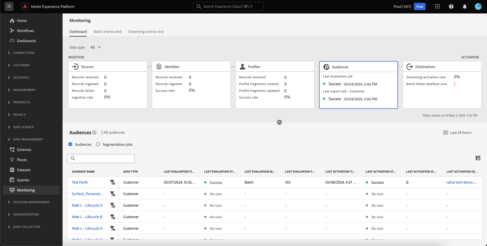
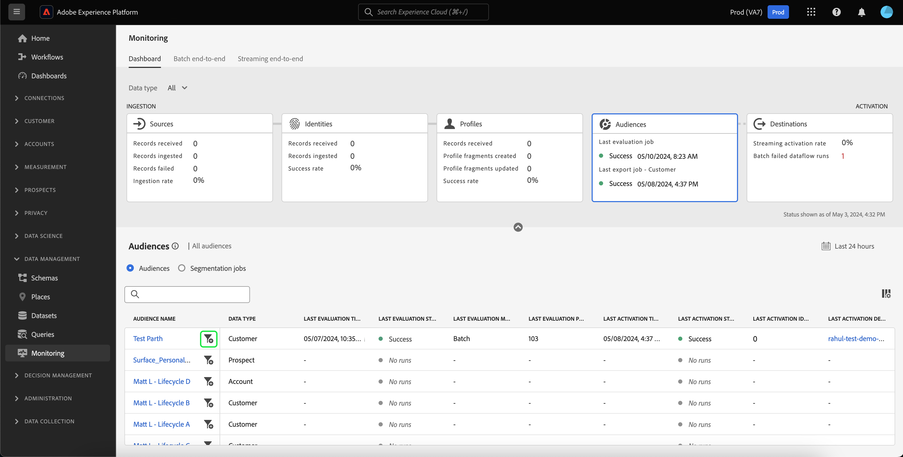
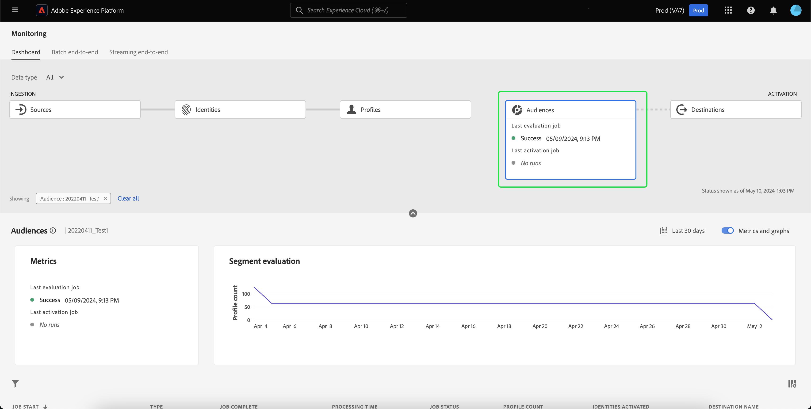
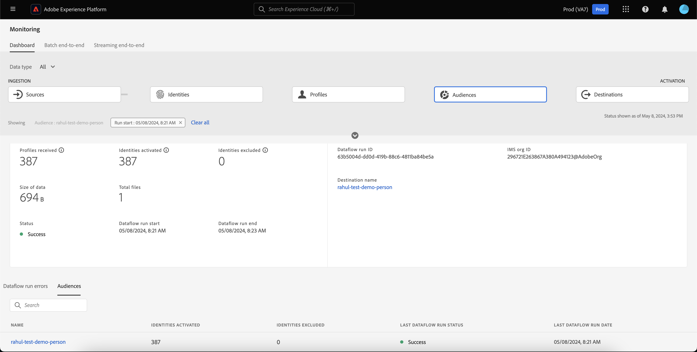
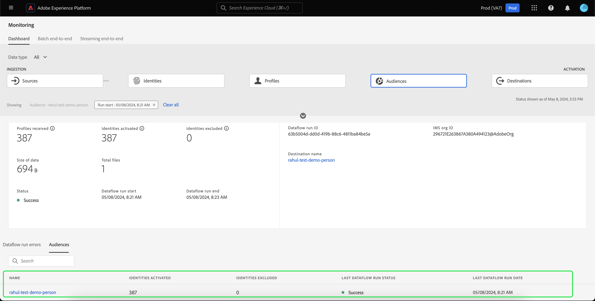
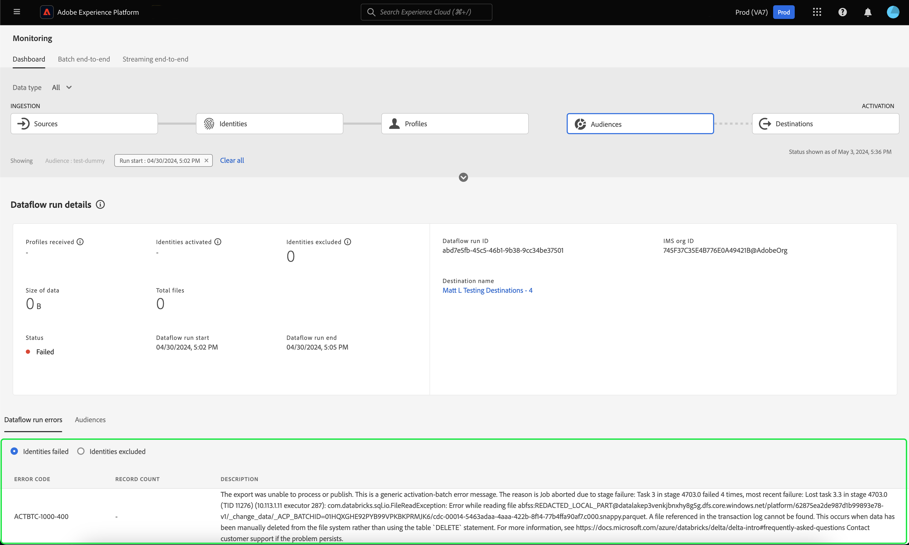
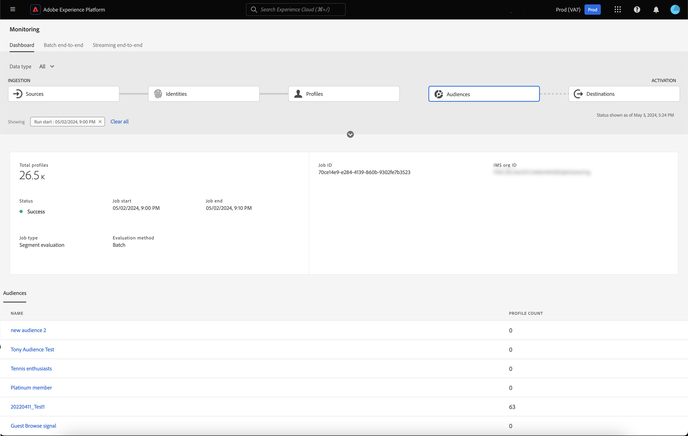
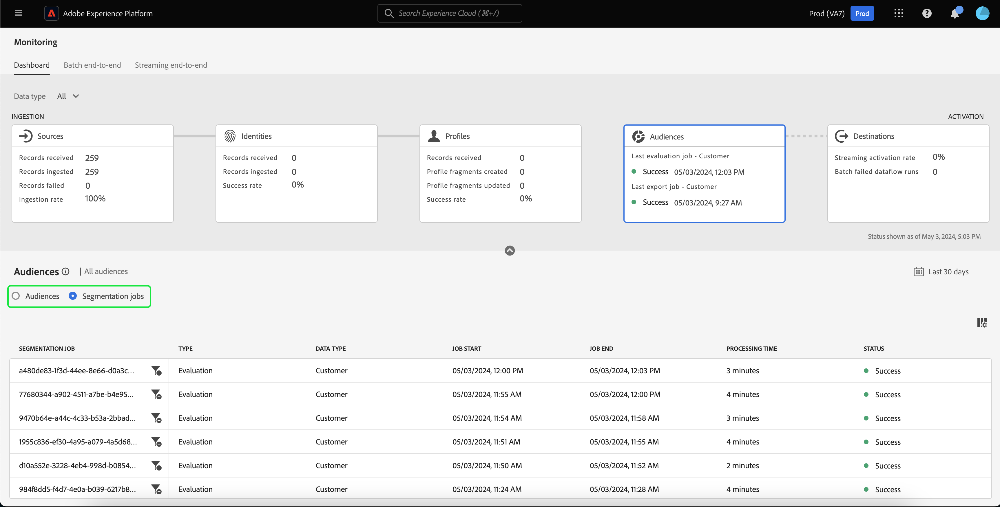

# Monitor dataflows for audiences in the UI

Segmentation Service allows you to create audiences through segment definitions or other sources from your [!DNL Real-Time Customer Profile] data. Platform provides dataflows to transparently track this flow of data from sources to destinations.

Use the monitoring dashboard to see a visual representation of the data's activity within an audience, including the status of your data's segmentation. Read the tutorial for instructions on how you can use the monitoring dashboard to monitor your data's segmentation using the Experience Platform user interface, allowing you to track the status of audience activation, evaluation, and export jobs.

## Getting started {#getting-started}

This guide requires a working understanding of the following components of Adobe Experience Platform:

- [Dataflows](../home.md): Dataflows are a representation of data jobs that move data across Platform. Dataflows are configured across different services, helping move data from source connectors to target datasets, to [!DNL Identity] and [!DNL Profile], and to [!DNL Destinations].
  - [Dataflow runs](../../sources/notifications.md): Dataflow runs are the recurring scheduled jobs based on the frequency configuration of selected dataflows.
- [Segmentation](../../segmentation/home.md): Segmentation allows you to create audiences from your Real-Time Customer Profile data. 
  - [Activation jobs](../../destinations/ui/activation-overview.md): An activation job is used to activate your audience to a specified destination.
  - [Evaluation jobs](../../segmentation/tutorials/evaluate-a-segment.md#evaluate-a-segment): An evaluation job is an asynchronous process that evaluates the audience.
  - [Export jobs](../../segmentation/api/export-jobs.md): An export job is an asynchronous processes that are used to persist audience members to datasets.
- [Sandboxes](../../sandboxes/home.md): [!DNL Experience Platform] provides virtual sandboxes which partition a single [!DNL Experience Platform] instance into separate virtual environments to help develop and evolve digital experience applications.

## Monitoring audiences dashboard {#monitoring-audiences-dashboard}

>[!CONTEXTUALHELP]
>id="platform_monitoring_segments"
>title="Audiences"
>abstract="The audiences view contains information on all your organization's audiences, with further information about their activation and evaluation jobs."

To access the **[!UICONTROL Audiences]** dashboard, select **[!UICONTROL Monitoring]** in the left navigation. Once on the **[!UICONTROL Monitoring]** page, select the **[!UICONTROL Audiences]** card. 

On the main **[!UICONTROL Audiences]** dashboard, the **[!UICONTROL Audiences]** card shows the status and date of the last evaluation job and the last export job. 

The dashboard itself contains metrics for both audiences and segmentation jobs. By default, the dashboard shows the audience metrics for the last 24 hours. To learn more about the segmentation jobs view, please read the [monitoring segmentation jobs](#monitoring-segmentation-jobs-dashboard) section.

>[!IMPORTANT]
>
>Currently, only audiences that are activated to [batch (file-based) destinations](../../destinations/destination-types.md#file-based) are supported for the monitoring audiences dashboard.

The following metrics are available for this dashboard view:

| Metric | Description |
| ------ | ----------- |
| **[!UICONTROL Audience name]** | The name of the audience. |
| **[!UICONTROL Data type]** | The data type of audience. Possible values include **[!UICONTROL Customer]**, **[!UICONTROL Account]**, and **[!UICONTROL Prospect]**. You can view for audiences of a specified data type by using the [!UICONTROL Data type] filter above the ribbon of cards. |
| **[!UICONTROL Last evaluation timestamp]** | The date and time that the audience's last evaluation job ran. |
| **[!UICONTROL Last evaluation status]** | The status of the audience's last evaluation job. Possible values include **[!UICONTROL Success]**, **[!UICONTROL No runs]**, and **[!UICONTROL Failed]**.|
| **[!UICONTROL Last evaluation method]** | The evaluation method of the audience. Since only batch segmentation is supported, the only possible value is **[!UICONTROL Batch]**. |
| **[!UICONTROL Last evaluation profiles]** | The number of profiles that were evaluated in the audience's last evaluation job. |
| **[!UICONTROL Last activation timestamp]** | The date and time that the audience's last activation job ran. |
| **[!UICONTROL Last activation status]** | The status of the audience's last activation job. Possible values include **[!UICONTROL Success]**, **[!UICONTROL No runs]**, and **[!UICONTROL Failed]**. | 
| **[!UICONTROL Last activation identities]** | The number of identities that were activated in the audience's last activation job. |
| **[!UICONTROL Last activation destination]** | The name of the destination that the audience's last activation job activated to. |

You can filter the results to a specific audience and view its segmentation jobs by selecting the filter icon (). The segmentation jobs are sorted in chronological order, with the most recent segmentation jobs appearing first.

The filtered audience dashboard appears. The **[!UICONTROL Audiences]** card shows the status and date of the last evaluation job and the last activation job. 

The dashboard itself displays the time and status of the last evaluation and activation jobs, a graph showing the profile count of the audience evaluation, and metrics for the segmentation jobs that were run. By default, the dashboard shows segmentation job metrics for the last 24 hours.

The following metrics are available for this dashboard view:

| Metric | Description |
| ------ | ----------- |
| **[!UICONTROL Job start]** | The date and time when the segmentation job started. |
| **[!UICONTROL Type]** | Indicates the type of the segmentation job. The two supported job types are **activation** and **evaluation** jobs. |
| **[!UICONTROL Job complete]** | The date and time when the segmentation job completed. |
| **[!UICONTROL Processing time]** | The amount of time it took for the segmentation job to complete. |
| **[!UICONTROL Job status]** | The status of the segmentation job. Supported values include **[!UICONTROL Success]**, **[!UICONTROL In Progress]**, and **[!UICONTROL Failed]**. |
| **[!UICONTROL Profile count]** | The number of profiles that the segmentation job is evaluating. Each user should have a unique profile. |
| **[!UICONTROL Identity activated]** | The number of identities that the segmentation job is activating. Each profile can have multiple identities. For example, a profile could have an email, phone number, and a loyalty number as identities. |
| **[!UICONTROL Destination name]** | The name of the destination that the segmentation job is being activated to. |

You can further filter to a specific segmentation job and see its details by selecting the filter icon (). There are two different kinds of segmentation jobs that can be filtered: activation jobs and evaluation jobs.

### Activation job details {#activation-job-details}

The activation job dataflow run details page shows information on the run's metrics, dataflow run errors, and audiences that are related to the segmentation job. An activation job is used to activate your audience for a specified destination.

The following metrics are available for this dashboard view:

| Metric | Description |
| ------ | ----------- |
| **[!UICONTROL Profiles received]** | The total number of profiles received in the activation flow. |
| **[!UICONTROL Identities activated]** | The total number of identities that were successfully activated to the destination, based on the profiles received. |
| **[!UICONTROL Identities excluded]** | The total number of identities that were excluded from being activated to the destination, based on the profiles received. These identities could be excluded because of missing attributes or consent violations. |
| **[!UICONTROL Size of data]** | The size of the dataflow being activated. |
| **[!UICONTROL Total files]** | The total number of files being activated in the dataflow. |
| **[!UICONTROL Status]** | The current status of the activation job. |
| **[!UICONTROL Dataflow run start]** | The date and time that the activation job started. |
| **[!UICONTROL Dataflow run end]** | The date and time that the activation job ended. |
| **[!UICONTROL Dataflow run ID]** | The ID of the current activation job. |
| **[!UICONTROL IMS org ID]** | The ID of the organization that the activation job belongs to. |
| **[!UICONTROL Destination name]** | The name of the destination that the data is being activated to. |

Under the audiences section, you can see a list of audiences that were activated as part of the activation job.

For the audiences section, the following metrics are available:

| Metric | Description | 
| ------ | ----------- |
| **[!UICONTROL Name]** | The name of the audience that was activated. |
| **[!UICONTROL Identities activated]** | The total number of identities that were successfully activated to the destination, based on the profiles received.  |
| **[!UICONTROL Identities excluded]** | The total number of identities that were excluded from being activated to the destination, based on the profiles received. These identities could be excluded because of missing attributes or consent violation.  |
| **[!UICONTROL Last dataflow run status]** | The status of the last activation job that ran for that audience. |
| **[!UICONTROL Last dataflow run date]** | The date and time of the last activation job that ran for that audience. |

Additionally, you can view details about the dataflow run errors. Under the dataflow run errors section, you can view both the identities that failed or the identities that were excluded. The errors section includes details about the error code and number of identities failed or excluded.

### Evaluation job details {#evaluation-job-details}

The evaluation job dataflow run details page shows information on the run's metrics and audiences that are related to the segmentation job. 

The following metrics are available for this dashboard view:

| Metric | Description |
| ------ | ----------- |
| **[!UICONTROL Total profiles]** | The total number of profiles that are being evaluated. |
| **[!UICONTROL Status]** | The status of the evaluation job. Possible statuses for the evaluation job include **[!UICONTROL Success]** and **[!UICONTROL Failed]**.  |
| **[!UICONTROL Job start]** | The date and time that the evaluation job started. |
| **[!UICONTROL Job end]** | The date and time that the evaluation job ended. |
| **[!UICONTROL Job type]** | The type of segmentation job. In this case, it will always be a **[!UICONTROL Segment evaluation]** job. |
| **[!UICONTROL Evaluation type]** | The type of evaluation that is being done. This can be either be **[!UICONTROL Batch]** or **[!UICONTROL Streaming]**. |
| **[!UICONTROL Job ID]** | The ID of the evaluation job. |
| **[!UICONTROL IMS org ID]** | The ID of the organization the evaluation job belongs to. |
| **[!UICONTROL Audience name]** | The name of the audience that is being evaluated. |
| **[!UICONTROL Audience ID]** | The ID of the audience that is being evaluated. |

Under the [!UICONTROL Audiences] section, you can see a list of audiences that are being evaluated as part of the evaluation job. You can filter the list of audiences by name by using the search bar. 

>[!IMPORTANT]
>
>This dashboard view currently supports up to 800 audience metrics.

For the [!UICONTROL Audiences] section, the following metrics are available:

| Metric | Description | 
| ------ | ----------- |
| **[!UICONTROL Name]** | The name of the audience that is being evaluated. |
| **[!UICONTROL Profile count]** | The number of profiles that are being evaluated. |

## Monitoring segmentation jobs dashboard {#monitoring-segmentation-jobs-dashboard}

>[!CONTEXTUALHELP]
>id="platform_monitoring_segment_jobs"
>title="Segmentation Jobs"
>abstract="The segmentation jobs view contains information on the evaluation and export jobs for all your audiences."

To access the **[!UICONTROL Segmentation Jobs]** dashboard, select **[!UICONTROL Segmentation jobs]** in the [!UICONTROL Audiences] dashboard. The [!UICONTROL Monitoring] dashboard contains metrics and information on the evaluation and export jobs.

>[!NOTE]
>
>Only **segmentation evaluation jobs** are supported for per-audience monitoring. Segmentation export jobs only support organization-level monitoring.

Use the [!UICONTROL Segmentation Jobs] dashboard to understand if profile evaluation and export occurs on time and without any exceptions, so the downstream services for destination activation can have the latest evaluated profile data.

The following metrics are available for segmentation jobs:

| Metric | Description |
| ------ | ----------- |
| **[!UICONTROL Segmentation job]** | Indicates the name of the segmentation job. |
| **[!UICONTROL Type]** | Indicates the type of segmentation job - export or evaluation. Note that in both cases, the segmentation job evaluates or exports **all** audiences belonging to an organization. To learn more about export jobs, please read the guide on the [export jobs endpoint](../../segmentation/api/export-jobs.md). To learn more about evaluation jobs, please read the tutorial on [evaluating a segment definition](../../segmentation/tutorials/evaluate-a-segment.md#evaluate-a-segment). |
| **[!UICONTROL Job start]** | The date and time when the segmentation job started. |
| **[!UICONTROL Job end]** | The date and time when the segmentation job completed. |
| **[!UICONTROL Status]** | The status of the completed job. Possible statuses for the segmentation job include success or failed. |
