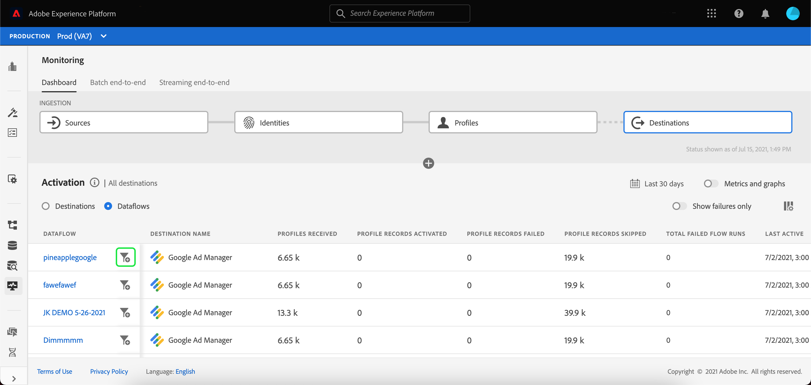

# Monitor dataflows for destinations in the UI

Destinations allow you to activate your data from Adobe Experience Platform to countless external partners. Platform makes the process of tracking the flow of data to your destinations easier by providing transparency with dataflows.

The monitoring dashboard provides you with a visual representation of the journey of a dataflow, including the destination the data is activated to. This tutorial provides instructions on how you can either monitor dataflows directly in the destinations workspace or use the monitoring dashboard to monitor dataflows for your destinations using the Experience Platform user interface.

## Getting started

This guide requires a working understanding of the following components of Adobe Experience Platform:

- [Dataflows](../home.md): Dataflows are a representation of data jobs that move data across Platform. Dataflows are configured across different services, helping move data from source connectors to target datasets, to [!DNL Identity] and [!DNL Profile], and to [!DNL Destinations].
  - [Dataflow runs](../../sources/notifications.md): Dataflow runs are the recurring scheduled jobs based on the frequency configuration of selected dataflows.
- [Destinations](../../destinations/home.md): Destinations are pre-built integrations with commonly used applications that allow for the seamless activation of data from Platform for cross-channel marketing campaigns, email campaigns, targeted advertising, and many other use cases.
- [Sandboxes](../../sandboxes/home.md): [!DNL Experience Platform] provides virtual sandboxes which partition a single [!DNL Platform] instance into separate virtual environments to help develop and evolve digital experience applications.

## Monitor dataflows in the Destinations workspace {#monitor-dataflows-in-the-destinations-workspace}

In the **[!UICONTROL Destinations]** workspace within the Platform UI, navigate to the **[!UICONTROL Browse]** tab and select the name of a destination that you want to view.

A list of existing dataflows appears. On this page is a list of viewable dataflows, including information about their destination, username, number of dataflows, and status.

See the following table for more information on statuses:

| Status | Description |
| ------ | ----------- |
| Enabled | The `Enabled` status indicates that a dataflow is active and is exporting data according to the schedule it was provided. |
| Disabled | The `Disabled` status indicates that a dataflow is inactive and is not exporting any data. |
| Processing | The `Processing` status indicates that a dataflow is not yet active. This status is often encountered immediately after a new dataflow is created. |
| Error | The `Error` status indicates that the activation process of a dataflow has been disrupted. |

### Dataflow runs for streaming destinations {#dataflow-runs-for-streaming-destinations}

For streaming destinations, the [!UICONTROL Dataflow runs] tab provides an hourly update for metric data on your dataflow runs. The most prominent statistics labelled are for identities.

Identities represent the different facets of a profile. For example, if a profile contains both a phone number and an email address, that profile will have two identities.

A list of individual runs and their particular metrics is displayed, along with the following totals for identities:

- **[!UICONTROL Identities activated]**: The total count of profile identities that were created or updated for activation.
- **[!UICONTROL Identities excluded]**:  The total number of profile identities that are skipped for activation based on missing attributes and consent violation.
- **[!UICONTROL Identities failed]**: The total number of profile identities that are not activated to the destination due to errors.

Each individual dataflow run shows the following details:

- **[!UICONTROL Dataflow run start]**: The time that the dataflow run started at.
- **[!UICONTROL Processing time]**: The amount of time that it took for the dataflow to process.
- **[!UICONTROL Profiles received]**: The total number of profiles received in the dataflow.
- **[!UICONTROL Identities activated]**: The total number of profile identities that were successfully activated to the selected destination.
- **[!UICONTROL Identities excluded]**: The total number of profile identities that are excluded for activation based on missing attributes and consent violation.
- **[!UICONTROL Identities failed]** The total number of profile identities that are not activated to the destination due to errors.
- **[!UICONTROL Activation rate]**: The percentage of received identities that have either been successfully activated or skipped. The following formula demonstrates how this value is calculated:

- **[!UICONTROL Status]**: Represents the state the dataflow is in: either [!UICONTROL Completed] or [!UICONTROL Processing]. [!UICONTROL Completed] means that all the identities for the corresponding dataflow run were exported within the one-hour period. [!UICONTROL Processing] means that the dataflow run has not yet finished.

To view the details of a particular dataflow run, select the run's start time from the list. 

The details page for a dataflow run contains additional information such as the number of profiles received, the number of identities activated, the number of identities failed, and the number of identities excluded.

The details page also displays a list of identities that failed and identities that were excluded. Information for both the failed and excluded identities is displayed, including the error code, identity count, and description. By default, the list displays the failed identities. To show skipped identities, select the **[!UICONTROL Identities excluded]** toggle.

### Dataflow runs for batch destinations {#dataflow-runs-for-batch-destinations}

For batch destinations, the [!UICONTROL Dataflow runs] tab provides metric data on your dataflow runs. A list of individual runs and their particular metrics is displayed, along with the following totals for identities:

- **[!UICONTROL Identities activated]**: The count of individual profile identities successfully activated to the selected destination.
- **[!UICONTROL Identities excluded]**: The count of individual profile identities excluded for activation for the selected destination, based on missing attributes and consent violation.

Each individual dataflow run shows the following details:

- **[!UICONTROL Dataflow run start]**: The time that the dataflow run started at.
- **[!UICONTROL Processing time]**: The amount of time it took for the dataflow run to be processed.
- **[!UICONTROL Profiles received]**: The total number of profiles received in the dataflow. This value is updated every 60 minutes.
- **[!UICONTROL Identities activated]**: The total number of profile identities that were successfully activated to the selected destination.
- **[!UICONTROL Identities excluded]**: The total number of profile identities that are excluded for activation based on missing attributes and consent violation.
- **[!UICONTROL Status]**: Represents the state the dataflow is in. This can be one of three states: [!UICONTROL Success], [!UICONTROL Failed], and [!UICONTROL Processing]. [!UICONTROL Success] means that the dataflow is active and is exporting data according to its provided schedule. [!UICONTROL Failed] means that the activation of data has been suspended due to errors. [!UICONTROL Processing] means that the dataflow is not yet active and is generally encountered when a new dataflow is created.

To view details of a specific dataflow run, select the run's start time from the list.

>[!NOTE]
>
>Dataflow runs are generated based on the destination dataflow's schedule frequency. A separate dataflow run is made for each [merge policy](../../profile/merge-policies/overview.md) applied to a segment.

The details page for a dataflow, in addition to the details shown on the dataflows list, displays more specific information about the dataflow:

- **[!UICONTROL Size of data]**: The size of the dataflow that is being exported.
- **[!UICONTROL Total files]**: The total number of files exported in the dataflow.
- **[!UICONTROL Last updated]**: The time the dataflow run was last updated.

The details page also displays a list of identities that failed and identities that were excluded. Information for both the failed and excluded identities is displayed, including the error code and description. By default, the list displays the failed identities. To show excluded identities, select the **[!UICONTROL Identities excluded]** toggle.

## Monitoring Destinations dashboard {#monitoring-destinations-dashboard}

To access the [!UICONTROL Monitoring] dashboard, select **[!UICONTROL Monitoring]** () in the left navigation. Once on the [!UICONTROL Monitoring] page, select [!UICONTROL Destinations]. The [!UICONTROL Monitoring] dashboard contains metrics and information on the destination run jobs.

At the center of the dashboard is the [!UICONTROL Activation] panel, which contains metrics and graphs that display data on the activation rate of the data which is exported to destinations, as well as on the batch flow runs to destinations.

By default, the data displayed contains the activation information from the last 24 hours. Select **[!UICONTROL Last 24 hours]** to adjust the time frame of records displayed. Available options include **[!UICONTROL Last 24 hours]**, **[!UICONTROL Last 7 days]**, and **[!UICONTROL Last 30 days]**. Alternatively, you can select the dates on the calendar pop-up window that appears. Once you have selected dates, select **[!UICONTROL Apply]** to adjust the time frame of the information shown.

>[!NOTE]
>
>The following screenshot shows the activation rate and batch flow runs for the last 30 days instead of the last 24 hours. You can adjust the time frame by selecting **[!UICONTROL Last 30 days]**.

Select the arrow icon () to expand the cards at the top of the screen to view at-a-glance information about the activation details, based on the destination type - streaming or batch:

- **[!UICONTROL Streaming activation rate]**: Represents the percentage of received identities that have either been successfully activated or skipped. The formula used to calculate this percentage is described higher on this page, in the [Dataflow runs for streaming destinations](#dataflow-runs-for-streaming-destinations) section.
- **Batch failed flow runs**: Represents the number of failed flow runs in the selected time interval.

The **[!UICONTROL Activation]** graph is displayed by default and you can disable it to expand the list of destinations below. Select the **[!UICONTROL Metrics and graphs]** toggle to disable the graphs.

The **[!UICONTROL Activation]** panel displays a list of destinations that contain at least one existing account. This list also includes information on the profiles received, identities activated, identities failed, identities excluded, activation rate, total failed dataflows, and the last updated date for these destinations. Not all metrics are available for all destination types. The table below outlines which metrics are available per destination type, streaming or batch.

| Metric | Destination types |
---------|----------|
| Profiles received | Streaming and batch |
| Identities activated | Streaming and batch |
| Identities failed | Streaming |
| Identities excluded | Streaming and batch |
| Activation rate | Streaming |
| Total failed dataflows | Batch |

You can also filter your list of destinations to only display the selected category of destinations. Select the **[!UICONTROL My destinations]** dropdown, and select the [destination category](/help/destinations/destination-types.md#categories) you want to filter to.

Additionally, you can enter a destination into the search bar to isolate to a single destination. If you want to see the destination's dataflows you can select the filter  beside it to see a list of its active dataflows.

If you want to view all existing dataflows across all destinations, select **[!UICONTROL Dataflows]**.

A list of dataflows appears, grouped on a per-destination basis. You can see additional details for a specific dataflow by locating the destination you want to monitor, selecting the filter  beside it, and then subsequently selecting the filter  beside the dataflow you want more information about.

The dataflow runs page contains a toggle which allows you to see the activated data in the dataflow, broken down by flow runs or segments.

When **[!UICONTROL Flow runs]** is selected, you can see a list of dataflow runs and further information about each run.

When **[!UICONTROL Segments]** is selected, you see a list of the segments which are currently being activated to the selected *dataflow*. This screen includes segment-level information about the identities activated, identities excluded, as well as the status and the time of the last dataflow run.

>[!IMPORTANT]
>
>Note the current limitations related to segment-level metrics:
>- The segment-level view is currently only available for batch destinations.
>- Segment level metrics are currently not recorded for failed flow runs and excluded records.

The dataflow runs page displays information on your dataflow runs, including the dataflow run start time, processing time, profiles received, identities activated, identities excluded, identities failed, activation rate, and status. To see more details about a specific dataflow run, select the filter  beside the dataflow run start time.

The dataflows details page, in addition to the details shown on the dataflows list, displays more specific information about the dataflow:

- **[!UICONTROL Dataflow run ID]**: The ID of the dataflow.
- **[!UICONTROL IMS org ID]**: The IMS organization the dataflow belongs to.
- **[!UICONTROL Last updated]**: The time the dataflow run was last updated.

The details page also has a toggle to switch between dataflow run errors and segments. 

The dataflow run errors view displays a list of identities that failed and identities that were excluded. Information for both the failed and excluded identities is displayed, including the error code, identity count, and description. By default, the list displays the failed identities. To show skipped identities, select the **[!UICONTROL Identities excluded]** toggle.

When **[!UICONTROL Segments]** is selected, you see a list of the segments which were activated in the selected *dataflow run*. This screen includes segment-level information about the identities activated, identities excluded, as well as the status and the time of the last dataflow run.

## Next steps

By following this guide, you now know how to monitor dataflows for both batch and streaming destinations, including all the relevant information such as processing time, activation rate, and status. To learn more about dataflows in Platform, please read the [dataflows overview](../home.md). To learn more about destinations, please read the [destinations overview](../../destinations/home.md).