# Monitor dataflows for destinations in the UI

Use the various destinations in the Experience Platform catalog to activate your data from Experience Platform to countless external partners. Experience Platform makes the process of tracking the flow of data to your destinations easier by providing transparency with dataflows.

The monitoring dashboard provides you with a visual representation of the journey of a dataflow, including the destination that the data is being activated to, the type of data that you are viewing, exported data per dataflow run, and much more. 

This tutorial provides instructions on how you can either monitor dataflows directly in the destinations workspace or use the monitoring dashboard to monitor dataflows for your destinations using the Experience Platform user interface.

## Getting started {#getting-started}

This guide requires a working understanding of the following components of Adobe Experience Platform:

- [Dataflows](../home.md): Dataflows are a representation of data jobs that move data across Experience Platform. Dataflows are configured across different services, helping move data from source connectors to target datasets, to [!DNL Identity] and [!DNL Profile], and to [!DNL Destinations].
    - [Dataflow runs](../../sources/notifications.md): Dataflow runs are the recurring scheduled jobs based on the frequency configuration of selected dataflows.
- [Destinations](../../destinations/home.md): Destinations are pre-built integrations with commonly used applications that allow for the seamless activation of data from Experience Platform for cross-channel marketing campaigns, email campaigns, targeted advertising, and many other use cases.
- [Sandboxes](../../sandboxes/home.md): [!DNL Experience Platform] provides virtual sandboxes which partition a single [!DNL Experience Platform] instance into separate virtual environments to help develop and evolve digital experience applications.

## Monitor dataflows in the Destinations workspace {#monitor-dataflows-in-the-destinations-workspace}

In the **[!UICONTROL Destinations]** workspace within the Experience Platform UI, navigate to the **[!UICONTROL Browse]** tab and select the name of a destination that you want to view.

A list of existing dataflows appears. On this page is a list of viewable dataflows, including information about their destination, username, number of dataflows, and status.

See the following table for more information on statuses:

| Status | Description |
| ------ | ----------- |
| Enabled | The `Enabled` status indicates that a dataflow is active and is exporting data according to the schedule it was provided. |
| Disabled | The `Disabled` status indicates that a dataflow is inactive and is not exporting any data. |
| Processing | The `Processing` status indicates that a dataflow is not yet active. This status is often encountered immediately after a new dataflow is created. |
| Error | The `Error` status indicates that the activation process of a dataflow has been disrupted. |

### Dataflow runs for streaming destinations {#dataflow-runs-for-streaming-destinations}

>[!CONTEXTUALHELP]
>id="platform_monitoring_dataflow_run_details_activation_streaming"
>title="Dataflow run details"
>abstract="The destination dataflow run details contain information on the activation status of an audience and metrics taken from Real-Time Customer Profile to generate unique identities. To learn more, review the metric definitions guide."

>[!CONTEXTUALHELP]
>id="platform_monitoring_profiles_received_streaming"
>title="Profiles received"
>abstract="The total number of profiles received in the dataflow. This value is updated every 60 minutes."

>[!CONTEXTUALHELP]
>id="platform_destinations_dataflow_identitiesactivated_streaming"
>title="Identities activated"
>abstract="The count of individual profile identities successfully activated to the selected destination. This metric includes identities that are created, updated, and removed from exported audiences."

>[!CONTEXTUALHELP]
>id="platform_destinations_dataflow_identitiesexcluded_streaming"
>title="Identities excluded"
>abstract="The count of individual profile records excluded from activation for the selected destination based on missing attributes and consent violation."

>[!CONTEXTUALHELP]
>id="platform_destinations_dataflow_identitiesfailed_streaming"
>title="Identities failed"
>abstract="The count of individual profile identities which failed for the selected destination. Please check error diagnostics for details."

For streaming destinations, the [!UICONTROL Dataflow runs] tab provides an hourly update for metric data on your dataflow runs. The most prominent statistics labelled are for identities.

Identities represent the different facets of a profile. For example, if a profile contains both a phone number and an email address, that profile has two identities.

A list of individual runs and their particular metrics is displayed, along with the following totals for identities:

- **[!UICONTROL Identities activated]**: The total number of profile identities successfully activated to the selected destination. This metric includes identities that are created, updated, and removed from exported audiences.
- **[!UICONTROL Identities excluded]**:  The total number of profile identities that are skipped for activation based on missing attributes and consent violation.
- **[!UICONTROL Identities failed]**: The total number of profile identities that are not activated to the destination due to errors.

>[!NOTE]
>
>The totals for identities activated, excluded, and failed represent a sum of all individual dataflow run counts. Since dataflow runs have a time-to-live (TTL) of 90 days, these totals typically cover approximately the last 3 months. As older dataflow runs expire and are removed from the system, you may observe a decrease in the total counts displayed.

Each individual dataflow run shows the following details:

- **[!UICONTROL Dataflow run start]**: The time when the dataflow run started. For streaming dataflow runs, Experience Platform captures metrics based on the start of the dataflow run, in the form of hourly metrics. This means that for streaming dataflow runs, if a dataflow run started for example at 10:30PM, the metric shows the start time as 10:00 PM in the UI.
- **[!UICONTROL Audience]**: The number of audiences associated with each dataflow run.
- **[!UICONTROL Processing duration]**: The amount of time that it took for the dataflow run to process.
  - For **[!UICONTROL completed]** runs, the processing time metric always shows one hour.
  - For dataflow runs which are still in a **[!UICONTROL processing]** state, the window to capture all the metrics stays open for more than an hour, to process all metrics that correspond to the dataflow run. For example, a dataflow run that started at 9:30 AM might stay in a processing state for one hour and thirty minutes to capture and process all the metrics. The length of the processing time is directly affected by the retries done as a result of the destination's failed response. Then, once the processing window closes and the status of the dataflow run updates to **completed**, the displayed processing time is changed to one hour.
- **[!UICONTROL Profiles received]**: The total number of profiles received in the dataflow.
- **[!UICONTROL Identities activated]**: The total number of profile identities that were successfully activated to the selected destination as part of the dataflow run. This metric includes identities that are created, updated, and removed from exported audiences.
- **[!UICONTROL Identities excluded]**: The total number of profile identities that are excluded from activation based on missing attributes and consent violation.
- **[!UICONTROL Identities failed]** The total number of profile identities that are not activated to the destination due to errors.

  >[!IMPORTANT]
  >
  > Starting with March 2025, Adobe is rolling out an update to increase reporting accuracy for streaming destinations. This enhancement ensures a better alignment between the reporting in Experience Platform and the destination platforms.
  >
  > Before this update, **[!UICONTROL Identities failed]** included all activation retries. After this update, only the last activation retry is included in the total count.
  > 
  > This enhancement applies to all streaming destinations.
  > Following this enhancement, users of streaming destinations may see an expected drop in their **[!UICONTROL Identities failed]** count.
 

- **[!UICONTROL Activation rate]**: The percentage of received identities that have been successfully activated. The following formula demonstrates how this value is calculated:
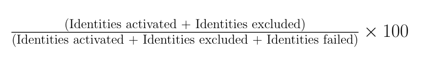
- **[!UICONTROL Status]**: Represents the state the dataflow is in: either [!UICONTROL Completed] or [!UICONTROL Processing]. [!UICONTROL Completed] means that all the identities for the corresponding dataflow run were exported within the one-hour period. [!UICONTROL Processing] means that the dataflow run has not yet finished.

To view the details of a particular dataflow run, select the run's start time from the list. 

The details page for a dataflow run contains additional information such as the number of profiles received, the number of identities activated, the number of identities failed, and the number of identities excluded.

The details page also displays a list of identities that failed and identities that were excluded. Information for both the failed and excluded identities is displayed, including the error code, identity count, and description. By default, the list displays the failed identities. To show skipped identities, select the **[!UICONTROL Identities excluded]** toggle.

#### Audience-level dataflow run monitoring for streaming destinations {#audience-level-dataflow-runs-for-streaming-destinations}

You can view information about the activated, excluded, or failed identities broken down on an audience level, for each audience that is part of the dataflow.

Audience-level monitoring for streaming destinations is only available for certain destinations. See the [audience level view](#audience-level-view) section for a list of supported destinations.

>[!NOTE]
>
>The **[!UICONTROL Profiles received]** number in the **[!UICONTROL Audiences]** tab may not always match with the number of profiles received for the dataflow run. This is because a given profile might be part of more than one audience being activated in the dataflow run. 

### Dataflow runs for batch destinations {#dataflow-runs-for-batch-destinations}

>[!CONTEXTUALHELP]
>id="platform_monitoring_dataflow_run_details_activation"
>title="Dataflow run details"
>abstract="The destination dataflow run details contain information on the activation status of an audience and metrics taken from Real-Time Customer Profile to generate unique identities. To learn more, review the metric definitions guide."
>additional-url="https://experienceleague.adobe.com/docs/experience-platform/dataflows/ui/monitor-destinations.html#dataflow-runs-for-streaming-destinations" text="Dataflow runs for streaming destinations"

>[!CONTEXTUALHELP]
>id="platform_monitoring_profiles_received_batch"
>title="Profiles received"
>abstract="The total number of profiles received in the dataflow. This value is updated every 60 minutes."

>[!CONTEXTUALHELP]
>id="platform_destinations_dataflow_identitiesactivated_batch"
>title="Identities activated"
>abstract="The count of individual profile identities successfully activated to the selected destination. This metric includes identities that are created, updated, and removed from exported audiences."

>[!CONTEXTUALHELP]
>id="platform_destinations_dataflow_identitiesexcluded_batch"
>title="Identities excluded"
>abstract="The count of individual profile records excluded from activation for the selected destination based on missing attributes and consent violation."

For batch destinations, the [!UICONTROL Dataflow runs] tab provides metric data on your dataflow runs. A list of individual runs and their particular metrics is displayed, along with the following totals for identities:

- **[!UICONTROL Identities activated]**: The total number of profile identities successfully activated to the selected destination. This metric includes identities that are created, updated, and removed from exported audiences.
- **[!UICONTROL Identities excluded]**: The count of individual profile identities excluded from activation for the selected destination, based on missing attributes and consent violation.

Each individual dataflow run shows the following details:

- **[!UICONTROL Dataflow run start]**: The time when the dataflow run started.
- **[!UICONTROL Audience]**: The name of the audience associated with each dataflow run.
- **[!UICONTROL Processing duration]**: The amount of time it took for the dataflow run to be processed.
- **[!UICONTROL Profiles received]**: The total number of profiles received in the dataflow. This value is updated every 60 minutes.
- **[!UICONTROL Identities activated]**: The total number of profile identities that were successfully activated to the selected destination as part of the dataflow run. This metric includes identities that are created, updated, and removed from exported audiences.
- **[!UICONTROL Identities excluded]**: The total number of profile identities that are excluded from activation based on missing attributes and consent violation.
- **[!UICONTROL Status]**: Represents the state the dataflow is in. This can be one of three states: [!UICONTROL Success], [!UICONTROL Failed], and [!UICONTROL Processing]. [!UICONTROL Success] means that the dataflow is active and is exporting data according to its provided schedule. [!UICONTROL Failed] means that the activation of data has been suspended due to errors. [!UICONTROL Processing] means that the dataflow is not yet active and is generally encountered when a new dataflow is created.

To view details of a specific dataflow run, select the run's start time from the list.

>[!NOTE]
>
>Dataflow runs are generated based on the destination dataflow's schedule frequency. A separate dataflow run is made for each [merge policy](../../profile/merge-policies/overview.md) applied to an audience.

The details page for a dataflow, in addition to the details shown on the dataflows list, displays more specific information about the dataflow:

- **[!UICONTROL Size of data]**: The size of the dataflow that is being exported.
- **[!UICONTROL Total files]**: The total number of files exported in the dataflow.
- **[!UICONTROL Last updated]**: The time the dataflow run was last updated.

The details page also displays a list of identities that failed and identities that were excluded. Information for both the failed and excluded identities is displayed, including the error code and description. By default, the list displays the failed identities. To show excluded identities, select the **[!UICONTROL Identities excluded]** toggle.

### View in monitoring {#view-in-monitoring}

You can also select to view rich information about a certain dataflow and its dataflow runs in the monitoring dashboard. To view information about a dataflow in the monitoring dashboard:

1. Navigate to **[!UICONTROL Connections]** > **[!UICONTROL Destinations]** > **[!UICONTROL Browse]** tab
2. Navigate to the dataflow that you want to inspect.
3. Select the ellipsis symbol and  **[!UICONTROL View in monitoring]**.

>[!SUCCESS]
>
>You can now view information about the dataflow and its associated dataflow runs in the monitoring dashboard. Read the section below for further information. 

## Monitoring Destinations dashboard {#monitoring-destinations-dashboard}

>[!NOTE]
>
>Destinations monitoring functionality is currently supported for all destinations in Experience Platform *except* the [Adobe Target](/help/destinations/catalog/personalization/adobe-target-connection.md) and [Custom personalization](/help/destinations/catalog/personalization/custom-personalization.md) destinations.

>[!CONTEXTUALHELP]
>id="platform_monitoring_activation"
>title="Activation"
>abstract="The destination activation view contains information on the activation status of an audience and metrics taken from Real-Time Customer Profile to generate unique identities."

To access the [!UICONTROL Monitoring] dashboard, select **[!UICONTROL Monitoring]** () in the left navigation. Once on the [!UICONTROL Monitoring] page, select [!UICONTROL Destinations]. The [!UICONTROL Monitoring] dashboard contains metrics and information on the destination run jobs.

Use the [!UICONTROL Destinations] dashboard to get an overall idea of the health of your activation flows. Start by getting insights on an aggregated level for all batch and streaming destinations and then drill down into detailed views for dataflows, dataflow runs, and activated audiences for an in-depth look at your activation data. The screens in the [!UICONTROL Monitoring] dashboard provide actionable insights through metrics and error descriptions to help you troubleshoot any problems that might arise in your activation scenarios.

You can filter the displayed information by data type - customers, accounts (for the Adobe Real-Time CDP B2B edition only), prospects, and account enrichment. Read more about these options in the [monitoring dashboard guide](/help/dataflows/ui/monitor.md#monitoring-dashboard-overview). 

At the center of the dashboard is the [!UICONTROL Activation] panel, which contains metrics and graphs that display data on the activation rate of the data which is exported to streaming destinations, as well as on the failed batch dataflow runs to batch destinations.

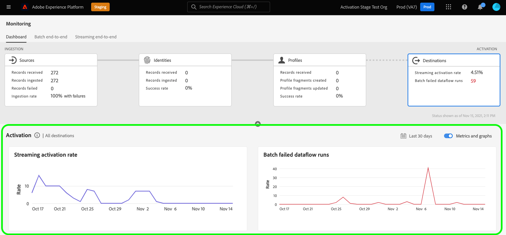

By default, the data displayed contains the activation information from the last 24 hours. Select **[!UICONTROL Last 24 hours]** to adjust the time frame of records displayed. Available options include **[!UICONTROL Last 24 hours]**, **[!UICONTROL Last 7 days]**, and **[!UICONTROL Last 30 days]**. Alternatively, you can select the dates on the calendar pop-up window that appears. Once you have selected dates, select **[!UICONTROL Apply]** to adjust the time frame of the information shown.

>[!NOTE]
>
>The following screenshot shows the activation rate and batch dataflow runs for the last 30 days instead of the last 24 hours. You can adjust the time frame by selecting **[!UICONTROL Last 30 days]**.

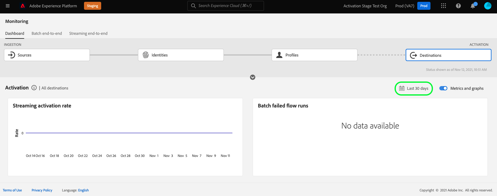

Use the arrow icon () to expand or dismiss the cards at the top of the screen, which show at-a-glance information about the activation details, based on the destination type - streaming or batch:

- **[!UICONTROL Streaming activation rate]**: Represents the percentage of received identities that have either been successfully activated or skipped. The formula used to calculate this percentage is described further above on this page, in the [Dataflow runs for streaming destinations](#dataflow-runs-for-streaming-destinations) section.
- **[!UICONTROL Batch failed dataflow runs]**: Represents the number of failed dataflow runs in the selected time interval.

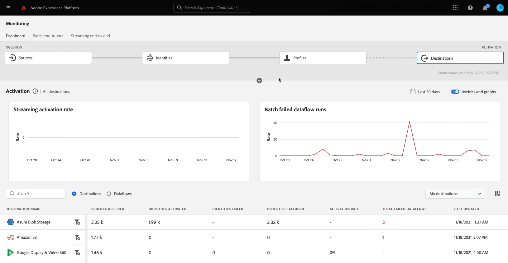

The **[!UICONTROL Activation]** graph is displayed by default and you can disable it to expand the list of destinations below. Select the **[!UICONTROL Metrics and graphs]** toggle to disable the graphs.

The **[!UICONTROL Activation]** panel displays a list of destinations that contain at least one existing account. This list also includes information on the profiles received, identities activated, identities failed, identities excluded, activation rate, total failed dataflows, and the last updated date for these destinations. Not all metrics are available for all destination types. The table below outlines the metrics and information available per destination type.

| Metric                               | Destination type      |
|--------------------------------------|-----------------------|
| **[!UICONTROL Records received]**    | Streaming and batch   |
| **[!UICONTROL Records activated]**   | Streaming and batch   |
| **[!UICONTROL Records failed]**      | Streaming             |
| **[!UICONTROL Records skipped]**     | Streaming and batch   |
| **[!UICONTROL Data type]**           | Streaming and batch   |
| **[!UICONTROL Activation rate]**     | Streaming             |
| **[!UICONTROL Total failed dataflows]** | Batch              |
| **[!UICONTROL Last updated]**        | Streaming and batch   |

{style="table-layout:auto"}

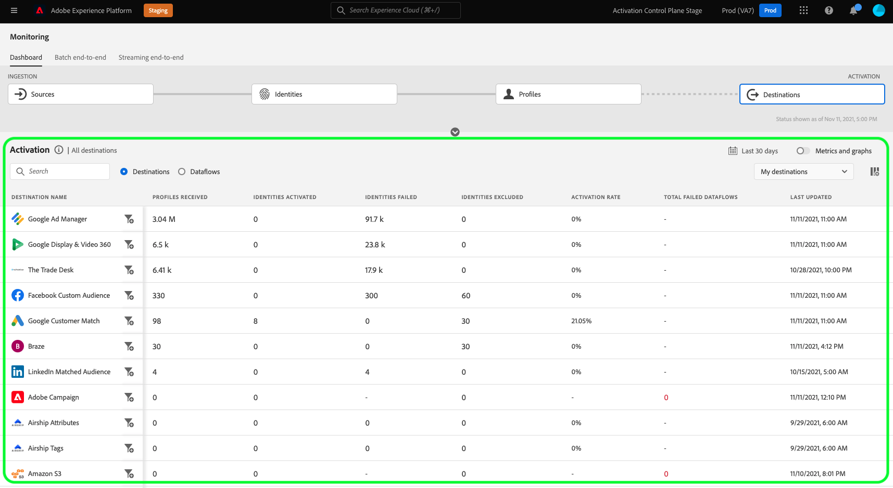

You can also filter your list of destinations to only display the selected category of destinations. Select the **[!UICONTROL My destinations]** dropdown, and select the [destination category](/help/destinations/destination-types.md#categories) that you want to filter to.

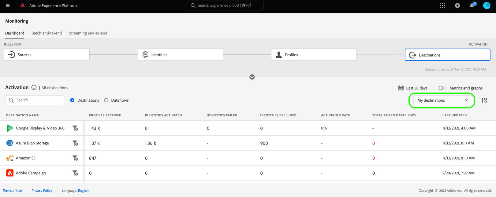

Additionally, you can enter a destination into the search bar to isolate to a single destination. If you want to see the destination's dataflows you can select the filter  beside it to see a list of its active dataflows.

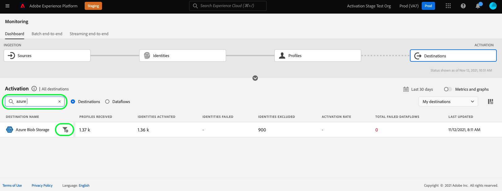

If you want to view all existing dataflows across all destinations, select **[!UICONTROL Dataflows]**.

A list of dataflows appears, sorted by the last dataflow run. You can see additional details for a specific dataflow by locating the destination you want to monitor, selecting the filter  beside it, and then subsequently selecting the filter  beside the dataflow you want more information about.

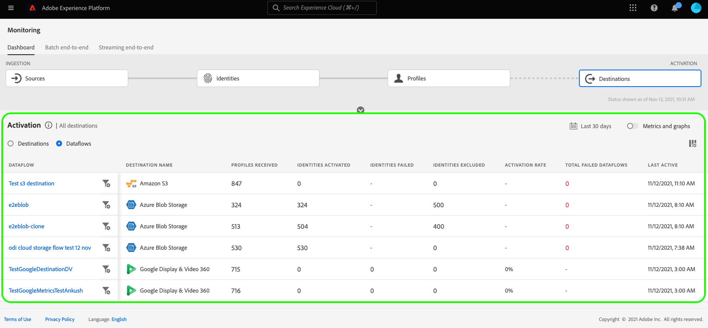

Once you select a dataflow for further inspection, the dataflow details page contains a toggle which allows you to see the activated data in the dataflow, broken down by dataflow runs or audiences.

### Dataflow runs view {#dataflow-runs-view}

When **[!UICONTROL Dataflow runs]** is selected, you can see a list of dataflow runs for the selected dataflow and further information about each run.

>[!INFO]
>
>For dataflows to streaming destinations, a dataflow run is broken down into hourly windows. Each hourly window generates a corresponding dataflow run ID.
>
>For dataflows to batch destinations, each audience has a corresponding dataflow run generated, based on the audience activation scheduled frequency. For example, if you set up a daily scheduled activation for five audiences in the same destination dataflow, there will be five separate dataflow runs generated every day.

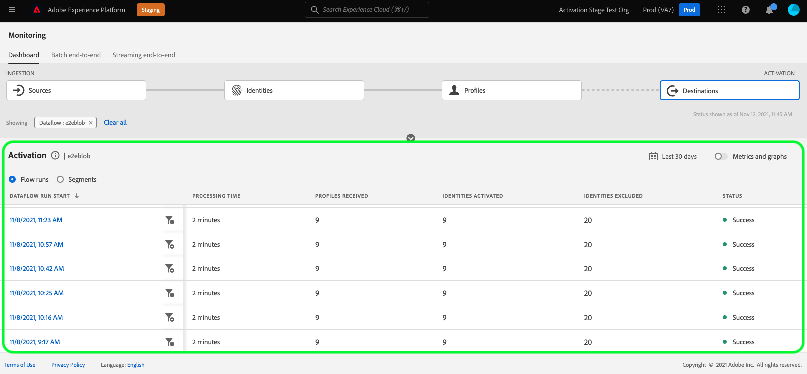

Use the **[!UICONTROL Show failures only]** toggle to display only the failed runs for a dataflow.

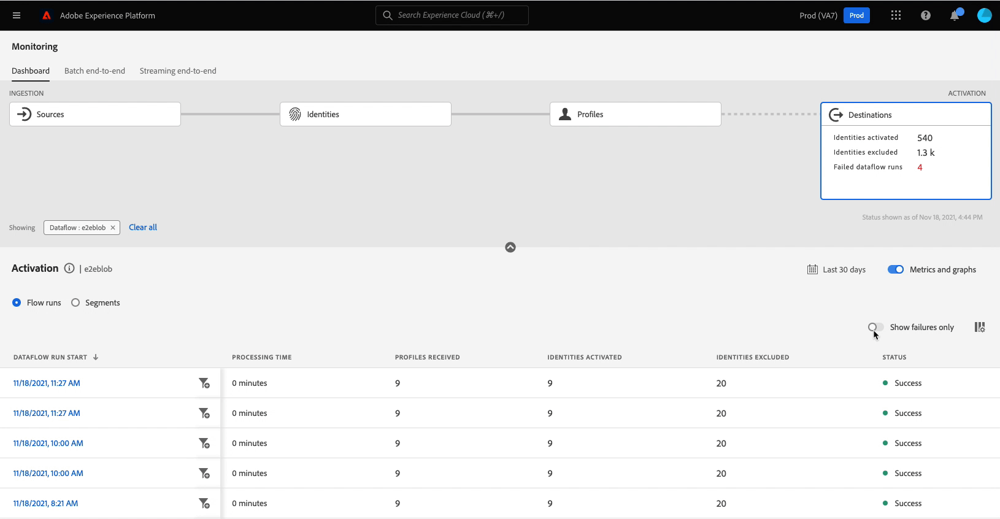

### Audience-level view {#segment-level-view}

When **[!UICONTROL Audiences]** is selected, you see a list of the audiences which were activated to the selected dataflow, within the selected time range. This screen includes audience-level information about the records activated, records excluded, as well as the status and the time of the last dataflow run. By reviewing the metrics for records excluded and activated, you can verify if an audience has been successfully activated or not.

For example, you are activating an audience called "Loyalty Members in California" to an Amazon S3 destination "Loyalty Members California December". Let's assume that there are 100 profiles in the selected audience but only 80 out of 100 records contain Loyalty ID attributes and you have defined the export mapping rules as `loyalty.id` is required. In this case, on an audience level, you will see 80 records activated, and 20 records excluded.

>[!IMPORTANT]
>
>Note the current limitations related to audience-level metrics:
>
>- The audience-level view is currently available for the destinations listed below. Rollout is planned for further streaming destinations.
>
>   - [[!DNL (API) Oracle Eloqua] connection](../../destinations/catalog/email-marketing/oracle-eloqua-api.md)
>   - [[!DNL (V2) Marketo Engage]](../../destinations/catalog/adobe/marketo-engage.md)
>   - [[!DNL Airship Attributes]](../../destinations/catalog/mobile-engagement/airship-attributes.md)
>   - [[!DNL Airship Tags]](../../destinations/catalog/mobile-engagement/airship-tags.md)
>   - [[!DNL Amazon Kinesis]](../../destinations/catalog/cloud-storage/amazon-kinesis.md)
>   - [[!DNL Azure Event Hubs]](../../destinations/catalog/cloud-storage/azure-event-hubs.md)
>   - [[!DNL Google Customer Match + Display & Video 360]](../../destinations/catalog/advertising/google-customer-match-dv360.md)
>   - [[!DNL HTTP API]](../../destinations/catalog/streaming/http-destination.md)
>   - [[!DNL HubSpot]](../../destinations/catalog/crm/hubspot.md)
>   - [[!DNL Magnite: Real-time]](../../destinations/catalog/advertising/magnite-streaming.md)
>   - [[!DNL Marketo Engage]](../../destinations/catalog/adobe/marketo-engage.md)
>   - [[!DNL Marketo Engage Person Sync]](../../destinations/catalog/adobe/marketo-engage-person-sync.md)
>   - [[!DNL Microsoft Bing]](../../destinations/catalog/advertising/bing.md)
>   - [[!DNL Microsoft Dynamics 365]](../../destinations/catalog/crm/microsoft-dynamics-365.md)
>   - [[!DNL Moengage]](../../destinations/catalog/mobile-engagement/moengage.md)
>   - [[!DNL Outreach]](../../destinations/catalog/crm/outreach.md)
>   - [[!DNL Pega CDH Realtime Audience (V1)]](../../destinations/catalog/personalization/pega.md)
>   - [[!DNL Pega CDH Realtime Audience (V2)]](../../destinations/catalog/personalization/pega-v2.md)
>   - [[!DNL PubMatic Connect]](../../destinations/catalog/advertising/pubmatic.md)
>   - [[!DNL PubMatic Connect (Custom Audience ID Mapping)]](../../destinations/catalog/advertising/pubmatic.md)
>   - [[!DNL Qualtrics Automations]](../../destinations/catalog/survey/qualtrics-automations.md)
>   - [[!DNL RainFocus Attendee Profiles]](../../destinations/catalog/marketing-automation/rainfocus.md)
>   - [[!DNL Salesforce Marketing Cloud] (API)](../../destinations/catalog/email-marketing/salesforce-marketing-cloud.md)
>   - [[!DNL SAP Commerce]](../../destinations/catalog/ecommerce/sap-commerce.md)
>   - [[!DNL Snowflake]](../../destinations/catalog/warehouses/snowflake-batch.md)
>   - [[!DNL The Trade Desk]](../../destinations/catalog/advertising/tradedesk.md)
>   - [[!DNL Yahoo DataX]](../../destinations/catalog/advertising/datax.md)
>   - [[!DNL Zendesk]](../../destinations/catalog/crm/zendesk.md)
>   - Batch (file-based) destinations
> 
>- For batch destinations, audience-level metrics are currently recorded for successful dataflow runs only. They are not recorded for failed dataflow runs and excluded records. For dataflow runs to streaming destinations, metrics are captured and displayed for activated and excluded records. 

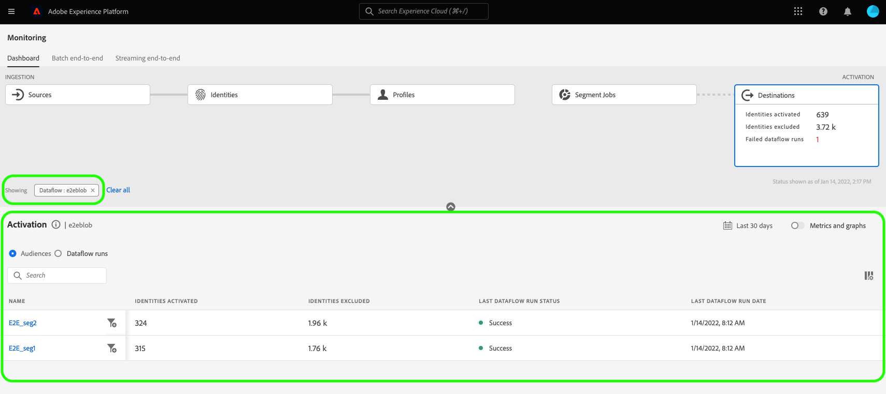

In the audience-level view, the metrics are aggregated across multiple dataflow runs within the selected time range. If there are multiple dataflow runs, you can drill down from the audience level to see the breakdown for each dataflow run, filtered by the selected audience.
Use the filter button  to drill down into the dataflow runs view for each audience in the dataflow.

### Dataflow runs page {#dataflow-runs-page}

The dataflow runs page displays information on your dataflow runs, including the dataflow run start time, processing time, records received, records activated, records excluded, records failed, activation rate, and status.

When you drill down into the dataflow runs page from the [audience-level view](#segment-level-view), you have the option of filtering the dataflow runs by the following options:

- **[!UICONTROL Dataflow runs with failed records]**: For the selected audience, this option lists all the dataflow runs that failed for activation. To inspect why records in a certain dataflow run failed, see the [dataflow run details page](#dataflow-run-details-page) for that dataflow run.
- **[!UICONTROL Dataflow runs with excluded records]**: For the selected audience, this option lists all the dataflow runs where some of the records were not fully activated and some profiles were skipped. To inspect why records in a certain dataflow run were skipped, see the [dataflow run details page](#dataflow-run-details-page) for that dataflow run.
- **[!UICONTROL Dataflow runs with activated records]**: For the selected audience, this option lists all the dataflow runs that have records which were successfully activated.

To see more details about a specific dataflow run, select the filter  beside the dataflow run start time to see the dataflow run details page.

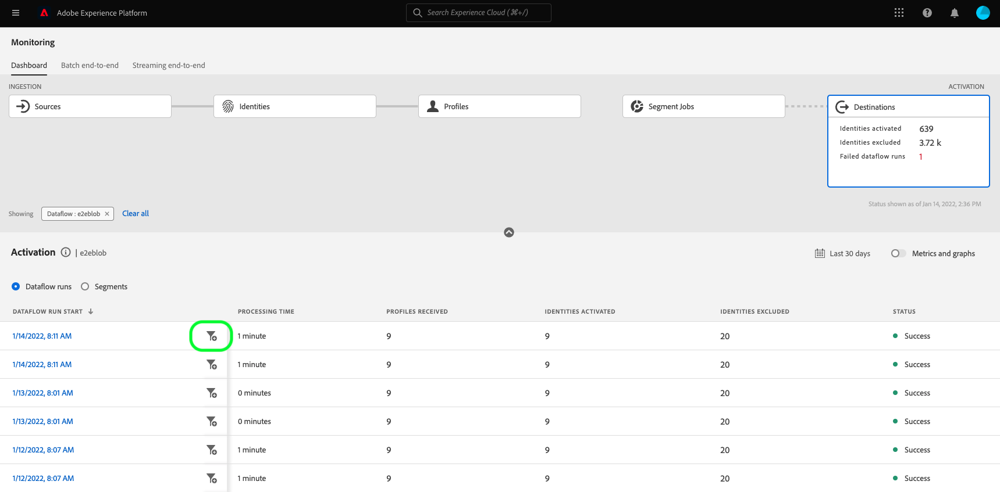

### Dataflow run details page {#dataflow-run-details-page}

The dataflow run details page, in addition to the details shown on the dataflow runs list, displays more specific information about the dataflow:

- **[!UICONTROL Dataflow run ID]**: The ID of the dataflow.
- **[!UICONTROL IMS org ID]**: The organization the dataflow belongs to.
- **[!UICONTROL Last updated]**: The time the dataflow run was last updated.

The details page also has a toggle to switch between dataflow run errors and audiences. This option is available for the destinations listed in the [audience-level view](#segment-level-view) section. 

The dataflow run errors view displays a list of records that failed and records that were skipped. Information for both the failed and skipped records is displayed, including the error code, identity count, and description. By default, the list displays the failed records. To show skipped records, select the **[!UICONTROL Records skipped]** toggle.

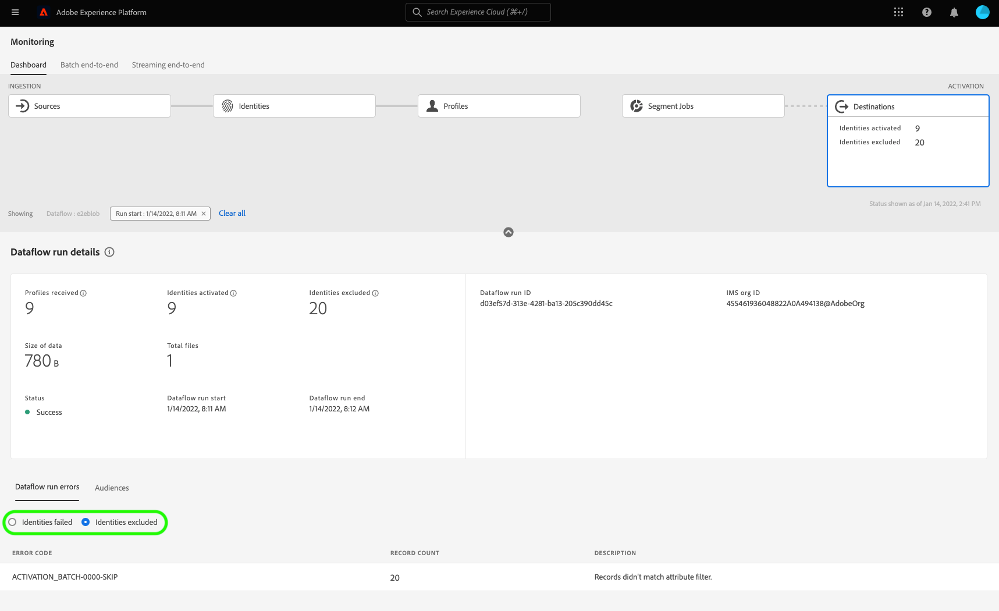

When **[!UICONTROL Audiences]** is selected, you see a list of the audiences which were activated in the selected dataflow run. This screen includes audience-level information about the records activated, records excluded, as well as the status and the time of the last dataflow run.

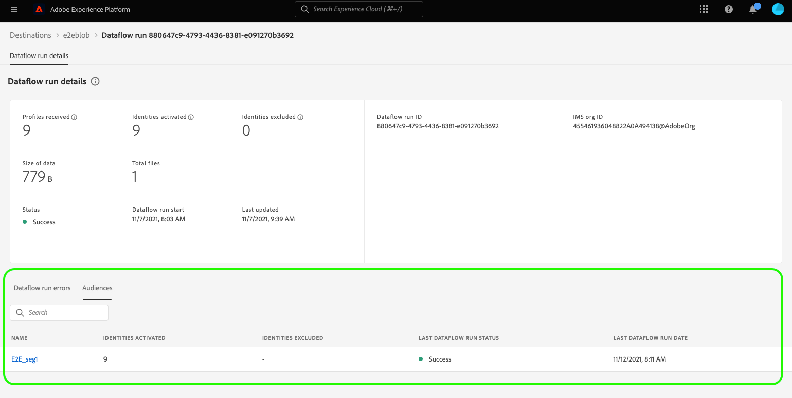

## Next steps {#next-steps}

By following this guide, you now know how to monitor dataflows for both batch and streaming destinations, including all the relevant information such as processing time, activation rate, and status. To learn more about dataflows in Experience Platform, read the [dataflows overview](../home.md). To learn more about destinations, read the [destinations overview](../../destinations/home.md).