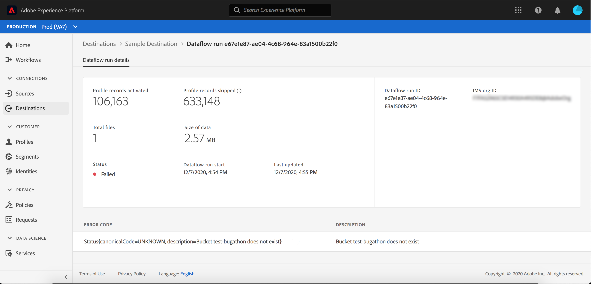

# Monitor dataflows for destinations in the UI

In the Adobe Experience Platform user interface, you can monitor the dataflows for your destinations. Details for these dataflows runs include.

## Getting started

This tutorial requires a working understanding of the following components of Adobe Experience Platform:

- [Destinations](../../destinations/home.md): Destinations are pre-built integrations with commonly used applications that allow for the seamless activation of data from Platform for cross-channel marketing campaigns, email campaigns, targeted advertising, and many other use cases.
- [Sandboxes](../../sandboxes/home.md): [!DNL Experience Platform] provides virtual sandboxes which partition a single [!DNL Platform] instance into separate virtual environments to help develop and evolve digital experience applications.

## Monitor dataflows

In the **[!UICONTROL Destinations]** workspace within the Platform UI, navigate to the **[!UICONTROL Browse]** tab and select the name of a destination that you want to view.

A list of existing dataflows appears. On this page is a list of viewable dataflows, including information about their destination, username, number of dataflows, and status.

See the following table for more information on statuses:

| Status | Description |
| ------ | ----------- |
| Enabled | The `Enabled` status indicates that a dataflow is active and is ingesting data according to the schedule it was provided. |
| Disabled | The `Disabled` status indicates that a dataflow is inactive and is not ingesting any data. |
| Processing | The `Processing` status indicates that a dataflow is not yet active. This status is often encountered immediately after a new dataflow is created. |
| Error | The `Error` status indicates that the activation process of a dataflow has been disrupted. |

## [!UICONTROL Dataflow runs]

The [!UICONTROL Dataflow runs] tab provides metric data on your dataflow runs to batch destinations. A list of individual runs and their particular metrics is displayed, along with the following totals for profile records:

- **[!UICONTROL Profile records activated]**: The total count of profile records that were created or updated for activation.
- **[!UICONTROL Profile records skipped]**:  The total count of profile records that are skipped for activation based on profile exits or missing attributes.

>[!NOTE]
>
>Dataflow runs are generated based on the destination dataflow's schedule frequency. A separate dataflow run is made for each merge policy applied to a segment.

To view the details of a particular dataflow run, select the run's start time from the list. The details page for a dataflow run contains additional information such as the size of data processed and a list of any errors that occurred with details for error diagnostics.

