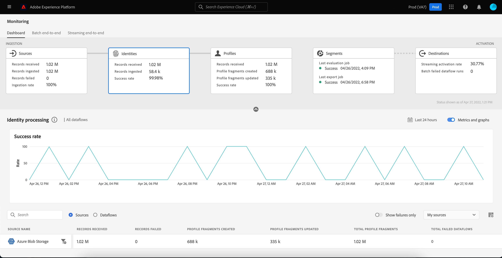
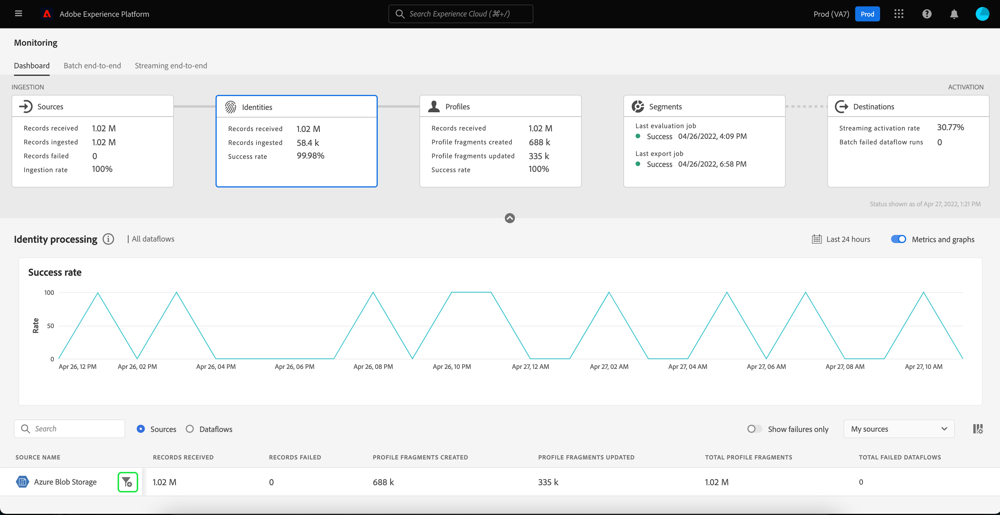
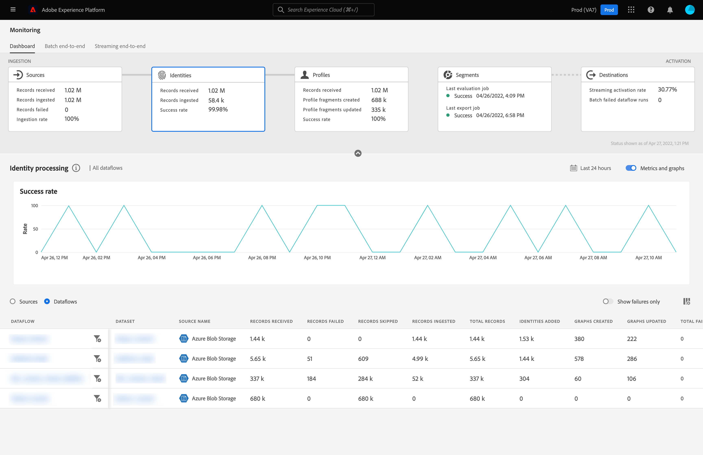
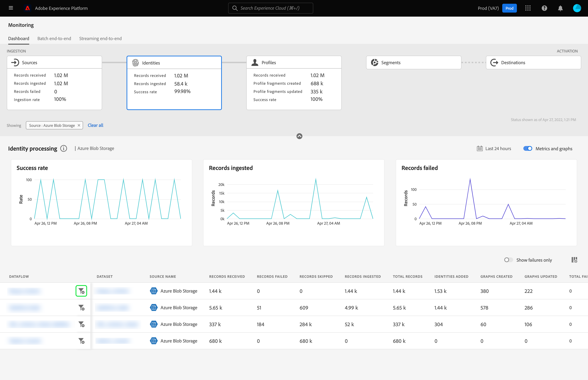

# Monitor dataflows for identities in the UI

Adobe Experience Platform Identity Service provides you with a comprehensive view of your customers and their behavior by bridging identities across devices and systems, allowing you to deliver impactful, personal digital experiences in real time.

The monitoring dashboard provides you with a visual representation of the data's activity within identities, including the status of your data's identities. This tutorial provides instructions on how you can use the monitoring dashboard to monitor your data's identities using the Experience Platform user interface, allowing you to track the status of identity processing.

## Getting started {#getting-started}

- [Dataflows](../home.md): Dataflows are a representation of data jobs that move data across Platform. Dataflows are configured across different services, helping move data from source connectors to target datasets, to [!DNL Identity] and [!DNL Profile], and to [!DNL Destinations].
  - [Dataflow runs](../../sources/notifications.md): Dataflow runs are the recurring scheduled jobs based on the frequency configuration of selected dataflows.
- [Identity Service](../../identity-service/home.md): Gain a better view of individual customers and their behavior by bridging identities across devices and systems.
- [Sandboxes](../../sandboxes/home.md): [!DNL Experience Platform] provides virtual sandboxes which partition a single [!DNL Platform] instance into separate virtual environments to help develop and evolve digital experience applications.

## Monitoring identities dashboard {#identity-metrics}

>[!CONTEXTUALHELP]
>id="platform_monitoring_identity_processing"
>title="Identity processing"
>abstract="The Identity processing view contains information on records ingested to Identity service, including the number of identities added, graphs created, and graphs updated. Review the metric definition guide to learn more about metrics and graphs."
>text="Learn more in documentation"

>[!CONTEXTUALHELP]
>id="platform_monitoring_dataflow_run_details_identity"
>title="Dataflow run details"
>abstract="The Dataflow run details page displays more information on your Identity dataflow run, including its organization ID and dataflow run ID."

To access the **[!UICONTROL Identities]** dashboard, select **[!UICONTROL Monitoring]** in the left navigation. Once on the **[!UICONTROL Monitoring]** page, select the **[!UICONTROL Identities]** card.

On the main **[!UICONTROL Identities]** dashboard, the **[!UICONTROL Identities]** card shows information about the total number of records received, the number of records ingested, as well as the success rate of record ingestion.

The dashboard itself contains metrics about Identity processing. By default, the dashboard will show Identity processing details for your organization's sources for the last 24 hours. 

The [!UICONTROL Identity processing] page contains information on records ingested to [!DNL Identity Service], including number of identities added, graphs created, and graphs updated.

The following metrics are available for this dashboard view:

| Identity metrics | Description |
| ---------------- | ----------- |
| **[!UICONTROL Records received]** | The number of records received from data lake. |
| **[!UICONTROL Records failed]** | The number of records that were not ingested into Platform due to errors in the data. |
| **[!UICONTROL Records skipped]** | The number of records that were ingested, but not into [!DNL Identity Service] because there was only one identifier in the record row. |
| **[!UICONTROL Records ingested]** | The number of records ingested into [!DNL Identity Service]. |
| **[!UICONTROL Identities added]** | The number of net new identifiers added to [!DNL Identity Service]. |
| **[!UICONTROL Graphs created]** | The number of net new identity graphs created in [!DNL Identity Service]. |
| **[!UICONTROL Graphs updated]** | The number of existing identity graphs updated with new edges. |
| **[!UICONTROL Total failed dataflows]** | The number of dataflow runs that failed. |

You can select the filter icon  beside the source name to see Identity processing information for that selected source's dataflows.

Alternatively, you can select **[!UICONTROL Dataflows]** on the toggle to see Identity processing details for your organization's dataflows for the last 24 hours.

The following metrics are available for this dashboard view:

| Metric | Description |
| -------| ----------- |
| **[!UICONTROL Dataflow]** | The name of the dataflow. |
| **[!UICONTROL Dataset]** | The name of the dataset that the dataflow is inserting to. |
| **[!UICONTROL Source name]** | The name of the source that the dataflow belongs to. |
| **[!UICONTROL Records received]** | The number of records received from data lake. |
| **[!UICONTROL Records failed]** | The number of records that were not ingested into Platform due to errors in the data. |
| **[!UICONTROL Records skipped]** | The number of records that were ingested, but not into [!DNL Identity Service] because there was only one identifier in the record row. |
| **[!UICONTROL Records ingested]** | The number of records ingested into [!DNL Identity Service]. |
| **[!UICONTROL Total records]** | The total count of all records, including records failed, records skipped, identities added, and duplicated records. |
| **[!UICONTROL Identities added]** | The number of net new identifiers added to [!DNL Identity Service]. |
| **[!UICONTROL Graphs created]** | The number of net new identity graphs created in [!DNL Identity Service]. |
| **[!UICONTROL Graphs updated]** | The number of existing identity graphs updated with new edges. |
| **[!UICONTROL Total failed dataflows]** | The number of dataflow runs that failed. |

Select the filter icon  beside the dataflow run start time to see more information on your [!DNL Identity] dataflow run.

The [!UICONTROL Dataflow run details] page displays more information on your [!DNL Identity] dataflow run, including its organization ID and dataflow run ID. This page also displays the corresponding error code and error message provided by [!DNL Identity Service], should any errors occur in the ingestion process.

The following metrics are available for this dashboard view:

| Metric | Description |
| -------| ----------- |
| **[!UICONTROL Records received]** | The number of records received from data lake. |
| **[!UICONTROL Records failed]** | The number of records that were not ingested into Platform due to errors in the data. |
| **[!UICONTROL Records skipped]** | The number of records that were ingested, but not into [!DNL Identity Service] because there was only one identifier in the record row. |
| **[!UICONTROL Records ingested]** | The number of records ingested into [!DNL Identity Service]. |
| **[!UICONTROL Identities added]** | The number of net new identifiers added to [!DNL Identity Service]. |
| **[!UICONTROL Graphs created]** | The number of net new identity graphs created in [!DNL Identity Service]. |
| **[!UICONTROL Graphs updated]** | The number of existing identity graphs updated with new edges. |
| **[!UICONTROL Status]** | Defines the overall status of a dataflow. The possible status values are: <ul><li>`Success`: Indicates that a dataflow is active and is ingesting data according to the schedule it was provided..</li><li>`Failed`: Indicates that the activation process of a dataflow has been disrupted due to errors. </li><li>`Processing`: Indicates that the dataflow is not yet active. This status is often encountered immediately after a new dataflow is created.</li></ul> |
| **[!UICONTROL Dataflow run start]** | The date and time the dataflow started to run. |
| **[!UICONTROL Last updated]** | The date and time the dataflow last updated. |
| **[!UICONTROL Error summary]** | If the dataflow run failed, this displays an error code and summary of why the dataflow run failed. |
| **[!UICONTROL Dataflow run ID]** | The ID of the dataflow run. |
| **[!UICONTROL IMS org ID]** | The organization ID that the dataflow run belongs to. |

Additionally, you can select the toggle to view the records failed or the records skipped. The errors section includes details about the error code and number of records failed or excluded.
