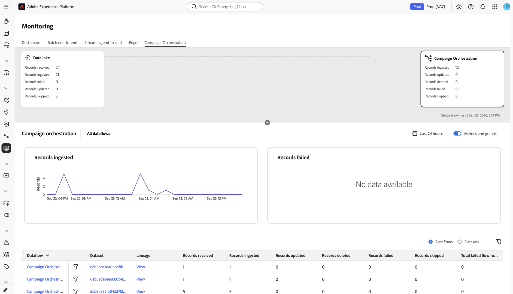
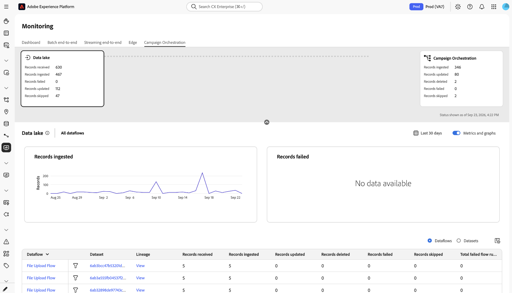
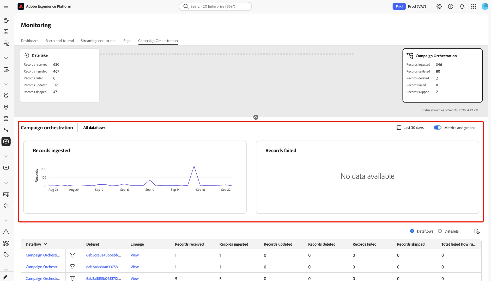
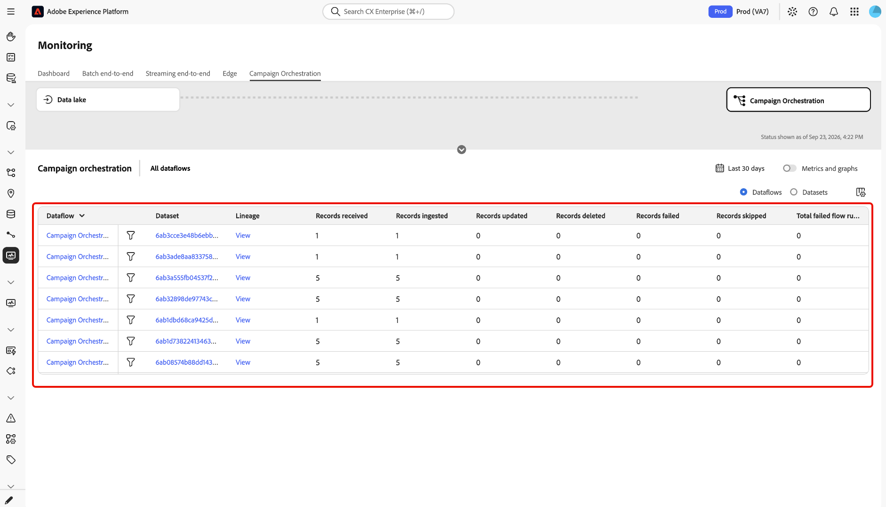
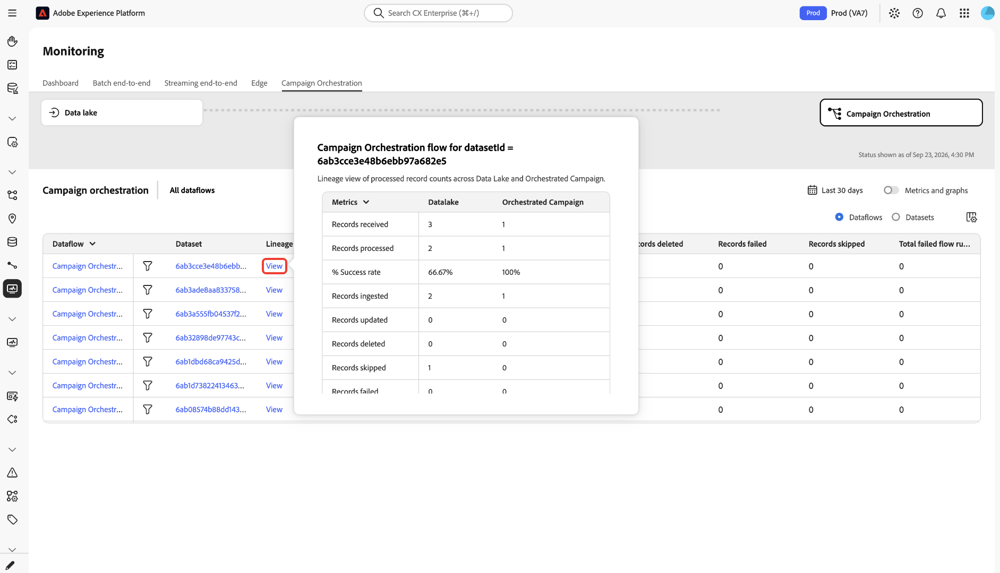

# Monitor Orchestrated Campaign ingestion in the UI

<!-- PLAT-307189. Confirmed with Amanda Li (PM), 2026-09-24: the official name is "Orchestrated Campaign" (see the Orchestrated Campaign lab: https://experienceleague.adobe.com/en/docs/blueprints-learn/architecture/labs/workshops/ajo-foundations/ajo-campaigns/ajo-campaigns-flagship/create-an-orchestrated-campaign). The "Campaign Orchestration" tab/card label seen in the 2026-09-23 bug bash screenshots is a UI bug engineering is fixing. Search on the detail table is not supported yet, so it's omitted below. The two summary cards currently show different metric sets - also a confirmed bug; both should show all six metrics (including Records received and Records deleted) once fixed. The lineage popup also shows "Datalake" as one word, inconsistent with "Data lake" everywhere else - not yet raised with engineering. Screenshots below predate these fixes and should be refreshed once the corrected UI ships; Amanda has approved this PR to publish in the meantime. -->

Orchestrated Campaign ingestion moves data from data lake into the relational store that powers Adobe Journey Optimizer Brand Journeys. Use the **[!UICONTROL Orchestrated Campaign]** dashboard to monitor these dataflows and troubleshoot dropped or failed records without contacting support.

This guide is for data stewards and marketing or campaign operations users who manage batch and Orchestrated Campaign ingestion in [!DNL Experience Platform].

## Getting started {#getting-started}

This guide requires a working understanding of the following components of Adobe Experience Platform:

- [Dataflows](../home.md): Dataflows are a representation of data jobs that move data across Experience Platform. Dataflows are configured across different services, helping move data from source connectors to target datasets, to [!DNL Identity] and [!DNL Profile], and to [!DNL Destinations].
  - [Dataflow runs](../../sources/notifications.md): Dataflow runs are the recurring scheduled jobs based on the frequency configuration of selected dataflows.
- [Real-Time Customer Profile](../../profile/home.md): Provides a unified, real-time consumer profile based on aggregated data from multiple sources.
- [Sandboxes](../../sandboxes/home.md): [!DNL Experience Platform] provides virtual sandboxes which partition a single [!DNL Experience Platform] instance into separate virtual environments to help develop and evolve digital experience applications.

## Access the Orchestrated Campaign dashboard {#access-dashboard}

In the [!DNL Experience Platform] UI, select **[!UICONTROL Monitoring]** in the left navigation. On the **[!UICONTROL Monitoring]** page, select the **[!UICONTROL Orchestrated Campaign]** tab.

The **[!UICONTROL Orchestrated Campaign]** dashboard shows two ingestion summary cards, a metrics panel with trend graphs, and a dataflow and dataset detail table. Select either card to filter the metrics panel, trend graphs, and detail table to that stage.

## View the ingestion summary cards {#summary-cards}

The dashboard displays two summary cards side by side, one for each stage of the pipeline:

- **[!UICONTROL Data lake]**: Records moving from source dataflows into [!DNL Data Lake].
- **[!UICONTROL Orchestrated Campaign]**: Records moving from [!DNL Data Lake] into the relational store.

Each card reports the same six metrics for its stage:

| Metric | Description |
| --- | --- |
| **[!UICONTROL Records received]** | The total number of records received into the stage. |
| **[!UICONTROL Records ingested]** | The total number of net new records ingested into the stage. |
| **[!UICONTROL Records updated]** | The total number of existing records updated in the stage. |
| **[!UICONTROL Records deleted]** | The total number of records deleted from the stage. |
| **[!UICONTROL Records failed]** | The total number of records that were not processed due to errors. |
| **[!UICONTROL Records skipped]** | The total number of records skipped during processing. |

{style="table-layout:auto"}

## View metrics and trend graphs {#metrics-panel}

Below the summary cards, the metrics panel displays a **[!UICONTROL Records ingested]** trend graph and a **[!UICONTROL Records failed]** trend graph for the selected card's stage.

By default, the dashboard shows data for the last 24 hours. To change the range, select the time-range selector and choose a different window. For steps, read [Configure monitoring time frame](./monitor.md#configure-monitoring-time-frame).

To hide the metrics panel and graphs, select **[!UICONTROL Metrics and graphs]** to turn off the toggle.

## View the detail table {#detail-table}

The lower part of the dashboard lists the dataflows or datasets that contribute to Orchestrated Campaign ingestion.

Select **[!UICONTROL Dataflows]** or **[!UICONTROL Datasets]** to change how the table groups rows. Use **[!UICONTROL All dataflows]** to filter the table to a specific dataflow.

Each row displays the following columns:

| Column | Description |
| --- | --- |
| **[!UICONTROL Dataflow]** | The name of the dataflow. |
| **[!UICONTROL Dataset]** | The ID of the dataset that the dataflow writes to. |
| **[!UICONTROL Lineage]** | Select **[!UICONTROL View]** to open the lineage reconciliation popup for this dataflow. |
| **[!UICONTROL Records received]** | The total number of records received by the dataflow. |
| **[!UICONTROL Records ingested]** | The total number of net new records ingested. |
| **[!UICONTROL Records updated]** | The total number of existing records updated. |
| **[!UICONTROL Records deleted]** | The total number of records deleted. |
| **[!UICONTROL Records failed]** | The total number of records that were not processed due to errors. |
| **[!UICONTROL Records skipped]** | The total number of records skipped during processing. |
| **[!UICONTROL Total failed flow runs]** | The total number of dataflow runs that failed. |

{style="table-layout:auto"}

To customize which columns are shown, select the column display icon in the top right of the table.

## View the lineage reconciliation popup {#lineage-reconciliation}

Use the lineage popup to compare how a dataflow's records moved through the [!DNL Data Lake] and [!UICONTROL Orchestrated Campaign] stages, and to diagnose discrepancies between them.

Select **[!UICONTROL View]** in the **[!UICONTROL Lineage]** column for a dataflow.

A popup titled **[!UICONTROL Orchestrated Campaign flow for datasetId =]** followed by the dataset ID appears, showing the following values side by side for each stage:

| Field | Description |
| --- | --- |
| **[!UICONTROL Records received]** | The total number of records received by the stage. |
| **[!UICONTROL Records processed]** | The total number of records successfully processed by the stage. This is the sum of records ingested, updated, and deleted. |
| **[!UICONTROL % Success rate]** | The percentage of received records that were successfully processed, calculated as records processed divided by records received. |
| **[!UICONTROL Records ingested]** | The total number of net new records ingested. |
| **[!UICONTROL Records updated]** | The total number of existing records updated. |
| **[!UICONTROL Records deleted]** | The total number of records deleted. |
| **[!UICONTROL Records skipped]** | The total number of records skipped during processing. |
| **[!UICONTROL Records failed]** | The total number of records that were not processed due to errors. |

{style="table-layout:auto"}

Compare the **[!UICONTROL % Success rate]** for each stage to identify where records are being dropped. For example, a lower success rate in the [!DNL Data Lake] stage than in the [!UICONTROL Orchestrated Campaign] stage indicates that records are failing or being skipped during initial source ingestion, rather than after they reach data lake.

## Next steps {#next-steps}

By reading this document, you learned how to use the **[!UICONTROL Orchestrated Campaign]** dashboard to monitor ingestion from data lake into the relational store, and how to use the lineage reconciliation popup to diagnose discrepancies. For information on monitoring other stages, read the following documents:

- [Monitor data lake ingestion](monitor-sources.md)
- [Monitor dataflows for Profiles in the UI](monitor-profiles.md)
- [Monitoring dashboard overview](monitor.md)
