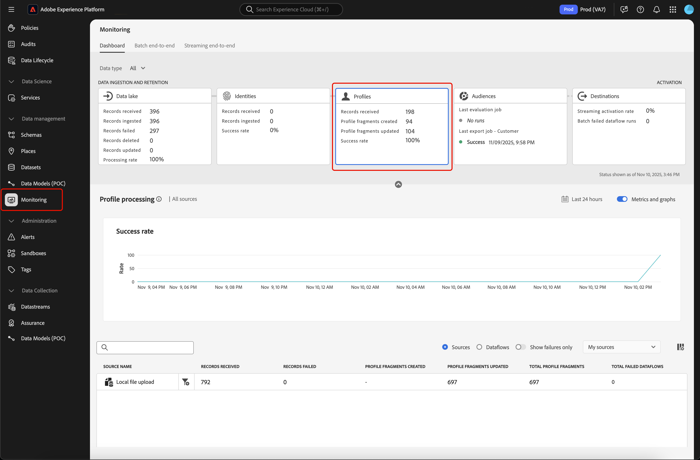
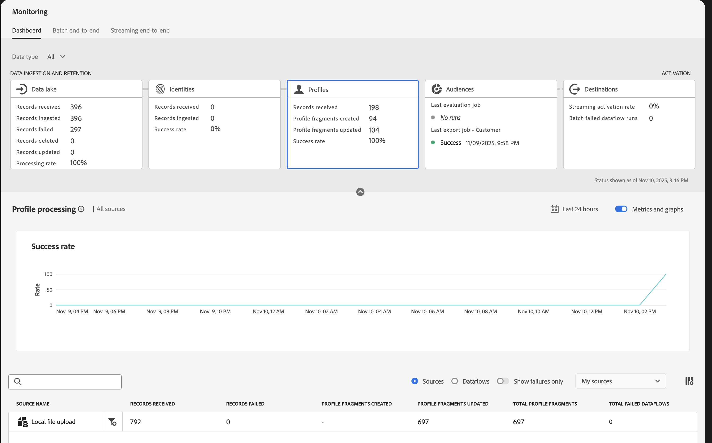
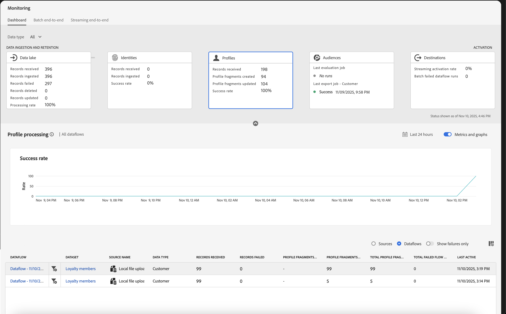
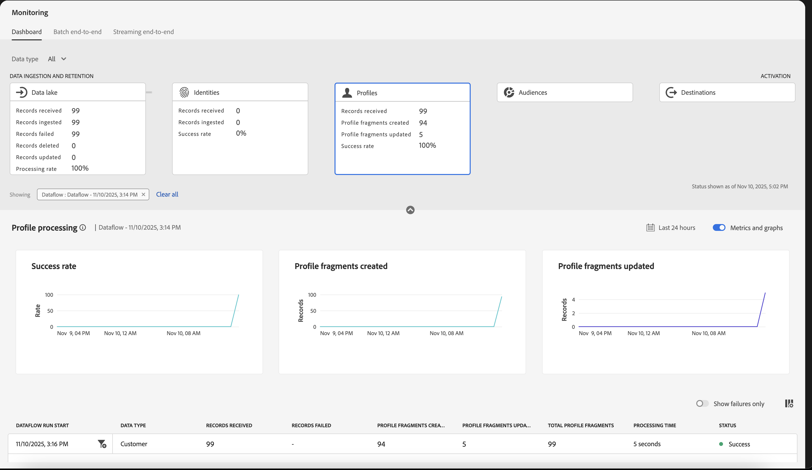
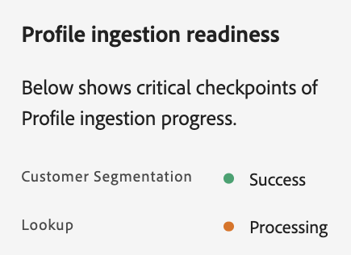
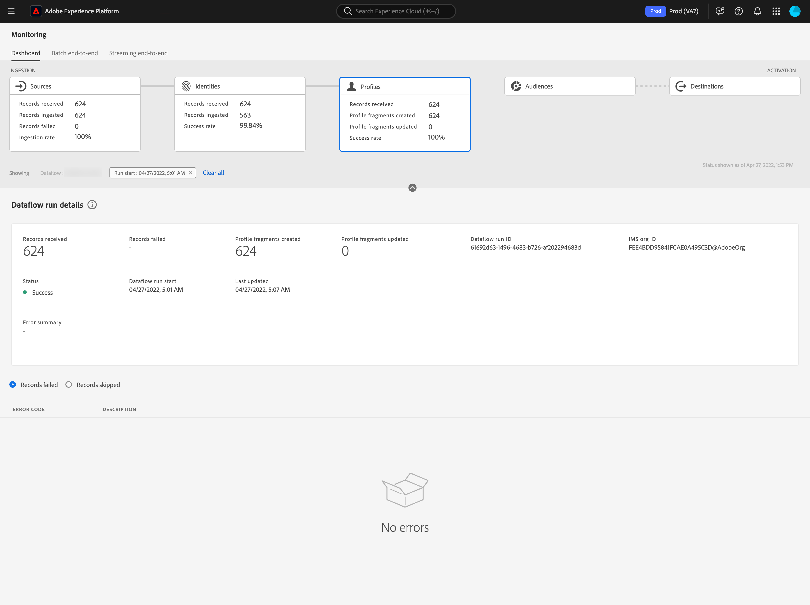

# Monitor dataflows for Profiles in the UI 

Real-Time Customer Profile lets you see a holistic view of each individual customer by combining data from multiple channels, including online, offline, CRM, and third party. Profile allows you to consolidate your customer data into a unified view offering an actionable, timestamped account of every customer interaction. 

The monitoring dashboard provides you with a visual representation of the data's activity within Profile, including the status of your data's Profiles. This tutorial provides instructions on how you can use the monitoring dashboard to monitor your data's profiles using the Experience Platform user interface, allowing you to track the status of Profile processing.

## Getting started {#getting-started}

This guide requires a working understanding of the following components of Adobe Experience Platform:

- [Dataflows](../home.md): Dataflows are a representation of data jobs that move data across Experience Platform. Dataflows are configured across different services, helping move data from source connectors to target datasets, to [!DNL Identity] and [!DNL Profile], and to [!DNL Destinations].
  - [Dataflow runs](../../sources/notifications.md): Dataflow runs are the recurring scheduled jobs based on the frequency configuration of selected dataflows.
- [Real-Time Customer Profile](../../profile/home.md): Provides a unified, real-time consumer profile based on aggregated data from multiple sources.
- [Sandboxes](../../sandboxes/home.md): [!DNL Experience Platform] provides virtual sandboxes which partition a single [!DNL Experience Platform] instance into separate virtual environments to help develop and evolve digital experience applications.

## Monitoring profiles dashboard {#profile-metrics}

>[!CONTEXTUALHELP]
>id="platform_monitoring_profile_processing"
>title="Profile processing"
>abstract="The Profile processing view contains information on records ingested to Profile service, including the number of profile fragments created, profile fragments updated, and the total number of profile fragments."
>text="Learn more in documentation"

>[!CONTEXTUALHELP]
>id="platform_monitoring_dataflow_run_details_profile"
>title="Dataflow run details"
>abstract="The Dataflow run details page displays more information on your Profile dataflow run, including its organization ID and dataflow run ID."

To access the **[!UICONTROL Profiles]** dashboard, select **[!UICONTROL Monitoring]** in the left navigation. Once on the **[!UICONTROL Monitoring]** page, select the **[!UICONTROL Profiles]** card.

On the main **[!UICONTROL Profiles]** dashboard, the **[!UICONTROL Profiles]** card shows information about the total number of records received, the number of profile fragments created and updated, as well as the success rate of created and updated profile fragments. 

The dashboard itself contains metrics about Profile processing. By default, the dashboard will show Profile processing details for your organization's sources for the last 24 hours. 

The [!UICONTROL Profile processing] page contains information on records ingested to [!DNL Profile], including number of profile fragments created, profile fragments updated, and the total number of profile fragments.

The following metrics are available for this dashboard view:

| Metric | Description |
| -------| ----------- |
| **[!UICONTROL Source name]** | The name of the source. |
| **[!UICONTROL Records received]** |  The number of records received from data lake. |
| **[!UICONTROL Records failed]**| The number of records that were ingested, but not into [!DNL Profile] due to errors. |
| **[!UICONTROL Profile fragments created]** | The number of net new [!DNL Profile] fragments added. |
| **[!UICONTROL Profile fragments updated]** | The number of existing [!DNL Profile] fragments updated. |
| **[!UICONTROL Total Profile fragments]** | The total number of records written into [!DNL Profile], including all existing [!DNL Profile] fragments updated and new [!DNL Profile] fragments created. |
| **[!UICONTROL Total failed dataflows]** | The number of dataflow runs that failed. |

You can select the filter icon  beside the source name to see Profile processing information for that selected source's dataflows.

Alternatively, you can select **[!UICONTROL Dataflows]** on the toggle to see Profile processing details for your organization's dataflows for the last 24 hours.

The following metrics are available for this dashboard view:

| Metric | Description |
| -------| ----------- |
| **[!UICONTROL Dataflow]** | The name of the dataflow. |
| **[!UICONTROL Dataset]** | The name of the dataset that the dataflow is inserting to. |
| **[!UICONTROL Source name]** | The name of the source that the dataflow belongs to. |
| **[!UICONTROL Data type]** | The type of data that is received from the dataset. |
| **[!UICONTROL Records received**] |  The number of records received from data lake. |
| **[!UICONTROL Records failed]** | The number of records that were ingested, but not into [!DNL Profile] due to errors. |
| **[!UICONTROL Profile fragments created]** | The number of net new [!DNL Profile] fragments added. |
| **[!UICONTROL Profile fragments updated]** | The number of existing [!DNL Profile] fragments updated |
| **[!UICONTROL Total Profile fragments]** | The total number of records written into [!DNL Profile], including all existing [!DNL Profile] fragments updated and new [!DNL Profile] fragments created. |
| **[!UICONTROL Total failed flow runs]** | The number of dataflow runs that failed. |
| **[!UICONTROL Last active]** | The timestamp which the dataflow was last run. |

Select the filter icon  beside the dataflow run start time to see more information on your [!DNL Profile] dataflow run.

A dashboard displaying all the dataflow runs appears. This dashboard contains metrics about the dataflow runs as well as graphs that show the success rate, profile fragments created, and profile fragments updated.

The following metrics are available for this dashboard view:

>[!NOTE]
>
>When the dataflow run is in the **[!UICONTROL Processing]** state, you can see information about the readiness by seeing the checkpoint statuses in the ingestion process.
>
>{zoomable="yes" width="300"}

| Metric | Description | 
| ------ | ----------- |
| **[!UICONTROL Dataflow run start]** | The time the dataflow run started in UTC. |
| **[!UICONTROL Data type]** | The type of data received by the dataflow. |
| **[!UICONTROL Records received]** | The number of records received from data lake. |
| **[!UICONTROL Records failed]** | The number of records that were ingested, but not into [!DNL Profile] due to errors. |
| **[!UICONTROL Profile fragments created]** | The number of net new [!DNL Profile] fragments added. |
| **[!UICONTROL Profile fragments updated]** | The number of existing [!DNL Profile] fragments updated. |
| **[!UICONTROL Total profile fragments]** | The total number of records written into [!DNL Profile], including all existing [!DNL Profile] fragments updated and new [!DNL Profile] fragments created. |
| **[!UICONTROL Processing time]** | The amount of time it took for the dataflow run to process. |
| **[!UICONTROL Status]** | The status of the dataflow run. Possible values include [!UICONTROL Success], [!UICONTROL Failed], [!UICONTROL Queued], and [!UICONTROL Processing]. |
| **[!UICONTROL Ready for customer segmentation]** | A status showing if the ingested records are ready to be used in customer segmentation. Possible values include [!UICONTROL Yes], [!UICONTROL Failed], [!UICONTROL Queued], and [!UICONTROL Processing]. Even if the **Status** of the dataflow is processing, if the value of this field is Yes, you can use the profiles in customer segmentation. |
| **[!UICONTROL Ready for lookup]** | A status showing if the ingested records are ready to used in Adobe Journey Optimizer lookup.  Possible values include [!UICONTROL Yes], [!UICONTROL Failed], [!UICONTROL Queued], and [!UICONTROL Processing]. Even if the **Status** of the dataflow is processing, if the value of this field is Yes, you can use the profiles in Journey Optimizer lookup. |

The [!UICONTROL Dataflow run details] page displays more information on your [!DNL Profile] dataflow run, including its organization ID and dataflow run ID. This page also displays the corresponding error code and error message provided by [!DNL Profile], should any errors occur in the ingestion process.

The following metrics are available for this dashboard view:

| Metric | Description |
| -------| ----------- |
| **[!UICONTROL Records received]** | The number of records received from data lake. |
| **[!UICONTROL Records failed]** | The number of records that were ingested, but not into [!DNL Profile] due to errors. |
| **[!UICONTROL Profile fragments created]** | The number of net new [!DNL Profile] fragments added. |
| **[!UICONTROL Profile fragments updated]** | The number of existing [!DNL Profile] fragments updated. |
| **[!UICONTROL Status]** | Defines the overall status of a dataflow. The possible status values are: <ul><li>`Success`: Indicates that a dataflow is active and is ingesting data according to the schedule it was provided..</li><li>`Failed`: Indicates that the activation process of a dataflow has been disrupted due to errors. </li><li>`Processing`: Indicates that the dataflow is not yet active. This status is often encountered immediately after a new dataflow is created.</li></ul> |
| **[!UICONTROL Dataflow run start]** | The date and time the dataflow started to run. |
| **[!UICONTROL Last updated]** | The date and time the dataflow last updated. |
| **[!UICONTROL Error summary]** | If the dataflow run failed, this displays an error code and summary of why the dataflow run failed. |
| **[!UICONTROL Dataflow run ID]** | The ID of the dataflow run. |
| **[!UICONTROL IMS org ID]** | The organization ID that the dataflow run belongs to. |

Additionally, you can select the toggle to view the records failed or the records skipped. The errors section includes details about the error code and number of records failed or excluded.
