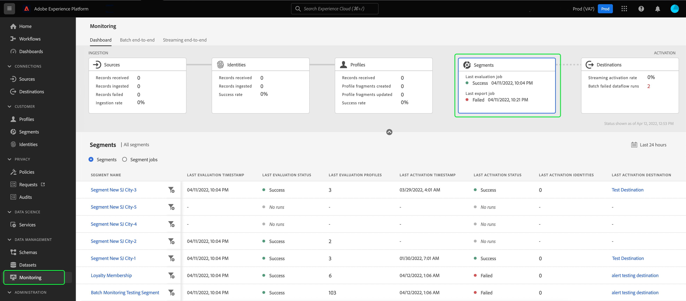
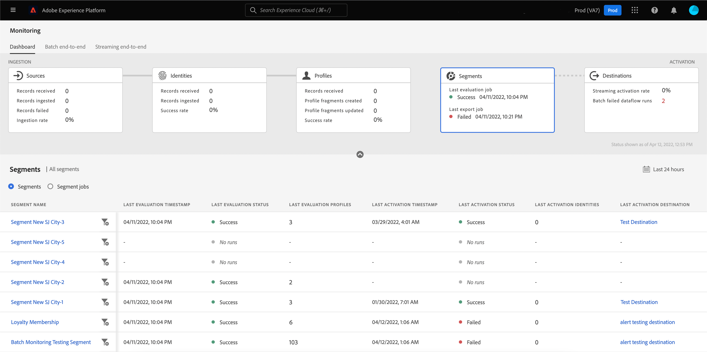
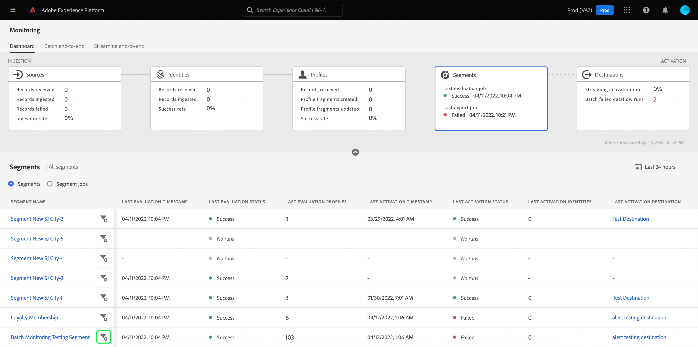
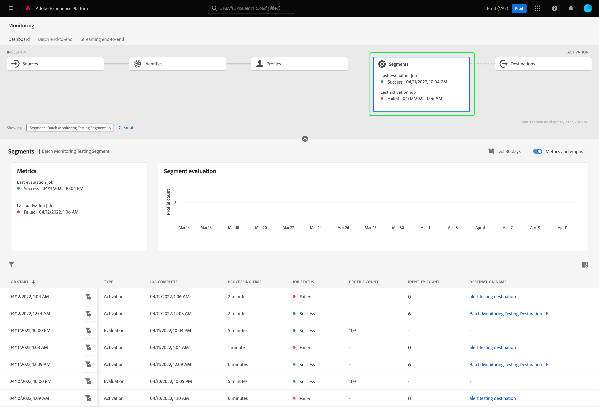
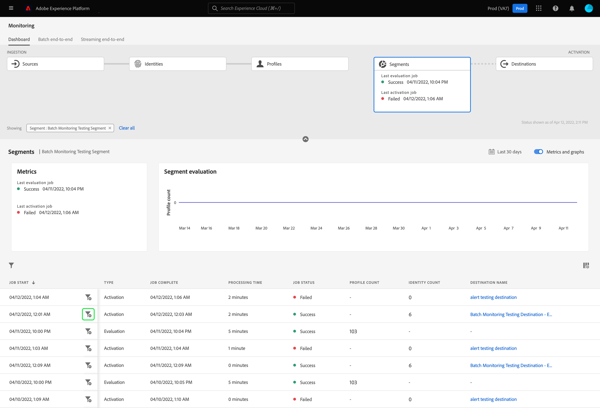
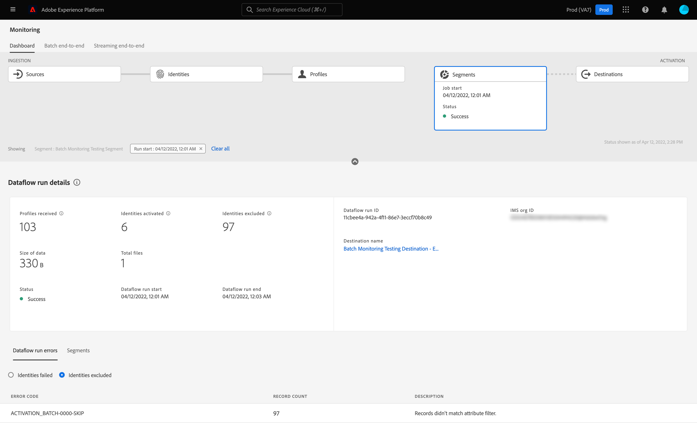
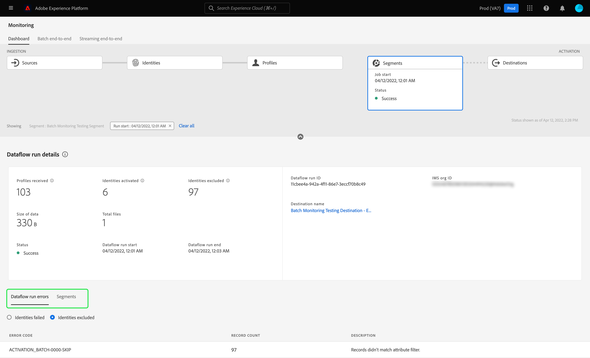
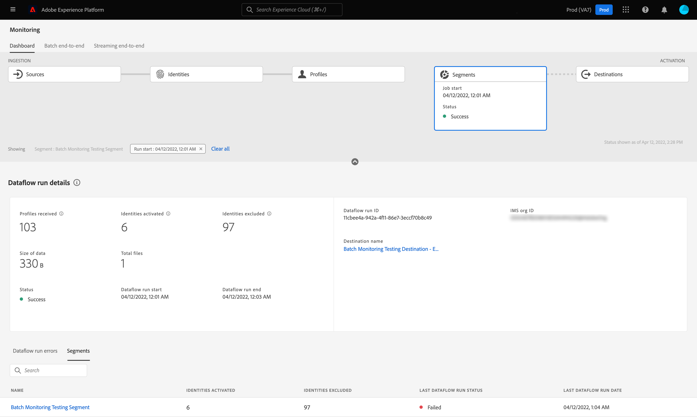
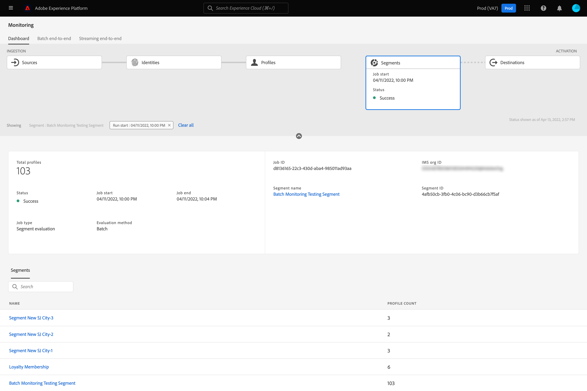
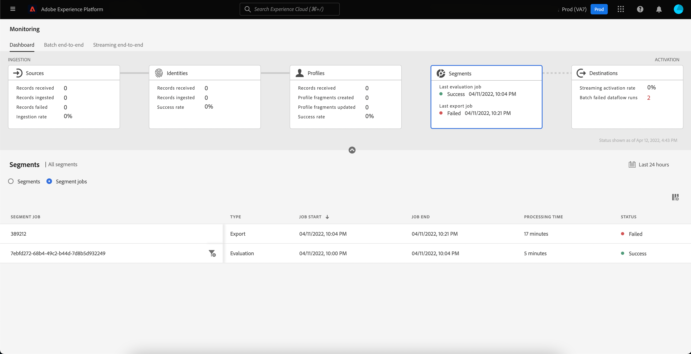

# Monitor dataflows for segments in the UI

Segmentation Service allows you to create segments and audiences from your Real-Time Customer Profile data in Adobe Experience Platform. Platform provides dataflows to transparently track this flow of data from sources to destinations.

The monitoring dashboard provides you with a visual representation of the data's activity within a segment, including the status of your data's segmentation. This tutorial provides instructions on how you can use the monitoring dashboard to monitor your data's segmentation using the Experience Platform user interface, allowing you to track the status of segment activation, evaluation, and export jobs.

## Getting started {#getting-started}

This guide requires a working understanding of the following components of Adobe Experience Platform:

- [Dataflows](../home.md): Dataflows are a representation of data jobs that move data across Platform. Dataflows are configured across different services, helping move data from source connectors to target datasets, to [!DNL Identity] and [!DNL Profile], and to [!DNL Destinations].
  - [Dataflow runs](../../sources/notifications.md): Dataflow runs are the recurring scheduled jobs based on the frequency configuration of selected dataflows.
- [Segmentation](../../segmentation/home.md): Segmentation allows you to create segments and audiences from your Real-Time Customer Profile data. 
  - [Activation jobs](../../destinations/ui/activation-overview.md): An activation job is used to activate your segment to a specified destination.
  - [Evaluation jobs](../../segmentation/tutorials/evaluate-a-segment.md#evaluate-a-segment): An evaluation job is an asynchronous process that runs creates an audience segment based on the specified segment.
  - [Export jobs](../../segmentation/api/export-jobs.md): An export job is an asynchronous processes that are used to persist audience segment members to datasets.
- [Sandboxes](../../sandboxes/home.md): [!DNL Experience Platform] provides virtual sandboxes which partition a single [!DNL Platform] instance into separate virtual environments to help develop and evolve digital experience applications.

## Monitoring segments dashboard {#monitoring-segments-dashboard}

>[!CONTEXTUALHELP]
>id="platform_monitoring_segments"
>title="Segments"
>abstract="The segments view contains information on all your organization's segments, with further information about their activation and evaluation jobs."

To access the **[!UICONTROL Segments]** dashboard, select **[!UICONTROL Monitoring]** in the left navigation. Once on the **[!UICONTROL Monitoring]** page, select the **[!UICONTROL Segments]** card. 

On the main **[!UICONTROL Segments]** dashboard, the **[!UICONTROL Segments]** card shows the status and date of the last evaluation job and the last export job. 

The dashboard itself contains metrics for both segments and segment jobs. By default, the dashboard will show the segment metrics for the last 24 hours. To learn more about the segment jobs view, please read the [monitoring segment jobs](#monitoring-segment-jobs-dashboard) section.

>[!IMPORTANT]
>
>Currently, only segments that are activated to [batch (file-based) destinations](../../destinations/destination-types.md#file-based) are supported for the monitoring segments dashboard.

The following metrics are available for this dashboard view:

| Metric | Description |
| ------ | ----------- |
| **[!UICONTROL Segment name]** | The name of the segment. |
| **[!UICONTROL Last evaluation timestamp]** | The date and time that the segment's last evaluation job ran. |
| **[!UICONTROL Last evaluation status]** | The status of the segment's last evaluation job. Possible values include **[!UICONTROL Success]**, **[!UICONTROL No runs]**, and **[!UICONTROL Failed]**.|
| **[!UICONTROL Last evaluation profiles]** | The number of profiles that were evaluated in the segment's last evaluation job. |
| **[!UICONTROL Last activation timestamp]** | The date and time that the segment's last activation job ran. |
| **[!UICONTROL Last activation status]** | The status of the segment's last activation job. Possible values include **[!UICONTROL Success]**, **[!UICONTROL No runs]**, and **[!UICONTROL Failed]**. | 
| **[!UICONTROL Last activation identities]** | The number of identities that were activated in the segment's last activation job. |
| **[!UICONTROL Last activation destination]** | The name of the destination that the segment's last activation job activated to. |

You can filter the results to a specific segment and view its segment jobs by selecting the filter icon (). The segment jobs are sorted in chronological order, with the most recent segment jobs appearing first.

The filtered segment dashboard appears. The **[!UICONTROL Segments]** card shows the status and date of the last evaluation job and the last activation job. 

The dashboard itself displays the time and status of the last evaluation and activation jobs, a graph showing the profile count of the segment evaluation, and metrics for the segment jobs that were run. By default, the dashboard shows segment job metrics for the last 24 hours.

The following metrics are available for this dashboard view:

| Metric | Description |
| ------ | ----------- |
| **[!UICONTROL Job start]** | The date and time when the segment job started. |
| **[!UICONTROL Type]** | Indicates the type of the segment job. The two supported job types are **activation** and **evaluation** jobs. |
| **[!UICONTROL Job complete]** | The date and time when the segment job completed. |
| **[!UICONTROL Processing time]** | The amount of time it took for the segment job to complete. |
| **[!UICONTROL Job status]** | The status of the segment job. Supported values include **[!UICONTROL Success]**, **[!UICONTROL In Progress]**, and **[!UICONTROL Failed]**. |
| **[!UICONTROL Profile count]** | The number of profiles that the segment job is evaluating. Each user should have a unique profile. |
| **[!UICONTROL Identity count]** | The number of identities that the segment job is activating. Each profile can have multiple identities. For example, a profile could have an email, phone number, and a loyalty number as identities. |
| **[!UICONTROL Destination name]** | The name of the destination that the segment job is being activated to. |

You can further filter to a specific segment job and see its details by selecting the filter icon (). There are two different kinds of segment jobs that can be filtered: activation jobs and evaluation jobs.

### Activation job details {#activation-job-details}

The activation job dataflow run details page shows information on the run's metrics, dataflow run errors, and segments that are related to the segment job. An activation job is used to activate your segment for a specified destination. By default, the details page shows the dataflow run errors.

The following metrics are available for this dashboard view:

| Metric | Description |
| ------ | ----------- |
| **[!UICONTROL Profiles received]** | The total number of profiles received in the activation flow. |
| **[!UICONTROL Identities activated]** | The total number of identities that were successfully activated to the destination, based on the profiles received. |
| **[!UICONTROL Identities excluded]** | The total number of identities that were excluded from being activated to the destination, based on the profiles received. These identities could be excluded because of missing attributes or consent violations. |
| **[!UICONTROL Size of data]** | The size of the dataflow being activated. |
| **[!UICONTROL Total files]** | The total number of files being activated in the dataflow. |
| **[!UICONTROL Status]** | The current status of the activation job. |
| **[!UICONTROL Dataflow run start]** | The date and time that the activation job started. |
| **[!UICONTROL Dataflow run end]** | The date and time that the activation job ended. |
| **[!UICONTROL Dataflow run ID]** | The ID of the current activation job. |
| **[!UICONTROL IMS org ID]** | The ID of the organization that the activation job belongs to. |
| **[!UICONTROL Destination name]** | The name of the destination that the data is being activated to. |

Underneath the metrics, a toggle to select between the dataflow run errors and the segments is displayed.

Under the dataflow run errors section, select the toggle to view the identities failed or the identities excluded fields. The errors section includes details about the error code and number of identities failed or excluded.

Under the segments section, you can see a list of segments that were activated as part of the activation job. Use the search bar to filter the list of segments by name. 

For the segments section, the following metrics are available:

| Metric | Description | 
| ------ | ----------- |
| **[!UICONTROL Name]** | The name of the segment that was activated. |
| **[!UICONTROL Identities activated]** | The total number of identities that were successfully activated to the destination, based on the profiles received.  |
| **[!UICONTROL Identities excluded]** | The total number of identities that were excluded from being activated to the destination, based on the profiles received. These identities could be excluded because of missing attributes or consent violation.  |
| **[!UICONTROL Last dataflow run status]** | The status of the last activation job that ran for that segment. |
| **[!UICONTROL Last dataflow run date]** | The date and time of the last activation job that ran for that segment. |

### Evaluation job details {#evaluation-job-details}

The evaluation job dataflow run details page shows information on the run's metrics and segments that are related to the segment job. An evaluation job is an asynchronous process that creates an audience segment based on the specified segment. To learn more about evaluation jobs, please read the tutorial on [evaluating a segment](../../segmentation/tutorials/evaluate-a-segment.md#evaluate-a-segment).

The following metrics are available for this dashboard view:

| Metric | Description |
| ------ | ----------- |
| **[!UICONTROL Total profiles]** | The total number of profiles that are being evaluated. |
| **[!UICONTROL Status]** | The status of the evaluation job. Possible statuses for the evaluation job include **[!UICONTROL Success]** and **[!UICONTROL Failed]**.  |
| **[!UICONTROL Job start]** | The date and time that the evaluation job started. |
| **[!UICONTROL Job end]** | The date and time that the evaluation job ended. |
| **[!UICONTROL Job type]** | The type of segment job. In this case, it will always be a segment evaluation job. |
| **[!UICONTROL Evaluation type]** | The type of evaluation that is being done. This can be either be **[!UICONTROL Batch]** or **[!UICONTROL Streaming]**. |
| **[!UICONTROL Job ID]** | The ID of the evaluation job. |
| **[!UICONTROL IMS org ID]** | The ID of the organization the evaluation job belongs to. |
| **[!UICONTROL Segment name]** | The name of the segment that is being evaluated. |
| **[!UICONTROL Segment ID]** | The ID of the segment that is being evaluated. |

Under the segments section, you can see a list of segments that are being evaluated as part of the evaluation job. You can filter the list of segments by name by using the search bar. 

>[!IMPORTANT]
>
>This dashboard view currently supports up to 800 segment metrics.

For the segments section, the following metrics are available:

| Metric | Description | 
| ------ | ----------- |
| **[!UICONTROL Name]** | The name of the segment that is being evaluated. |
| **[!UICONTROL Profile count]** | The number of profiles that are being evaluated. |

## Monitoring segment jobs dashboard {#monitoring-segment-jobs-dashboard}

>[!CONTEXTUALHELP]
>id="platform_monitoring_segment_jobs"
>title="Segment Jobs"
>abstract="The segment jobs view contains information on the evaluation and export jobs for all your segments."

To access the **[!UICONTROL Segment Jobs]** dashboard, select **[!UICONTROL Monitoring]** () in the left navigation. Once on the [!UICONTROL Monitoring] page, select **[!UICONTROL Segment Jobs]**. The [!UICONTROL Monitoring] dashboard contains metrics and information on the segment evaluation and export jobs.

>[!NOTE]
>
>Only **segment evaluation jobs** are supported for per-segment monitoring. Segment export jobs only support organization-level monitoring.

Use the [!UICONTROL Segment Jobs] dashboard to understand if profile evaluation and export occurs on time and without any exceptions, so the downstream services for destination activation can have the latest evaluated profile data.

The following metrics are available for segment jobs:

| Metric | Description |
---------|----------|
| **[!UICONTROL Segment job]** | Indicates the name of the segment job. |
| **[!UICONTROL Type]** | Indicates the type of segment job - export or evaluation. Note that in both cases, the segment job evaluates or exports **all** segments belonging to an organization. To learn more about export jobs, please read the guide on the [export jobs endpoint](../../segmentation/api/export-jobs.md). To learn more about evaluation jobs, please read the tutorial on [evaluating a segment](../../segmentation/tutorials/evaluate-a-segment.md#evaluate-a-segment). |
| **[!UICONTROL Job start]** | The date and time when the segment job started. |
| **[!UICONTROL Job end]** | The date and time when the segment job completed. |
| **[!UICONTROL Status]** | The status of the completed job. Possible statuses for the segment job include success or failed. |
