# Monitor dataflows for sources in the UI

In Adobe Experience Platform, data is ingested from a wide variety of sources, analyzed within Experience Platform, and activated to a wide variety of destinations. Platform makes the process of tracking this potentially non-linear flow of data easier by providing transparency with dataflows.

The monitoring dashboard provides you with a visual representation of the the journey of a dataflow. You can use an aggregated monitoring view and navigate vertically from the source level, to a dataflow, and to a dataflow run, allowing you to view the corresponding metrics that contribute to a dataflow's successful ingestion, or failure. You can also use the monitoring dashboard's cross-service monitoring capacity to monitor a dataflow's journey from a source, to [!DNL Identity Service], and to [!DNL Profile].

This tutorial provides steps to monitor your dataflow, using both aggregated monitoring view and cross-service monitoring.

## Getting started

This tutorial requires a working understanding of the following components of Adobe Experience Platform:

* [Dataflows](../home.md): Dataflows are a representation of data jobs that move data across Platform. Dataflows are configured across different services, helping move data from source connectors to target datasets, to [!DNL Identity] and [!DNL Profile], and to [!DNL Destinations].
* [Sources](../../sources/home.md): Experience Platform allows data to be ingested from various sources while providing you with the ability to structure, label, and enhance incoming data using Platform services.
* [Identity Service](../../identity-service/home.md): Gain a better view of individual customers and their behavior by bridging identities across devices and systems.
* [Real-time Customer Profile](../../profile/home.md): Provides a unified, real-time consumer profile based on aggregated data from multiple sources.
* [Sandboxes](../../sandboxes/home.md): Experience Platform provides virtual sandboxes which partition a single Platform instance into separate virtual environments to help develop and evolve digital experience applications.

## Aggregated monitoring view

In the [Platform UI](https://platform.adobe.com), select **[!UICONTROL Monitoring]** from the left navigation to access the [!UICONTROL Monitoring] dashboard. The [!UICONTROL Monitoring] dashboard contains metrics and information on all sources dataflows, including insights into the health of data traffic from a source to [!DNL Identity Service], and to [!DNL Profile].

At the center of the dashboard is the [!UICONTROL Source ingestion panel], which contains metrics and graphs that display data on records ingested and records failed. By default, the data displayed contains ingestion rates from the last 24 hours. Select **[!UICONTROL Last 24 hours]** to adjust the time frame of records displayed.

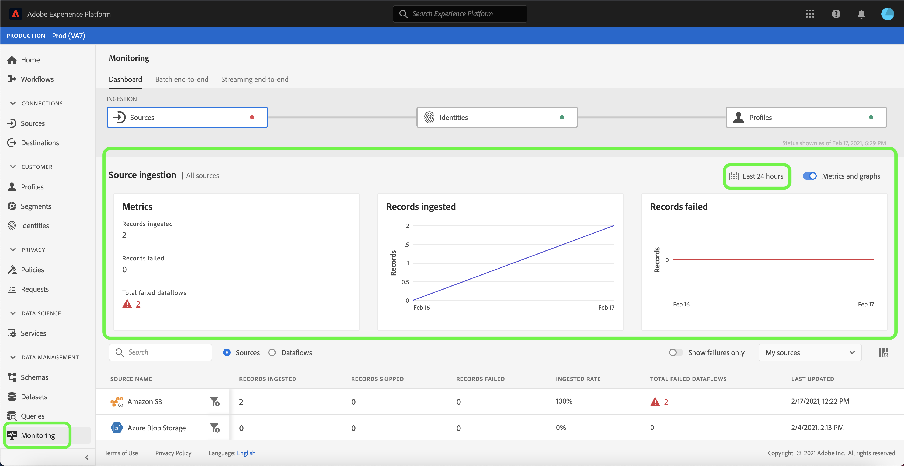

A calendar pop-up window appears, providing you options for alternative ingestion time frames. Select **[!UICONTROL Last 30 days]** and then select **[!UICONTROL Apply]**

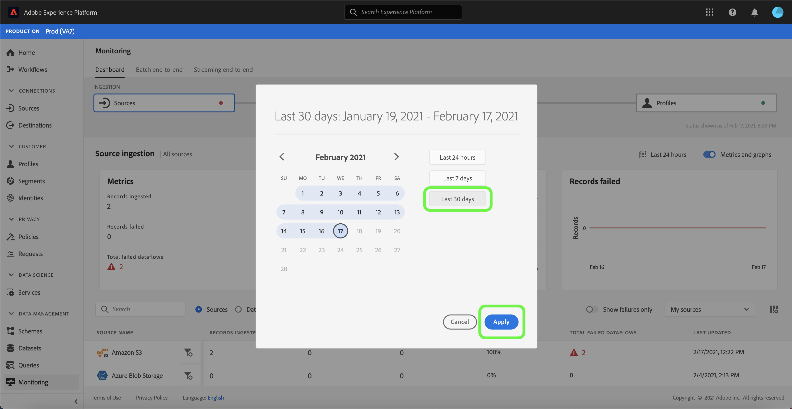

The graphs are enabled by default and you can disable them to expand the list of sources below. Select the **[!UICONTROL Metrics and graphs]** toggle to disable the graphs.

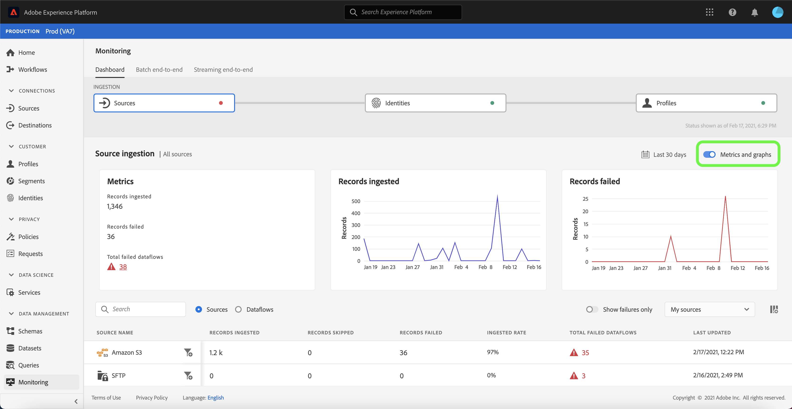

| Source ingestion | Description |
| ---------------- | ----------- |
| Records ingested | The total number of records ingested. |
| Records failed | The total number of records that were not ingested due to errors in the data. |
| Total failed dataflows | The total number of dataflows with a `failed` status. |

The source ingestion list displays all sources that contain at least one existing account. The list also includes information on each source's ingestion rate, number of failed records, and total number of failed dataflows based on the time frame that you applied.

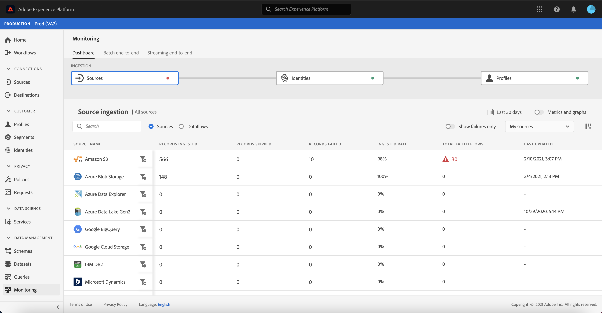

To sort through the list of sources, select **[!UICONTROL My sources]** and then select your category of choice from the dropdown menu. To focus on cloud storages, select **[!UICONTROL Cloud storage]**

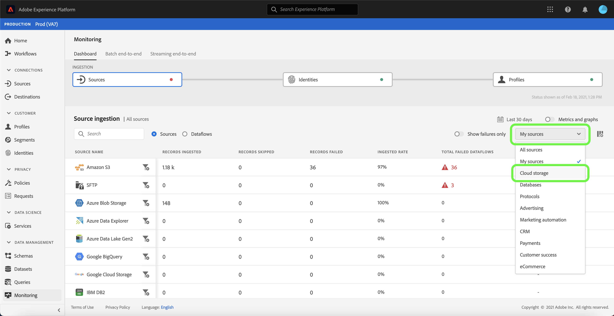

To view all existing dataflows across all sources, select **[!UICONTROL Dataflows]**.

Alternatively, you can enter a source into the search bar to isolate a single source. Once you have your source identified, select the filter icon  beside it to see a list of its active dataflows.

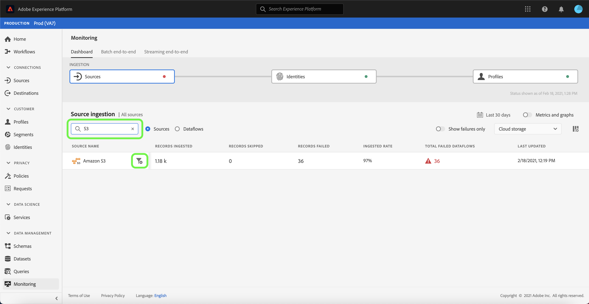

A list of dataflows appears. To narrow down the list and focus on dataflows with errors, select **[!UICONTROL Show failures only]**.

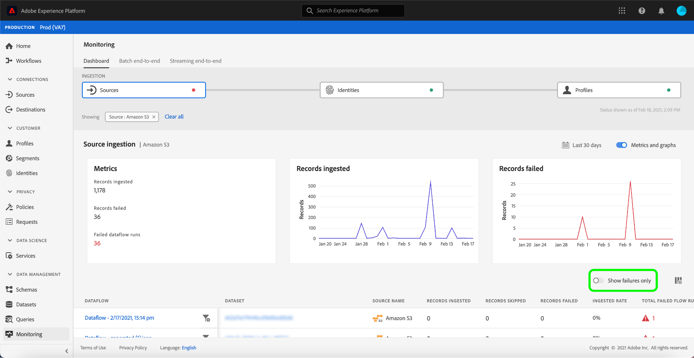

Locate the dataflow that you want to monitor and then select the filter icon  beside it, to see more information on its run status

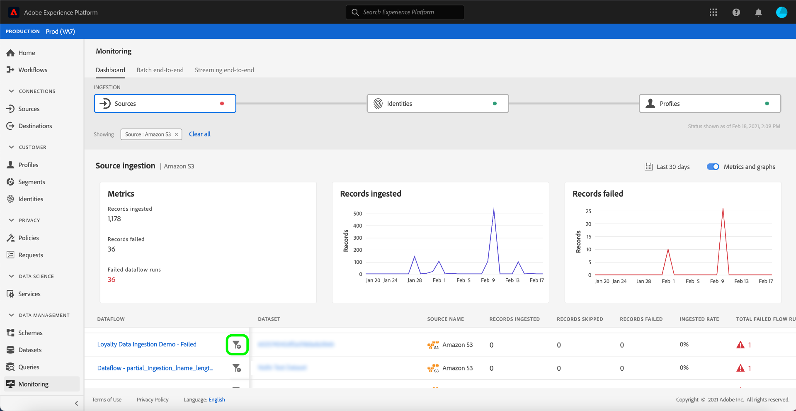

The dataflow run page displays information on your dataflow's run start date, size of data, status, as well as its processing time duration. Select the filter icon  beside the dataflow run start time to see its dataflow run details.

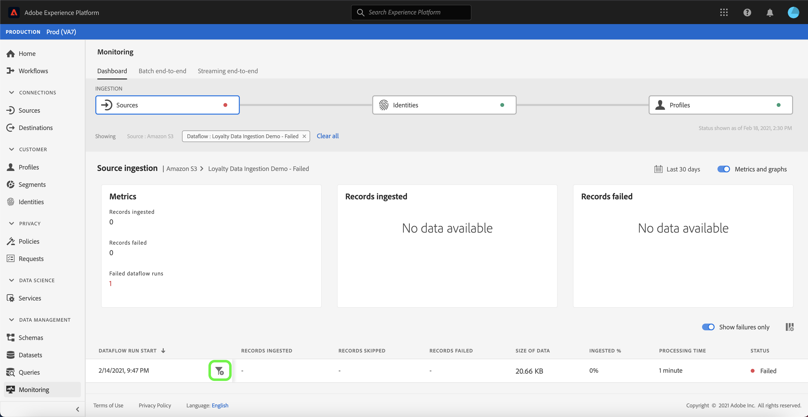

The [!UICONTROL Dataflow run details] page displays information on the dataflow's metadata, partial ingestion status, and error summary. The error summary contains the specific top-level error that shows at which step the ingestion process encountered an error.

Scroll down to see more specific information on the error that occurred.

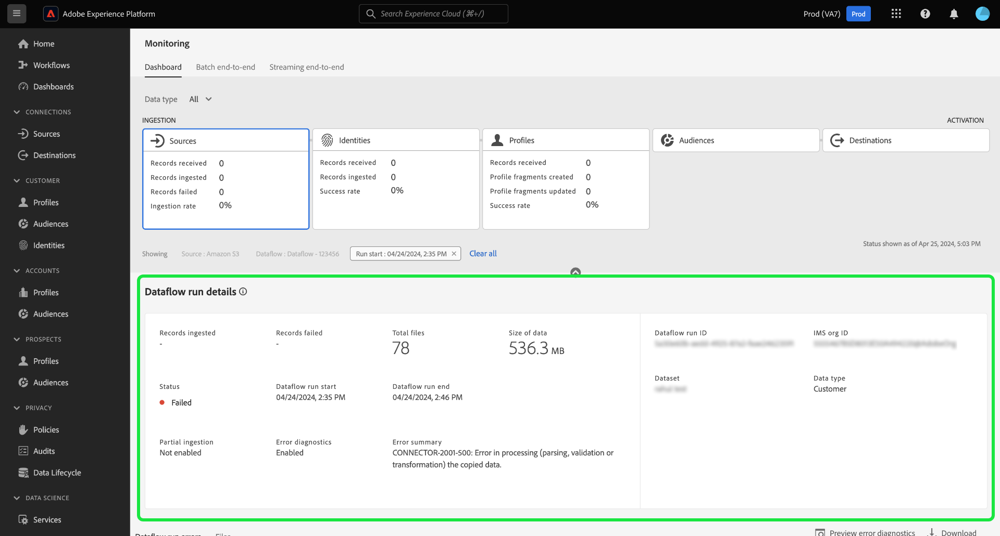

The [!UICONTROL Dataflow run errors] panel displays the specific error and error code that resulted in the dataflow's ingestion failure. In this scenario, a mapper transformation error occurred, resulting in the failure of 24 records.

Select **[!UICONTROL Files]** for more information.

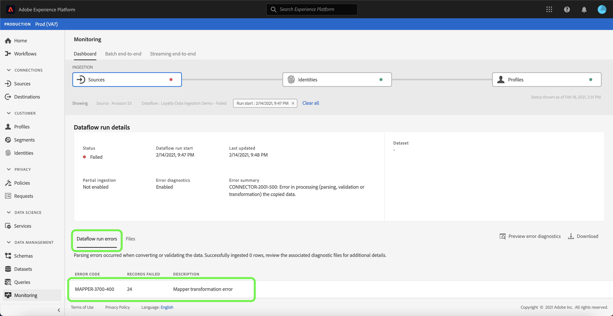

The [!UICONTROL Files] panel contains information on the file's name and path.

For a more granular representation of the error, select **[!UICONTROL Preview error diagnostics]**

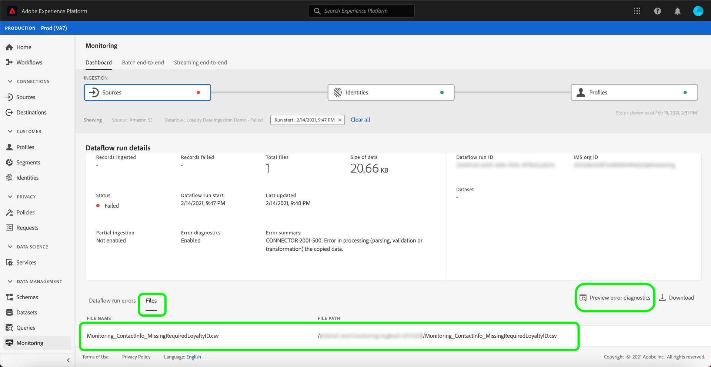

The [!UICONTROL Error diagnostics preview] window appears, displaying a preview of up to 100 errors in the dataflow. You can select **[!UICONTROL Download]** to retrieve a curl command, which then allows you to download the error diagnostics.

When you are finished, select **[!UICONTROL Close]**

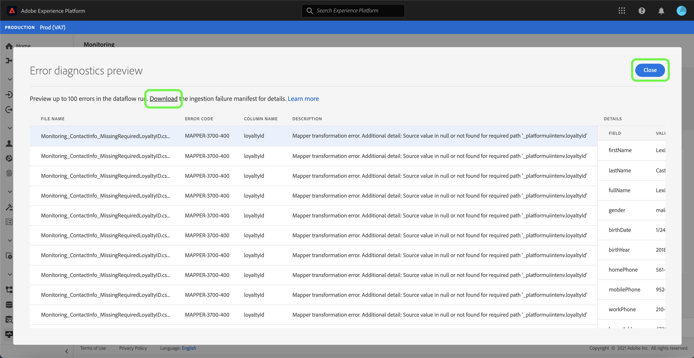

You can use the breadcrumb system at the top header to navigate your way back to the [!UICONTROL Monitoring] dashboard. Select **[!UICONTROL Run start: 2/14/2021, 9:47 PM]** to return to the previous page, and then select **[!UICONTROL Dataflow: Loyalty Data Ingestion Demo - Failed]** to return to the dataflows page.

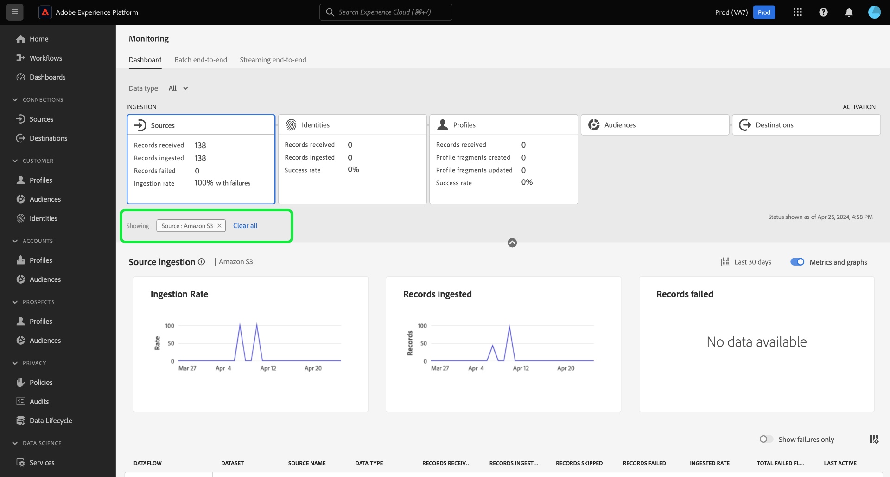

## Cross-service monitoring

The upper part of the dashboard contains a representation of the ingestion flow from the source-level, to [!DNL Identity Service], and to [!DNL Profile]. Each cell includes a dot marker that indicates the presence of errors that occurred at that stage of ingestion. A green dot means an error-free ingestion, while a red dot means that an error occurred in that particular stage of ingestion.

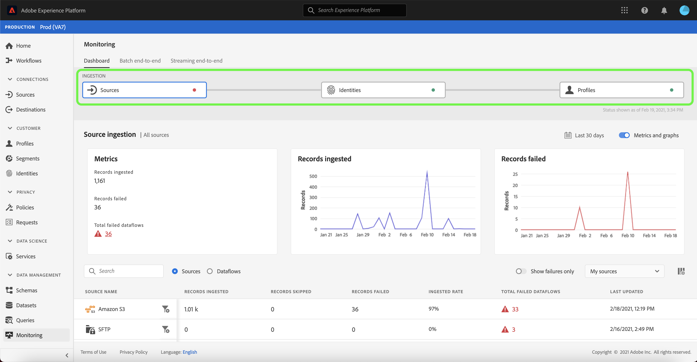

From the dataflows page, locate a successful dataflow and select the filter icon  beside it, to see its dataflow run information.

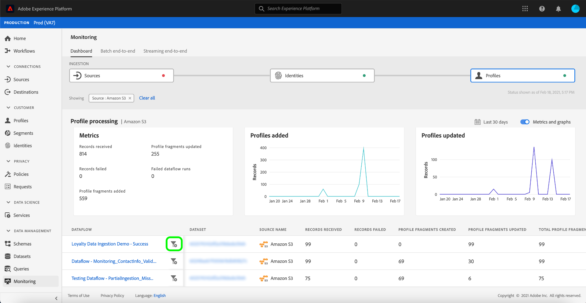

The [!UICONTROL Source ingestion] page contains information that confirms the successful ingestion of your dataflow. From here, you can start monitoring your dataflow's journey from the source-level, to [!DNL Identity Service], and then to [!DNL Profile].

Select **[!UICONTROL Identities]** to see ingestion in the [!UICONTROL Identities] stage.

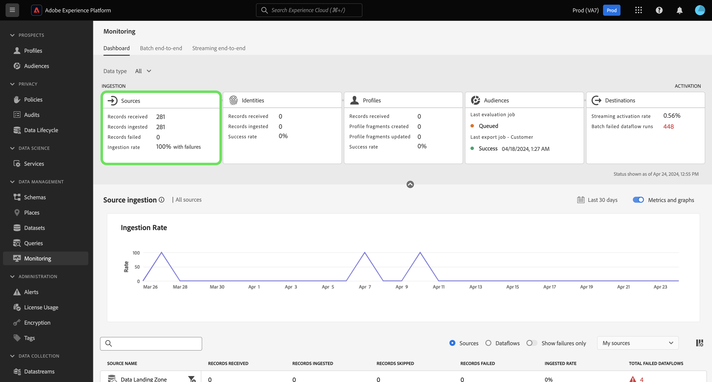

### [!DNL Identity] processing

The [!UICONTROL Identity processing] page contains information on records ingested to [!DNL Identity Service], including number of identities added, graphs created, and graphs updated.

Select the filter icon  beside the dataflow run start time to see more information on your [!DNL Identity] dataflow run.

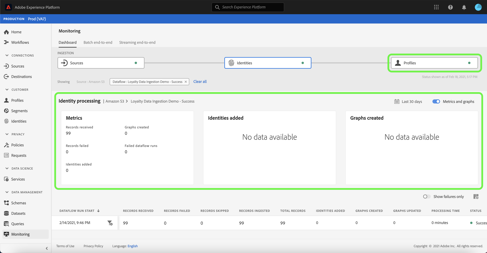

| Identity metrics | Description |
| ---------------- | ----------- |
| Records received | The number of records received from a source. |
| Records failed | The number of records that were not ingested into Platform due to errors in the data. |
| Records skipped | The number of records that were ingested, but not into [!DNL Identity Service] because there was only one identifier in the record row. |
| Records ingested | The number of records ingested into [!DNL Identity Service]. |
| Total records | The total count of all records, including records failed, records skipped, [!DNL Identities] added, and duplicated records. |
| [!DNL Identities] added | The number of net new identifiers added to [!DNL Identity Service] |
| Graphs created | The number of net new identity graphs created in [!DNL Identity Service]. |
| Graphs updated | The number of existing identity graphs updated with new edges. |
| Failed dataflow runs | The number of dataflow runs that failed. |
| Processing time | The timestamp from the start of ingestion to completion. |
| Status | Defines the overall status of a dataflow. The possible status values are: `Success`, `Failed`, and `Processing`. |

The [!UICONTROL Dataflow run details] page displays more information on your [!DNL Identity] dataflow run, including its IMS Org ID and Dataflow run ID. This page also displays the corresponding error code and error message provided by [!DNL Identity Service], should any errors occur in the ingestion process.

Select **[!UICONTROL Run start: 2/14/2021, 9:47 PM]** to return to the previous page.

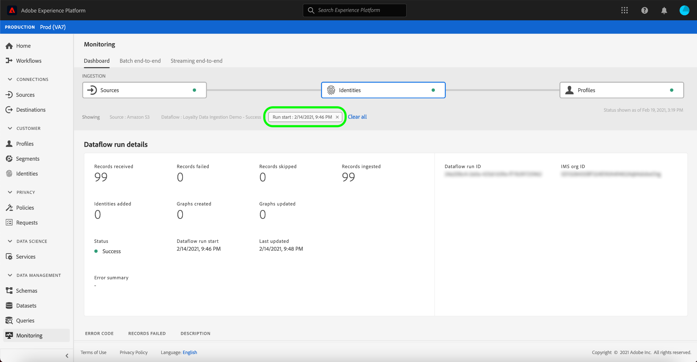

From the [!UICONTROL Identity processing] page, select **[!UICONTROL Profiles]** to see the status of records ingestion in the [!DNL Profiles] stage.

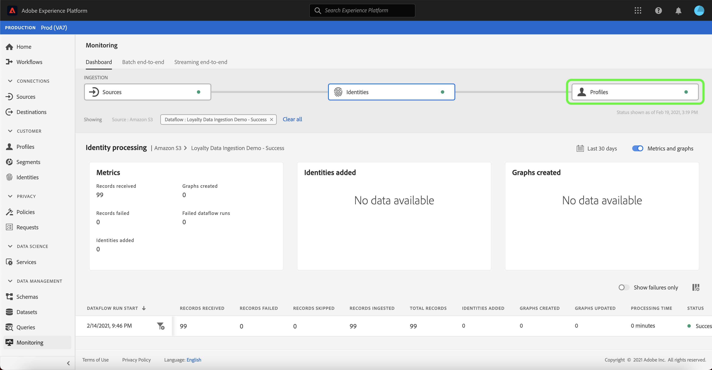

### [!DNL Profile] processing

The [!UICONTROL Profile processing] page contains information on records ingested to [!DNL Profile], including number of profile fragments created, profile fragments updated, and the total number of profile fragments.

Select the filter icon  beside the dataflow run start time to see more information on your [!DNL Profile] dataflow run.

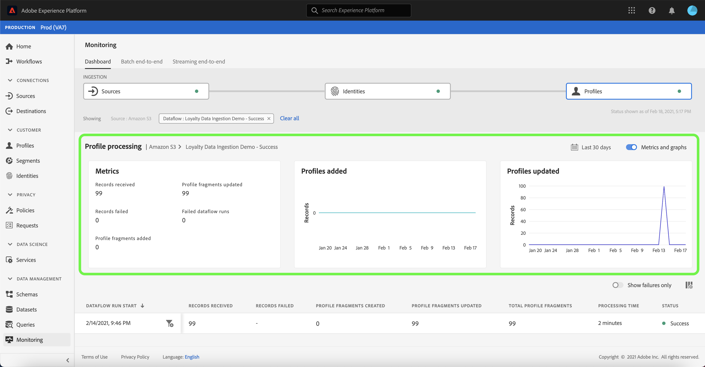

| Profile metrics | Description |
| --------------- | ----------- |
| Records received |  The number of records received from a source. |
| Records failed | The number of records that were ingested, but not into [!DNL Profile] due to errors. |
| [!UICONTROL Profile fragments added] | The number of net new [!DNL Profile] fragments added. |
| [!UICONTROL Profile fragments updated] | The number of existing [!DNL Profile] fragments updated |
| Total [!DNL Profile] fragments | The total number of records written into [!DNL Profile], including all existing [!DNL Profile] fragments updated and new [!DNL Profile] fragments created. |
| Failed dataflow runs | The number of dataflow runs that failed. |
| Processing time | The timestamp from the start of ingestion to completion. |
| Status | Defines the overall status of a dataflow. The possible status values are: `Success`, `Failed`, and `Processing`. |

The [!UICONTROL Dataflow run details] page displays more information on your [!DNL Profile] dataflow run, including its IMS Org ID and Dataflow run ID. This page also displays the corresponding error code and error message provided by [!DNL Profile], should any errors occur in the ingestion process.

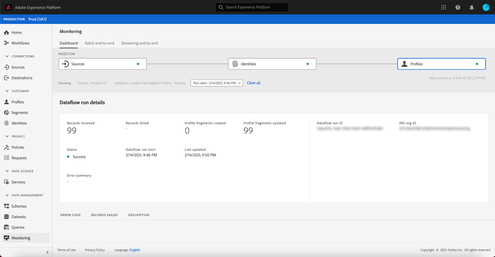

## Next steps

By following this tutorial, you have successfully monitored the ingestion flow of a dataflow from the source-level, to [!DNL Identity Service], and to [!DNL Profile], using the **[!UICONTROL Monitoring]** dashboard. You have also successfully identified errors that contributed to the failure of dataflows during the ingestion process. See the following documents for more details:

* [Real-time Customer Profile overview](../../profile/home.md)
* [Data Science Workspace overview](../../data-science-workspace/home.md)
