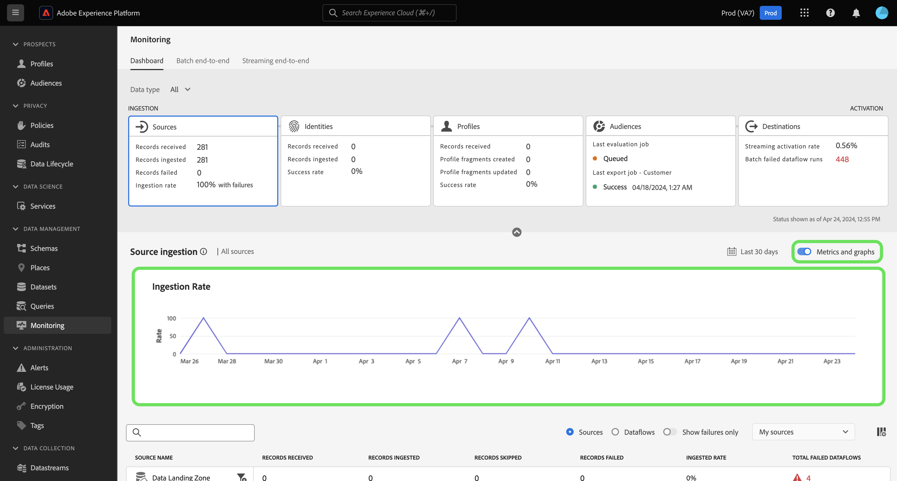
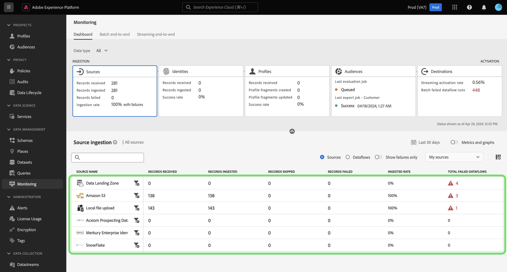
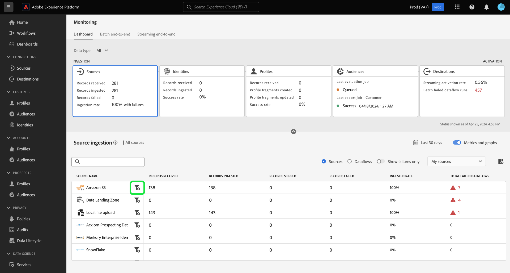
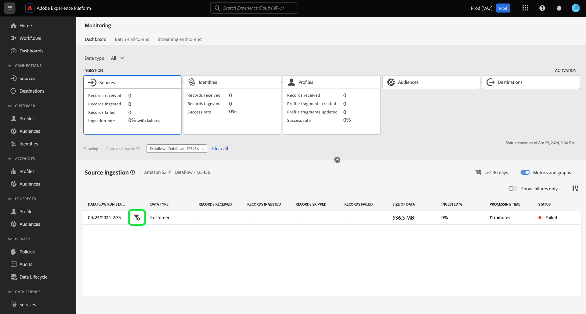
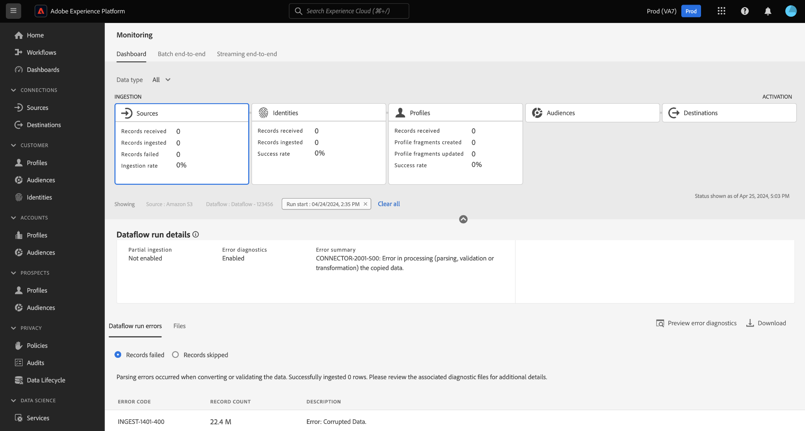

# Monitor dataflows for sources in the UI

>[!IMPORTANT]
>
>Streaming sources, such as the [HTTP API source](../../sources/connectors/streaming/http.md) are not currently supported by the monitoring dashboard. At this moment, you can only use the dashboard to monitor batch sources.

Read this document to learn how to use the monitoring dashboard to monitor your sources dataflows in the Experience Platform UI.

## Get started {#get-started}

This tutorial requires a working understanding of the following components of Adobe Experience Platform:

* [Dataflows](../home.md): Dataflows are a representation of data jobs that move data across Platform. Dataflows are configured across different services, helping move data from source connectors to target datasets, to [!DNL Identity] and [!DNL Profile], and to [!DNL Destinations].
  * [Dataflow runs](../../sources/notifications.md): Dataflow runs are the recurring scheduled jobs based on the frequency configuration of selected dataflows.
* [Sources](../../sources/home.md): Experience Platform allows data to be ingested from various sources while providing you with the ability to structure, label, and enhance incoming data using Platform services.
* [Identity Service](../../identity-service/home.md): Gain a better view of individual customers and their behavior by bridging identities across devices and systems.
* [Real-Time Customer Profile](../../profile/home.md): Provides a unified, real-time consumer profile based on aggregated data from multiple sources.
* [Sandboxes](../../sandboxes/home.md): Experience Platform provides virtual sandboxes which partition a single Platform instance into separate virtual environments to help develop and evolve digital experience applications.

## Monitor your sources data using the monitoring dashboard

>[!CONTEXTUALHELP]
>id="platform_monitoring_source_ingestion"
>title="Source ingestion"
>abstract="The Source ingestion view contains information on data activity status and metrics in data lake service, including records ingested and records failed. Review the metric definition guide to learn more about metrics and graphs."
>text="Learn more in documentation"

>[!CONTEXTUALHELP]
>id="platform_monitoring_dataflow_run_details_ingestion"
>title="Dataflow run details"
>abstract="Sources processing contains information on data activity status and metrics in data lake service, including records ingested and records failed. Review the metric definition guide to learn more about metrics and graphs."
>text="Learn more in documentation"

<!-- In the [Experience Platform UI](https://platform.adobe.com), select **[!UICONTROL Monitoring]** from the left navigation to access the [!UICONTROL Monitoring] dashboard. The [!UICONTROL Monitoring] dashboard contains metrics and information on all sources dataflows, including insights into the health of data traffic from a source to [!DNL Identity Service], and to [!DNL Profile].

At the center of the dashboard is the [!UICONTROL Source ingestion] panel, which contains metrics and graphs that display data on records ingested and records failed. -->

In the monitoring dashboard, select [!UICONTROL Sources] from the main header to update your dashboard with a display of your sources dataflow ingestion rate.

The [!UICONTROL Ingestion rate] graph displays your data ingestion rate based on your configured time frame. By default, the monitoring dashboard displays ingestion rate from the last 24 hours. For steps on how to configure your time frame, read the guide on [configuring monitoring time frame](monitor.md#configure-monitoring-time-frame).

The graph is enabled to display by default. To hide the graph, select **[!UICONTROL Metrics and graphs]** to disable the toggle and hide the graph.

The lower part of the dashboard displays a table that outlines the current metrics report for all existing sources dataflows.

| Metrics | Description |
| --- | --- |
| Records received | The total number of records received from a given source. |
| Records ingested | The total number of records ingested to data lake. |
| Records skipped | The total number of records skipped. A skipped record refers to fields that were skipped because they were not required for ingestion. For example, if you create a sources dataflow with partial ingestion enabled, you can configure an acceptable error rate threshold. During the ingestion process, ingestion will skip records of fields that are not required, such as identity fields, so long as they are within the error threshold. |
| Records failed | The total number of records that could not be ingested due to errors. |
| Ingested rate | The percentage of records that were ingested based on the total number of records received. |
| Total failed dataflows | The total number of dataflows that failed. |

{style="table-layout:auto"}

You can further filter your data using the options provided above the metrics table:

| Filtering options | Description |
| --- | --- |
| Search | Use the search bar to filter your view to a single source type. |
| Sources | Select **[!UICONTROL Sources]** to filter your view and display metric data per source type. This is the default display that the monitoring dashboard uses. |
| Dataflows | Select **[!UICONTROL Dataflows]** to filter your view and display metric data per dataflow. |
| Show failures only | Select **[!UICONTROL Show failures only]** to filter your view and display only dataflows that reported ingestion failures. |
| My sources | You can further filter your view by using the [!UICONTROL My sources] dropdown menu. Use the dropdown menu to filter your view by category. Alternatively, you can select **[!UICONTROL All sources]** to display metrics on all or sources, or select **[!UICONTROL My sources]** to display only the sources that you have a corresponding account with. |

{style="table-layout:auto"}

To monitor the data that is being ingested in a specific dataflow, select the filter icon  beside a source.

The metrics table updates to a table of active dataflows that correspond to the source that you selected. During this step, you can view additional information on your dataflows, including their corresponding dataset and data type, as well as a time stamp to indicate when they were last active. 

To further inspect a dataflow, select the filter icon  beside a dataflow.

Next, you are taken to an interface that lists all dataflow run iterations of the dataflow that you selected.

Dataflow runs represent an instance of dataflow execution. For example, if a dataflow is scheduled to run hourly at 9:00 AM, 10:00 AM, and 11:00 AM, then you would have three instances of a flow run. Flow runs are specific to your particular organization.

To inspect metrics of a specific dataflow run iteration, select the filter icon  beside your dataflow.

Use the dataflow run details page to view metrics and information of your selected run iteration.

| Dataflow run details | Description |
| --- | --- |
| Records ingested | The total number of records that were ingested from the dataflow run. |
| Records failed | The total number of records that were not ingested due to errors in the dataflow run. |
| Total files | The total number of files in the dataflow run. |
| Size of data | The total size of data contained in the dataflow run. |
| Dataflow run ID | The ID of the dataflow run iteration. |
| Org ID | The ID of the organization in which the dataflow run was created in. |
| Status | The status of the dataflow run. |
| Dataflow run start | A timestamp that indicates when the dataflow run started. |
| Dataflow run end | A timestamp that indicates when the dataflow run ended. |
| Dataset | The dataset used to create the dataflow. |
| Data type | The type of the data that was in the dataflow. |
| Partial ingestion | Partial batch ingestion is the ability to ingest data containing errors, up to a certain configurable threshold. This feature allows you to successfully ingest all of your accurate data into Experience Platform, while all of your incorrect data is batched separately with information on why it is invalid. You can enable partial ingestion during the dataflow creation process. |
| Error diagnostics | Error diagnostics instructs the source to produce error diagnostics that you can later reference when monitoring your dataset activity and dataflow status. You can enable error diagnostics during the dataflow creation process. |
| Error summary | Given a failed dataflow run, error summary displays an error code and description to summarize why the run iteration failed. |

{style="table-layout:auto"}

If your dataflow run reports errors, you can scroll down to the bottom of the page use the [!UICONTROL Dataflow run errors] interface.

Use the [!UICONTROL Records failed] section to view metrics on records that were not ingested due to errors. To view a comprehensive error report, select **[!UICONTROL Preview error diagnostics]**. To download a copy of your error diagnostics and file manifest, select **[!UICONTROL Download]** and then copy the example API call to be used with the [!DNL Data Access] API.

>[!NOTE]
>
>You may only use error diagnostics if the feature was enabled during the source connection creation process.

## Next steps {#next-steps}

By following this tutorial, you have successfully monitored the ingestion dataflow from the source-level using the **[!UICONTROL Monitoring]** dashboard. You have also successfully identified errors that contributed to the failure of dataflows during the ingestion process. See the following documents for more details:

* [Monitoring identity data](./monitor-identities.md).
* [Monitoring profile data](./monitor-profiles.md).
