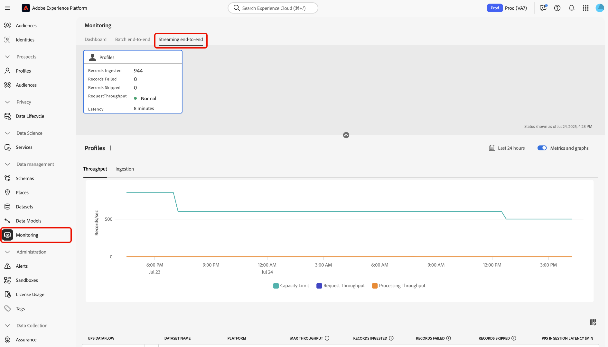
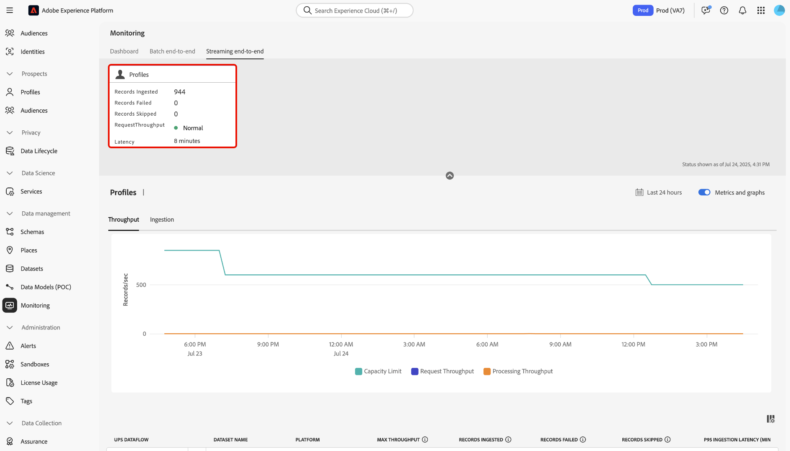
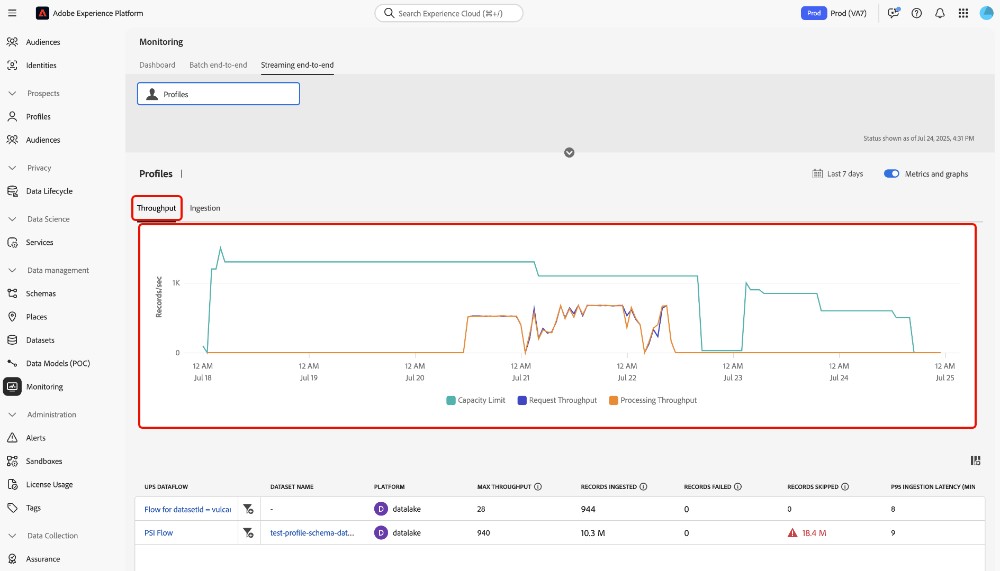
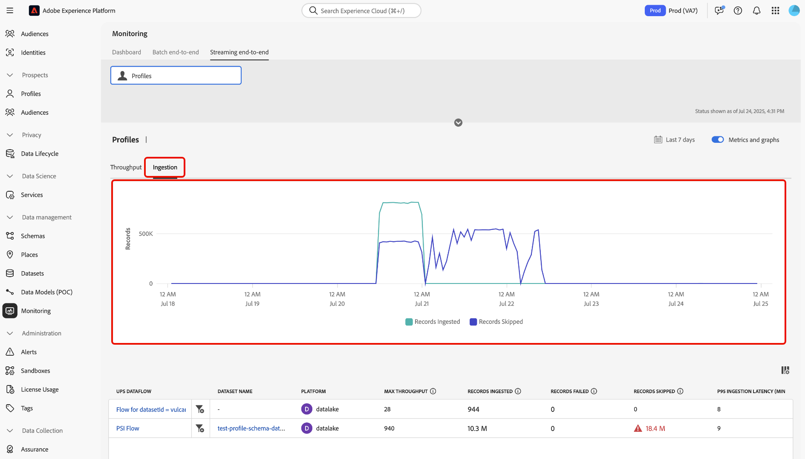
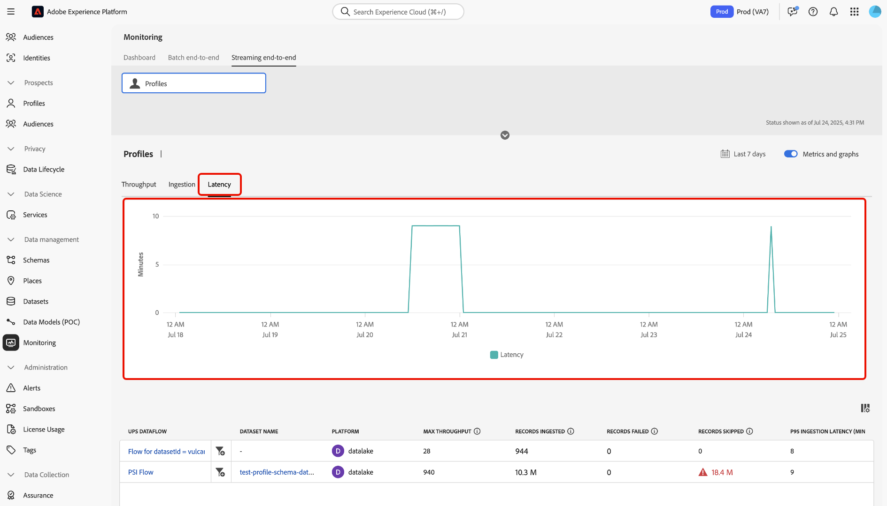
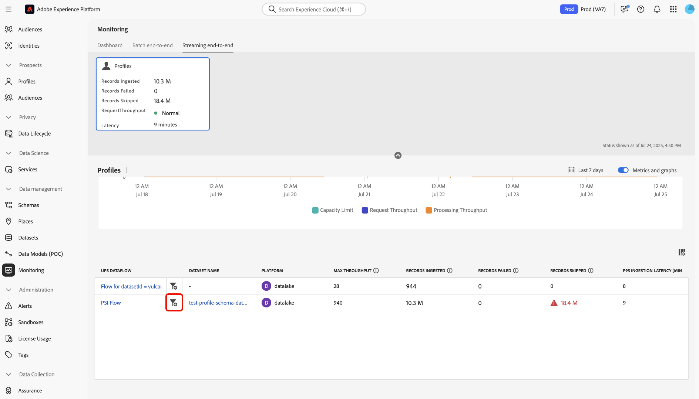
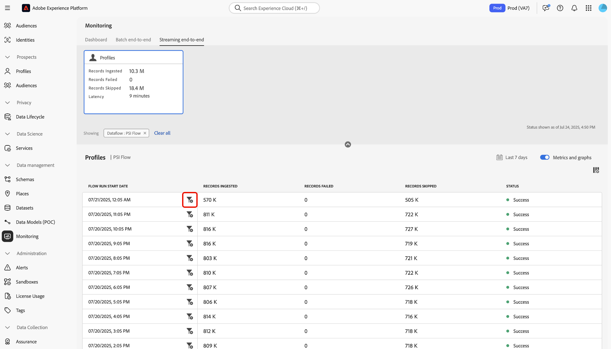
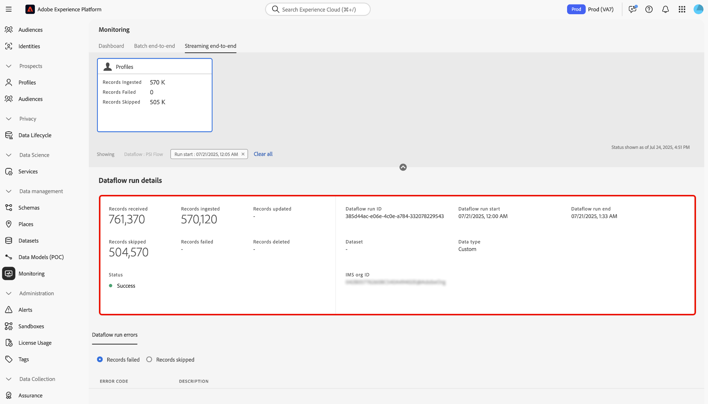

# Monitor streaming profile ingestion

You can use the monitoring dashboard in the Adobe Experience Platform UI to conduct real-time monitoring of streaming profile ingestion within your organization. Use this feature to access greater transparency into throughput, latency, and data quality metrics related to your streaming data. Additionally, use this feature for proactive alerting and the retrieval of actionable insights to help identify potential capacity violations and data ingestion issues.

Read the following guide to learn how to use the monitoring dashboard to track rates and metrics for streaming profile ingestion jobs in your organization.

## Get started

This guide requires a working understanding of the following components of Experience Platform:

* [Dataflows](../home.md): Dataflows represent data jobs that transfer information across Experience Platform. They are configured across various services to facilitate the movement of data from source connectors to target datasets, as well as to Identity Service, Real-Time Customer Profile, and Destinations.
* [Real-Time Customer Profile](../../profile/home.md): Real-Time Customer Profile combines data from multiple sources—online, offline, CRM, and third-party—into a single, actionable view of each customer, enabling consistent and personalized experiences across all touch points.
* [Streaming ingestion](../../ingestion/streaming-ingestion/overview.md): Streaming ingestion for Experience Platform provides users a method to send data from client and server-side devices to Experience Platform in real-time.Experience Platform enables you to drive coordinated, consistent, and relevant experiences by generating a Real-Time Customer Profile for each of your individual customers. ​Streaming ingestion plays a key role in building these profiles with as little latency as possible.
* [Capacities](../../landing/license-usage-and-guardrails/capacity.md): In Experience Platform, capacities let you know if your organization has exceeded any of your guardrails and gives you information on how to fix these issues.

>[!NOTE]
>
>Streaming throughput capacity supports up to 1500 inbound events per second. You may purchase additional Streaming Segmentation to support up to a maximum of an additional 13,500 inbound events per second​. For more information, refer to the [Real-Time CDP B2C Edition - Prime and Ultimate Packages product descriptions](https://helpx.adobe.com/legal/product-descriptions/real-time-customer-data-platform-b2c-edition-prime-and-ultimate-packages.html).

## Monitoring metrics for streaming profile ingestion {#streaming-profile-metrics}

>[!CONTEXTUALHELP]
>id="platform_monitoring_streaming_profile"
>title="Monitor streaming profile ingestion"
>abstract="The monitoring dashboard for streaming profiles displays information on throughput, ingestion rates, and latency. Use this dashboard to view, understand, and analyze the data processing metrics. of your streaming profiles into Experience Platform."
>text="Learn more in documentation"

>[!CONTEXTUALHELP]
>id="platform_monitoring_streaming_profile_request_throughput"
>title="Request throughput"
>abstract="This metric represents the number of events entering the ingestion system per second."
>text="Learn more in documentation"

>[!CONTEXTUALHELP]
>id="platform_monitoring_streaming_profile_processing_throughput"
>title="Processing throughput"
>abstract="This metric represents the number of events that are successfully ingested by the system each second."
>text="Learn more in documentation"

>[!CONTEXTUALHELP]
>id="platform_monitoring_streaming_profile_p95_ingestion_latency"
>title="P95 ingestion latency"
>abstract="This metric measures the 95th percentile latency from the moment an event arrives in Experience Platform to when it is successfully ingested into the Profile store."
>text="Learn more in documentation"

>[!CONTEXTUALHELP]
>id="platform_monitoring_streaming_profile_max_throughput"
>title="Max throughput"
>abstract="This metric represents the maximum number of inbound requests per second entering streaming profile ingestion."
>text="Learn more in documentation"

>[!CONTEXTUALHELP]
>id="platform_monitoring_streaming_profile_records_ingested"
>title="Records ingested"
>abstract="This metric represents the total number of records ingested to the Profile store within a configured time window."
>text="Learn more in documentation"

>[!CONTEXTUALHELP]
>id="platform_monitoring_streaming_profile_records_failed"
>title="Records failed"
>abstract="This metric represents the total number of records that failed ingestion into the Profile store, within a configured time window, due to errors."
>text="Learn more in documentation"

>[!CONTEXTUALHELP]
>id="platform_monitoring_streaming_profile_records_skipped"
>title="Records skipped"
>abstract="This metric represents the total number of records that were dropped within a configured time window, due to configuration or capacity breaches."
>text="Learn more in documentation"

>[!CONTEXTUALHELP]
>id="platform_monitoring_streaming_profile_error_details"
>title="Error details"
>abstract="This metric represents the number of failed events due to errors."
>text="Learn more in documentation"

Use the metrics table for information specific to your dataflows. Refer to the following table for details on each column.

| Metric | Description | Dimensions | Frequency of measurement |
| --- | --- | --- | --- |
| Request throughput | This metric represents the number of events entering the ingestion system per second. |Sandbox/Dataflow | Real-time monitoring with a data refresh every 60 seconds. |
| Processing throughput | This metric represents the number of events that are successfully ingested by the system each second. |Sandbox/Dataflow | Real-time monitoring with a data refresh every 60 seconds. |
| P95 ingestion latency | This metric measures the 95th percentile latency from the moment an event arrives in Experience Platform to when it is successfully ingested into the Profile store. | Sandbox/Dataflow | Real-time monitoring with a data refresh every 60 seconds. |
| Max throughput | This metric represents the maximum number of inbound requests per second entering streaming profile ingestion | <ul><li>Sandbox/Dataflow</li><li>Dataflow run</li></ul> |
| Records ingested | This metric represents the total number of records ingested to the Profile store within a configured time window. | <ul><li>Sandbox/Dataflow</li><li>Dataflow run</li></ul> | <ul><li>Sandbox/Dataflow: Real-time monitoring with a data refresh every 60 seconds.</li><li>Dataflow run: Grouped in 15 minutes.</li></ul>  |
| Records failed | This metric represents the total number of records that failed ingestion into the Profile store, within a configured time window, due to errors. | <ul><li>Sandbox/Dataflow</li><li>Dataflow run</li></ul> |<ul><li>Sandbox/Dataflow: Real-time monitoring with a data refresh every 60 seconds.</li><li>Dataflow run: Grouped in 15 minutes.</li></ul>  |
| Records skipped | This metric represents the total number of records that were dropped within a configured time window, due to configuration or capacity breaches. | <ul><li>Sandbox/Dataflow</li><li>Dataflow run</li></ul> | <ul><li>Sandbox/Dataflow: Real-time monitoring with a data refresh every 60 seconds.</li><li>Dataflow run: Grouped in 15 minutes.</li></ul>  |
| Error details | This metric represents the number of failed events due to errors. | Dataflow run | Grouped in an hourly window. |

{style="table-layout:auto"}

## Use the monitoring dashboard for streaming profile ingestion 

To access the monitoring dashboard for streaming profile ingestion, go to the Experience Platform UI, select **[!UICONTROL Monitoring]** from the left-navigation and then select **[!UICONTROL Streaming end-to-end]**.

Refer to the top-header of the dashboard for the *[!UICONTROL Profile]* metrics card. Use this display to view information on the records ingested, failed, and skipped, as well as information on the current status of request throughput and latency.

Next, use the interface to view detailed information on your streaming profile ingestion metrics. Use calendar feature to toggle between different timeframes. You can select from following pre-configured time windows:

* [!UICONTROL Last 6 hours]
* [!UICONTROL Last 12 hours]
* [!UICONTROL Last 24 hours]
* [!UICONTROL Last 7 days]
* [!UICONTROL Last 30 days]

Alternatively, you can manually configure your own timeframe using the calendar.

You can use three different metric categories in the monitoring dashboard for streaming profile ingestion: [!UICONTROL Throughput], [!UICONTROL Ingestion], and [!UICONTROL Latency].

>[!BEGINTABS]

>[!TAB Throughput]

Select **[!UICONTROL Throughput]** to view information on the amount of data that Experience Platform is processing given a configured period of time. Refer to this metric to evaluate the efficiency and capacity of your system.

* **[Capacity](../../landing/license-usage-and-guardrails/capacity.md)**: The maximum amount of data that your sandbox can process under defined conditions.
* **Request throughput**: The rate at which events are received by the ingestion system, measured in events per second.
* **Processing throughput**: The rate at which the system successfully ingests and processes incoming event payloads, measured in events per second.

>[!TAB Ingestion]

**Ingestion**: Select **[!UICONTROL Ingestion]** to view information on the ingestion jobs in your sandbox. These ingestion jobs are measured in three different metrics.

* **Records ingested**: The total amount of records created within a given time period. This metric represents successful data ingestion processes in your sandbox.
* **Records skipped**: The total number of records that did not get ingested due to errors.
* **Records skipped**: The total number of records that were dropped due to violation of capacity limits.

>[!TAB Latency]

Select **[!UICONTROL Latency]** to view information on the amount of time it takes Experience Platform to respond to a request or complete an operation within a given time period.

>[!ENDTABS]

### Use the dataflow metrics table

The dataflow table lists all streaming ingestion activities with their corresponding set of metrics for Real-Time Customer Profile. Each dataflow is listed with it's corresponding dataset. 

If you are approaching the limits of your sandbox-level capacity, you can refer to the [!UICONTROL Max throughput] column to identify any existing dataflows that are contributing to your consumption rates. Read the [best practices section](#best-practices)  for more information on dataflow management best practices.

To monitor the data that is being ingested in a specific dataflow, select the filter icon  beside the dataflow name.

Next, use the dataflow metrics interface to select the specific flow run that you want to inspect. Select the filter icon  beside a flow run iteration to view metrics particular to the selected flow run.

Dataflow runs represent an instance of dataflow execution. For example, if a dataflow is scheduled to run hourly at 9:00 AM, 10:00 AM, and 11:00 AM, then you would have three instances of a flow run. Flow runs are specific to your particular organization.

Use the dataflow run details page to view metrics and information of your selected run iteration.

## Dataflow management best practices {#best-practices}

Read the following section for information on how to best manage your dataflows and optimize your data consumption on Experience Platform.

### Evaluate and optimize streaming ingestion dataflows

To ensure efficient streaming ingestion, review and adjust your dataflows and processing strategy:

* **Assess current usage**: Identify which dataflows and datasets are contributing most to throughput.
* **Prioritize valuable data**: Not all data may be necessary. Exclude data that doesn't support your use cases to reduce storage and improve efficiency.
* **Optimize processing mode**: Determine if some data can be shifted from streaming to batch ingestion. Reserve streaming for use cases that require low latency, such as real-time segmentation.

### Plan for capacity and seasonal traffic

If your current limit of **1,500 events per second** is insufficient, consider optimizing your data strategy or increasing your license capacity:

* **Analyze dataset and sandbox usage**: Review both current and historical data to understand how traffic and engagement impact streaming segmentation throughput.
* **Account for seasonality**: Identify peak traffic periods driven by recurring marketing campaigns or industry-specific cycles.
* **Forecast future demand**: Estimate upcoming traffic and engagement volumes based on past seasonal trends, planned campaigns, or major events.

| Contributing factor | What it is | Impact to use cases| Best practices |
| --- | --- | --- | --- |
| Batch to streaming conversion | Batch workloads converted to streaming can significantly increase throughput, affecting performance and resource allocation. For example, performing a bulk profile update after an event without rate limits. | Streaming strategies are unnecessary for batch use cases when low-latency processing isn't required. | Evaluate use case requirements. For batch outbound marketing, consider using [batch ingestion](../../ingestion/batch-ingestion/overview.md) instead of streaming to manage data ingestion more efficiently.  |
| Unnecessary data ingestion | Ingesting data not required for personalization increases throughput without adding value, wasting resources. For example, ingesting all analytics traffic into profiles regardless of relevance.| Excess non-relevant data creates noise, making it harder to identify impactful data points. It can also cause friction when defining and managing audiences and profiles. | Ingest only data that is required for your use cases. Ensure that you filter out unnecessary data.<ul><li>**Adobe Analytics**: Use [row-level filtering](../../sources/tutorials/ui/create/adobe-applications/analytics.md#filtering-for-real-time-customer-profile) to optimize your data intake.</li><li>**Sources**: Use the [[!DNL Flow Service] API to filter row-level data](../../sources/tutorials/api/filter.md) for supported sources like [!DNL Snowflake] and [!DNL Google BigQuery].</li></li>**Edge datastream**: Configure [dynamic datastreams](../../datastreams/configure-dynamic-datastream.md) to perform row-level filtering of traffic coming in from WebSDK.</li></ul> |

{style="table-layout:auto"}

### Frequently asked questions {#faq}

Read this section for answers to frequently asked questions about the monitoring for streaming profile ingestion.

#### Why do my metrics look different between the Capacity and Monitoring dashboards for request throughput?

+++Answer

The [!UICONTROL Monitoring] dashboard shows real-time metrics for ingestion and processing. These numbers are exact metrics recorded at the time of activity. Conversely, the [!UICONTROL Capacity] dashboard uses a 15-minute rolling window of smoothing for throughput. This mechanism helps reduce short-lived spikes from instantly qualifying as violations and ensures that capacity alerts focus on sustained trends, rather than momentary bursts.

Due to the smoothing mechanism, you may notice:

* Small spikes in [!UICONTROL Monitoring] that do not appear in [!UICONTROL Capacity].
* Slightly lower values in [!UICONTROL Capacity] compared to [!UICONTROL Monitoring] at the same timestamp.

The two dashboards are accurate, but are designed for different purposes.

* [!UICONTROL Monitoring]: Detailed, moment-by-moment operational visibility.
* [!UICONTROL Capacity]: Strategic view for identifying usage and violation patterns.

+++

## Next steps {#next-steps}

By following this tutorial, you learned how to monitor streaming profile ingestion jobs in your organization. Read the following documents for additional information on monitoring data for Real-Time Customer Profile.

* [Use the monitoring dashboard](./monitor.md).
* [Monitor profile data](./monitor-profiles.md).
