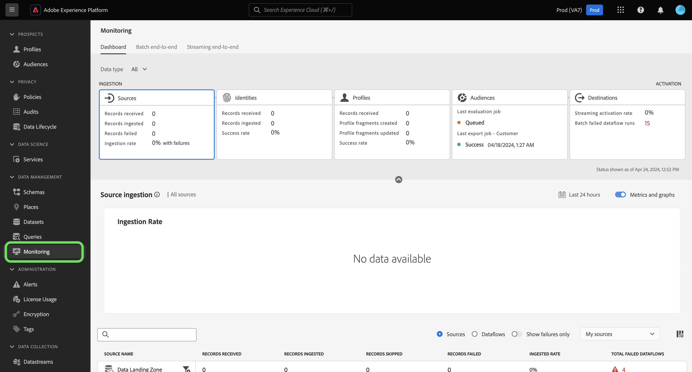
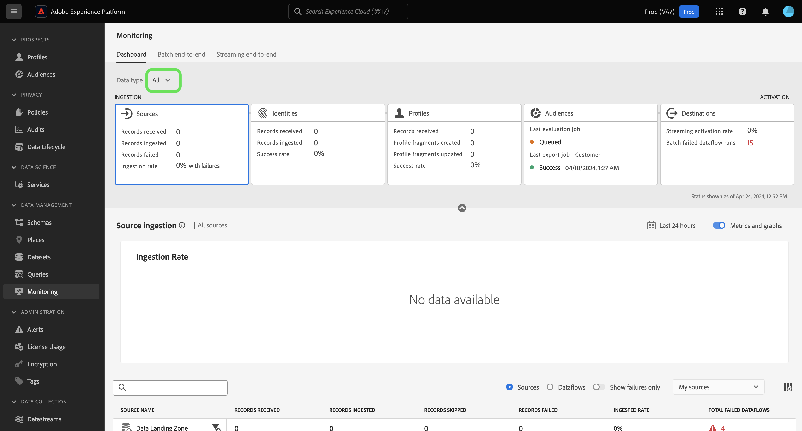
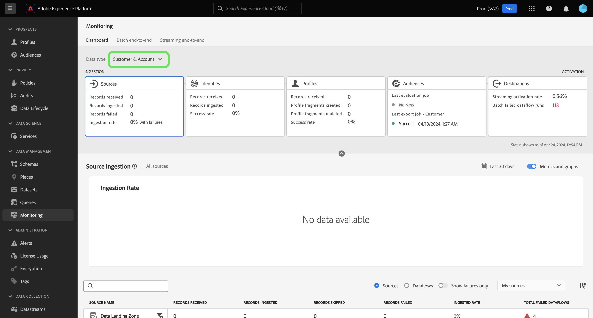
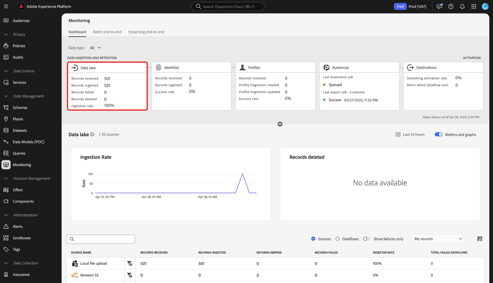
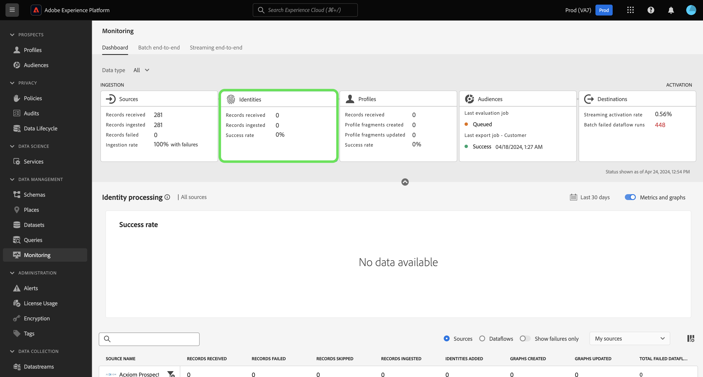
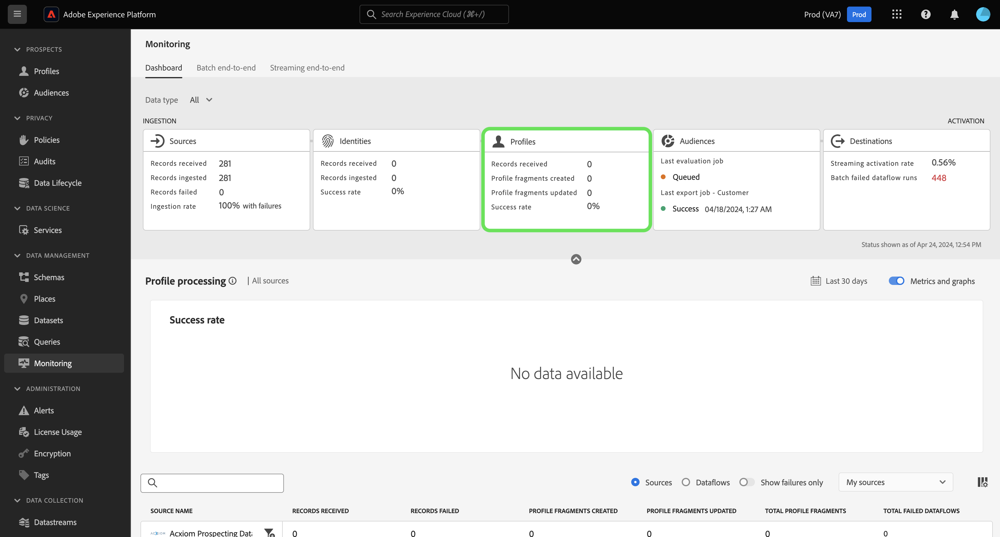
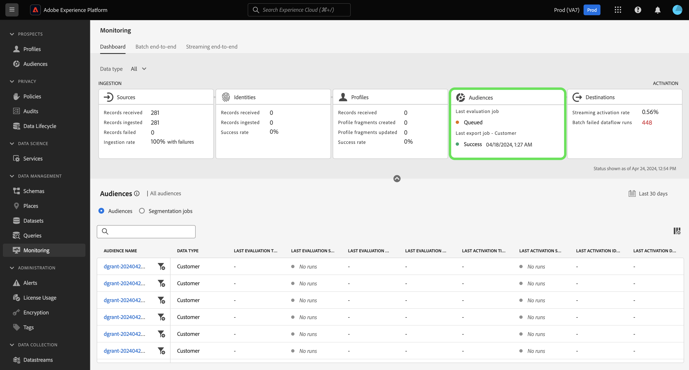
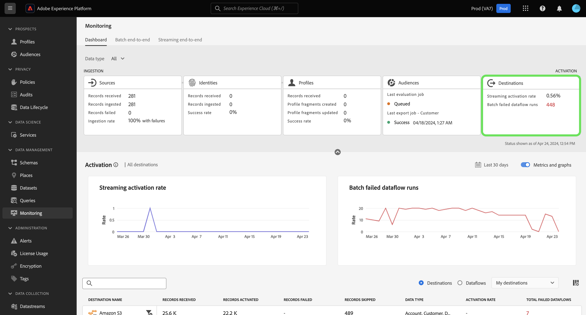
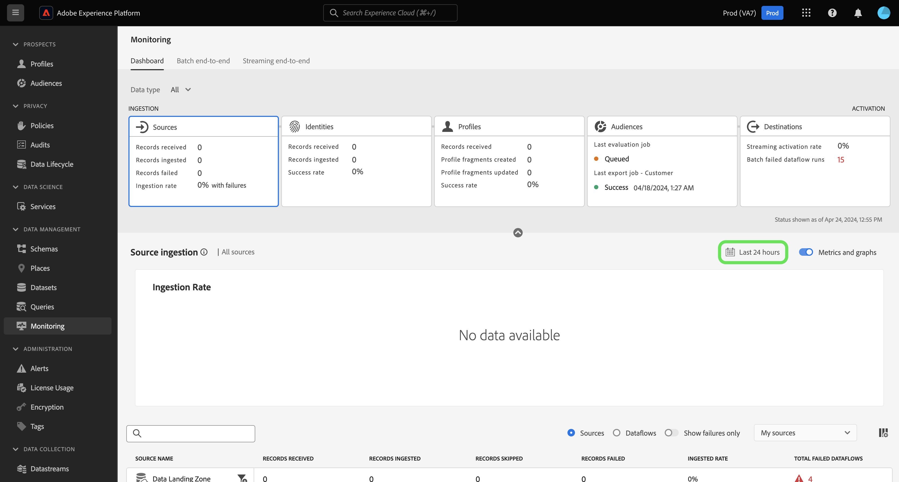
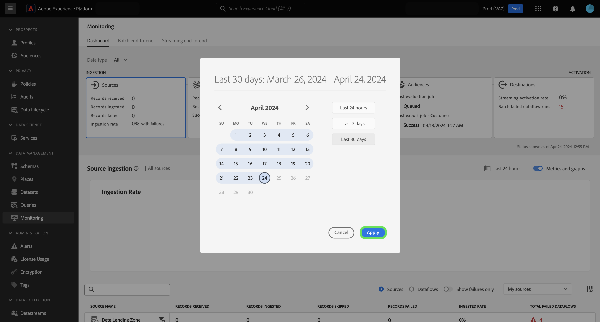

# Monitoring dashboard overview

Use the monitoring dashboard in the Adobe Experience Platform UI to view the journey of your data from ingestion to activation. With the monitoring dashboard, you can:

* Monitor the journey of your data from Sources, Identity Service, Real-Time Customer Profile, Audiences, and finally in Destinations.
* View different metrics and statuses depending on the stage that your data is in.
* Filter your data monitoring view by data type.

The monitoring dashboard supports the view of several different data types:

* **Customer & Account**: Customer data refers to the data used in [Real-Time Customer Data Platform](../../rtcdp/home.md), while account data refers to [account profiles data](../../rtcdp/accounts/account-profile-overview.md) that is accessible when subscribed to [Real-Time CDP, B2B Edition](../../rtcdp/b2b-overview.md). If your Real-Time CDP license does not include Real-Time CDP, B2B Edition, then you can only use the monitoring dashboard to monitor customer data.
* **Prospect**: [Prospect profiles](../../profile/ui/prospect-profile.md) are used to represent people who have not yet engaged with your company but you want to reach out to. With prospect profiles, you can supplement your customer profiles with attributes from trusted third-party partners. You must be licensed with Real-Time CDP (App Service), Adobe Experience Platform Activation, Real-Time CDP, Real-Time CDP Prime, Real-Time CDP Ultimate to view the prospect data type.
* **Account profile enrichment**: Account profiles enable you to unify account information from multiple sources. You must be licensed to Real-Time CDP, B2B edition in order monitor account profile enrichment data.

Read this document to learn how to use the monitoring dashboard to monitor the journey of your data across different Experience Platform services.

## Get started

This document requires a working understanding of the following components of Experience Platform:

* [Dataflows](../home.md): Dataflows are representations of data jobs that move data across Experience Platform. You can use the sources workspace to create dataflows that ingest data from a given source to Experience Platform.
* [Sources](../../sources/home.md): Use sources in Experience Platform to ingest data from an Adobe application or a third-party data source.
* [Identity Service](../../identity-service/home.md): Gain a better view of individual customers and their behavior by bridging identities across devices and systems.
* [Real-Time Customer Profile](../../profile/home.md): Provides a unified, real-time consumer profile based on aggregated data from multiple sources.
* [Segmentation](../../segmentation/home.md): Use the Segmentation Service to create segments and audiences from your Real-Time Customer Profile data. 
* [Destinations](../../destinations/home.md): Destinations are pre-built integrations with commonly used applications that allow for the seamless activation of data from Experience Platform for cross-channel marketing campaigns, email campaigns, targeted advertising, and many other use cases.

## Monitoring dashboard guide

In the Experience Platform UI, select **[!UICONTROL Monitoring]** under [!UICONTROL Data Management] in the left navigation.

Select **[!UICONTROL Data Type]** and then use the dropdown menu to select the type of data that you want to view. Data types are defined by Experience Data Model (XDM) schema classes to ensure that their data follows a standard format when ingested into Experience Platform. For more information, visit the following documentation:

* [B2B Account data type](../../rtcdp/b2b-tutorial.md)
* [Prospect data type](../../rtcdp/partner-data/prospecting.md)

You can filter your view based on the following data types:

>[!BEGINTABS]

>[!TAB All]

Select **[!UICONTROL All]** to update your dashboard and display metrics on all data that has been ingested to Experience Platform over the course of a given period.

>[!TAB Customer & Account]

Select **[!UICONTROL Customer & Account]** to update your dashboard and display metrics on Customer & Account data that has been ingested to Experience Platform over the course of a given period.

>[!TAB Account profile enrichment]

Select **[!UICONTROL Account profile enrichment]** to update your dashboard and display metrics on profile enrichment data. **Note**: You can only view account profile enrichment metrics if you are entitled to [B2B data](../../rtcdp/b2b-tutorial.md). 

>[!ENDTABS]

Use the top header of the dashboard for a cross-service monitoring experience. You can filter your metrics and graphs view by selecting the feature card of your choice from the data category header.

>[!BEGINTABS]

>[!TAB Data lake]

Select **[!UICONTROL Data lake]** to view metrics on your data lake ingestion rate. Read the guide on [monitoring data lake ingestion](monitor-sources.md) for more information.

>[!TAB Identities]

Select **[!UICONTROL Identities]** to view the processing success rate of your identity data. Read the guide on [monitoring identity data](monitor-identities.md) for more information.

>[!TAB Profiles]

Select **[!UICONTROL Profiles]** to view the processing success rate of your profile data. Read the guide on [monitoring profile data](monitor-profiles.md) for more information.

>[!TAB Audiences]

Select **[!UICONTROL Audiences]** to view metrics on your audiences and segmentation jobs. Read the guide on [monitoring audience data](monitor-audiences.md) for more information.

>[!TAB Destinations]

Select **[!UICONTROL Destinations]** to view metrics on your [!UICONTROL Streaming activate rate] and [!UICONTROL Batch failed dataflow runs]. Read the guide on [monitoring destinations data](monitor-destinations.md) for more information.

>[!ENDTABS]

### Configure monitoring time frame {#configure-monitoring-time-frame}

By default, the monitoring dashboard displays metrics on data ingested within the last 24 hours. To update the time frame, select **[!UICONTROL Last 24 hours]**.

You can configure a new time frame for your data monitoring view in the dialog that appears. You have the option to create a custom time frame or select from the list of pre-configured options:

* [!UICONTROL Last 24 hours]
* [!UICONTROL Last 7 days]
* [!UICONTROL Last 30 days]

When finished, select **[!UICONTROL Apply]**.

## Next steps

By reading this document, you can now navigate your way through the monitoring dashboard in the UI. For information on how to monitor data for a specific Experience Platform service, read the documentation below:

* [Monitor data lake ingestion](monitor-sources.md).
* [Monitor identity data](monitor-identities.md).
* [Monitor profile data](monitor-profiles.md).
* [Monitor audience data](monitor-audiences.md).
* [Monitor destinations data](monitor-destinations.md).

<!-- >[!TAB Prospect]

Select **[!UICONTROL Prospect]** to update your dashboard and display metrics on prospecting data that has been ingested to Experience Platform over the course of a given period. **Note**: You can only view prospect data type activities if you are [entitled to prospect data](../../rtcdp/partner-data/prospecting.md). -->