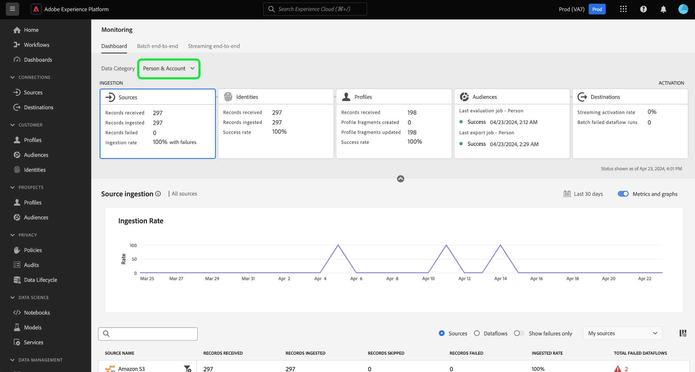
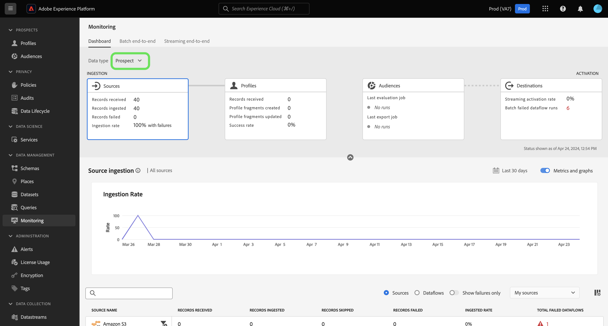
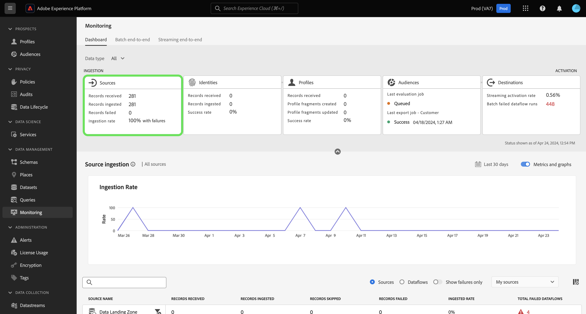

# Monitoring dashboard overview

Use the monitoring dashboard in the Adobe Experience Platform UI to view the journey of a dataflow from ingestion to activation. With the monitoring dashboard, you can:

* Monitor data journey from sources, Identity Service, Real-Time Customer Profile, Audiences, and finally in Destinations.
* View different metrics and statuses depending on the stage that your dataflow is in.
* Filter your data monitoring view by data type.

Read this document to learn how to use the monitoring dashboard to monitor the journey of your data across different Experience Platform services.

## Get started

* [Dataflows](../../../dataflows/home.md): Dataflows are representations of data jobs that move data across Experience Platform. You can use the sources workspace to create dataflows that ingest data from a given source to Experience Platform.
* [Sources](../../home.md): Use sources in Experience Platform to ingest data from an Adobe Application or a third-party data source.
* [Identity Service](../../identity-service/home.md): Gain a better view of individual customers and their behavior by bridging identities across devices and systems.
* [Real-Time Customer Profile](../../profile/home.md): Provides a unified, real-time consumer profile based on aggregated data from multiple sources.
* [Segmentation](../../segmentation/home.md): Use the Segmentation Service to create segments and audiences from your Real-Time Customer Profile data. 
* [Destinations](../../destinations/home.md): Destinations are pre-built integrations with commonly used applications that allow for the seamless activation of data from Platform for cross-channel marketing campaigns, email campaigns, targeted advertising, and many other use cases.

## Monitoring dashboard guide

In the Experience Platform UI, select **[!UICONTROL Monitoring]** under [!UICONTROL Data Management] in the left navigation.

Select **[!UICONTROL Data Type]** and then use the dropdown menu to select the type of data that you want to view.

You can filter your view based on the following data categories:

>[!BEGINTABS]

>[!TAB All]

Select **[!UICONTROL All]** to update your dashboard and display metrics on all data that has been ingested to Experience Platform over the course of a given period.

>[!TAB Customer & Account]

Select **[!UICONTROL Customer & Account]** to update your dashboard and display metrics on Customer & Account data that has been ingested to Experience Platform over the course of a given period.

>[!TAB Prospect]

Select **[!UICONTROL Prospect]** to update your dashboard and display metrics on prospecting data that has been ingested to Experience Platform over the course of a given period. **Note**: You can only view prospect if you are entitled to prospect data and B2B.

>[!TAB Account profile enrichment]

Select **[!UICONTROL Account profile enrichment]** to update your dashboard and display metrics on profile enrichment data. **Note**: You can only view account profile enrichment if you are entitled to prospect data and B2B. 

>[!ENDTABS]

Use the top header of the dashboard for a cross-service monitoring experience. You can filter your metrics and graphs view by selecting the feature card of your choice from the data category header.

>[!BEGINTABS]

>[!TAB Sources]

Select **[!UICONTROL Sources]** to view metrics on your sources ingestion rate.

>[!TAB Identities]

Select **[!UICONTROL Identities]** to view the processing success rate of your identity data.

>[!TAB Profiles]

Select **[!UICONTROL Profiles]** to view the processing success rate of your profile data.

>[!TAB Audiences]

Select **[!UICONTROL Audiences]** to view metrics on your audiences and segmentation jobs. **Note**: The metrics graph display is not available for [!UICONTROL Audiences].

>[!TAB Destinations]

Select **[!UICONTROL Destinations]** to view metrics on your [!UICONTROL Streaming activate rate] and [!UICONTROL Batch failed dataflow runs].

>[!ENDTABS]

### Configure monitoring time frame {#configure-monitoring-time-frame}

By default, the monitoring dashboard displays metrics on data ingested within the last 24 hours. To update the time frame, select **[!UICONTROL Last 24 hours]**.

A pop-up dialog appears. Use this dialog to configure a new time frame for your data monitoring view. You can either create a custom time frame or select from the list of pre-configured options:

* [!UICONTROL Last 24 hours]
* [!UICONTROL Last 7 days]
* [!UICONTROL Last 30 days]

When finished, select **[!UICONTROL Apply]**.

<!-- ### Filter metrics table

* Select [!UICONTROL Sources] to view metrics based on the sources that were used to ingest data.
* Select [!UICONTROL Dataflows] to view metrics based on all dataflows.
* Select [!UICONTROL Show failures only] to update your view and display only failed ingestion jobs filtered by either source or dataflow.
* You can further filter your view by using the [!UICONTROL My sources] dropdown menu. Use the dropdown menu to filter your view by category. Alternatively, you can select [!UICONTROL All sources] to display metrics on all or sources, or select [!UICONTROL My sources] to display only the sources that you have a corresponding account with. -->

## Next steps

By reading this document, you can now navigate your way through the monitoring dashboard in the UI. For information on how to monitor data for a specific Experience Platform service, read the documentation below:

* [Monitor sources data](monitor-sources.md).
* [Monitor identity data](monitor-identities.md).
* [Monitor profile data](monitor-profiles.md).
* [Monitor audience data](monitor-segments.md).
* [Monitor destinations data](monitor-destinations.md).