# Configure bot detection for datastreams

Traffic originating from nonhuman entities, such as automated programs, web scrapers, spiders, scripted scanners, can make it more difficult to identify events occuring from human visitors. This type of traffic can negatively affect important business metrics, leading to incorrect traffic reporting.

Bot detection allows you to identify events generated by the[Web SDK](../web-sdk/home.md), [Mobile SDK](https://developer.adobe.com/client-sdks/home/) and [[!DNL Server API]](../server-api/overview.md) as being generated by known spiders and bots.

By configuring bot detection for your datastreams, you can identify specific IP addresses, IP ranges and request headers which you would like to classified as bot events.

Identification of bot traffic can provide you with a more accurate measurement of user activity on your site or mobile application.

When a request to the Edge Network matches any of the bot detection rules, the XDM schema is updated with a bot scoring (always set to 1), as shown below.

```json
{
  "botDetection": {
    "score": 1
  }
}
```

This bot scoring helps the solutions receiving the request correctly identify the bot traffic.

>[!IMPORTANT]
>
>Bot detection does not drop any bot requests. It only updates the XDM schema with the bot scoring, and forwards the event to the [datastream service](configure.md) which you configured.

Bot detection rules can take up to 15 minutes to propagate across the Edge Network after being created.

## Prerequisites {#prerequisites}

For bot detection to work on your datastream, you must add the **[!UICONTROL Bot Detection Information]** field group to your schema. See the [XDM schema](../xdm/ui/resources/schemas.md#add-field-groups) documentation to learn how to add fields groups to a schema.

## Configure bot detection for datastreams {#configure}

You can configure bot detection after creating a datastream configuration. See the documentation on how to [create and configure a datastream](configure.md), then follow the instructions below to add bot detection capabilities to your datastream.

Go to the datastreams list and select the datastream to which you want to add bot detection.

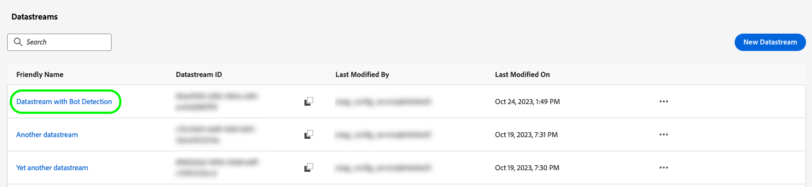

In the datastream details page, select the **[!UICONTROL Bot Detection]** option on the right rail.

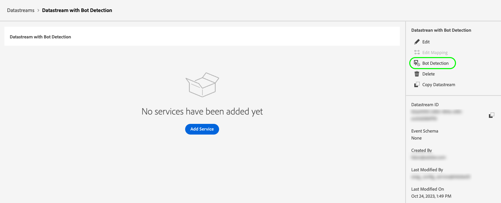

The **[!UICONTROL Bot Detection Rules]** page is shown.

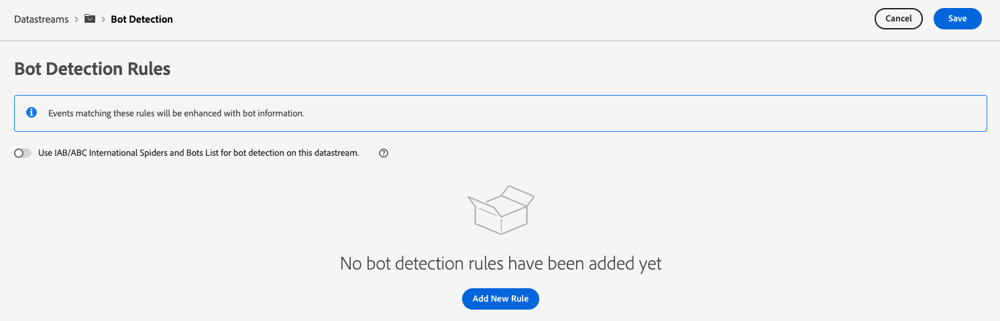

From the Bot Detection Rules page, you can configure bot detection by using the following functionalities:

* Using the [!DNL [IAB/ABC International Spiders and Bots List]](https://www.iab.com/guidelines/iab-abc-international-spiders-bots-list/).
* Creating your own bot detection rules.

### Use the IAB/ABC International Spiders and Bots List {#iab-list}

The [IAB/ABC International Spiders and Bots List](https://www.iab.com/guidelines/iab-abc-international-spiders-bots-list/) is a third-party, industry-standard list of internet spiders and bots, which helps you identify automated traffic such as search engine crawlers, monitoring tools, and other nonhuman traffic which you may not want to show up in your analytics counts.

To configure your datastream to use the [!DNL IAB/ABC International Spiders and Bots List], toggle the **[!UICONTROL Use IAB/ABC International Spiders and Bots List for bot detection on this datastream]** option, then select Save to apply the bot detection settings to your datastream.

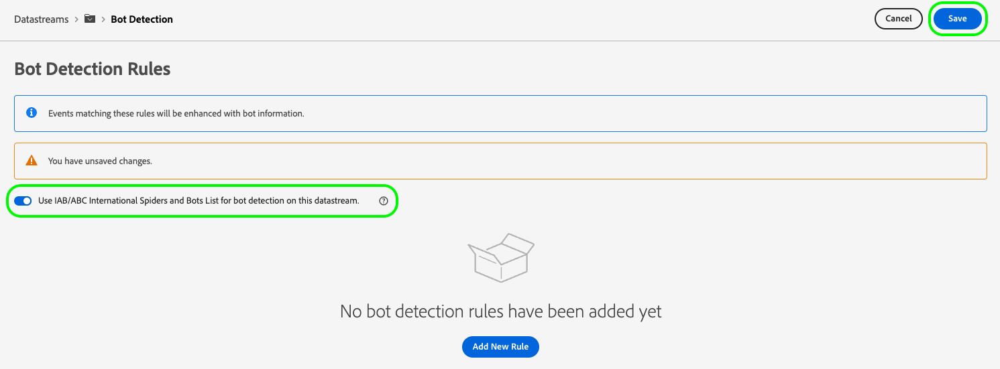

### Create bot detection rules {#rules}

In addition to using the [IAB/ABC International Spiders and Bots List](https://www.iab.com/guidelines/iab-abc-international-spiders-bots-list/), you can define your own bot detection rules for each datastream.

You can create bot detection rules based on **IP addresses** and **IP address ranges**.

If you need more granular bot detection rules, you can combine the IP conditions with request header conditions. Bot detection rules can use the following headers:

| HTTP header | Description |
| --- | --- |
| `user-agent` | A header which lets servers and network peers identify the application, operating system, vendor, and/or version of the requesting user agent. |
| `content-type`| Indicates the original media type of the resource (prior to any content encoding applied for sending). |
| `referer`| Identifies the address of the web page from which the resource has been requested. |
| `sec-ch-ua`| Provides the brand and significant version for each brand associated with the browser in a comma-separated list.|
| `sec-ch-ua-mobile`| Indicates whether the browser is on a mobile device. It can also be used by a desktop browser to indicate a preference for a mobile user experience. |
| `sec-ch-ua-platform`| Provides the platform or operating system on which the user agent is running. For example: "Windows" or "Android". |
| `sec-ch-ua-platform-version`| Provides the version of the operating system on which the user agent is running. |
| `sec-ch-ua-arch`| Provides the user-agent's underlying CPU architecture, such as ARM or x86. |
| `sec-ch-ua-model`| Indicates the device model on which the browser is running. |
| `sec-ch-ua-bitness`| Provides the "bitness" of the user-agent's underlying CPU architecture. This is the size in bits of an integer or memory address—typically 64 or 32 bits. |
| `sec-ch-ua-wow64`| Indicates whether a user agent binary is running in 32-bit mode on 64-bit Windows. |

To create a bot detection rule, follow the steps below:

1. Select **[!UICONTROL Add New Rule]**.
    
    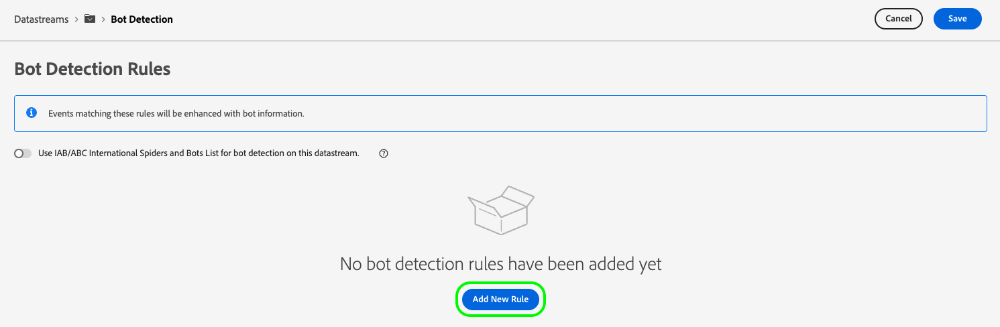

2. Type a name for the rule in the **[!UICONTROL Rule Name]** field.

    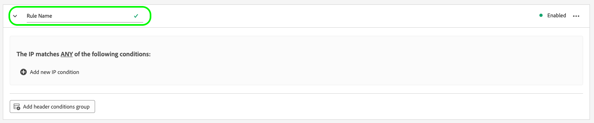

3. Select **[!UICONTROL Add new IP condition]** to add a new IP-based rule. You can define the rule by IP address or by IP address range.

    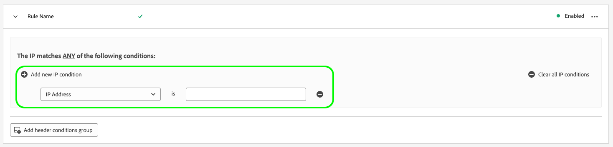

    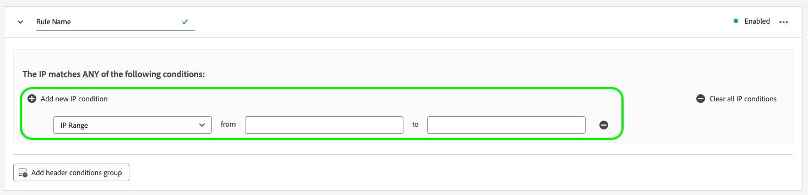

    >[!TIP]
    >
    >The IP conditions are based on a logical `OR` operation. A request is marked as originating from a bot if matches any of the IP conditions which you defined.

4. If you want to add header conditions to your rule, select **[!UICONTROL Add header conditions group]**, and then select the headers which you want the rule to use.

    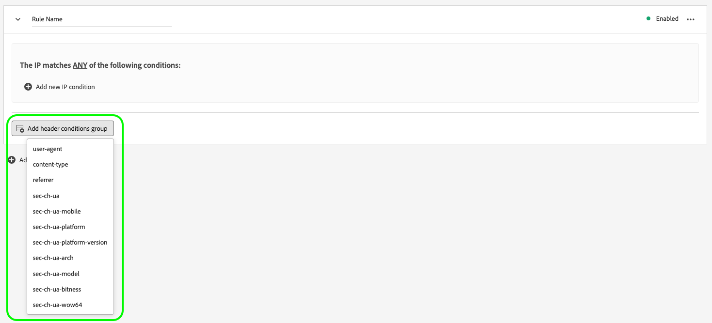

    Then, add the conditions to be used for the selected header.

    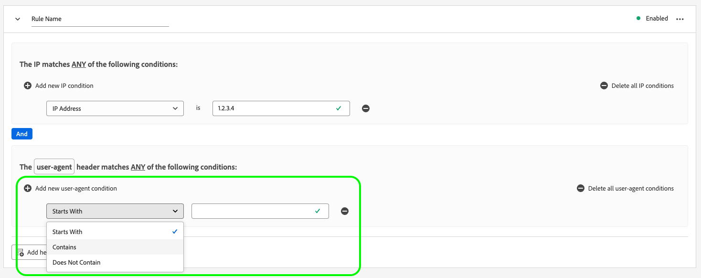

5. After configuring the desired bot detection rules, select **[!UICONTROL Save]** to have the rules applied to your datastream.

    


## Bot detection rule examples {#examples}

To help you get started with bot detection, you can use the examples detailed below to create bot detection rules.

### Bot detection based on one IP address {#one-ip}

To mark all requests originating from a specific IP address as bot traffic, create a new bot detection rule which evaluates a single IP address, as shown in the image below.

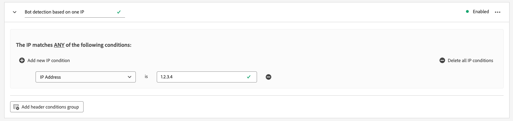

### Bot detection based on two IP addresses {#two-ip}

To mark all requests originating from either of two specific IP addresses as bot traffic, create a new bot detection rule which evaluates two IP addresses, as shown in the image below.

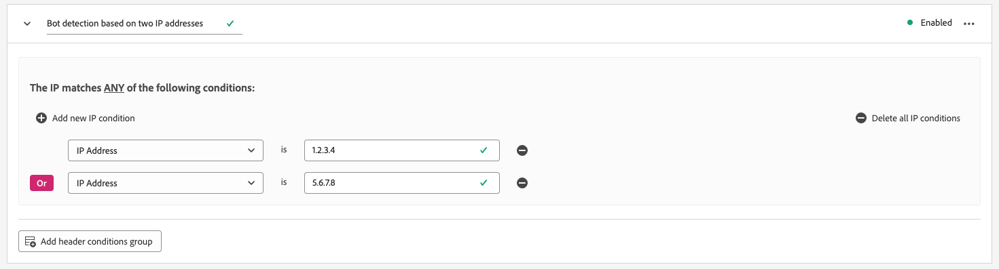

### Bot detection based on a range of IP addresses {#range}

To mark all requests originating from any IP address in a specific range as bot traffic, create a new bot detection rule which evaluates an entire IP address range, as shown in the image below.

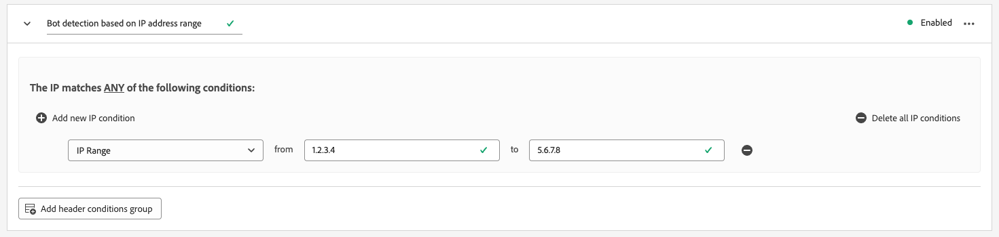

### Bot detection based on an IP address and a request header {#ip-header}

To mark all requests originating from a specific IP address and containing a specific request header as bot traffic, create a new bot detection rule as shown in the image below. 

This rule checks if the request originates from a specific IP address and if the `referer` request header starts with `www.adobe.com`.

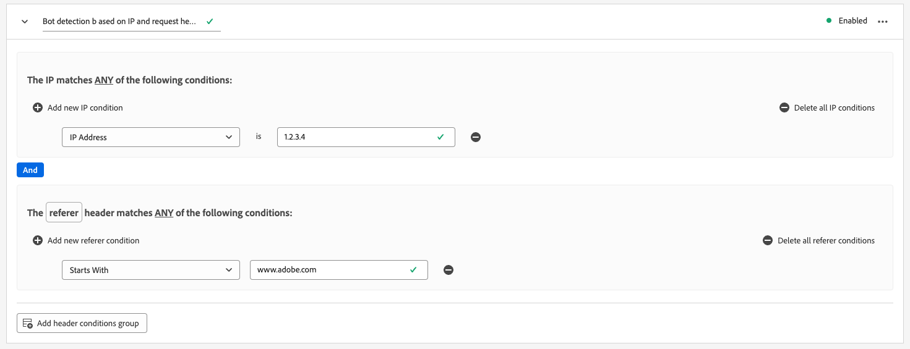

### Bot detection based on multiple conditions {#multiple-conditions}

You can create bot detection rules based on:

* **Multiple different conditions**: Different conditions are evaluated as a logical `AND` operation, meaning that the conditions need to be met simultaneously in order for the request to be identified as originating from a bot.
* **Multiple conditions of the same type**: Conditions of the same type are evaluated as a logical `OR` operation, meaning that if any of the conditions are met, the request is identified as originating from a bot.

The rule shown in the image below identifies a bot-originating request if the following conditions are met:

The request originates from either one of the two IP addresses, the `referer` header starts with `www.adobe.com`, and the `sec-ch-ua-mobile` header identifies the request as originating from a desktop browser.

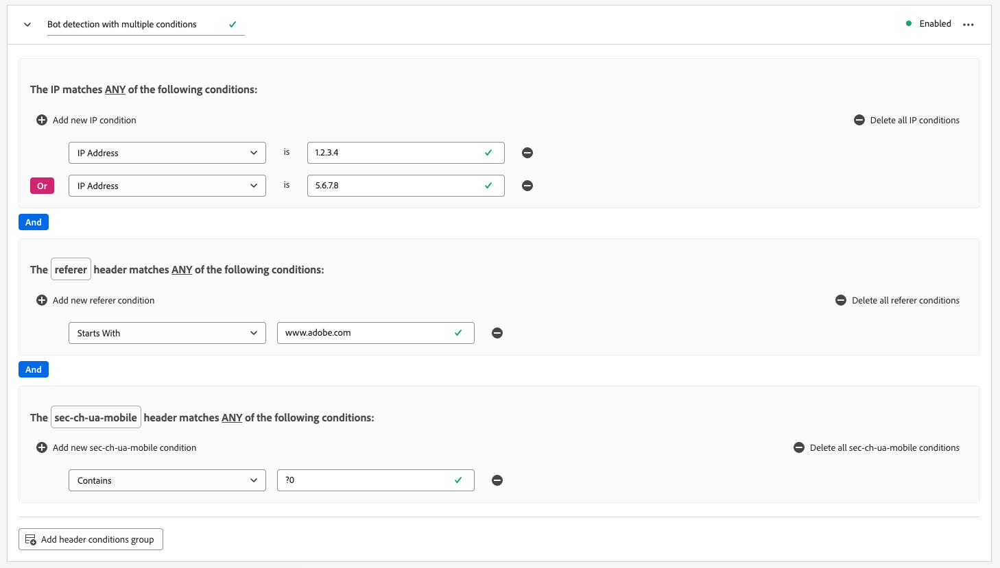
