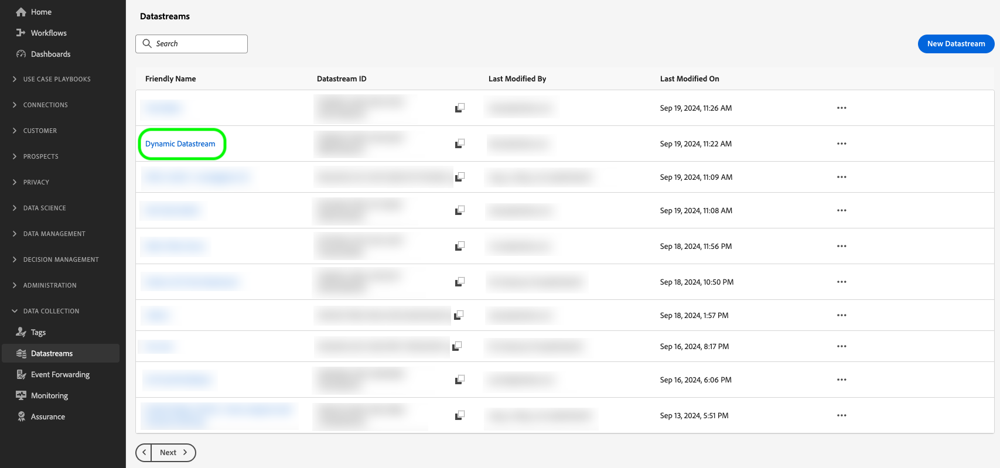
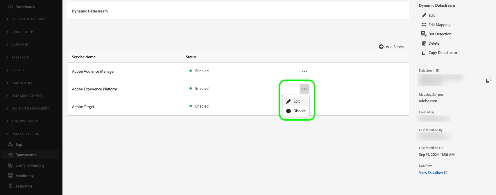
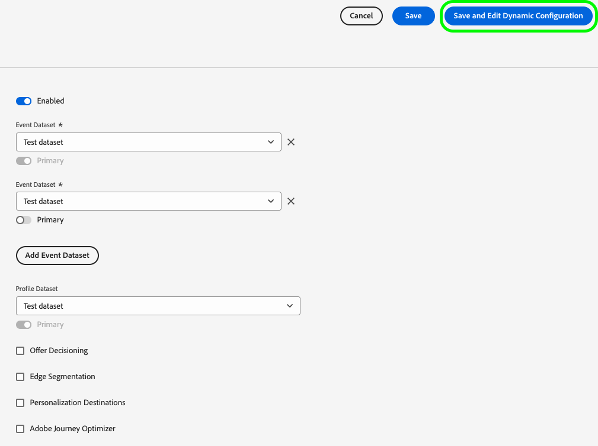
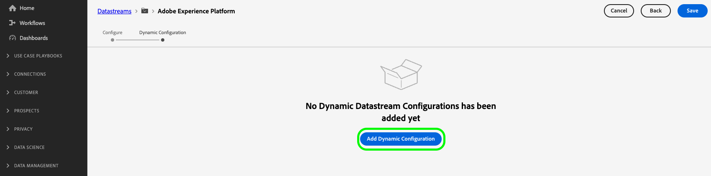
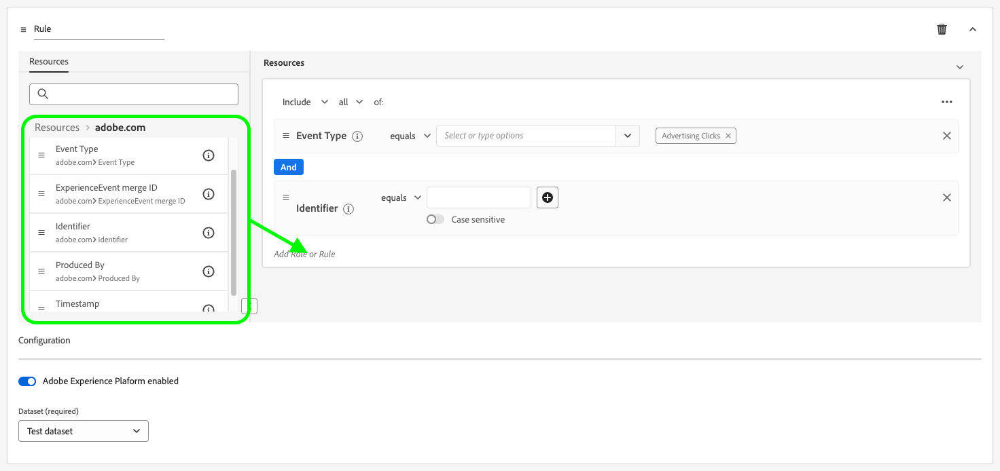
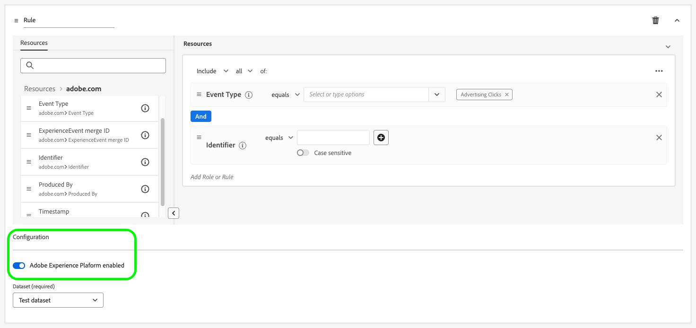
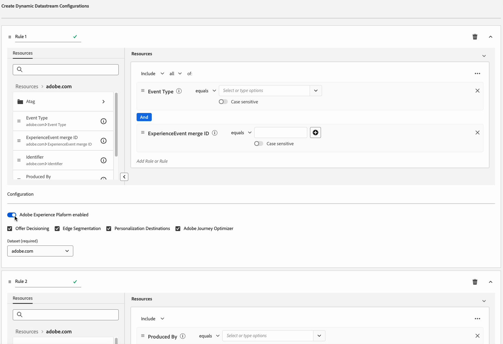
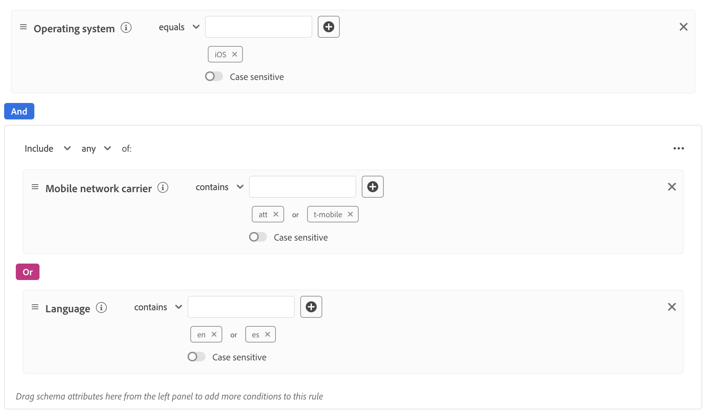
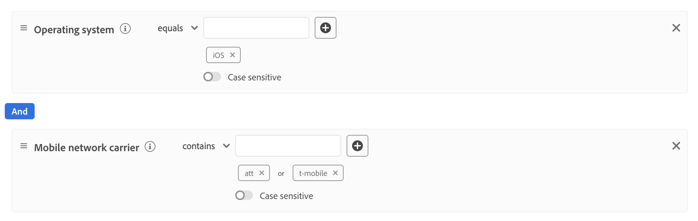
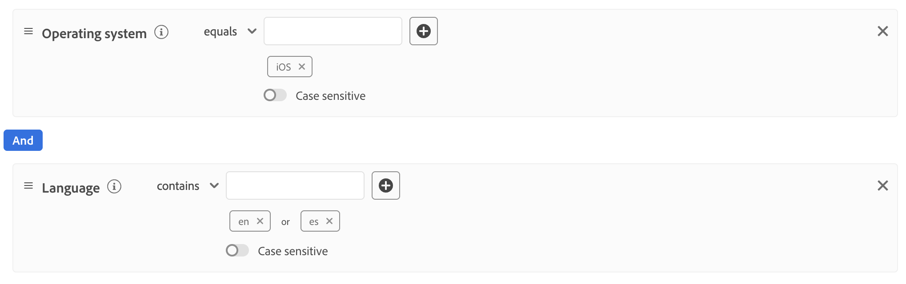

# Create dynamic datastream configurations

>[!AVAILABILITY]
>
>* The option to define dynamic datastream configurations is currently in Beta and available to a limited number of customers. To receive access to this functionality, contact your Adobe representative. The documentation and the functionality are subject to change.

By default, the Experience Platform Edge Network sends all the events that reach a datastream to all the Experience Cloud [services](configure.md#add-services) that you have enabled for your datastreams. This might not always be the ideal workflow for you, depending on your use cases.

Dynamic datastream configurations address this concern through user-configurable sets of rules that you define for each service enabled for your datastream, which dictate what Experience Cloud solution should receive each type of data.

## Prerequisites {#prerequisites}

To create a dynamic configuration for your datastream, there are two conditions you must meet:

* You must have created *at least* one datastream to work with. See the documentation on how to [create a datastream](configure.md) for detailed information.
* You must have *at least* one Experience Cloud service added to your datastream. See the documentation on how to [add a service](configure.md#add-services) to a datastream for detailed information.

After you have created a datastream and added an Experience Cloud service to it, you can then [create a dynamic configuration](#create-dynamic-configuration).

## Guardrails {#guardrails}

Dynamic datastream configurations have specific limits and performance constraints to ensure optimal system performance and data processing efficiency. The following guardrails apply when configuring dynamic datastream rules:

| Guardrail | Limit | Limit type |
|---------|------------|------|
| Maximum number of dynamic datastream configurations per datastream for Experience Platform services | 5 | Performance guardrail |
| Maximum number of dynamic datastream configurations per datastream for Event Forwarding | 5 | Performance guardrail |
| Maximum number of dynamic datastream configurations per datastream for Adobe Analytics | 5 | Performance guardrail |
| Maximum number of dynamic datastream configurations per datastream for Adobe Target | 5 | Performance guardrail |
| Maximum number of dynamic datastream configurations per datastream for Adobe Audience Manager | 5 | Performance guardrail |
| Maximum number of conditions (predicates) that you can combine within a single rule | 100 | Performance guardrail |
| Maximum time allowed for evaluating all dynamic datastream configurations per datastream before timing out | 25 ms | System-enforced guardrail |

## Dynamic datastream configurations versus datastream configuration overrides {#dynamic-versus-overrides}

Dynamic datastream configurations and [datastream configuration overrides](overrides.md) are mutually exclusive functionalities.

This means that you cannot use dynamic datastream configurations along with datastream configuration overrides. You must choose one or the other.

If you enable both dynamic datastream configurations and datastream configuration overrides, the configuration overrides will take precedence and the dynamic datastream configuration rules will be ignored.

## Create a dynamic datastream configuration {#create-dynamic-configuration}

After you have [created a datastream](configure.md) and [added a service](configure.md#add-services) to it, follow the steps below to add a dynamic configuration to the service.

1. Go to the **[!UICONTROL Data Collection]** > **[!UICONTROL Datastreams]** page and select the datastream that you created.
    
    

1. Select the **[!UICONTROL Edit]** option on the service for which you want to define a dynamic configuration.
    
    

1. In the **[!UICONTROL Configure]** page, select **[!UICONTROL Save and Edit Dynamic Configuration]**.

    

1. Select **[!UICONTROL Add Dynamic Configuration]**.
    
    

1. From the **[!UICONTROL Resources]** panel, drag and drop the items that you want to build your rule with to the right side of the window. You can combine multiple resources to build complex rules.

    Use each resource's options, such as **[!UICONTROL equals]**, **[!UICONTROL does not equal]**, **[!UICONTROL exists]**, and more, to fine tune your rules.

    

1. In the **[!UICONTROL Configuration]** section, toggle the services that you want to enable or disable for each rule, depending on whether you want the data to be sent to each service. If you turn the toggle off, the service routing is disabled and *no data* will be sent to the upstream service.

    

1. When you are done configuring your rules, select **[!UICONTROL Save]**.

## Rule priority considerations {#considerations}

You can define multiple rules for each dynamic datastream configuration. However, if your data matches the conditions of multiple rules, only the first matching rule in the list is taken into consideration, and all the other matching rules are ignored.

To achieve the desired data routing behavior, pay attention to the order in which you arrange the rules.

To configure the rule order, you can drag and drop the rule windows in the order you want.

## Rule eligibility criteria {#eligibility-criteria}

Dynamic datastream configurations must meet specific eligibility criteria to ensure high performance, maintainability, and clarity. Below are the main requirements and best practices for defining rules.

### Supported data types {#supported-data-types}

Dynamic datastream configuration rules work with specific data types to ensure optimal performance and reliable data routing. Understanding which data types are supported helps you create effective rules that process your data efficiently.

| Data Type | Status | Notes |
|-----------|--------|-------|
| String | Allowed | - |
| Number (Integer, Long, Short, Byte) | Allowed | - |
| Enum | Allowed | - |
| Boolean | Allowed | - |
| Date | Allowed | - |
| Array | Not allowed | Rules based on arrays are not supported, as they can degrade performance. |
| Map | Not allowed | Rules based on maps are not supported, as they can degrade performance. |

### Supported operators {#supported-operators}

Rules can use the following operators, depending on the data type:

| Data type | Supported operators |
|-----------|-------------------|
| **String** | `equals`, `starts with`, `ends with`, `contains`, `exists`, `does not equal`, `does not start with`, `does not end with`, `does not contain`, `does not exist` |
| **Number (Long, Integer, Short, Byte)** | `equals`, `does not equal`, `greater than`, `less than`, `greater than or equal to`, `less than or equal to`, `exists`, `does not exist` |
| **Boolean** | `equals true/false`, `does not equal true/false` |
| **Enum** | `equals`, `does not equal`, `exists`, `does not exist` |
| **Date** | `today`, `yesterday`, `this month`, `this year`, `custom date`, `in last`, `from`, `during`, `within`, `before`, `after`, `rolling range`, `in next`, `exists`, `does not exist` |
| **Logical** | `INCLUDE`, `ANY/ALL` (equivalent to AND/OR) |

>[!NOTE]
>
>The **[!UICONTROL EXCLUDE]** operator is not directly supported, but you can achieve equivalent logic using **[!UICONTROL INCLUDE]** with negated comparison operators (e.g., "does not equal").

### Rule structure {#rule-structure}

When creating rules for dynamic datastream configurations, it's important to understand the structural requirements that ensure optimal performance and system compatibility. The rule structure directly impacts how efficiently your data is processed and routed through the system.

**Use flat expressions only**. You must define rules as flat logical expressions. Nested logical expressions (using containers or multiple levels of AND/OR) are not supported. If you need complex logic, break it into multiple flat rules.

For example, consider the complex rule shown in the image below.

You can break this rule into the following simpler rules:

**Avoid complex rules**. Simpler rules ensure faster evaluation and better maintainability.

### Best practices {#best-practices}

Following best practices when creating dynamic datastream configuration rules ensures optimal performance, system reliability, and maintainable configurations. These guidelines help you avoid common pitfalls and create efficient rules that work seamlessly with the platform's architecture.

* **Keep rules simple and flat.** If you need to express complex logic, use multiple rules instead of nesting.
* **Use only [supported data types](#supported-data-types) and [operators](#supported-operators).** 
* **Test your rules for performance.** Overly complex or unsupported rules may cause the system to reject them or could impact system performance.

