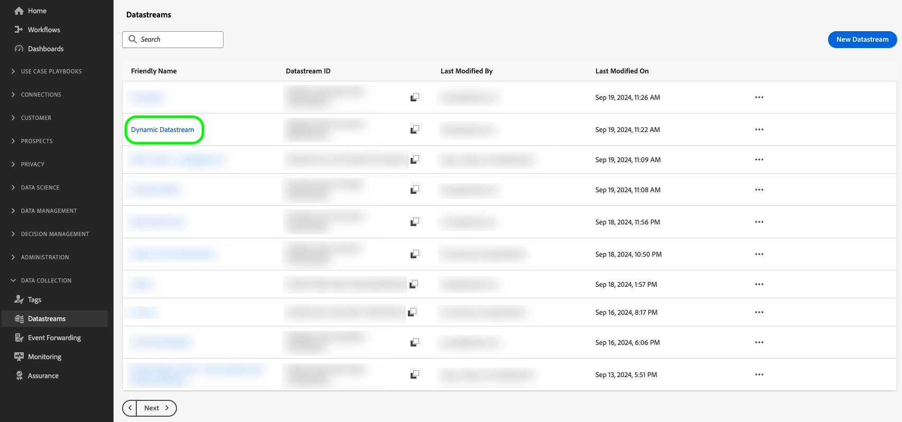
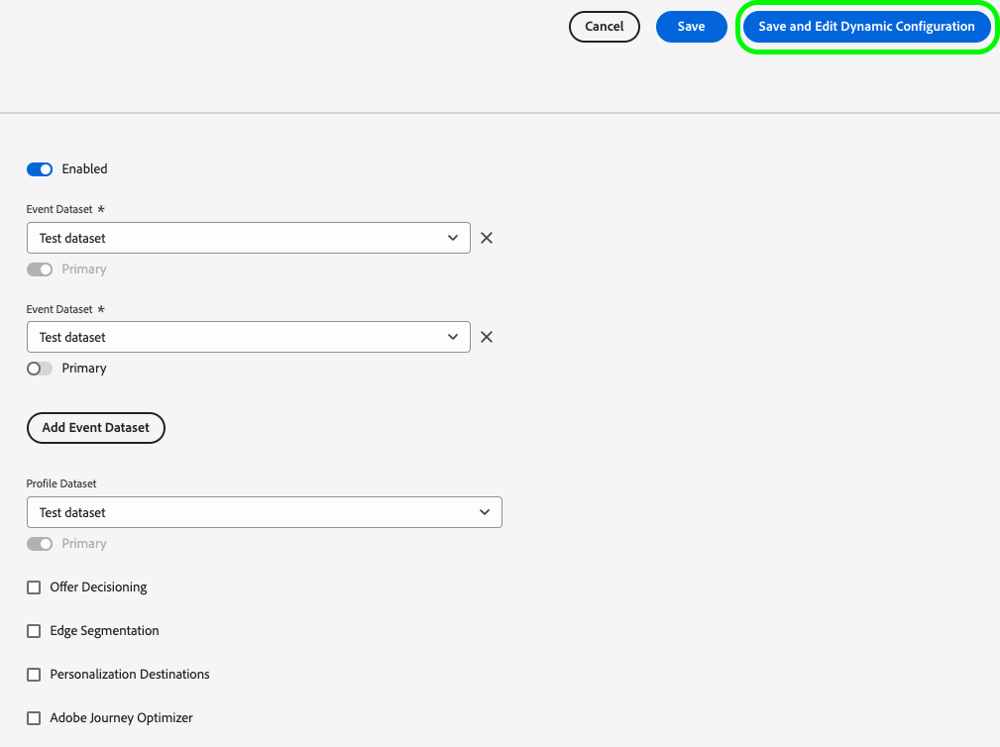
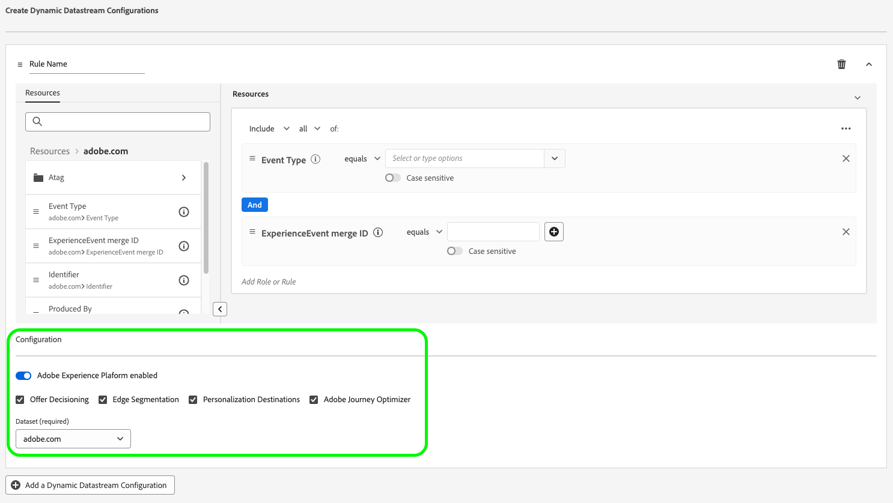
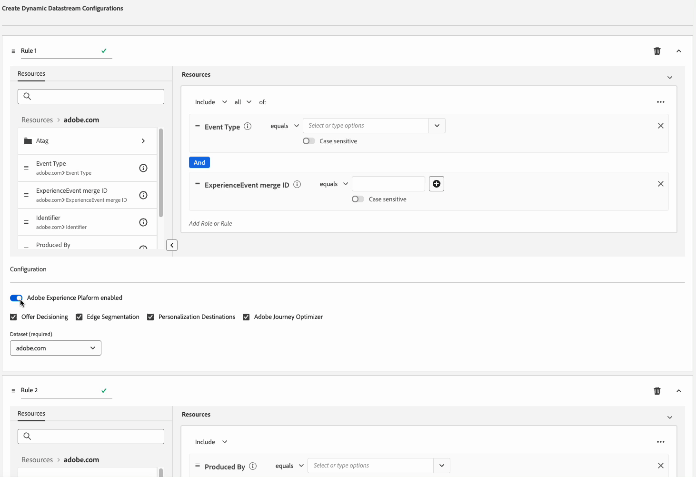
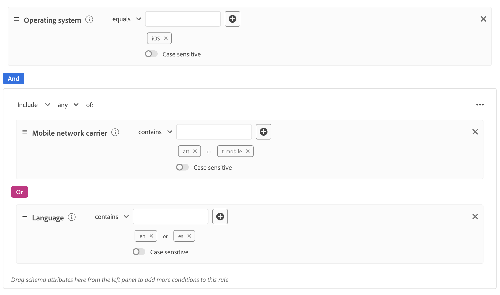
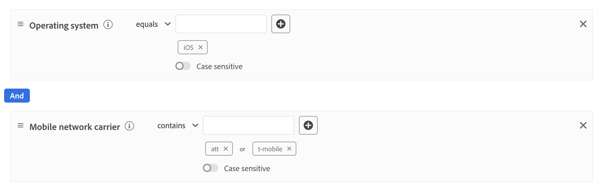
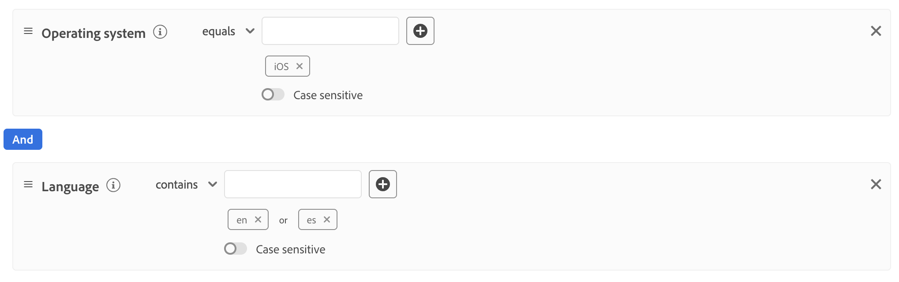

# Create [!DNL Dynamic Datastream Configurations]

By default, the [!DNL Adobe Experience Platform Edge Network] sends all events that reach a datastream to all [!DNL Experience Cloud] [services](/help/datastreams/configure.md#add-services) you have enabled for your datastreams. Depending on your use cases, this may not always be the ideal workflow.

Dynamic datastream configurations address this through sets of rules that you define for each service enabled for your datastream, which control what [!DNL Experience Cloud] solution receives each type of data.

## [!DNL Dynamic Datastream Configurations] guide {#guide}

If you are new to [!DNL Dynamic Datastream Configurations] or are planning a production implementation, read the full guide before configuring rules. The guide covers the event taxonomy, dataset strategies, use cases, best practices, and testing approach.

* [Overview](/help/datastreams/dynamic-configurations/overview.md) — How rules are evaluated, the event taxonomy, and mutual exclusivity with client-side overrides
* [Prerequisites and planning checklist](/help/datastreams/dynamic-configurations/prerequisites.md) — Datastream setup, schema and dataset preparation, and event inventory
* [Configuration patterns](/help/datastreams/dynamic-configurations/configuration-patterns.md) — Actionable first versus Analytical first dataset strategies
* [Use cases](/help/datastreams/dynamic-configurations/use-cases.md) — Six common routing scenarios with example rule tables
* [End-to-end example](/help/datastreams/dynamic-configurations/example.md) — A complete e-commerce implementation
* [Best practices](/help/datastreams/dynamic-configurations/best-practices.md) — Rule design, dataset strategy, and operational guidance
* [Test and validate](/help/datastreams/dynamic-configurations/testing.md) — Assurance-based testing checklist
* [FAQ](/help/datastreams/dynamic-configurations/faq.md) — Common questions about rule behavior and system interactions

## Prerequisites {#prerequisites}

To create a dynamic configuration for your datastream, there are two conditions you must meet:

* You must have created *at least* one datastream to work with. See the documentation on how to [create a datastream](/help/datastreams/configure.md) for detailed information.
* You must have *at least* one [!DNL Experience Cloud] service added to your datastream. See the documentation on how to [add a service](/help/datastreams/configure.md#add-services) to a datastream for detailed information.

After you have created a datastream and added an Experience Cloud service to it, you can then [create a dynamic configuration](#create-dynamic-configuration).

## Guardrails {#guardrails}

Dynamic datastream configurations have specific limits and performance constraints to ensure optimal system performance and data processing efficiency. The following guardrails apply when configuring dynamic datastream rules:

| Guardrail | Limit | Limit type |
|---------|------------|------|
| Maximum number of [!DNL Dynamic Datastream Configurations] per datastream for Experience Platform services | 5 | Performance guardrail |
| Maximum number of [!DNL Dynamic Datastream Configurations] per datastream for Event Forwarding | 5 | Performance guardrail |
| Maximum number of [!DNL Dynamic Datastream Configurations] per datastream for [!DNL Adobe Analytics] | 5 | Performance guardrail |
| Maximum number of [!DNL Dynamic Datastream Configurations] per datastream for [!DNL Adobe Target] | 5 | Performance guardrail |
| Maximum number of [!DNL Dynamic Datastream Configurations] per datastream for [!DNL Adobe Audience Manager] | 5 | Performance guardrail |
| Maximum number of conditions (predicates) that you can combine within a single rule | 100 | Performance guardrail |
| Maximum time allowed for evaluating all [!DNL Dynamic Datastream Configurations] per datastream before timing out | 25 ms | System-enforced guardrail |

## Dynamic datastream configurations versus datastream configuration overrides {#dynamic-versus-overrides}

Dynamic datastream configurations and [datastream configuration overrides](/help/datastreams/overrides.md) are mutually exclusive functionalities.

You cannot use [!DNL Dynamic Datastream Configurations] along with datastream configuration overrides. You must choose one or the other.

If you enable both, configuration overrides take precedence and the system ignores the [!DNL Dynamic Datastream Configuration] rules.

## Create a [!DNL Dynamic Datastream Configuration] {#create-dynamic-configuration}

After you have [created a datastream](/help/datastreams/configure.md) and [added a service](/help/datastreams/configure.md#add-services) to it, follow these steps to add a dynamic configuration to the service.

1. Go to the **[!UICONTROL Data Collection]** > **[!UICONTROL Datastreams]** page and select the datastream that you created.
    
    

1. Select the **[!UICONTROL Edit]** option on the service for which you want to define a dynamic configuration.
    
    

1. In the **[!UICONTROL Configure]** page, select **[!UICONTROL Save and Edit Dynamic Configuration]**.

    

1. Select **[!UICONTROL Add Dynamic Configuration]**.
    
    

1. From the **[!UICONTROL Resources]** panel, drag and drop the items that you want to build your rule with to the right side of the window. You can combine multiple resources to build complex rules.

    Use each resource's options, such as **[!UICONTROL equals]**, **[!UICONTROL does not equal]**, **[!UICONTROL exists]**, and more, to fine tune your rules.

    

1. In the **[!UICONTROL Configuration]** section, enable or disable the services for each rule, depending on whether you want the data sent to each service. If you disable a service, the routing is disabled and *no data* is sent to the downstream service.

    

1. When you are done configuring your rules, select **[!UICONTROL Save]**.

## Rule priority considerations {#rule-priority}

You can define multiple rules for each [!DNL Dynamic Datastream Configuration]. However, if your data matches the conditions of multiple rules, only the first matching rule in the list is taken into consideration, and all the other matching rules are ignored.

To achieve the desired data routing behavior, pay attention to the order in which you arrange the rules.

To configure the rule order, you can drag and drop the rule windows in the order you want.

## Rule eligibility criteria {#eligibility-criteria}

Dynamic datastream configurations must meet specific eligibility criteria to ensure high performance and reliable routing.

### Supported data types {#supported-data-types}

Dynamic datastream configuration rules work with specific data types to ensure optimal performance and reliable data routing. Understanding which data types are supported helps you create effective rules that process your data efficiently.

| Data Type | Status | Notes |
|-----------|--------|-------|
| String | Allowed | - |
| Number (Integer, Long, Short, Byte) | Allowed | - |
| Enum | Allowed | - |
| Boolean | Allowed | - |
| Date | Allowed | - |
| Array | Not allowed | Rules based on arrays are not supported, as they can degrade performance. |
| Map | Not allowed | Rules based on maps are not supported, as they can degrade performance. |

### Supported operators {#supported-operators}

Rules can use the following operators, depending on the data type:

| Data type | Supported operators |
|-----------|-------------------|
| **String** | `equals`, `starts with`, `ends with`, `contains`, `exists`, `does not equal`, `does not start with`, `does not end with`, `does not contain`, `does not exist` |
| **Number (Long, Integer, Short, Byte)** | `equals`, `does not equal`, `greater than`, `less than`, `greater than or equal to`, `less than or equal to`, `exists`, `does not exist` |
| **Boolean** | `equals true/false`, `does not equal true/false` |
| **Enum** | `equals`, `does not equal`, `exists`, `does not exist` |
| **Date** | `today`, `yesterday`, `this month`, `this year`, `custom date`, `in last`, `from`, `during`, `within`, `before`, `after`, `rolling range`, `in next`, `exists`, `does not exist` |
| **Logical** | `INCLUDE`, `ANY/ALL` (equivalent to [!DNL AND]/[!DNL OR]) |

>[!NOTE]
>
>The **[!UICONTROL EXCLUDE]** operator is not directly supported, but you can achieve equivalent logic using **[!UICONTROL INCLUDE]** with negated comparison operators (for example, "does not equal").

### Rule structure {#rule-structure}

Rules must be flat logical expressions. Nested logical expressions (using containers or multiple levels of [!DNL AND]/[!DNL OR]) are not supported. If you need complex logic, break it into multiple flat rules.

For example, consider the following complex rule.

You can break this rule into the following simpler rules:

## Next steps

* Review [best practices for [!DNL Dynamic Datastream Configurations]](/help/datastreams/dynamic-configurations/best-practices.md) for rule design, dataset strategy, and operational guidance.
* See [Dynamic datastream configuration use cases](/help/datastreams/dynamic-configurations/use-cases.md) for complete rule configurations.
* Follow [Test and validate [!DNL Dynamic Datastream Configurations]](/help/datastreams/dynamic-configurations/testing.md) to verify your rules are routing correctly.
