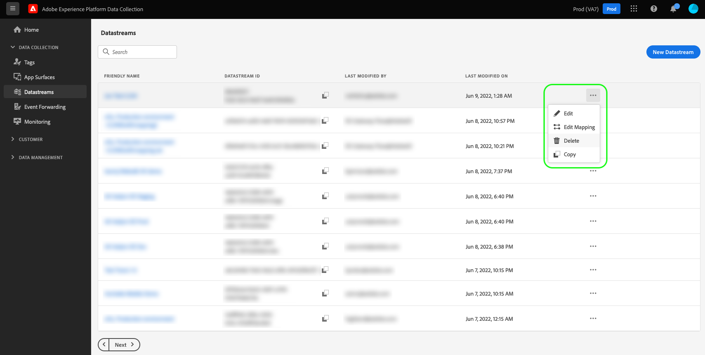

# Configure a datastream

This document covers the steps for configuring a [datastream](./overview.md) in the UI. 

## Access the [!UICONTROL Datastreams] workspace

You can create and manage datastreams in the Data Collection UI or Experience Platform UI by selecting **[!UICONTROL Datastreams]** in the left navigation.

The **[!UICONTROL Datastreams]** tab displays a list of existing datastreams, including their friendly name, ID, and last modified date. Select the name of a datastream to [view its details and configure services](#view-details).

Select the "more" icon (**...**) for a particular datastream to reveal more options. Select **[!UICONTROL Edit]** to update the [basic configuration](#configure) for the datastream, or select **[!UICONTROL Delete]** to remove the datastream.

## Create a new datastream {#create}

To create a datastream, start by selecting **[!UICONTROL New Datastream]**.

The datastream creation workflow appears, starting at the configuration step. From here, you must provide a name and optional description for the datastream.

If you are configuring this datastream for use in Experience Platform and are using the Platform Web SDK, you must also select an [event-based Experience Data Model (XDM) schema](../xdm/classes/experienceevent.md) to represent the data you plan on ingesting.

### Configure geolocation and network lookup {#geolocation-network-lookup}

Geolocation and network lookup settings help you define the level of granularity of the geographical and network-level data that you want to collect.

Expand the **[!UICONTROL Geolocation and network lookup]** section to configure the settings described below.

| Setting | Description |
| --- | --- |
| [!UICONTROL Geo Lookup] | Enables geolocation lookups for the selected options, based on the visitor IP address. Geolocation lookup requires you to include the [`placeContext`](../edge/data-collection/automatic-information.md#place-context) field group in your Web SDK configuration.   Available options: <ul><li>Country</li><li>Postal Code</li><li>State/Province</li><li>DMA</li><li>City</li><li>Latitude </li><li>Longitude</li></ul>Selecting **[!UICONTROL City]**, **[!UICONTROL Latitude]**, or **[!UICONTROL Longitude]** provides coordinates up to two decimal points, regardless of what other options are selected. This is considered city-level granularity.    Not selecting any option disables any geolocation lookups. Geolocation occurs before [!UICONTROL IP Obfuscation] and is not impacted by the  [!UICONTROL IP Obfuscation] setting.|
| [!UICONTROL Network Lookup] | Enables network lookups for the selected options, based on the visitor IP address. Network lookup requires you to include the [`Environment`](../edge/data-collection/automatic-information.md#environment) field group in your Web SDK configuration.   Available options: <ul><li>Carrier</li><li>Domain</li><li>ISP</li></ul>Use these options to provide more information to other services about the specific network where the requests originated.|

### Configure device lookup {#geolocation-device-lookup}

The **[!UICONTROL Device Lookup]** settings allow you to select the granularity level of the device-specific information that you want to collect.

Expand the **[!UICONTROL Device Lookup]** section to configure the settings described below.

>[!IMPORTANT]
>
>The settings described in the table below are mutually exclusive. You cannot select both user agent information and device lookup data at the same time.

| Setting | Description |
| --- | --- |
| **[!UICONTROL Keep user agent and client hints headers]** | Select this option to only collect the information stored in the user agent string. This is the default setting. |
| **[!UICONTROL Use device lookup to collect the following information]** | Select this option if you want to collect one or more of the following device-specific information: <ul><li>**[!UICONTROL Device]** information:<ul><li>Device manufacturer</li><li>Device model</li><li>Marketing name</li></ul></li><li>**[!UICONTROL Hardware]** information: <ul><li>Device type</li><li>Display height</li><li>Display width</li><li>Display color depth</li></ul></li><li>**[!UICONTROL Browser]** information: <ul><li>Browser vendor</li><li>Browser name</li><li>Browser version</li></ul></li><li>**[!UICONTROL Operating system]** information: <ul><li>OS vendor</li><li>OS name</li><li>OS version</li></ul></li></ul>    Device lookup information cannot be collected along with user agent and client hints. Choosing to collect device information will disable the collection of user agent and client hints, and vice versa. All device lookup information is stored in the `xdm:device` field group. |
| **[!UICONTROL Do not collect any device information]** | Select this option if you do not want to collect any kind of lookup information. No device, hardware, browser or operating system information will be collected, including no user agent or client hints headers. |

### Configure advanced options {#@advanced-options}

Select **[!UICONTROL Advanced Options]** to reveal additional controls to configure the datastream, such as IP obfuscation, First Party ID cookies, and more.

 

>[!IMPORTANT]
>
> You are responsible for ensuring you have obtained all necessary permissions, consents, clearances, and authorization required under applicable laws and regulations to collect, process, and transmit personal data, including precise geolocation information.
> 
> Your IP address obfuscation selection does not affect the level of geolocation information that will be derived from the IP address and sent to your configured Adobe solutions. Geolocation lookups must be limited or disabled separately.

| Setting | Description |
| --- | --- |
| [!UICONTROL IP Obfuscation]| Indicates the type of IP obfuscation to be applied to the datastream. Any processing based on customer IP will be impacted by the IP obfuscation setting. This includes all Experience Cloud services which receive data from your datastream. 
Available options:
 <ul><li>**[!UICONTROL None]**: Disables IP obfuscation. The full user IP address will be sent via the datastream.</li><li>**[!UICONTROL Partial]**: For IPv4 addresses, obfuscates the last octet of the user IP address. For IPv6 addresses, obfuscates the last 80 bits of the address. 
Examples:
 <ul><li>IPv4: `1.2.3.4` -> `1.2.3.0`</li><li>IPv6: `2001:0db8:1345:fd27:0000:ff00:0042:8329` -> `2001:0db8:1345:0000:0000:0000:0000:0000`</li></ul></li><li>**[!UICONTROL Full]**: Obfuscates the entire IP address. 
Examples:
 <ul><li>IPv4: `1.2.3.4` -> `0.0.0.0`</li><li>IPv6: `2001:0db8:1345:fd27:0000:ff00:0042:8329` -> `0:0:0:0:0:0:0:0`</li></ul></li></ul> IP obfuscation impact on other Adobe products: <ul><li>**Adobe Target**: The datastream-level [!UICONTROL IP obfuscation] is applied before the [!UICONTROL IP obfuscation] performed in Adobe Target, to all IP addresses present on the request. For example, if the datastream-level [!UICONTROL IP obfuscation] option is set to **[!UICONTROL Full]** and the Adobe Target IP obfuscation option is set to **[!UICONTROL Last octet obfuscation]**, Adobe Target receives a fully obfuscated IP. If the datastream-level [!UICONTROL IP obfuscation] option is set to **[!UICONTROL Partial]** and the Adobe Target IP obfuscation option is set to **[!UICONTROL Full]**, Adobe Target receives a partially obfuscated IP, and then applies the full obfuscation on it. The Adobe Target IP obfuscation is managed independently of the datastream one. See the Adobe Target documentation on [IP obfuscation](https://developer.adobe.com/target/before-implement/privacy/privacy/) and [geolocation](https://experienceleague.adobe.com/docs/target/using/audiences/create-audiences/categories-audiences/geo.html?lang=en) for more details.</li><li>**Audience Manager**: The datastream-level [!UICONTROL IP obfuscation] setting is applied before the [!UICONTROL IP obfuscation] performed in Audience Manager, to all IP addresses present in the request. Any geolocation lookup done by Audience Manager is impacted by the datastream-level [!UICONTROL IP obfuscation] option. A geolocation lookup in Audience Manager, based on a fully obfuscated IP, will result in an unknown region, and any segments based on the resulted geolocation data will not be realized. See the Audience Manager documentation on [IP obfuscation](https://experienceleague.adobe.com/docs/audience-manager/user-guide/features/administration/ip-obfuscation.html?lang=en) for more details.</li><li>**Adobe Analytics**: Adobe Analytics currently receives the partially obfuscated IP addresses if any IP obfuscation option is selected, other than NONE. For Analytics to receive fully obfuscated IP addresses, you must configure IP obfuscation separately, in Adobe Analytics. This behavior will be updated in future releases. See the Adobe Analytics [documentation](https://experienceleague.adobe.com/docs/analytics/admin/admin-tools/manage-report-suites/edit-report-suite/report-suite-general/general-acct-settings-admin.html) for details on how to enable IP obfuscation in Analytics.</li></ul> |
| [!UICONTROL First Party ID Cookie] | When enabled, this setting tells the Edge Network to refer to a specified cookie when looking up a [first-party device ID](../edge/identity/first-party-device-ids.md), rather than looking up this value in the Identity Map.  When enabling this setting, you must provide the name of the cookie where the ID is expected to be stored.                                                                                                                                                                                                                                                                                                                                                                                                                                                                                                                                                                                                                                                                                                                                                                                                                                                                                                                                                                                                                                                                                                                                                                                                                                                                                                                                                                                                                                                                                                                                                                                                                                                                                                                                                                                                                                                                                                                                                                                                                                                                                                                                                                                                                                                                                                                                                                                                                                                                                                                                                                                                                                                                                                                                                                                                                                                                       |
| [!UICONTROL Third Party ID Sync] | ID syncs can be grouped into containers to allow different ID syncs to be run at different times. When enabled, this setting lets you specify which container of ID syncs is run for this datastream.                                                                                                                                                                                                                                                                                                                                                                                                                                                                                                                                                                                                                                                                                                                                                                                                                                                                                                                                                                                                                                                                                                                                                                                                                                                                                                                                                                                                                                                                                                                                                                                                                                                                                                                                                                                                                                                                                                                                                                                                                                                                                                                                                                                                                                                                                                                                                                                                                                                                                                                                                                                                                                                                                                                                                                                                                                                                                                                                                                                                                  |
| [!UICONTROL Third Party ID Sync Container ID] | The numeric ID of the container to be used for third party ID sync.                                                                                                                                                                                                                                                                                                                                                                                                                                                                                                                                                                                                                                                                                                                                                                                                                                                                                                                                                                                                                                                                                                                                                                                                                                                                                                                                                                                                                                                                                                                                                                                                                                                                                                                                                                                                                                                                                                                                                                                                                                                                                                                                                                                                                                                                                                                                                                                                                                                                                                                                                                                                                                                                                                                                                                                                                                                                                                                                                                                                                                                                                                                                                    |
| [!UICONTROL Container ID Overrides] | In this section you can define additional third party ID sync container IDs which you can use to override the default one.                                                                                                                                                                                                                                                                                                                                                                                                                                                                                                                                                                                                                                                                                                                                                                                                                                                                                                                                                                                                                                                                                                                                                                                                                                                                                                                                                                                                                                                                                                                                                                                                                                                                                                                                                                                                                                                                                                                                                                                                                                                                                                                                                                                                                                                                                                                                                                                                                                                                                                                                                                                                                                                                                                                                                                                                                                                                                                                                                                                                                                                                                             |
| [!UICONTROL Access Type] | Defines the authentication type that the Edge Network accepts for the datastream. <ul><li>**[!UICONTROL Mixed Authentication]**: When this option is selected, the Edge Network accepts both authenticated and unauthenticated requests. Select this option when you plan to use the Web SDK or [Mobile SDK](https://developer.adobe.com/client-sdks/documentation/), along with the [Server API](../server-api/overview.md). </li><li>**[!UICONTROL Authenticated Only]**: When this option is selected, the Edge Network only accepts authenticated requests. Select this option when you plan to use only the Server API and want to prevent any unauthenticated requests from being processed by the Edge Network.</li></ul>                                                                                                                                                                                                                                                                                                                                                                                                                                                                                                                                                                                                                                                                                                                                                                                                                                                                                                                                                                                                                                                                                                                                                                                                                                                                                                                                                                                                                                                                                                                                                                                                                                                                                                                                                                                                                                                                                                                                                                                                                                                                                                                                                                                                                                                                                                                                                                                                                                                                                       |
[!UICONTROL Media Analytics] | Select this option to enable processing of streaming tracking data for Edge Network integration via Experience Platform SDKs or Media Edge API. Learn about Media Analytics from the [documentation](https://experienceleague.adobe.com/docs/media-analytics/using/media-overview.html?lang=en).                                                                                                                                                                                                                                                                                                                                                                                                                                                                                                                                                                                                                                                                                                                                                                                                                                                                                                                                                                                                                                                                                                                                                                                                                                                                                                                                                                                                                                                                                                                                                                                                                                                                                                                                                                                                                                                                                                                                                                                                                                                                                                                                                                                                                                                                                                                                                                                                                                                                                                                                                                                                                                                                                                                                                                                                                                                                                                                       |

From here, if you are configuring your datastream for Experience Platform, follow the tutorial on [Data Prep for Data Collection](./data-prep.md) to map your data to a Platform event schema before returning to this guide. Otherwise, select **[!UICONTROL Save]** and continue to the next section.

## View datastream details {#view-details}

After configuring a new datastream or selecting an existing one to view, the details page for that datastream appears. Here you can find further information about the datastream, including its ID.

From the datastream details screen, you can [add services](#add-services) to enable capabilities from the Adobe Experience Cloud products you have access to. You can also edit the datastream's [basic configuration](#create), update its [mapping rules](./data-prep.md), [copy the datastream](#copy), or delete it entirely.

## Add services to a datastream {#add-services}

On the details page of a datastream, select **[!UICONTROL Add Service]** to start adding available services for that datastream.

On the next screen, use the dropdown menu to select a service to configure for this datastream. Only the services that you have access to will appear in this list.

Select the desired service, fill in the configuration options that appear, and then select **[!UICONTROL Save]** to add the service to the datastream. All added services appear in the details view for the datastream.

The subsections below describe the configuration options for each service.

>[!NOTE]
>
>Each service configuration contains an **[!UICONTROL Enabled]** toggle that is automatically activated when the service is selected. To disable the selected service for this datastream, select the **[!UICONTROL Enabled]** toggle again.

### Adobe Analytics settings {#analytics}

This service controls whether and how data is sent to Adobe Analytics. Additional details can be found in the guide on [sending data to Analytics](../edge/data-collection/adobe-analytics/analytics-overview.md).

| Setting | Description |
| --- | --- |
| [!UICONTROL Report Suite ID] | **(Required)** The ID of the Analytics report suite that you want to send data to. This ID can be found in the Adobe Analytics UI under [!UICONTROL Admin] > [!UICONTROL ReportSuites]. If multiple report suites are specified, then data is copied to each report suite. |
| [!UICONTROL Report Suite Overrides]| In this section, you can add additional report suite IDs that you can use to override the default one. |

### Adobe Audience Manager settings {#audience-manager}

This service controls whether and how data is sent to Adobe Audience Manager. All that is needed to send data to Audience Manager is to enable this section. The other settings are optional but encouraged.

| Setting | Description |
| --- | --- |
| [!UICONTROL Cookie Destinations Enabled] | Allows the SDK to share segment information via [cookie destinations](https://experienceleague.adobe.com/docs/audience-manager/user-guide/features/destinations/custom-destinations/create-cookie-destination.html) from [!DNL Audience Manager]. |
| [!UICONTROL URL Destinations Enabled] | Allows the SDK to share segment information via [URL destinations](https://experienceleague.adobe.com/docs/audience-manager/user-guide/features/destinations/custom-destinations/create-url-destination.html) from [!DNL Audience Manager]. |

### Adobe Experience Platform settings {#aep}

>[!IMPORTANT]
>
>When enabling a datastream for Platform, take note of the Platform sandbox that you are currently using, as displayed in the top ribbon of the UI.
>
>
>
>Sandboxes are virtual partitions in Adobe Experience Platform that allow you to isolate your data and implementations from others in your organization. Once a datastream is created, its sandbox cannot be changed. For more details about the role of sandboxes in Experience Platform, see the [sandboxes documentation](../sandboxes/home.md). 

This service controls whether and how data is sent to Adobe Experience Platform.

| Setting | Description |
|---| --- |
| [!UICONTROL Event Dataset] | **(Required)** Select the Platform dataset that customer event data will be streamed to. This schema must use the [XDM ExperienceEvent class](../xdm/classes/experienceevent.md). To add additional datasets, select **[!UICONTROL Add Event Dataset]**. |
| [!UICONTROL Profile Dataset] | Select the Platform dataset that customer attribute data will be sent to. This schema must use the [XDM Individual Profile class](../xdm/classes/individual-profile.md). |
| [!UICONTROL Offer Decisioning] | Select this checkbox to enable Offer Decisioning for a Platform Web SDK implementation. See the guide on [using Offer Decisioning with the Platform Web SDK](../edge/personalization/offer-decisioning/offer-decisioning-overview.md) for more implementation details.  For more information on Offer Decisioning capabilities, refer to the [Adobe Journey Optimizer documentation](https://experienceleague.adobe.com/docs/journey-optimizer/using/offer-decisioniong/get-started/starting-offer-decisioning.html). |
| [!UICONTROL Edge Segmentation] | Select this checkbox to enable [edge segmentation](../segmentation/ui/edge-segmentation.md) for this datastream. When the SDK sends data through an edge-segmentation-enabled datastream, any updated segment memberships for the profile in question are sent back in the response.  This option can be used in combination with [!UICONTROL Personalization Destinations] for [next-page personalization use cases](../destinations/ui/activate-edge-personalization-destinations.md). |
| [!UICONTROL Personalization Destinations] | When enabling this after enabling the [!UICONTROL Edge Segmentation] checkbox, this option allows the datastream to connect to personalization destinations, such as [Custom Personalization](../destinations/catalog/personalization/custom-personalization.md).  Refer to the destinations documentation for specific steps on [configuring personalization destinations](../destinations/ui/activate-edge-personalization-destinations.md). |
| [!UICONTROL Adobe Journey Optimizer] | Select this checkbox to enable [Adobe Journey Optimizer](https://experienceleague.adobe.com/docs/journey-optimizer/using/ajo-home.html) for this datastream.    Enabling this option allows the datastream to return personalized content from web and app-based inbound campaigns in [!DNL Adobe Journey Optimizer]. This option requires [!UICONTROL Edge Segmentation] to be active. If [!UICONTROL Edge Segmentation] is unchecked, this option is greyed out. |

### Adobe Target settings {#target}

This service controls whether and how data is sent to Adobe Target.

| Setting | Description |
| --- | --- |
| [!UICONTROL Property Token] | [!DNL Target] allows customers to control permissions through the use of properties. For more information on properties, see the guide on [configuring enterprise permissions](https://experienceleague.adobe.com/docs/target/using/administer/manage-users/enterprise/properties-overview.html) in the [!DNL Target] documentation.  The property token can be found in the Adobe Target UI under [!UICONTROL Setup] > [!UICONTROL Properties]. |
| [!UICONTROL Target Environment ID] | [Environments in Adobe Target](https://experienceleague.adobe.com/docs/target/using/administer/hosts.html) help you manage your implementation through all stages of development. This setting specifies which environment you are going to use with this datastream.  Best practice is to set this differently for each of your `dev`, `stage`, and `prod` datastream environments to keep things simple. However, if you already have Adobe Target environments defined, you can use those. |
| [!UICONTROL Target Third Party ID namespace] | The identity namespace for the `mbox3rdPartyId` you want to use for this datastream. See the guide on [implementing `mbox3rdPartyId` with the Web SDK](../edge/personalization/adobe-target/using-mbox-3rdpartyid.md) for more information. |
| [!UICONTROL Property Token Overrides] | In this section you can define additional property tokens that you can use to override the default one. |

### [!UICONTROL Event Forwarding] settings

This service controls whether and how data is sent to [event forwarding](../tags/ui/event-forwarding/overview.md).

| Setting | Description |
| --- | --- |
| [!UICONTROL Launch Property] | **(Required)** The event forwarding property that you want to send data to. |
| [!UICONTROL Launch Environment] | **(Required)** The environment within the selected property that you want to send data to. |

>[!NOTE]
>
>You can select **[!UICONTROL Manually enter IDs]** to type in the property and environment names instead of using the dropdown menus.

## Copy a datastream {#copy}

You can create a copy of an existing datastream and alter its details as needed.

>[!NOTE]
>
>Datastreams can only be copied within the same [sandbox](../sandboxes/home.md). In other words, you cannot copy a datastream from one sandbox to another.

From the main page in the [!UICONTROL Datastreams] workspace, select the ellipsis (**....**) for the datastream in question, then select **[!UICONTROL Copy]**.

![Image showing the [!UICONTROL Copy] option being selected from the datastream list view](assets/configure/copy-datastream-list.png)

Alternatively, you can select **[!UICONTROL Copy Datastream]** from the details view of a given datastream.

![Image showing the [!UICONTROL Copy] option being selected from the datastream details view](assets/configure/copy-datastream-details.png)

A confirmation dialog appears, prompting you to provide a unique name for the new datastream to be created, along with details about the configuration options that will be copied over. When ready, select **[!UICONTROL Copy]**.

The main page of the [!UICONTROL Datastreams] workspace reappears with the new datastream listed.

## Next steps

This guide covered how to manage datastreams in the Data Collection UI. For more information on how to install and configure the Web SDK after setting up a datastream, refer to the [Data Collection E2E guide](../collection/e2e.md#install).
