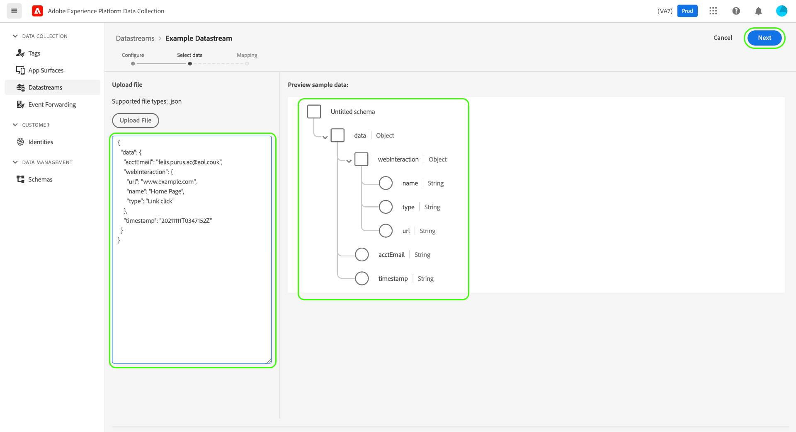

# Data Prep for Data Collection

Data Prep is an Adobe Experience Platform service that allows you to map, transform, and validate data to and from [Experience Data Model (XDM)](../xdm/home.md). When configuring a Platform-enabled [datastream](./overview.md), you can use Data Prep capabilities to map your source data to XDM when sending it to the Platform Edge Network.

All data sent from a web page must land in Experience Platform as XDM. There are 3 ways to translate data from an on-page data layer to the XDM accepted by Experience Platform:

1. Reformat the data layer into XDM on the web page itself.
2. Use the Tags native data elements functionality to reformat a web page's existing data layer format into XDM.
3. Reformat a web page's existing data layer format into XDM via the Edge Network, using Data Prep for Data Collection.

This guide focuses on the 3rd option. 

## When to use Data Prep for Data Collection {#when-to-use-data-prep}

There are two uses cases where Data Prep for Data Collection is useful:

1. The website has a well-formed, governed, and maintained data layer and there is a preference for sending it directly to the Edge Network instead of using JavaScript manipulation to convert it to XDM on the page (either via Tags data elements or via manual JavaScript manipulation).
2. A tagging system other than Tags is deployed on the site.

## Send an existing data layer to the Edge Network via WebSDK {#send-datalayer-via-websdk}

The existing data layer must be sent using the `data` option of the `sendEvent` command as described in the [Web SDK documentation](https://experienceleague.adobe.com/docs/experience-platform/edge/fundamentals/tracking-events.html#sending-non-xdm-data).

If you are using Tags, you must use the **[!UICONTROL Data]** field of the **[!UICONTROL Send Event]** action type, as described in the [Web SDK tag extension documentation](https://experienceleague.adobe.com/docs/experience-platform/tags/extensions/client/web-sdk/action-types.html).

The rest of this guide will focus on how to map the data layer to XDM standards after it has been sent by the WebSDK. 

>[!NOTE]
>
>For comprehensive guidance on all Data Prep capabilities, including transformation functions for calculated fields, refer to the following documentation:
>
>* [Data Prep overview](../data-prep/home.md)
>* [Data Prep mapping functions](../data-prep/functions.md)
>* [Handling data formats with Data Prep](../data-prep/data-handling.md)

This guide covers how to map your data within the UI. To follow along with the steps, start the process of creating a datastream up to (and including) the [basic configuration step](./overview.md#create).

For a quick demonstration of the Data Prep for Data Collection process, refer to the following video:

>[!VIDEO](https://video.tv.adobe.com/v/342120?quality=12&enable10seconds=on&speedcontrol=on)

## [!UICONTROL Select data] {#select-data}

Select **[!UICONTROL Save and Add Mapping]** after completing the basic configuration for a datastream, and the **[!UICONTROL Select data]** step appears. From here, you must provide a sample JSON object that represents the structure of the data that you plan on sending to Platform.

To capture properties directly from your data layer, the JSON object must have a single root property `data`. The subproperties of the `data` object should then be constructed in a way that maps to the data layer properties that you want to capture. Select the section below to view an example of a properly formatted JSON object with a `data` root.

+++Sample JSON file with `data` root

```json
{
  "data": {
    "eventMergeId": "cce1b53c-571f-4f36-b3c1-153d85be6602",
    "eventType": "view:load",
    "timestamp": "2021-09-30T14:50:09.604Z",
    "web": {
      "webPageDetails": {
        "siteSection": "Product section",
        "server": "example.com",
        "name": "product home",
        "URL": "https://www.example.com"
      },
      "webReferrer": {
        "URL": "https://www.adobe.com/index2.html",
        "type": "external"
      }
    },
    "commerce": {
      "purchase": 1,
      "order": {
        "orderID": "1234"
      }
    },
    "product": [
      {
        "productInfo": {
          "productID": "123"
        }
      },
      {
        "productInfo": {
          "productID": "1234"
        }
      }
    ],
    "reservation": {
      "id": "anc45123xlm",
      "name": "Embassy Suits",
      "SKU": "12345-L",
      "skuVariant": "12345-LG-R",
      "priceTotal": "112.99",
      "currencyCode": "USD",
      "adults": 2,
      "children": 3,
      "productAddMethod": "PDP",
      "_namespace": {
        "test": 1,
        "priceTotal": "112.99",
        "category": "Overnight Stay"
      },
      "freeCancellation": false,
      "cancellationFee": 20,
      "refundable": true
    }
  }
}
```

+++

To capture properties from an XDM object data element, the same rules apply to the JSON object, but the root property must be keyed as `xdm` instead. Select the section below to view an example of a properly formatted JSON object with an `xdm` root.

+++Sample JSON file with `xdm` root

```json
{
  "xdm": {
    "environment": {
      "type": "browser",
      "browserDetails": {
        "userAgent": "Mozilla/5.0 (Macintosh; Intel Mac OS X 10_7_5) AppleWebkit/537.36 (KHTML, like Gecko) Chrome/49.0.2623.112 Safari/537.36",
        "javaScriptEnabled": true,
        "javaScriptVersion": "1.8.5",
        "cookiesEnabled": true,
        "viewportHeight": 900,
        "viewportWidth": 1680,
        "javaEnabled": true
      },
      "domain": "adobe.com",
      "colorDepth": 24,
      "viewportHeight": 1050,
      "viewportWidth": 1680
    },
    "device": {
      "screenHeight": 1050,
      "screenWidth": 1680
    }
  }
}
```

+++

You can select the option to upload the object as a file, or paste the raw object into the provided textbox instead. If the JSON is valid, a preview schema is displayed in the right panel. Select **[!UICONTROL Next]** to continue.



>[!NOTE]
>
> Use a sample JSON object that represents every data layer element that may be used on any page. For example, not all pages use shopping cart data layer elements. However, the shopping cart data layer elements should be included in this sample JSON object.

## [!UICONTROL Mapping]

The **[!UICONTROL Mapping]** step appears, allowing you to map the fields in your source data to that of the target event schema in Platform. From here, you can configure the mapping in two ways:

* [Create mapping rules](#create-mapping) for this datastream through a manual process.
* [Import mapping rules](#import-mapping) from an existing datastream.

### Create mapping rules {#create-mapping}

To create a mapping rule, select **[!UICONTROL Add new mapping]**.


Select the source icon (), and in the dialog that appears select the source field that you want to map in the provided canvas. Once you have chosen a field, use the **[!UICONTROL Select]** button to continue.


Next, select the schema icon () to open a similar dialog for the target event schema. Choose the field that you want to map the data to before confirming with **[!UICONTROL Select]**.


The mapping page reappears with the completed field mapping shown. The **[!UICONTROL Mapping progress]** section updates to reflect the total number of fields that have been successfully mapped.


>[!TIP]
>
>If you want to map an array of objects (in the source field) to an array of different objects (in the target field), add `[*]` after the array name in the source and destination field paths, as shown below.
>
>

### Import existing mapping rules {#import-mapping}

If you have previously created a datastream, you can reuse its configured mapping rules for a new datastream. 

>[!WARNING]
>
>Importing mapping rules from another datastream overwrites any field mappings that you might have added before the import.

To start, select **[!UICONTROL Import Mapping]**.


In the dialog that appears, select the datastream whose mapping rules you want to import. Once the datastream is chosen, select **[!UICONTROL Preview]**.


>[!NOTE]
>
>Datastreams can only be imported within the same [sandbox](../sandboxes/home.md). In other words, you cannot import a datastream from one sandbox to another.

The next screen shows a preview of the saved mapping rules for the selected datastream. Make sure that the displayed mappings are what you expect, and then select **[!UICONTROL Import]** to confirm and add the mappings to the new datastream.


>[!NOTE]
>
>If any source fields in the imported mapping rules are not included in the sample JSON data that you [provided earlier](#select-data), those field mappings will not be included in the import.

### Complete the mapping

Continue following the above steps to map the rest of the fields to the target schema. While you do not have to map all available source fields, any fields in the target schema that are set as required must be mapped to complete this step. The **[!UICONTROL Required fields]** counter indicates how many required fields are not yet mapped in the current configuration.

Once the required field count reaches zero and you are satisfied with your mapping, select **[!UICONTROL Save]** to finalize your changes.


## Next steps

This guide covered how to map your data to XDM when setting up a datastream in the UI. If you were following general datastreams tutorial, you can now return to the step on [viewing datastream details](./overview.md).
