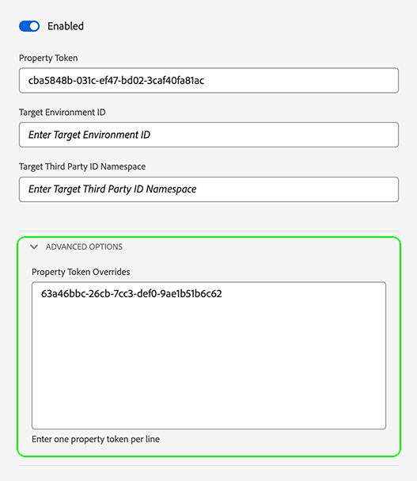
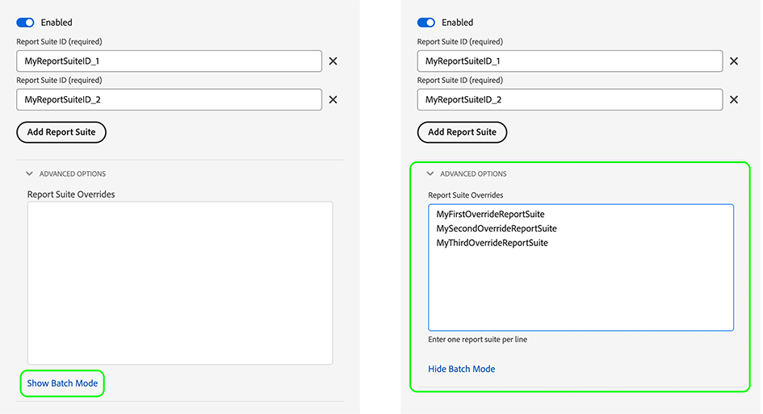

# Configure datastream overrides

Datastream overrides allow you to define additional configurations for your datastreams, which get passed to the Edge Network via the Web SDK.

This helps you trigger different datastream behaviors than the default ones, without creating a  datastream or modifying your existing settings.

Datastream configuration override is a two-step process:

1. First, you must define your datastream configuration override in the [datastream configuration page](configure.md).
2. Then, you must send the overrides to the Edge Network in one of the following ways:
    * Through the `sendEvent` or `configure` [Web SDK](#send-overrides-web-sdk) commands.
    * Through the Web SDK [tag extension](../tags/extensions/client/web-sdk/web-sdk-extension-configuration.md).
    * Through the Mobile SDK [sendEvent](#send-overrides-mobile-sdk) command.

This article explains the end-to-end datastream configuration override process for every type of supported override.

>[!IMPORTANT]
>
>Datastream overrides are only supported for [Web SDK](../web-sdk/home.md) and [Mobile SDK](https://developer.adobe.com/client-sdks/home/) integrations. [Server API](../server-api/overview.md) integrations do not currently support datastream overrides.
><br>
>Datastream overrides should be used when you need different data sent to different datastreams. Do not use datastream overrides for personalization use cases or consent data.

## Use cases {#use-cases}

To help you better understand how and when to use datastream overrides, here are some use cases that Adobe Experience Platform customers can solve by using this feature.

**Multi-region data collection**

A company has different websites or subdomains for different countries in which they operate. They have [configured](configure.md) separate datastreams with corresponding analytics-specific report suites, country-specific Adobe Target property tokens, country-specific schemas, datasets, Journey Optimizer configurations, and so on. The company also has a global set of configurations where all country-specific data is aggregated.

By using datastream overrides, the company can dynamically switch the flow of data to different datastreams, instead of the default behavior of sending data to one datastream.

A common use case could be sending data to a country-specific datastream and also to a global datastream where customers perform an important action, such as placing an order or updating their user profile.

**Differentiating profiles and identities for different business units**

A company with multiple business units wants to use multiple Experience Platforms sandboxes to store data specific to each business unit.

Instead of sending data to a default datastream, the company can use datastream overrides to make sure each business unit has its own datastream to receive data through.

## Configure datastream overrides in the Datastreams UI {#configure-overrides}

Datastream configuration overrides allow you to modify the following datastream configurations:

* Experience Platform event datasets
* Adobe Target property tokens
* Audience Manager ID sync containers
* Adobe Analytics report suites

### Datastream overrides for Adobe Target {#target-overrides}

To configure datastream overrides for an Adobe Target datastream, you must first have an Adobe Target datastream created. Follow the instructions to [configure a datastream](configure.md) with the [Adobe Target](configure.md#target) service.

Once you have created the datastream, edit the [Adobe Target](configure.md#target) service that you have added and use the **[!UICONTROL Property Token Overrides]** section to add the desired datastream overrides, as shown in the image below. Add one property token per line.



After you've added the desired overrides, save your datastream settings.

You should now have the Adobe Target datastream overrides configured. Now you can [send the overrides to the Edge Network via the Web SDK](#send-overrides).

### Datastream overrides for Adobe Analytics {#analytics-overrides}

To configure datastream overrides for an Adobe Analytics datastream, you must first have an [Adobe Analytics](configure.md#analytics) datastream created. Follow the instructions to [configure a datastream](configure.md) with the [Adobe Analytics](configure.md#analytics) service.

Once you have created the datastream, edit the [Adobe Analytics](configure.md#target) service that you have added and use the **[!UICONTROL Report Suite Overrides]** section to add the desired datastream overrides, as shown in the image below.

Select **[!UICONTROL Show Batch Mode]** to enable batch editing of the report suite overrides. You can copy and paste a list of report suite overrides, entering one report suite per line.



After you've added the desired overrides, save your datastream settings.

You should now have the Adobe Analytics datastream overrides configured. Now you can [send the overrides to the Edge Network via the Web SDK](#send-overrides).

### Datastream overrides for Experience Platform event datasets {#event-dataset-overrides}

To configure datastream overrides for Experience Platform event datasets, you must first have an [Adobe Experience Platform](configure.md#aep) datastream created. Follow the instructions to [configure a datastream](configure.md) with the [Adobe Experience Platform](configure.md#aep) service.

Once you have created the datastream, edit the [Adobe Experience Platform](configure.md#aep) service that you have added and select the **[!UICONTROL Add Event Dataset]** option to add one or more override event datasets, as shown in the image below.


After you've added the desired overrides, save your datastream settings.

You should now have the Adobe Experience Platform datastream overrides configured. Now you can [send the overrides to the Edge Network via the Web SDK](#send-overrides).

### Datastream overrides for third party ID sync containers {#container-overrides}

To configure datastream overrides for third party ID sync containers, you must first have a datastream created. Follow the instructions to [configure a datastream](configure.md) to create one.

Once you've created the datastream, go to **[!UICONTROL Advanced Options]** and enable the **[!UICONTROL Third Party ID Sync]** option.

Then, use the **[!UICONTROL Container ID Overrides]** section to add the container IDs that you want to override the default setting, as shown in the image below.

>[!IMPORTANT]
>
>Container IDs must be numeric values, like `1234567`, and not strings, such as `"1234567"`. If you send a string value through the Web SDK as a container ID override, you will receive an error.


After you've added the desired overrides, save your datastream settings.

You should now have the ID sync container overrides configured. Now you can [send the overrides to the Edge Network via the Web SDK](#send-overrides).

## Send the overrides to the Edge Network via the Web SDK {#send-overrides-web-sdk}

After configuring datastream overrides in the Data Collection UI, you can send the overrides to the Edge Network through the Web SDK or Mobile SDK.

* **Web SDK**: See [datastream configuration overrides](../web-sdk/commands/datastream-overrides.md#library) for tag extension instructions and JavaScript library code examples.
* **Mobile SDK**: See below.

### Datastream ID override via Mobile SDK {#id-override-mobile}

The examples below show what a datastream ID override could look like on a Mobile SDK integration. Select the tabs below to see the [!DNL iOS] and [!DNL Android] examples.

>[!BEGINTABS]

>[!TAB iOS (Swift)]

This example shows what a datastream ID override looks like in a Mobile SDK [!DNL iOS] integration.

```swift
// Create Experience event from dictionary
var xdmData: [String: Any] = [
  "eventType": "SampleXDMEvent",
  "sample": "data",
]
let experienceEvent = ExperienceEvent(xdm: xdmData, datastreamIdOverride: "SampleDatastreamId")

Edge.sendEvent(experienceEvent: experienceEvent) { (handles: [EdgeEventHandle]) in
  // Handle the Edge Network response
}
```

>[!TAB Android&trade; (Kotlin)]

This example shows what a datastream ID override looks like in a Mobile SDK [!DNL Android] integration.

```kotlin
// Create experience event from Map
val xdmData = mutableMapOf < String, Any > ()
xdmData["eventType"] = "SampleXDMEvent"
xdmData["sample"] = "data"

val experienceEvent = ExperienceEvent.Builder()
    .setXdmSchema(xdmData)
    .setDatastreamIdOverride("SampleDatastreamId")
    .build()

Edge.sendEvent(experienceEvent) {
    // Handle the Edge Network response
}
```

>[!ENDTABS]

### Datastream configuration override via Mobile SDK {#config-override-mobile}

The examples below show what a datastream configuration override could look like on a Mobile SDK integration. Select the tabs below to see the [!DNL iOS] and [!DNL Android] examples.

>[!BEGINTABS]

>[!TAB iOS (Swift)]

This example shows what a datastream configuration override looks like in a Mobile SDK [!DNL iOS] integration.

```swift
// Create Experience event from dictionary
var xdmData: [String: Any] = [
  "eventType": "SampleXDMEvent",
  "sample": "data",
]

let configOverrides: [String: Any] = [
  "com_adobe_experience_platform": [
    "datasets": [
      "event": [
        "datasetId": "SampleEventDatasetIdOverride"
      ]
    ]
  ],
  "com_adobe_analytics": [
  "reportSuites": [
        "MyFirstOverrideReportSuite",
          "MySecondOverrideReportSuite",
          "MyThirdOverrideReportSuite"
      ]
  ],
  "com_adobe_identity": [
    "idSyncContainerId": "1234567"
  ],
  "com_adobe_target": [
    "propertyToken": "63a46bbc-26cb-7cc3-def0-9ae1b51b6c62"
 ],
]

let experienceEvent = ExperienceEvent(xdm: xdmData, datastreamConfigOverride: configOverrides)

Edge.sendEvent(experienceEvent: experienceEvent) { (handles: [EdgeEventHandle]) in
  // Handle the Edge Network response
}
```

>[!TAB Android (Kotlin)]

This example shows what a datastream configuration override looks like in a Mobile SDK [!DNL Android] integration.

```kotlin
// Create experience event from Map
val xdmData = mutableMapOf < String, Any > ()
xdmData["eventType"] = "SampleXDMEvent"
xdmData["sample"] = "data"

val configOverrides = mapOf(
    "com_adobe_experience_platform"
    to mapOf(
        "datasets"
        to mapOf(
            "event"
            to mapOf("datasetId"
                to "SampleEventDatasetIdOverride")
        )
    ),
    "com_adobe_analytics"
    to mapOf(
        "reportSuites"
        to listOf(
            "MyFirstOverrideReportSuite",
            "MySecondOverrideReportSuite",
            "MyThirdOverrideReportSuite"
        )
    ),
    "com_adobe_identity"
    to mapOf(
        "idSyncContainerId"
        to "1234567"
    ),
    "com_adobe_target"
    to mapOf(
        "propertyToken"
        to "63a46bbc-26cb-7cc3-def0-9ae1b51b6c62"
    )
)

val experienceEvent = ExperienceEvent.Builder()
    .setXdmSchema(xdmData)
    .setDatastreamConfigOverride(configOverrides)
    .build()

Edge.sendEvent(experienceEvent) {
    // Handle the Edge Network response
}
```

>[!ENDTABS]

## Payload example {#payload-example}

The examples above generate an [!DNL Edge Network] payload similar to the one below.

```json
{
  "meta": {
    "configOverrides": {
      "com_adobe_experience_platform": {
        "datasets": {
          "event": {
            "datasetId": "SampleProfileDatasetIdOverride"
          }
        }
      },
      "com_adobe_analytics": {
        "reportSuites": [
        "MyFirstOverrideReportSuite",
        "MySecondOverrideReportSuite",
        "MyThirdOverrideReportSuite"
        ]
      },
      "com_adobe_identity": {
        "idSyncContainerId": "1234567"
      },
      "com_adobe_target": {
        "propertyToken": "63a46bbc-26cb-7cc3-def0-9ae1b51b6c62"
      }
    },
    "state": {  }
  },
  "events": [  ]
}
```
