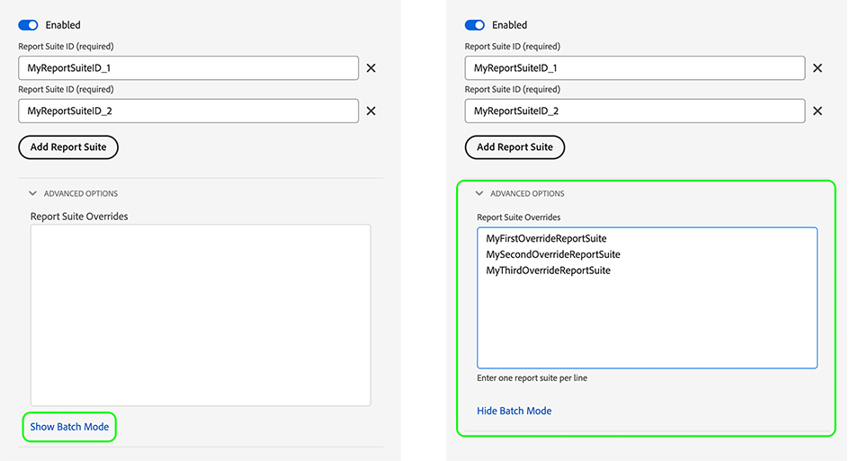
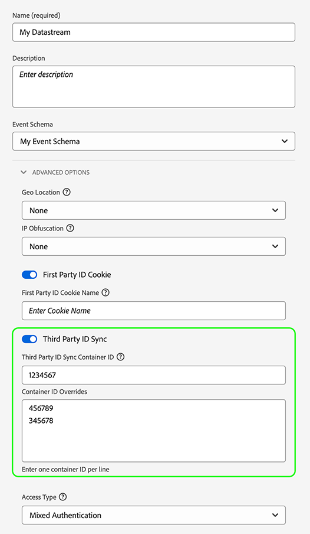

# Configure datastream overrides

Use datastream overrides to define additional configurations for your datastreams, which get passed to the [!DNL Edge Network] via the Web SDK or Mobile SDK.

Trigger different datastream behaviors without creating a new datastream or modifying your existing settings.

Datastream configuration override is a two-step process:

1. First, you must define your datastream configuration override in the [datastream configuration page](/help/datastreams/configure.md).
2. Then, you must send the overrides to the [!DNL Edge Network] in one of the following ways:
    * Through the `sendEvent` or `configure` [Web SDK](#send-overrides) commands.
    * Through the Web SDK [tag extension](/help/tags/extensions/client/web-sdk/configure/configuration-overrides.md).
    * Through the Mobile SDK [sendEvent](#send-overrides) API or by using [Rules](#send-overrides).

This article explains the end-to-end datastream configuration override process for every type of supported override.

>[!IMPORTANT]
>
>[!DNL Edge Network] API integrations do not currently support datastream overrides.
>
>Datastream overrides should be used when you need different data sent to different datastreams. Do not use datastream overrides for personalization use cases or consent data.

## Use cases {#use-cases}

The following use cases show how and when to use datastream overrides.

### Multi-region data collection {#multi-region}

A company has different websites or subdomains for different countries in which they operate. They have [configured](/help/datastreams/configure.md) separate datastreams with corresponding analytics-specific report suites, country-specific [!DNL Adobe Target] property tokens, country-specific schemas, datasets, [!DNL Journey Optimizer] configurations, and so on. The company also has a global set of configurations where all country-specific data is aggregated.

By using datastream overrides, the company can dynamically switch the flow of data to different datastreams, instead of the default behavior of sending data to one datastream.

A common use case is sending data to a country-specific datastream and also to a global datastream when customers perform an important action, such as placing an order or updating their user profile.

### Differentiating profiles and identities for different business units {#multiple-business-units}

A company with multiple business units wants to use multiple Experience Platform sandboxes to store data specific to each business unit.

Instead of sending data to a default datastream, the company can use datastream overrides to make sure each business unit has its own datastream to receive data through.

## Configure datastream overrides in the Datastreams UI {#configure-overrides}

Datastream configuration overrides let you modify the following datastream configurations:

* Experience Platform event datasets
* [!DNL Adobe Target] property tokens
* Audience Manager ID sync containers
* [!DNL Adobe Analytics] report suites

### Datastream overrides for Adobe Target {#target-overrides}

To configure datastream overrides for an [!DNL Adobe Target] datastream, you must first have an [!DNL Adobe Target] datastream created. Follow the instructions to [configure a datastream](/help/datastreams/configure.md) with the [Adobe Target](/help/datastreams/configure.md#target) service.

After creating the datastream, edit the [Adobe Target](/help/datastreams/configure.md#target) service you added and use the **[!UICONTROL Property Token Overrides]** section to add the desired datastream overrides. Add one property token per line.


After adding the desired overrides, save your datastream settings.

The [!DNL Adobe Target] datastream overrides are now configured. You can now [send the overrides to the [!DNL Edge Network] via the Web SDK or Mobile SDK](#send-overrides).

### Datastream overrides for Adobe Analytics {#analytics-overrides}

To configure datastream overrides for an [!DNL Adobe Analytics] datastream, you must first have an [Adobe Analytics](/help/datastreams/configure.md#analytics) datastream created. Follow the instructions to [configure a datastream](/help/datastreams/configure.md) with the [Adobe Analytics](/help/datastreams/configure.md#analytics) service.

After creating the datastream, edit the [Adobe Analytics](/help/datastreams/configure.md#analytics) service you added and use the **[!UICONTROL Report Suite Overrides]** section to add the desired datastream overrides.

Select **[!UICONTROL Show Batch Mode]** to enable batch editing of the report suite overrides. You can copy and paste a list of report suite overrides, entering one report suite per line.



After adding the desired overrides, save your datastream settings.

The [!DNL Adobe Analytics] datastream overrides are now configured. You can now [send the overrides to the [!DNL Edge Network] via the Web SDK or Mobile SDK](#send-overrides).

### Datastream overrides for Experience Platform event datasets {#event-dataset-overrides}

To configure datastream overrides for Experience Platform event datasets, you must first have an [Adobe Experience Platform](/help/datastreams/configure.md#aep) datastream created. Follow the instructions to [configure a datastream](/help/datastreams/configure.md) with the [Adobe Experience Platform](/help/datastreams/configure.md#aep) service.

After creating the datastream, edit the [Adobe Experience Platform](/help/datastreams/configure.md#aep) service you added and select the **[!UICONTROL Add Event Dataset]** option to add one or more override event datasets.


After adding the desired overrides, save your datastream settings.

The [!DNL Adobe Experience Platform] datastream overrides are now configured. You can now [send the overrides to the [!DNL Edge Network] via the Web SDK or Mobile SDK](#send-overrides).

### Datastream overrides for third party ID sync containers {#container-overrides}

To configure datastream overrides for third party ID sync containers, you must first have a datastream created. Follow the instructions to [configure a datastream](/help/datastreams/configure.md) to create one.

After creating the datastream, go to **[!UICONTROL Advanced Options]** and enable the **[!UICONTROL Third Party ID Sync]** option.

Then, use the **[!UICONTROL Container ID Overrides]** section to add the container IDs that you want to override the default setting.

>[!IMPORTANT]
>
>Container IDs must be numeric values, like `1234567`, and not strings, such as `"1234567"`. If you send a string value through the Web SDK as a container ID override, you will receive an error.



After adding the desired overrides, save your datastream settings.

The ID sync container overrides are now configured. You can now [send the overrides to the [!DNL Edge Network] via the Web SDK or Mobile SDK](#send-overrides).

## Send the overrides to the Edge Network {#send-overrides}

After configuring datastream overrides in the Data Collection UI, you can send the overrides to the [!DNL Edge Network] through the Web SDK or Mobile SDK.

* **Web SDK**: See [datastream configuration overrides](/help/collection/js/commands/configure/edgeconfigoverrides.md) for JavaScript library code examples.
* **Mobile SDK**: You can send datastream ID overrides either using the [sendEvent API](https://developer.adobe.com/client-sdks/edge/edge-network/tutorials/send-overrides-sendevent/) or by using [Rules](https://developer.adobe.com/client-sdks/edge/edge-network/tutorials/send-overrides-rules/).

## Payload example {#payload-example}

The preceding examples generate an [!DNL Edge Network] payload similar to the one below.

```json
{
  "meta": {
    "configOverrides": {
      "com_adobe_experience_platform": {
        "datasets": {
          "event": {
            "datasetId": "SampleProfileDatasetIdOverride"
          }
        }
      },
      "com_adobe_analytics": {
        "reportSuites": [
        "MyFirstOverrideReportSuite",
        "MySecondOverrideReportSuite",
        "MyThirdOverrideReportSuite"
        ]
      },
      "com_adobe_identity": {
        "idSyncContainerId": "1234567"
      },
      "com_adobe_target": {
        "propertyToken": "63a46bbc-26cb-7cc3-def0-9ae1b51b6c62"
      }
    },
    "state": {  }
  },
  "events": [  ]
}
```
