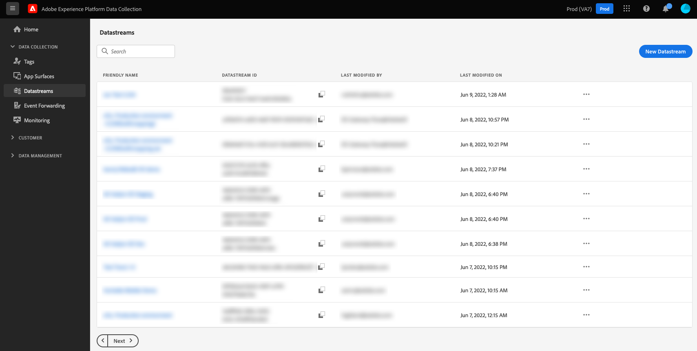

# Datastreams overview

A datastream represents the server-side configuration for the [!DNL Adobe Experience Platform] Web and Mobile SDKs. While the [`configure`](/help/collection/js/commands/configure/overview.md) command in the SDK handles client-side settings (such as the `edgeDomain`), datastreams manage all other configurations.

When you send a request to the [!DNL Edge Network], the `datastreamId` references the datastream where the data is sent. You can update the server-side configuration without changing your website's code.

You can create and manage datastreams by selecting **[!UICONTROL Datastreams]** in the left navigation within the [!DNL Adobe Experience Platform] UI or Data Collection UI.

For more information on how to configure a datastream in the UI, see the [configuration guide](/help/datastreams/configure.md).

## Handling sensitive data in datastreams {#sensitive}

>[!IMPORTANT]
>
>The content of this document is not legal advice and is not meant to substitute for legal advice. Consult with your company's legal department for advice concerning the handling of sensitive data. 

Corporate data stewardship policies and regulatory requirements are increasing restrictions on how sensitive customer data can be collected, processed, and used. This includes the collection, processing, and usage of Protected Health Data (PHI) which is subject to regulations like the Health Insurance Portability and Accountability Act (HIPAA).

Datastreams provide three methods to help you securely handle your sensitive data:

* [Enhanced encryption](#encryption)
* [Data governance](#governance)
* [Audit logs](#audit-logs)

### Enhanced encryption {#encryption}

All data in transit through the [!DNL Edge Network] is conducted over secure, encrypted connections using [HTTPS TLS 1.2](https://datatracker.ietf.org/doc/html/rfc5246). If the datastream is bringing data into Experience Platform, the data is then encrypted at rest in the Experience Platform data lake. See the document on [data encryption in Experience Platform](/help/landing/governance-privacy-security/encryption.md) for more information.

### Data governance {#governance}

Datastreams use the Experience Platform built-in data governance capabilities to prevent sensitive data from being sent to non-HIPAA-ready services. By labeling specific fields that contain sensitive data in your datastream schemas, you can take granular control over which data fields can be used for specific purposes.

The following video provides a brief overview of how data usage restrictions are configured and enforced for datastreams in the UI:

>[!VIDEO](https://video.tv.adobe.com/v/3409588/?quality=12&learn=on&speedcontrol=on)

In Experience Platform, you can apply [sensitive data usage labels](/help/data-governance/labels/reference.md#sensitive) to schemas and fields containing data that your organization deems sensitive. For example, the `RHD` label is used to denote Protected Health Information (PHI), and the `S1` label represents geolocation data.

>[!NOTE]
>
>For details on how to apply data usage labels within the [!UICONTROL Schemas] tab in the Experience Platform UI or Data Collection UI, see the [schema labeling tutorial](/help/xdm/tutorials/labels.md).

When you create a datastream, if the selected schema contains sensitive data usage labels, you can only configure the datastream to send that data to HIPAA-ready destinations. Currently, the only HIPAA-ready destination supported by datastreams is [!DNL Adobe Experience Platform]. Other destination services including [!DNL Adobe Target], [!DNL Adobe Analytics], [!DNL Adobe Audience Manager], event forwarding, and edge destinations are disabled for datastreams containing sensitive data usage labels.

If a schema is being used in an existing datastream with non-HIPAA-ready services, attempting to add a sensitive data usage label to the schema results in a policy violation message and the action is prevented. The message specifies which datastream triggered the violation and suggests removing any non-HIPAA-ready services from the datastream to resolve the issue.

### Audit logs {#audit-logs}

In Experience Platform, datastream activities can be monitored in the form of audit logs. Audit logs indicate **who** performed **what** action, and **when**, along with other contextual data that can help you troubleshoot issues related to datastreams to help your business comply with corporate data stewardship policies and regulatory requirements.

Whenever a user creates, updates, or deletes a datastream, an audit log is created to record the action. The same occurs whenever a user creates, updates, or deletes a mapping through [Data Prep for Data Collection](/help/datastreams/data-prep.md). Regardless of whether it was a datastream or a mapping that was updated, the resulting audit log is categorized under the [!UICONTROL Datastreams] resource type.

See the documentation on [audit logs](/help/landing/governance-privacy-security/audit-logs/overview.md) for more information on how to interpret logs from datastreams and other supported services.

## Next steps {#next-steps}

This guide provided a high-level overview of datastreams and their use in Data Collection and the processing of sensitive data. For steps on how to set up a new datastream, see the [datastream configuration guide](/help/datastreams/configure.md).
