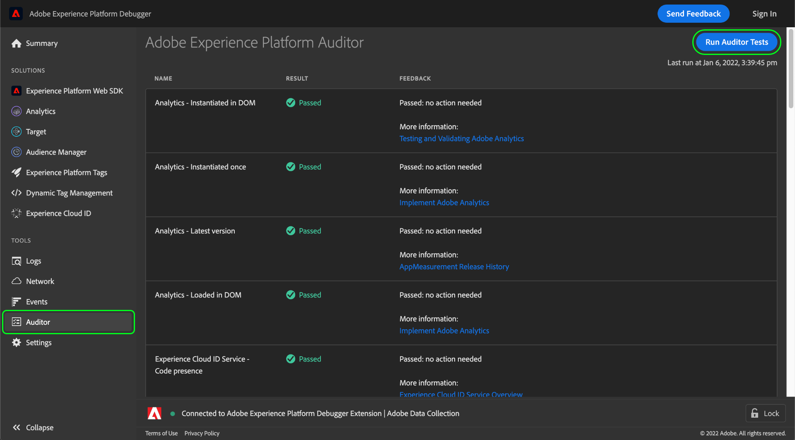

# Auditor tab

In Adobe Experience Platform Debugger, you can use the **[!UICONTROL Auditor]** tab to run a series of audit tests on your page.

To use this feature:

1. Select **[!UICONTROL Auditor]** in the left navigation.
1. Select **[!UICONTROL Run Auditor Tests]**. Once the tests are complete, their results appear below.

The results list shows the test and its result, and provides suggestions to resolve any issues.

## Interpreting test results

Each test is weighted, and your test score is equal to the assigned weight. If you pass a test with a weight of 5, you receive five points.

| Score | Description |
| --- | --- |
| 0 | Alerts you of issues you should be aware of, but don't affect your score. |
| 1 | Recommends an optimization. No impact on data accuracy. |
| 2 | Failing this test means you won't have access to the latest features and fixes in Adobe Experience Cloud. |
| 3 | Tests for efficiency and whether the implementation follows best practices. |
| 4 | Failure means you may be collecting unreliable data. |
| 5 | Failure means you may see data loss. |

All tests either pass or fail. They test for compliance or non-compliance with the test conditions, so there are no partial scores for partial compliance. For example, if the test checks for the latest version of an Adobe solution and you're only one version behind, you get the same score as if you're five versions back. The most recent versions include performance improvements and bug fixes, so it is recommended to be on the most recent version.

It is **highly recommended** that you fix any level 4 or 5 results.

It is **recommended** that you fix any level 1 to 3 results.

## Supported Adobe technologies

The auditor feature is able to grade the following Adobe technologies:

* Adobe Advertising Cloud DSP 
* Adobe Advertising Cloud Search 
* Adobe Analytics 
* Adobe Experience Cloud Identity Service
* Adobe Target
* Tags (formerly Adobe Experience Platform Launch)

## Test rubrics

For more information on the test rubrics provided by this feature, refer to the following documents:

* [Tag consistency](./tag-consistency.md)
* [Tag presence](./tag-presence.md)
* [Configuration](./configuration.md)
* [Alerts](./alerts.md)
