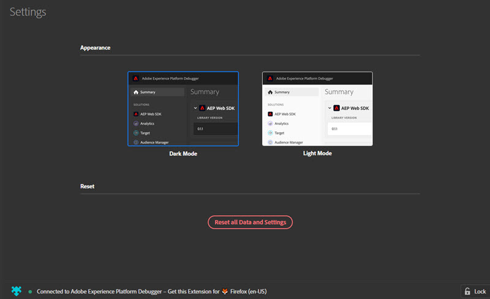
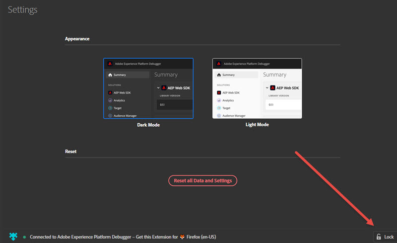

# Configure Platform Debugger

You can configure certain aspects of how Adobe Experience Platform Debugger looks and works.

## Light or dark mode

After Platform Debugger opens, you can select your preferred appearance by going to **[!UICONTROL Settings]** and selecting either **Dark Mode** (default) or **Light Mode**.

## Reset

Select **[!UICONTROL Reset all Data and Settings]** to return to clear all data and return to the default settings.

## Lock Experience Platform Debugger on one page

As you change pages on your site, the Experience Platform Debugger window updates to show info for that page. The name of the page you're connected to shows at the bottom of the screen. To keep Experience Platform Debugger locked on one page, select **[!UICONTROL Lock]** in the bottom right corner of the Platform Debugger window.

This is useful if you're reading documentation or viewing information on another page while debugging your page.
