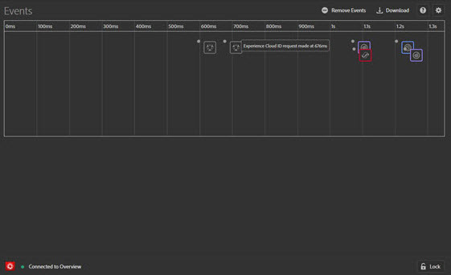
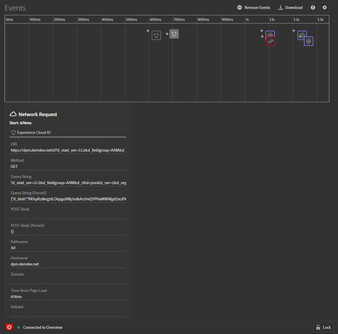
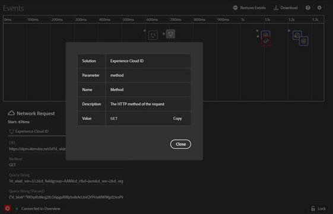
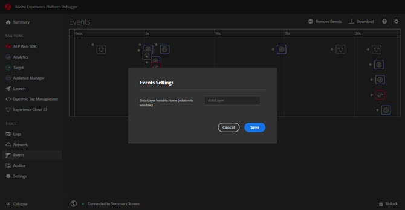

# Events tab

The **Events** tab provides a graphical view of the events that occur, displayed on a timeline.

For each event, an icon for the applicable solution appears on the timeline. Icons also show changes to the data layer (if enabled). Hover over an icon for a summary of the event. Select on the event for more details. You can Shift-Select or Control-Select to view multiple events.

Select on a detail for more information.

## Track data layer changes

To enable tracking data layer changes in the timeline: 

1. Select the Gear icon at the top right.
1. Enter the name of your data layer.

    

1. Select **[!UICONTROL Save]**.

The data layer change details show anything that has been deleted or added. You can select **{}** to look deeper into the data layer.

## Download event information

Select **[!UICONTROL Download]** to download an Excel file showing information about your page calls.
