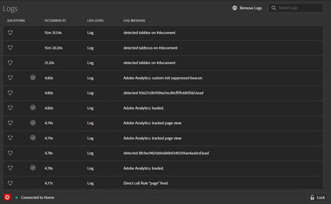

# Logs tab

The **Logs** tab provides information specific to tags and Adobe Experience Platform Web SDK implementations. You can filter by solutions implemented via their associated tools. 

The Logs tab shows information in four columns:

**[!UICONTROL Solutions]:** Displays icons for the Experience Cloud solution affected by the logged item. Hover over the icon for a text description.

**[!UICONTROL Occurred at]:** Shows when the logged issue occured during the session.

**[!UICONTROL Log level]:** Shows the issue severity. The severity is one of the following levels: 

* Log
* Info
* Warnings
* Errors

**[!UICONTROL Log message]:** Describes the issue.

Some log messages include a Show Code option. Select **[!UICONTROL Show Code]** to view the conditional code that determines whether a rule should fire. 

To clear the log, select **[!UICONTROL Remove Logs]**.
