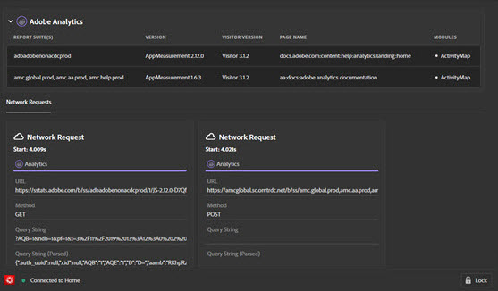

# Solutions

Adobe Experience Platform Debugger provides a list of **Solutions** in the left navigation. Select a solution to see the results for specific Adobe Experience Cloud technologies.

## Adobe Experience Platform Web SDK {#aep}

The Adobe Experience Platform Web SDK screen shows information about the Adobe Experience Platform Web SDK. Select **[!UICONTROL Configure]** to toggle console logging on or off.

## Analytics {#section-f71dfcc22bb44c86bec328491606a482}

The Analytics screen provides information about your [Analytics](https://experienceleague.adobe.com/docs/analytics.html) implementation.

## Target {#section-988873ba5ede4317953193bd7ac5474c}

Use the Target screen to view [Target](https://experienceleague.adobe.com/docs/target/using/target-home.html) requests or [mboxTrace](https://experienceleague.adobe.com/docs/target/using/activities/troubleshoot-activities/content-trouble.html#section_256FCF7C14BB435BA2C68049EF0BA99E) response details.

See the guide on [using Debugger for Target implementations](./target.md) for more information.

## Audience Manager {#section-1d4484f8b46f457f859ba88039a9a585}

Use the [Audience Manager](https://experienceleague.adobe.com/docs/audience-manager/user-guide/aam-home.html) tab to view details of [events](https://experienceleague.adobe.com/docs/audience-manager/user-guide/api-and-sdk-code/dcs/dcs-event-calls/dcs-event-calls.html). Select the organization to expand it and show the information.

## Adobe Experience Platform Tags {#section-ee80a9c509f2462c89c1e5bd8d05d7c8}

Use the Adobe Experience Platform Tags section to view tag requests. You can also select **[!UICONTROL Configuration]** to configure [embed codes](../../tags/ui/publishing/environments.md#embed-code). You can edit, replace, or add more embed codes from within Experience Platform Debugger . If you sign in, you can select an alternate property using the dropdowns.

## Experience Cloud ID Service {#section-a96c32f8e63a4991abb296f6e8ea01cf}

Use the Experience Cloud ID Service tab to view [Experience Cloud ID Service](https://experienceleague.adobe.com/docs/id-service/using/home.html) requests.
