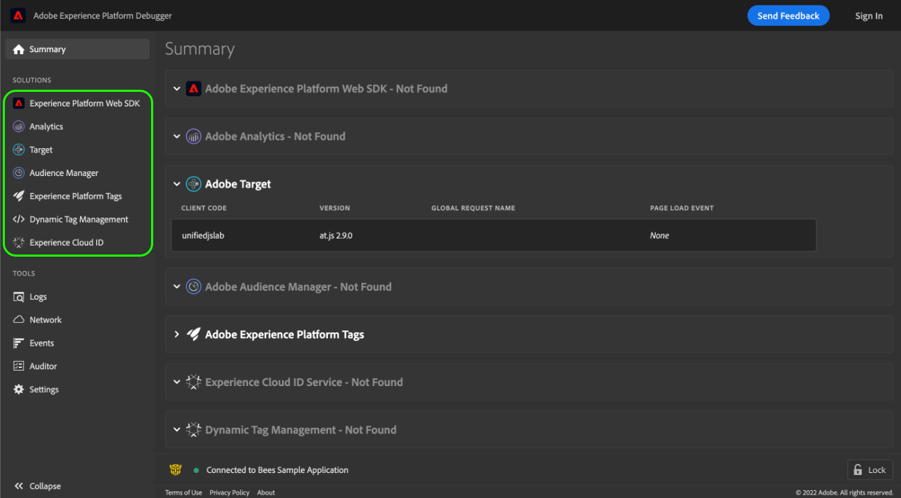

# Solutions

Adobe Experience Platform Debugger provides a list of **Solutions** in the left navigation. Select a solution to see the results for specific Adobe Experience Cloud technologies.

## Adobe Experience Platform Web SDK {#aep}

The Adobe Experience Platform Web SDK screen shows information about the Adobe Experience Platform Web SDK. Select **[!UICONTROL Configure]** to toggle console logging on or off.

## [!UICONTROL Analytics] {#section-f71dfcc22bb44c86bec328491606a482}

The [!UICONTROL Analytics] tab provides information about your [Adobe Analytics implementation](https://experienceleague.adobe.com/docs/analytics/implementation/home.html).

## [!UICONTROL Target] {#section-988873ba5ede4317953193bd7ac5474c}

Use the [!UICONTROL Target] screen to view [Adobe Target](https://experienceleague.adobe.com/docs/target/using/target-home.html) requests or [mboxTrace](https://experienceleague.adobe.com/docs/target/using/activities/troubleshoot-activities/content-trouble.html#section_256FCF7C14BB435BA2C68049EF0BA99E) response details.

See the guide on [using Debugger for Target implementations](./target.md) for more information.

## [!UICONTROL Audience Manager] {#section-1d4484f8b46f457f859ba88039a9a585}

Use the [[!UICONTROL Audience Manager]](https://experienceleague.adobe.com/docs/audience-manager/user-guide/aam-home.html) tab to view details of [events](https://experienceleague.adobe.com/docs/audience-manager/user-guide/api-and-sdk-code/dcs/dcs-event-calls/dcs-event-calls.html) in Adobe Audience Manager. Select the organization to expand it and show the information.

## [!UICONTROL Adobe Experience Platform Tags] {#section-ee80a9c509f2462c89c1e5bd8d05d7c8}

Use the [!UICONTROL Adobe Experience Platform Tags] section to view tag requests. You can also select **[!UICONTROL Configuration]** to configure [embed codes](../../tags/ui/publishing/environments.md#embed-code). You can edit, replace, or add more embed codes from within Experience Platform Debugger . If you sign in, you can select an alternate property using the dropdowns.

## [!UICONTROL Experience Cloud ID] {#section-a96c32f8e63a4991abb296f6e8ea01cf}

Use the [!UICONTROL Experience Cloud ID] tab to view [Experience Cloud ID Service](https://experienceleague.adobe.com/docs/id-service/using/home.html) requests.

## [!UICONTROL Dynamic Tag Management]

If you have previously implemented the old version of tags in Experience Platform (referred to as [!DNL Dynamic Tag Management (DTM)]), you can use this tab to configure your embed codes and view network request details.
