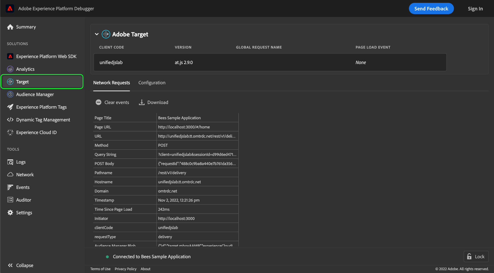
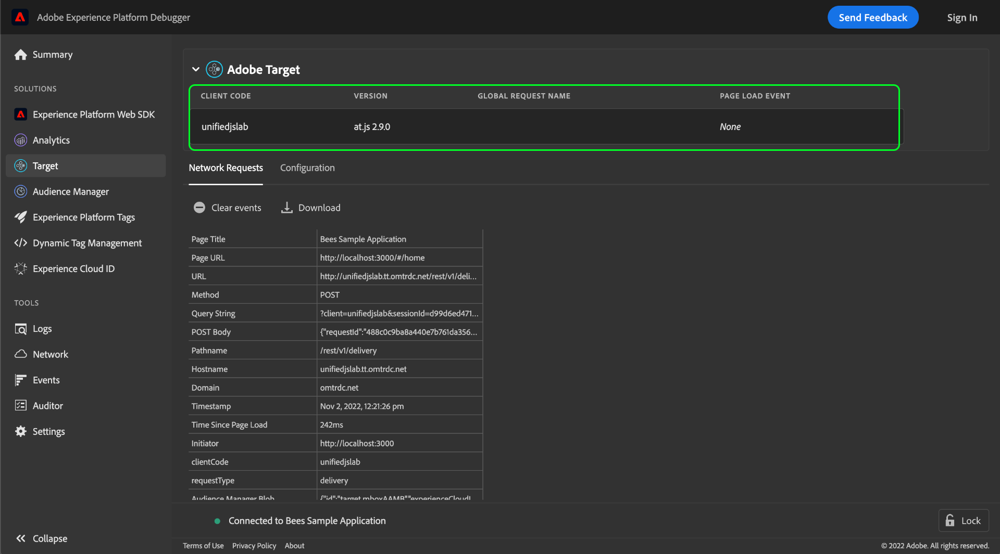

# Test an Adobe Target implementation with Adobe Experience Platform Debugger

Adobe Experience Platform Debugger provides a suite of useful tools for testing and debugging a website that has been tooled with an Adobe Target implementation. This guide covers some common workflows and best practices for using Platform Debugger on a Target-enabled website.

## Prerequisites

To use Platform Debugger for Target, the website must be using the [at.js library](https://developer.adobe.com/target/implement/client-side/atjs/how-atjs-works/) version 1.x or higher. Previous versions are not supported.

## Initializing Platform Debugger

Open the website you want to test in a browser, and then open the Platform Debugger extension.

Select **[!DNL Target]** in the left navigation. If Platform Debugger detects that a compatible version of at.js is running on the site, Adobe Target implementation details are shown.

## Global configuration information

Information about the implementation's global configuration is displayed at the top of the Target view in Platform Debugger.

| Name | Description |
| --- | --- |
| Client Code | A unique ID that identifies your organization.|
| Version | The version of the Adobe Target library currently installed on the website.|
| Global Request Name | The name of the [global mbox](https://developer.adobe.com/target/implement/client-side/atjs/global-mbox/global-mbox-overview/?) for the Target implementation, the default name being `target-global-mbox`. |
| Page Load Event | A boolean value indicating whether a [page load event](https://developer.adobe.com/target/implement/client-side/atjs/how-atjs-works/how-atjs-works/#atjs-2x-diagrams) has taken place. Page load events are only supported for at.js 2.x. For non-compatible versions, this value defaults to `None`.|

{style="table-layout:auto"}

## [!DNL Network Requests] {#network}

Select **[!DNL Network Requests]** to view summary information on each network request made on the page.

![The [!DNL Network Requests] section for Target selected within Platform Debugger](../images/solutions/target/network-requests.png)

As you perform actions on the page (including reloading the page), new columns are automatically added to the table, allowing you to view the sequence of actions and how values are altered between each request.

![The [!DNL Network Requests] section for Target selected within Platform Debugger](../images/solutions/target/new-request.png)

The following values are captured:

| Name | Description |
| --- | --- |
| [!DNL Page Title] | The title of the page that initiated this request. |
| [!DNL Page URL] | The URL of the page that initiated the request. |
| [!DNL URL] | The raw URL of the request. |
| [!DNL Method] | The HTTP method for the request. |
| [!DNL Query String] | The query string of the request, taken from the URL. |
| [!DNL POST Body] | The body of the request (only set for POST requests). |
| [!DNL Pathname] | The pathname of the request URL. |
| [!DNL Hostname] | The hostname of the request URL. |
| [!DNL Domain] | The domain of the request URL. |
| [!DNL Timestamp] | A timestamp of when the request (or event) took place, within the browser's timezone. |
| [!DNL Time Since Page Load] | The elapsed time since the page initially loaded at the time of the request. |
| [!DNL Initiator] | The initiator of the request. In other words, who made the request? |
| [!DNL clientCode] | The identifier for your organization's account as recognized by Target.  |
| [!DNL requestType] | The API that was used for the request. If using at.js 1.x, the value is `/json`. If using at.js 2.x, the value is `delivery`. |
| [!DNL Audience Manager Blob] | Provides information on encrypted Audience Manager metadata referred to as the "blob". |
| [!DNL Audience Location Hint] | The data collection region ID. This is a numeric identifier for the geographic location of a particular ID service data center. For more information, see the Audience Manager documentation on [DCS Region IDs, Locations, and Host Names](https://experienceleague.adobe.com/docs/audience-manager/user-guide/api-and-sdk-code/dcs/dcs-api-reference/dcs-regions.html) and the Experience Cloud Identity Service guide on [`getLocationHint`](https://experienceleague.adobe.com/docs/id-service/using/id-service-api/methods/getlocationhint.html?lang=en#reference-a761030ff06c4439946bb56febf42d4c). |
| [!DNL Browser Height] | The browser height in pixels. |
| [!DNL Browser Time Offset] | The browser's time offset associated with its timezone. |
| [!DNL Browser Width] | The browser width in pixels. |
| [!DNL Color Depth] | The color depth of the screen. |
| [!DNL context] | An object that contains contextual information about the browser used to make the request, including screen dimensions and client platform. |
| [!DNL prefetch] | The parameters that are used in during `prefetch` processing. |
| [!DNL execute] | The parameters that are used during `execute` processing. |
| [!DNL Experience Cloud Visitor ID] | If one is detected, provides information on the [Experience Cloud ID (ECID)](https://experienceleague.adobe.com/docs/id-service/using/intro/overview.html) that is assigned to the current site visitor. |
| [!DNL experienceCloud] | Holds the Experience Cloud IDs for this specific user session: an A4T [supplemental data ID](https://experienceleague.adobe.com/docs/target/using/integrate/a4t/before-implement.html?#section_2C1F745A2B7D41FE9E30915539226E3A), and a [visitor ID (ECID)](https://experienceleague.adobe.com/docs/id-service/using/intro/overview.html). |
| [!DNL id] | The [Target ID](https://developers.adobetarget.com/api/delivery-api/#section/Identifying-Visitors/Target-ID) for the visitor. |
| [!DNL Mbox Host] | The [host](https://experienceleague.adobe.com/docs/target/using/administer/hosts.html) that the Target request was made to. |
| [!DNL Mbox PC] | A string that encapsulates the [`mbox`](https://developer.adobe.com/target/implement/client-side/atjs/global-mbox/global-mbox-overview/) session ID and the [Adobe Target Edge](https://experienceleague.adobe.com/docs/target/using/introduction/how-target-works.html#concept_0AE2ED8E9DE64288A8B30FCBF1040934) location hint. This value is used by at.js to ensure that the session and Edge location remain sticky.  |
| [!DNL Mbox Referrer] | The URL referrer for the specific [`mbox`](https://developer.adobe.com/target/implement/client-side/atjs/global-mbox/global-mbox-overview/) request. |
| [!DNL Mbox URL] | The URL for the [`mbox`](https://developer.adobe.com/target/implement/client-side/atjs/global-mbox/global-mbox-overview/) server. |
| [!DNL Mbox Version] | The version of [`mbox`](https://developer.adobe.com/target/implement/client-side/atjs/global-mbox/global-mbox-overview/) being used. |
| [!DNL mbox3rdPartyId] | The [`mbox3rdPartyId`](https://experienceleague.adobe.com/docs/target/using/audiences/visitor-profiles/3rd-party-id.html) assigned to the current visitor. |
| [!DNL mboxRid] | The [`mbox`](https://developer.adobe.com/target/implement/client-side/atjs/global-mbox/global-mbox-overview/) request ID. |
| [!DNL requestId] | A unique ID for the request. |
| [!DNL Screen Height] | The height of the screen in pixels. |
| [!DNL Screen Width] | The width of the screen in pixels. |
| [!DNL Supplemental Data ID] | A system-generated ID used to match visitors with corresponding Adobe Target and Adobe Analytics calls. See the [A4T troubleshooting guide](https://experienceleague.adobe.com/docs/target/using/integrate/a4t/troubleshoot-a4t/a4t-troubleshooting.html?#section_75002584FA63456D8D9086172925DD8D) for more information. |
| [!DNL vst] | The [Experience Cloud Identity Service API configuration](https://experienceleague.adobe.com/docs/id-service/using/id-service-api/configurations/function-vars.html). |
| [!DNL webGLRenderer] | Provides information on the WebGL renderer used on the page, if applicable. |

{style="table-layout:auto"}

To view the details for a parameter on a particular network event, select the table cell in question. A popover appears providing further information on the parameter, including a description and its value. If the value is a JSON object, the dialog includes a fully navigable view of the object's structure.

![The [!DNL Network Requests] section for Target selected within Platform Debugger](../images/solutions/target/request-param-details.png)

## [!DNL Configuration]

Select **[!DNL Configuration]** to enable or disable a selection of additional debugging tools for Target.

![The [!DNL Configuration Requests] section for Target selected within Platform Debugger](../images/solutions/target/configuration.png)

| Debugging tool | Description |
| --- | --- |
| [!DNL Target Console Logging] | When enabled, allows you access at.js logs in the browser's console tab. This feature can also be enabled by adding an `mboxDebug` query param (with any value) to the browser URL. |
| [!DNL Target Diable] | When enabled, all Target functionalities are disabled on the page. This can be used to determine if a Target-specific offer is what is causing the issue on the page. |
| [!DNL Target Trace] | **Note**: You must be logged in to enable this feature.  When enabled, tracking tokens are sent with every quest, and a trace object is returned in each response. `at.js` parses the response `window.__targetTraces`. Each trace object contains the same information as the [[!DNL Network Requests] tab], with the following additions:<ul><li>A profile snapshot, allowing you to see attributes before and after requests.</li><li>Matched and unmatched [activities](https://experienceleague.adobe.com/docs/target/using/activities/target-activities-guide.html), showing why the current profile did or did not qualify for specific activities.<ul><li>This can help identify which audiences a profile is qualifying for at a given point, and why.</li><li>Target docs contain more info on different activity types</li></ul></li></ul> |

{style="table-layout:auto"}
