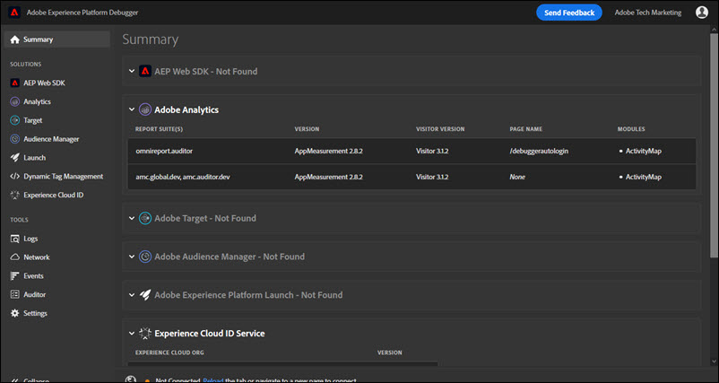

# Summary tab

To run Adobe Experience Platform Debugger, open the page you want to examine in the browser, then select the icon () on your browser bar. The extension opens on the **Summary** tab.

This screen shows information about each Adobe Experience Cloud solution. The information shown varies by solution, but typically includes information including the solution library and version (for example, "AppMeasurement v2.9") and account identifiers (such as the Analytics report suite ID, the Target client code, the Audience Manager partner ID, and so on)

## Information shown in Experience Platform Debugger  

Experience Platform Debugger shows the following information for each solution:

**Adobe Analytics**

<table id="table_BEB9CC58E59D4D86BC895A8A51D84A2C"> 
 <tbody> 
  <tr> 
   <td colname="col1"> 
Report Suite(s) 
 </td> 
   <td colname="col2"> 
A <a href="https://experiencecloud.adobe.com/resources/help/en_US/reference/report_suites_admin.html" format="html" scope="external"> report suite</a> defines the complete, independent reporting on a chosen website, set of websites, or subset of web pages 
 </td> 
  </tr> 
  <tr> 
   <td colname="col1"> 
Version 
 </td> 
   <td colname="col2"> 
The <a href="https://experienceleague.adobe.com/docs/analytics/implementation/js/overview.html" format="html" scope="external"> AppMeasurement</a> version defined for the page 
 </td> 
  </tr> 
  <tr> 
   <td colname="col1"> 
Visitor Version 
 </td> 
   <td colname="col2"> 
The version of the <a href="https://experienceleague.adobe.com/docs/analytics/import/data-sources/data-types-and-categories/datasrc-visitorid.html" format="html" scope="external"> visitor ID</a> library. 
 </td> 
  </tr> 
  <tr> 
   <td colname="col1"> 
Page Name 
 </td> 
   <td colname="col2"> 
The <a href="https://experiencecloud.adobe.com/resources/help/en_US/sc/implement/pageName.html" format="html" scope="external"> pageName</a> variable sent to Analytics that contains a user friendly name of the site. 
 </td> 
  </tr> 
  <tr> 
   <td colname="col1"> 
Modules 
 </td> 
   <td colname="col2"> 
The modules loaded by Adobe Analytics 
 </td> 
  </tr> 
 </tbody> 
</table>

**Audience Manager**

<table id="table_784AEABADBDA4D14BB9A7A9CB9EF07C3"> 
 <tbody> 
  <tr> 
   <td colname="col1"> 
Partner 
 </td> 
   <td colname="col2"> 
The <a href="https://experiencecloud.adobe.com/resources/help/en_US/aam/r_dil_get_partner.html" format="html" scope="external"> partner name</a> for the DIL instance 
 </td> 
  </tr> 
  <tr> 
   <td colname="col1"> 
Version 
 </td> 
   <td colname="col2"> 
The<a href="https://experiencecloud.adobe.com/resources/help/en_US/aam/r_api_return_versions_dil.html" format="html" scope="external"> version number</a> for the DIL instance 
 </td> 
  </tr> 
  <tr> 
   <td colname="col1"> 
UUID 
 </td> 
   <td colname="col2"> 
The <a href="https://experiencecloud.adobe.com/resources/help/en_US/aam/ids-in-aam.html" format="html" scope="external"> Unique User ID</a> associated with the DIL instance 
 </td> 
  </tr> 
 </tbody> 
</table>

**Adobe Experience Platform Tags**

<table id="table_E9574975444A407887E26514D1BB1601"> 
 <tbody> 
  <tr> 
   <td colname="col1"> 
Name 
 </td> 
   <td colname="col2"> 
The name of the tag <a href="https://experienceleague.adobe.com/docs/experience-platform/tags/admin/companies-and-properties.html" format="https" scope="external"> property</a> 
 </td> 
  </tr> 
  <tr> 
   <td colname="col1"> 
Version 
 </td> 
   <td colname="col2"> 
The version of Turbine</a> 
 </td> 
  </tr> 
  <tr> 
   <td colname="col1"> 
Build Date 
 </td> 
   <td colname="col2"> 
The tag <a href="https://experienceleague.adobe.com/docs/experience-platform/tags/publish/libraries.html" format="https" scope="external"> library</a> build date 
 </td> 
  </tr> 
  <tr> 
   <td colname="col1"> 
Environment 
 </td> 
   <td colname="col2"> 
The <a href="https://experienceleague.adobe.com/docs/experience-platform/tags/publish/environments/environments.html" format="https" scope="external"> environment</a> used by the tag library 
 </td> 
  </tr> 
  <tr> 
   <td colname="col1"> 
Extensions 
 </td> 
   <td colname="col2"> 
The extensions used on the page 
 </td> 
  </tr> 
 </tbody> 
</table>

**Adobe Experience Platform Web SDK**

<table id="table_DC76D63FA6EF4891906B9E1D3E4A8A6C"> 
 <tbody> 
  <tr> 
   <td colname="col1"> 
Library Version 
 </td> 
   <td colname="col2"> 
The number of the Adobe Experience Platform Web SDK <a href="https://experienceleague.adobe.com/docs/experience-platform/web-sdk/extension/web-sdk-ext-release-notes.html" format="html" scope="external">library version</a> 
 </td> 
  </tr> 
  <tr> 
   <td colname="col1"> 
Namespace
 </td> 
   <td colname="col2"> 
The name identified in the extension
 </td> 
  </tr> 
  <tr> 
   <td colname="col1"> 
Property ID 
 </td> 
   <td colname="col2"> 
The name of the tag property specified in the extension 
 </td> 
  </tr> 
  <tr> 
   <td colname="col1"> 
Edge Domain 
 </td> 
   <td colname="col2"> 
The domain that the Adobe Experience Platform extension sends and receives data from 
 </td> 
  </tr> 
  <tr> 
   <td colname="col1"> 
IMS Organization ID 
 </td> 
   <td colname="col2"> 
The organization that you would like the data sent to at Adobe, as specified in the extension 
 </td> 
  </tr> 
  <tr> 
   <td colname="col1"> 
Logging Enabled 
 </td> 
   <td colname="col2"> 
Specifies whether logging has been enabled for this property
 </td> 
  </tr> 
 </tbody> 
</table>

**Adobe Experience Cloud ID Service**

<table id="table_274CFCEFA8F34D16BB546B4669EC0209"> 
 <tbody> 
  <tr> 
   <td colname="col1"> 
Experience Cloud Org ID 
 </td> 
   <td colname="col2"> 
Your <a href="https://experiencecloud.adobe.com/resources/help/en_US/mcvid/" format="https" scope="external"> Organization ID</a> 
 </td> 
  </tr> 
  <tr> 
   <td colname="col1"> 
Version 
 </td> 
   <td colname="col2"> 
The version of the<a href="https://experienceleague.adobe.com/docs/analytics/import/data-sources/data-types-and-categories/datasrc-visitorid.html" format="html" scope="external"> visitor ID</a> library 
 </td> 
  </tr> 
 </tbody> 
</table>

**Adobe Target**

<table id="table_D30E0CD20FB04E41862B22655136E043"> 
 <tbody> 
  <tr> 
   <td colname="col1"> 
Client Code 
 </td> 
   <td colname="col2"> 
Your Target <a href="https://experienceleague.adobe.com/docs/target/using/implement-target/client-side/at-js-implementation/deploy-at-js/implementing-target-without-a-tag-manager.html" format="html" scope="external"> Client Code </a> 
 </td> 
  </tr> 
  <tr> 
   <td colname="col1"> 
Version 
 </td> 
   <td colname="col2"> 
Your current <a href="https://experienceleague.adobe.com/docs/target/using/implement-target/client-side/at-js-implementation/target-atjs-versions.html" format="html" scope="external"> at.js</a> or mbox.js version 
 </td> 
  </tr> 
  <tr> 
   <td colname="col1"> 
Global Request Name 
 </td> 
   <td colname="col2"> 
The<a href="https://experienceleague.adobe.com/docs/target/using/implement-target/client-side/global-mbox/understanding-global-mbox.html" format="html" scope="external"> global mbox</a> refers to the single server call made at the top of each web page in your Target implementation 
 </td> 
  </tr> 
  <tr> 
   <td colname="col1"> 
Page Load Event 
 </td> 
   <td colname="col2"> 
The type of <a href="https://experienceleague.adobe.com/docs/experience-platform/tags/extensions/adobe/target/overview.html" format="html" scope="external">event</a> that fires when the page loads 
 </td> 
  </tr> 
  <tr> 
   <td colname="col1"> 
Request Name 
 </td> 
   <td colname="col2"> 
The name of a request around a <a href="https://experienceleague.adobe.com/docs/target/using/implement-target/client-side/global-mbox/understanding-global-mbox.html" format="html" scope="external"> location</a> on the page. Available without authentication only if you implement the Debugging event listener in your code or tag manager and turn on the necessary <a href="https://experienceleague.adobe.com/docs/target/using/administer/response-tokens.html" format="html" scope="external"> response tokens</a> in the Target UI. 
 </td> 
  </tr> 
  <tr> 
   <td colname="col1"> 
Activity Name 
 </td> 
   <td colname="col2"> 
The name of the Target <a href="https://experienceleague.adobe.com/docs/target/using/activities/activities.html" format="html" scope="external"> campaign or activity</a>. Available without authentication only if you implement the Debugging event listener in your code or tag manager and turn on the necessary <a href="https://experienceleague.adobe.com/docs/target/using/administer/response-tokens.html" format="html" scope="external"> response tokens</a> in the Target UI. 
 </td> 
  </tr> 
  <tr> 
   <td colname="col1"> 
Activity ID 
 </td> 
   <td colname="col2"> 
The ID of the Target activity. Available without authentication only if you implement the Debugging event listener in your code or tag manager and turn on the necessary <a href="https://experienceleague.adobe.com/docs/target/using/administer/response-tokens.html" format="html" scope="external"> response tokens</a> in the Target UI. 
 </td> 
  </tr> 
  <tr> 
   <td colname="col1"> 
Experience Name 
 </td> 
   <td colname="col2"> 
The name of the Target <a href="https://experienceleague.adobe.com/docs/target/using/experiences/experiences.html" format="html" scope="external"> experience</a>. Available without authentication only if you implement the Debugging event listener in your code or tag manager and turn on the necessary <a href="https://experienceleague.adobe.com/docs/target/using/administer/response-tokens.html" format="html" scope="external"> response tokens</a> in the Target UI. 
 </td> 
  </tr> 
  <tr> 
   <td colname="col1"> 
Experience ID 
 </td> 
   <td colname="col2"> 
The ID of the Target experience. Available without authentication only if you implement the Debugging event listener in your code or tag manager and turn on the necessary <a href="https://experienceleague.adobe.com/docs/target/using/administer/response-tokens.html" format="html" scope="external"> response tokens</a> in the Target UI. 
 </td> 
  </tr> 
  <tr> 
   <td colname="col1"> 
Offer Name
 </td> 
   <td colname="col2"> 
The name of the Target <a href="https://experienceleague.adobe.com/docs/target/using/experiences/offers/manage-content.html" format="html" scope="external"> offer</a>. Available without authentication only if you implement the Debugging event listener in your code or tag manager and turn on the necessary <a href="https://experienceleague.adobe.com/docs/target/using/administer/response-tokens.html" format="html" scope="external"> response tokens</a> in the Target UI. 
 </td> 
  </tr> 
  <tr> 
   <td colname="col1"> 
Offer ID 
 </td> 
   <td colname="col2"> 
The ID of the Target offer. Available without authentication only if you implement the Debugging event listener in your code or tag manager and turn on the necessary <a href="https://experienceleague.adobe.com/docs/target/using/administer/response-tokens.html" format="html" scope="external"> response tokens</a> in the Target UI. 
 </td> 
  </tr> 
 </tbody> 
</table>
