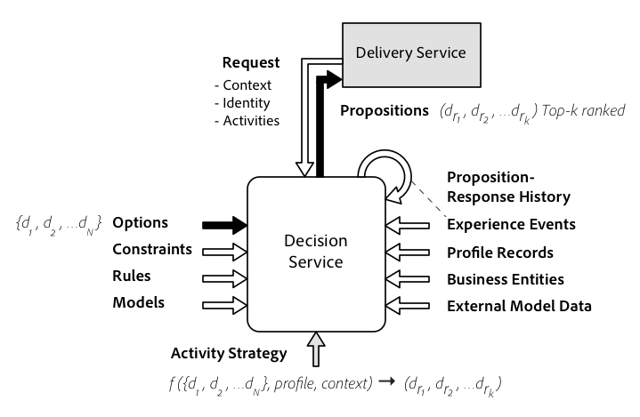
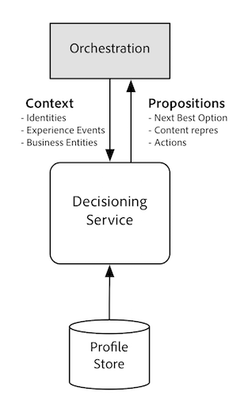
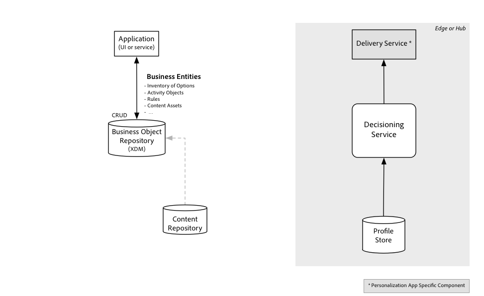
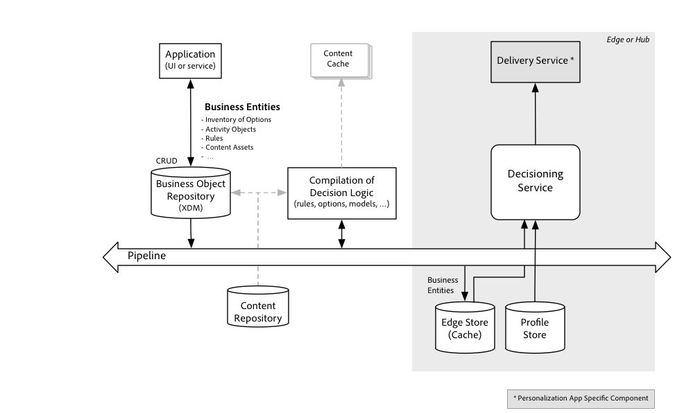
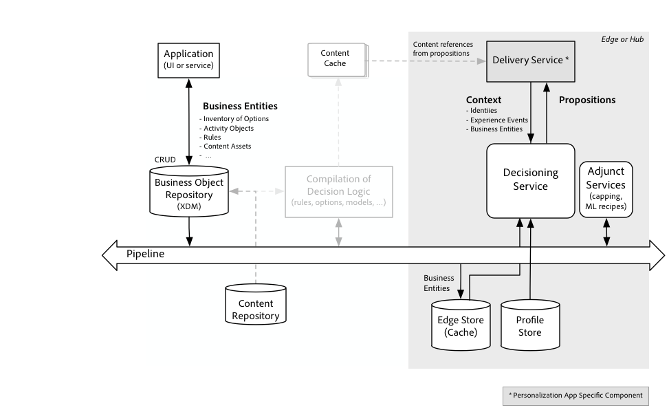

# Decisioning Service overview

[!DNL Decisioning Service] provides the capability to create personalized, optimized, and orchestrated experiences in applications running on Adobe Experience Platform. Using [!DNL Decisioning Service], you can determine the best *option* from a set of available choices. These options, also called alternatives, could be offers, product recommendations, content components for a web experience, conversation scripts, and actions to take. Currently the use case and domain of *Offer Decisioning* is supported, where decision options are modeled specifically as offers, with support for more use cases to come.

With [!DNL Decisioning Service], customers can reuse business logic as well as share a catalog of options across channels and applications. Instead of managing decision options – and strategies for selecting them – deeply inside an application, they can now be leveraged regardless of when, how and on which channel a customer’s end user interacts with a business or organization.

Decisioning strategies can factor in the many interactions a customer has had, across many channels and applications. For instance, call center application activity could enable or suppress a marketing message for some time following a complaint, and that message itself may be based on purchases made and reviews posted by the customer.

[!DNL Decisioning Service] facilitates evolved experience personalization.

| Before Experience Decisioning | After Experience Decisioning |
| --- | --- |
| Personalize and optimize their user’s experiences within a single channel or in small set of experience touch points. | Experiences are orchestrated responses across interactions. |
| Optimizations are focused a single and typically short phase of the end user’s journey | Decisions are based on the entire interaction history spanning from behaviors detected in the past to the latest situational context. |
| Options, and the strategies for selecting which to present during a customer's experience, are typically coded deeply inside of an application. | Strategies for selecting the best option are defined outside the channel specific applications and become reusable. |
| Customer experiences are personalized and optimized according to a simplistic goal, e.g. increase the number of successful checkouts on a web page or the acceptance of an offer presented in an interaction with a representative. | Customer experiences are optimized based on a holistic understanding of the customer's current needs and adapts to all experiences the user had, good or bad. For example, a marketing campaign may not be appropriate for a customer who has recently placed a complaint about a product or service. |

[!DNL Decisioning Service] moves your experience personalization capabilities from targeting in a single channel to determining the overall stage in the lifecycle of your customers' engagement with your brand independent of channels. A lifecycle stage is much more complex than a segment membership, and is almost always based on complex events streams, business rules and predicted attributes. 

Other terms used by products and services aiming to serve similar use cases:

- Real-time interaction management (RTIM)
- Journey management
- Omni-channel marketing and personalization
- Real-time decisioning 

## How does [!DNL Decisioning Service] work?

Experiences can be customized using [!DNL Decisioning Service] in real time, as your customer engages with your brand via an inbound channel, such as your site or mobile app. Decisioning can also be used to customize messages via outbound channel, like an email or push notification. 

Decisions can be made in many ways. One approach is to eliminate options successively until either only one is left or the options have been pared down and there is some subset remaining or a winner is randomly picked from the reduced set. A variant of this approach to pick the winning option according to a calculated formula. Ranking eligible options is accomplished using a function. For offer decisioning, that function could calculate the cost, the value of the offer to the business and use a pre-determined the likelihood that the offer is accepted by the end user. The resulting score could be used to order the offers.

Alternatively or additionally, a strategy could be based on outcomes collected from prior interactions with similar customers who were proposed similar options. In this strategy, the function that calculated the priority values is learned. The optimal outcome value is tied to the goals of the activity and the performance indicator for the prediction is how frequently the outcome was achieved after the option was proposed.

### Decision strategy

Decision strategies are configured via objects called activities. Each decision strategy is essentially an algorithm or a function that takes N options {o1, o2, …oN} as input and produces an ordered list of options (o1, o2,…oK) whereby the first option in the list is considered the best one according to an optimization criteria, the second option in the result list is then considered the second best option and so forth.

At any given time during a customer's journey, the best option for a given activity is re-evaluated based on the most current set of context variables, rules, and constraints. Context variables include the records stored in [!DNL Real Time Customer Profile]. A central record entity is a customer’s profile, but other entities like operational business data are equally available to the activity.

The algorithm or function that produces the list of top-K options varies with the use case. The internal components of that algorithm is different for different use cases. The components are defined in a repository at design time and and "compiled" into instructions for the use case specific decision strategy.

## Working with [!DNL Decisioning Service]

The [!DNL Decisioning Service], like other [!DNL Platform] services, adopts an API first philosophy. This means that the API is the primary interface where all functions, including administrative functions, are made available via APIs. It also means that other [!DNL Platform] services, Adobe solutions, and 3rd party integrations use the same APIs.

You can use [!DNL Decisioning Service] in a synchronous request-response interaction mode facilitated by a simple HTTP REST API. The API call returns the currently best option for a single profile. The “currently best option" selection will change based on the rules and constraints applied to all options that are in consideration by a given activity. The REST API allows getting the next best option for multiple activities at once. This allows the arbitration of options across channels. When responses for multiple activities are obtained together, additional rules may be applied.

### Integration with other [!DNL Platform] workflows

Use of [!DNL Decisioning Service] is optional and only requires a few steps in addition to the typical steps required to create [!DNL Profile] entities and manage them.

>[!NOTE]
>
>To make the most out of the [!DNL Real-time Customer Profile], the [!DNL Decisioning Service] directly integrates with the profile store. The API calls only need to indicate one of the identities for a given profile.

The typical sequence of steps starts with building out profiles:

- Authenticate to [!DNL Experience Platform].
- Define a schema based on the profile class and optionally define a schema based on the experience event class.
- Configure a dataset to upload record and time series data to [!DNL Customer Profile].
- Add data via the dataset configured in the prior step or stream instance data via Pipeline.
- Stream experience events into the [!DNL Platform] to enrich the profile with behavioral data.

Additionally, to use [!DNL Decisioning Service], the following steps:

- Define decision components using the Repository APIs. These are the business logic entities that make up the decision strategy. The decision components will be automatically compiled into a format used by the [!DNL Decision Service Runtime]. The Repository APIs are illustrated on the left side in the diagram below.
- Invoke the Runtime API to obtain the best option as per the business logic defined in the prior step. The [!DNL Decision Service Runtime] APIs are illustrated on the right side in the diagram below.

The activation of the business logic entities happens automatically and continuously. As soon as a new option is saved in the repository and it is marked as "approved", it will be a candidate for inclusion in the set of available options. As soon as a decision rule is updated, the rule set will be reassembled and prepared for runtime execution. At this automatic activation step, any constraints defined by the business logic that aren’t dependent on runtime context will be evaluated. The results of this activation step are sent to a cache where they are available to the [!DNL Decisioning Service] runtime. This is illustrated in the following diagram.
 

Once the option sets, rule sets and constraints are activated, and have been pushed to [!DNL Decisioning Service] nodes, a simple API is used to post a request for a decision. The API is typically called by a delivery service that then takes the proposed option (e.g. next best action or next best offer) and assembles the experience or executes the action. If the proposition is an offer, then the content that represents that offer is looked up and is inserted in an experience delivered to the end user. This is illustrated in the following diagram.

[!DNL Delivery Service] assembles data for the decision request. It determines the ID of the profile entity for which the best option is decided upon. It also assembles any context data that is not stored in [!DNL Customer Profile] but is potentially used by the decision logic. 

The decision logic is organized by activities, each of which specifies a filter for the subset of options that should be considered for this activity, along with a single fallback option.

Each decision is made by first applying constraints to reduce the number of options and then ranking the remaining options. Although most of the logic is evaluated inside [!DNL Decisioning Service], various adjunct services are used to help with these two aspects. For example, a capping service manages upper bounds for how often an option can be used in any decision, and another service may host an machine learning model that is used to calculate scores for a profile and option.

To learn more about using the Repository APIs, see the tutorial on [Managing Decisioning entities and rule using APIs](./tutorials/entities.md)

To learn more about using the [!DNL Decisioning Service] runtime, see the tutorial on [Working with the Decisioning Service runtime using APIs](./tutorials/runtime.md)