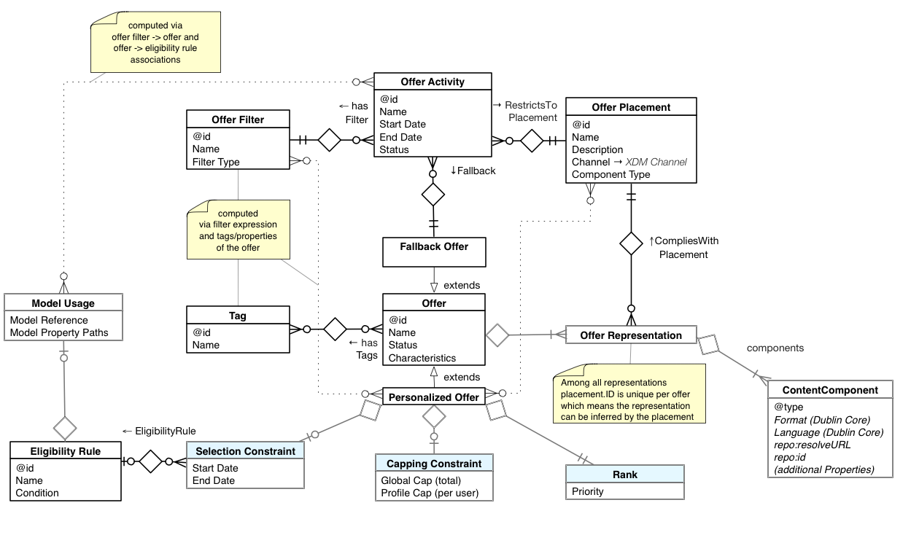

# Offer Decisioning domain model overview

Offer decisioning is a use case of [!DNL Decisioning Service] within which you formalize and centrally manage the rules and predictions used for engaging customers with offers. Offer decisioning is considered a type of _**content decisioning**_. In this use case, the _**decision options**_ are referred to as _**offers**_, and are characterized as such by the content attached to them. For an introduction of the object model used by the [!DNL Decisioning Service], please refer to [Decisioning Service Domain Model](experience-model.md).

The objective is to present the end user with a "Best Offer" in any channel based on targeting criteria, cost and frequency constraints, as well as prior interactions across channels including prior Offers proposed. 

Like with all decisioning use cases, the decision options (offers) are managed in a repoistory shared by any number of application. Offers could be created by different departments of your organization or by partners, and those offers could be added and removed daily. 

Offers are visually placed into larger experiences by the application that is delivering the experience. _**Placements**_, sometimes called spots or slots, are important components for crafting a strategy. Designing an offer strategy often starts with the definition of those placements. An offer typically has multiple _**content representations**_ so that it can be correctly integrated into a variety of experiences, where each has varying dimensional or other constraints and requires different media formats.

Offers frequently have an association with physical goods or services and there is a cost calculation involved. An organization needs to be able to limit the resources that are consumed by offers and therefore needs to be able to _**cap**_ the total number of times an offer can be proposed. 

The predicted value of an accepted offer to the organization is the optimization criteria and stands against the cost of making an offer. Cost, likelihood of acceptance and predicted value is used to rank the offers. The Best Offer is the one with the highest predicted positive impact on the goals of your offer activities.

Offer Decisioning considers the interactions an end-user had, _**across many channels**_ and applications, it leverages an end-user’s profile and experience event data. For instance, a call center application can use Offer Decisioning to enable or suppress an offer based on purchases made and reviews posted by the end-user; or an email management application can rely on Offer Decisioning to select the Next Best Offer in a weekly newsletter based on the browsing history on a website.

Offers have other interesting properties. Frequently, there is a defined _**schedule**_ or date and time range when the offer is valid and by when the offer needs to be invalidated.

Lastly, the appeal of an offer deteriorates with the frequency by which it is presented. An Offer that is not accepted after being proposed repeatedly is a lost opportunity because a different offer could have been presented. For that reason, end-user _**fatigue**_ must be managed.

## Offer Decision Strategy at a glance

The overall approach is to narrow the selection of Offers until all constraints are satisfied, then apply the Ranking model to the remaining Options, and then optimize across multiple activities using Capping Constraints (de-duplication & avoidance of fallback choices).

| Strategy Component | Realized as |
| --- | --- |
| Decision activities | Offer activities |
| Decision options | Offer with content representations |
| Fallback options | Fallback offer with content representations |
| Finite set of decision options | Offer inventory (a.k.a. offer library) |
| Topical categories | Offer filter based on tags and offer identifiers |
| Decision outputs | Proposition of one offer per activity, for multiple activities at once |
| Decision outcomes | Expected experience event with reference to the offer, e.g. `eventType='opened'` |
| Decision algorithm | Internal service logic, parameterized |
| Constraints | Placement constraints, calendar constraints, global and per user capping constraints, de-duplication constraints |
| Decision rules | Eligibility rules |
| Model for *expected utility* | Offer rank or priority |

The total number of offers in the inventory of options is typically quite large (in the order of 10,000s) and each offer activity may be focused on offers that fall into a different category (topic). The offer decision strategy allows attaching an offer filter to an offer activity. Additional constraints will be evaluated at the time the decision is requested.
The following sections explain the components for the Offer Decisioning domain in detail.

## General offers

General offers, also called personalized offers, are the options at the center of the offer decision activities. They have attributes like name and status. The status attribute indicates if the entity is ready to be included in the list of active approved offers. General offers will have several constraints added to them. More about this in section ‎Constraints [below](#offer-constraints).

## Content in Offers

### Offer Placements

Placements define content constraints and used with an activity to specify the place into which the next best experience is delivered. This reduces further the number of options that can be considered and is another constraint imposed by the activity. This is called the placement constraint. Only options that have content meeting a placement constraint, such as offers, will be considered. This is evaluated in the early stages of the decision strategy. When option objects change the placement constraints of each activity are reevaluated and the option may come into consideration or fall out of it for one or more activities.

It is not the responsibility of the [!DNL Decisioning Service] to formalize the complex details of content dependencies. Instead, each client will identify the list of placements across all channels and give those placements unique identifiers and names. By referencing a particular placement, the designer asserts that the given content will fit into the placement.

When content is developed the offer marketer and the content designer will simply (have to) agree on an "implied contract" that stands behind the name "Home Page Hero Image" or "Service Call Opening Script". The former may be agreed upon as an image of 600px width and 350px height and the latter may be restricting the content to text in two language variants that is no more than 50 words in three or four sentences with a semantic structure. Placement to not store all meaning of the hidden contract.

### Offer Representations

To ensure that an offer can be presented properly in the varying parameters of the placements in your channels, different representations of that offer must be created. The content that gets attached to offers is grouped by placements. Each offer can have one or more representation whereby each of those representations reference one of the defined placements. Each representation in an offer must use a different placement. The more representations an offer has the more opportunity exists to use the offer in different placement contexts.

A Placement restricts the type of content items that can be added to the Representation.

## Fallback offers

Fallback offers are decision options that do not have additional constraints except for the placements rules. Fallback offers have content representations that are tied to placements, just like any other offer. 

Fallback offers are specified in activities to indicate a viable content experience for use when combined constraints disqualify all narrowed-down options. Because it is not dependent on runtime context or the profile, the placement constraint can be checked ahead of time when the activity is assembled. Using fallback offers, there is always an answer to the question: What is currently the best offer?

## Offer Constraints

### Calendar constraints

In the offer decisioning domain, the offers have a validity period. That means that the offer cannot be proposed before its start date and time has passed and cannot be proposed any longer after its end date and time has passed. The offer entity has a simple structure which defines those calendar constraints. 

Periodically, expired Offers will be removed from the list of considered options. But, the calendar filter is applied right at the time the decision is requested so that the constraints are applied with precision.

### Capping constraints

Offers can have an optional capping constraint. It consists of two values:

- The global cap value restricts how often an offer can be proposed across the entire profile set (targeted audience).
  
- The per profile cap and determines how often that Offer can be proposed to the same profile.

### Duplication constraints

When a decision is requested the client can ask for propositions for multiple activities at once. This is a typical scenario in content decisioning. Each activity contributes one or more content options to the overall experience. Because of the composition aspect, decisions need to arbitrate across activities to avoid duplication - unless the activities each pick a from disjointed subset of the overall option inventory. A high-ranking option is likely going to rank high in all activities and it would be poor experience if all activities proposed the same option. On the other hand, if a delivery system wants to know what the Next Best Conversion is across all channels and there is no capping constraint, it may be ok to propose the same option across different activities.

Duplication constraints are currently not written into the business object repository. Instead, de-duplication is the default strategy at runtime. A request parameter can override the default behavior to suppress de-duplication step.

### [!DNL Profile] constraints - Eligibility rules

So far, the constraints discussed have been applicable regardless of whom the offer selection is made for. Experience Decisioning also supports a use case wherein personalizing propositions are based on a customer’s record and time series events. Rules are evaluated per profile, to decide if an offer qualifies or must be suppressed for that user. To do that an eligibility rule can be associated with each offer. Aside from the profile and experience events of an end user the eligibility rule will take real-time context data into account. That data is provided by the delivery service and can take the form of data that is not related to a profile such as inventory levels, weather conditions, flight schedules.

It is important to distinguish between targeting and segmentation rules, and between eligibility and priority rules for decisioning. For targeting a set of profiles is the output (audience selection) for eligibility a set of options (allowed offers) is the output of the evaluation.

## Offer Collections

The inventory is the overall pool of options that are considered for decisioning. The inventory can be further divided into categories or collections. A collection of options is represented by a common tag that those options have. Filters are used to test if offers fall into a certain category, or more specifically, share the same tag or tags.

### Tags

Tags provide a way to express that a group of options belongs to a category.

An option can have more than one tag and can therefore be in multiple categories at the same time. Categories can also overlap or contain another one. When a category "S" is defined by offers having the tag "A" and the category "R" is defined by options with both tag "A" and "B" then "S" is going to be a superset of "R".

### Filters

Filters are used to define the criteria for a set of options that belongs to a category. Filters can be thought of as queries against the inventory of general offers. There are two basic ways to form a filter: by stating that an offer has one or more tag and by selecting the set of offers explicitly. The former method can be configured to state that an offer in that collection must have all of the specified tags or that an option qualifies when it has at least one of the specified tags.

When options are explicitly placed into a collection their tag set is ignored for that collection.

## Offer Activities

Activities configure and control the decisioning process. Currently, the decision strategy is mainly pre-determined but future iterations of the Offer Decisioning domain model will allow the selection of models, additional rules and constraints.

An experience can be assembled using many activities simultaneously. Currently, up to 30 activities can be addressed in a single decisioning request. If more than 30 activities or slots in an experience must be filled with content, multiple requests can be made for the same profile. However, when activities are included in the same decision request, de-duplication of offer propositions will be performed among those activities.

If activities are defined in a way that they select from disjointed sets of offers, then it makes little difference whether activities are combined in the same request or in split up into separate requests. But, network and response time constraints may call for combining activities into the same request. As different requests may get routed to different service nodes, the same profile data may need to be fetched into different nodes. This reduces the effective IO bandwidth available for other requests.

Activities are used to insert content into an experience. To facilitate (not to ensure) that the content items will “fit” correctly, an activity references a single placement. Notice that a placement is not always a concrete place/slot but more like an abstraction of those places/slots. For instance, in a web page with a grid of tiles each tile could be governed by the same placement, assuming they all have similar shape and size and can hold similar content. However, an individual tile would typically be supplied by its own activity.

The following figure illustrates how the business entities are related to each other:

When clients create and link the object graph for decisions, there will typically be three different work streams. These are as follows:

- Setting up the supporting entities such as tags and placements. Those entities are used to structure, filter and group other entities. They are also used to provide some coordination between the second and third workflow. This workflow constitutes some upfront work but at any given time refinements can be made to the setup. While tags are relatively straightforward, placements require a little more planning. At a minimum a business needs to take an inventory of all the places where a decision gets presented.

- Creating offers with the various representations and business rules (constraints). This central workflow provides the options amongst which we need to select the best ones. The tags of the first workflow are used to categorize offers and the placements are used to indicate what options can be presented, and where.

  - This workflow also defines absolute constraints for the offers. They are absolute because they will always be enforced and aren’t merely affecting the ranking amongst a set of offers. For instance, when a calendar constraint is set it is enforced that the offer will never be selected before its set start date/time and never after its end date/time. The constraints that will be set in this workflow are the [calendar constraints](#calendar-constraints), [capping constraints](#capping-constraints) and [eligibility constraints](#profile-constraints---eligibility-rules). A sub workflow here is the definition of additional rules that determine who is eligible to receive a given offer.
 
    -   At the same time constraints are created for an offer, its representations are selected. This workflow assumes that the content is already created somewhere and is simply uploaded to and picked from the content repository. Here is where the placements from the first workflow come into play. An offer can pick placements and associate the content under that [placement](#offer-placements).

    -   Creating suitable fallback offers is the last step in this workflow. A fallback offer is very much like a general offer without constraints.

-  The last workflow is concerned with creating activities. However, this step doesn't necessarily occur sequentially after the workflow to create offers. Both processes are ongoing and concurrent. Activities are used to narrow the scope of the options by topic and by location where the decisions are presented. An activity references a [collection](#offer-collections) and a placement. It also must specify a [fallback offer](#fallback-offers) that is used in cases when a qualifying offer cannot be determined.

