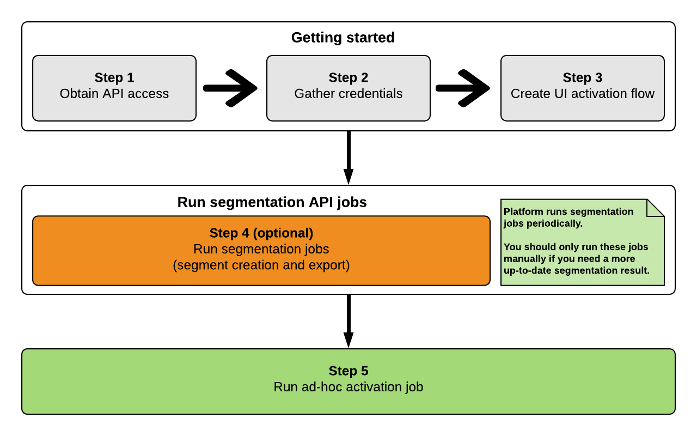
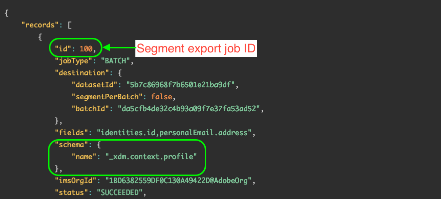

# Activate audience segments on-demand to batch destinations via the ad-hoc activation API

>[!IMPORTANT]
>
>After completing the Beta phase, the [!DNL ad-hoc activation API] is now generally available (GA) to all Experience Platform customers. In the GA version, the API has been upgraded to version 2. Step 4 ([Obtain the latest segment export job ID](#segment-export-id)) is not required anymore, since the API does not require the export ID anymore.
>
>See [Run the ad-hoc activation job](#activation-job) further below in this tutorial for more information.

## Overview {#overview}

The ad-hoc activation API allows marketers to programmatically activate audience segments to destinations, in a fast and efficient manner, for situations where immediate activation is required.

Use the ad-hoc activation API to export full files to your desired file reception system. Ad-hoc audience activation is only supported by [batch file-based destinations](../destination-types.md#file-based).

The diagram below illustrates the end-to-end workflow for activating segments via the ad-hoc activation API, including the segmentation jobs that take place in Platform every 24 hours.




## Use cases {#use-cases}

### Flash sales or promotions

An online retailer is preparing a limited flash sale and wants to notify customers on a short notice. Through the Experience Platform ad-hoc activation API, the marketing team can export segments on-demand, and quickly send promotional emails to the customer base.

### Current events or breaking news

A hotel expects inclement weather over the following days, and the team wants to inform the arriving guests quickly, so they can plan accordingly. The marketing team can use the Experience Platform ad-hoc activation API to export segments on-demand, and notify the guests.

### Integration testing

IT managers can use the Experience Platform ad-hoc activation API to export segments on-demand, so they can test their custom integration with Adobe Experience Platform, and ensure everything is working correctly.

## Guardrails {#guardrails}

Keep in mind the following guardrails when using the ad-hoc activation API.

* Currently, each ad-hoc activation job can activate up to 80 segments. Attempting to activate more than 80 segments per job will cause the job to fail. This behavior is subject to change in future releases.
* Ad-hoc activation jobs cannot run in parallel with scheduled [segment export jobs](../../segmentation/api/export-jobs.md). Before running an ad-hoc activation job, make sure the scheduled segment export job has finished. See [destination dataflow monitoring](../../dataflows/ui/monitor-destinations.md) for information on how to monitor the status of activation flows. For example, if your activation dataflow shows a **[!UICONTROL Processing]** status, wait for it to finish before running the ad-hoc activation job.
* Do not run more than one concurrrent ad-hoc activation job per segment.

## Segmentation considerations {#segmentation-considerations}

Adobe Experience Platform runs scheduled segmentation jobs once every 24 hours. The ad-hoc activation API runs based on the latest segmentation results.

## Step 1: Prerequisites {#prerequisites}

Before you can make calls to the Adobe Experience Platform APIs, make sure you meet the following prerequisites:

* You have an organization account with access to Adobe Experience Platform.
* Your Experience Platform account has the `developer` and `user` roles enabled for the Adobe Experience Platform API product profile. Contact your [Admin Console](../../access-control/home.md) administrator to enable these roles for your account.
* You have an Adobe ID. If you do not have an Adobe ID, go to the [Adobe Developer Console](https://developer.adobe.com/console) and create a new account.

## Step 2: Gather credentials {#credentials}

In order to make calls to Platform APIs, you must first complete the [authentication tutorial](https://www.adobe.com/go/platform-api-authentication-en). Completing the authentication tutorial provides the values for each of the required headers in all Experience Platform API calls, as shown below:

*   Authorization: Bearer `{ACCESS_TOKEN}`
*   x-api-key: `{API_KEY}`
*   x-gw-ims-org-id: `{ORG_ID}`

Resources in Experience Platform can be isolated to specific virtual sandboxes. In requests to Platform APIs, you can specify the name and ID of the sandbox that the operation will take place in. These are optional parameters.

*   x-sandbox-name: `{SANDBOX_NAME}`

>[!NOTE]
>
>For more information on sandboxes in Experience Platform, see the [sandbox overview documentation](../../sandboxes/home.md).

All requests that contain a payload (POST, PUT, PATCH) require an additional media type header:

*   Content-Type: `application/json`

## Step 3: Create activation flow in the Platform UI {#activation-flow}

Before you can activate segments through the ad-hoc activation API, you must first have an activation flow configured in the Platform UI, for the chosen destination.

This includes going into the activation workflow, selecting your segments, configuring a schedule, and activating them. You can use the UI or API to create an activation flow:

* [Use the Platform UI to create an activation flow to batch profile export destinations](../ui/activate-batch-profile-destinations.md)
* [Use the Flow Service API to connect to batch profile export destinations and activate data](../api/connect-activate-batch-destinations.md)

## Step 4: Obtain the latest segment export job ID (Not required in v2) {#segment-export-id}

>[!IMPORTANT]
>
>In the v2 of the ad-hoc activation API, you do not need to obtain the latest segment export job ID. You can skip this step and proceed to the next one.

After you configure an activation flow for your batch destination, scheduled segmentation jobs start running automatically every 24 hours.

Before you can run the ad-hoc activation job, you must obtain the ID of the latest segment export job. You must pass this ID in the ad-hoc activation job request.

Follow the instructions described [here](../../segmentation/api/export-jobs.md#retrieve-list) to retrieve a list of all the segment export jobs.

In the response, look for the first record that includes the schema property below.

```
"schema":{
   "name":"_xdm.context.profile"
}
```

The segment export job ID is in the `id` property, as shown below.




## Step 5: Run the ad-hoc activation job {#activation-job}

Adobe Experience Platform runs scheduled segmentation jobs once every 24 hours. The ad-hoc activation API runs based on the latest segmentation results.

>[!IMPORTANT]
>
>Note the following one-time constraint: Before running an ad-hoc activation job, make sure that at least 20 minutes have passed from the moment that the segment was first activated according to the schedule you set in [Step 3 - Create activation flow in the Platform UI](#activation-flow). 

Before running an ad-hoc activation job, make sure the scheduled segment export job for your segments has finished. See [destination dataflow monitoring](../../dataflows/ui/monitor-destinations.md) for information on how to monitor the status of activation flows. For example, if your activation dataflow shows a **[!UICONTROL Processing]** status, wait for it to finish before running the ad-hoc activation job to export a full file.

Once the segment export job has completed, you can trigger the activation.

>[!NOTE]
>
>Currently, each ad-hoc activation job can activate up to 80 segments. Attempting to activate more than 80 segments per job will cause the job to fail. This behavior is subject to change in future releases.

### Request {#request}

>[!IMPORTANT]
>
>It is mandatory to include the `Accept: application/vnd.adobe.adhoc.activation+json; version=2` header in your request in order to use v2 of the ad-hoc activation API.

```shell

curl --location --request POST 'https://platform.adobe.io/data/core/activation/disflowprovider/adhocrun' \
--header 'x-gw-ims-org-id: 5555467B5D8013E50A494220@AdobeOrg' \
--header 'Authorization: Bearer {{token}}' \
--header 'x-sandbox-id: 6ef74723-3ee7-46a4-b747-233ee7a6a41a' \
--header 'x-sandbox-name: {sandbox-id}' \
--header 'Accept: application/vnd.adobe.adhoc.activation+json; version=2' \
--header 'Content-Type: application/json' \
--data-raw '{
   "activationInfo":{
      "destinationId1":[
         "segmentId1",
         "segmentId2"
      ],
      "destinationId2":[
         "segmentId2",
         "segmentId3"
      ]
   }
}'

```

| Property | Description |
| -------- | ----------- |
| <ul><li>`destinationId1`</li><li>`destinationId2`</li></ul> | The IDs of the destination instances to which you want to activate segments. You can get these IDs from the Platform UI, by navigating to **[!UICONTROL Destinations]** > **[!UICONTROL Browse]** tab, and clicking on the desired destination row to bring up the destination ID in the right rail. For more information, read the [destinations workspace documentation](/help/destinations/ui/destinations-workspace.md#browse). |
| <ul><li>`segmentId1`</li><li>`segmentId2`</li><li>`segmentId3`</li></ul>  | The IDs of the segments that you want to activate to the selected destination. |

{style="table-layout:auto"}

### Request with export IDs (to be deprecated) {#request-deprecated}

>[!IMPORTANT]
>
>**Deprecated request type**. This example type describes the request type for the API version 1. In the v2 of the ad-hoc activation API, you do not need to include the latest segment export job ID.

```shell

curl -X POST https://platform.adobe.io/data/core/activation/disflowprovider/adhocrun \
 -H 'Authorization: Bearer {ACCESS_TOKEN}' \
 -H 'Content-Type: application/json' \
 -H 'x-gw-ims-org-id: {ORG_ID}' \
 -H 'x-api-key: {API_KEY}' \
 -d '
{
   "activationInfo":{
      "destinationId1":[
         "segmentId1",
         "segmentId2"
      ],
      "destinationId2":[
         "segmentId2",
         "segmentId3"
      ]
   },
   "exportIds":[
      "exportId1"
   ]
}
```

| Property | Description |
| -------- | ----------- |
| <ul><li>`destinationId1`</li><li>`destinationId2`</li></ul> | The IDs of the destination instances to which you want to activate segments. You can get these IDs from the Platform UI, by navigating to **[!UICONTROL Destinations]** > **[!UICONTROL Browse]** tab, and clicking on the desired destination row to bring up the destination ID in the right rail. For more information, read the [destinations workspace documentation](/help/destinations/ui/destinations-workspace.md#browse). |
| <ul><li>`segmentId1`</li><li>`segmentId2`</li><li>`segmentId3`</li></ul>  | The IDs of the segments that you want to activate to the selected destination. |
| <ul><li>`exportId1`</li></ul> | The ID returned in the response of the [segment export](../../segmentation/api/export-jobs.md#retrieve-list) job. See [Step 4: Obtain the latest segment export job ID](#segment-export-id) for instructions on how to find this ID. |

{style="table-layout:auto"}

### Response {#response}

A successful response returns HTTP status 200.

```shell
{
   "order":[
      {
         "segment":"db8961e9-d52f-45bc-b3fb-76d0382a6851",
         "order":"ef2dcbd6-36fc-49a3-afed-d7b8e8f724eb",
         "statusURL":"https://platform.adobe.io/data/foundation/flowservice/runs/88d6da63-dc97-460e-b781-fc795a7386d9"
      }
   ]
}
```

| Property | Description |
| -------- | ----------- |
| `segment` | The ID of the activated segment. |
| `order` | The ID of the destination to which the segment was activated. |
| `statusURL` | The status URL of the activation flow. You can track the flow progress using the [Flow Service API](../../sources/tutorials/api/monitor.md). |

{style="table-layout:auto"}

## API error handling {#api-error-handling}

Destination SDK API endpoints follow the general Experience Platform API error message principles. Refer to [API status codes](../../landing/troubleshooting.md#api-status-codes) and [request header errors](../../landing/troubleshooting.md#request-header-errors) in the Platform troubleshooting guide.

### API error codes and messages specific to the ad-hoc activation API {#specific-error-messages}

When using the ad-hoc activation API, you can come across error messages that are specific to this API endpoint. Review the table to understand how to address them when they do appear.

|Error message | Resolution |
|---------|----------|
| Run already going on for segment `segment ID` for order `dataflow ID` with run id `flow run ID` | This error message indicates that an ad-hoc activation flow is currently ongoing for a segment. Wait for the job to finish before triggering the activation job again.|
| Segments `<segment name>` are not part of this dataflow or out of schedule range! | This error message indicates that the segments you selected to activate are not mapped to the dataflow or that the activation schedule set up for the segments has either expired or not yet started. Check if the segment is indeed mapped to the dataflow and verify that the segment activation schedule overlaps with the present date.|

## Related information {#related-information}

* [Connect to batch destinations and activate data using the Flow Service API](/help/destinations/api/connect-activate-batch-destinations.md)
* [(Beta) Export files on-demand to batch destinations using the Experience Platform UI](/help/destinations/ui/export-file-now.md)