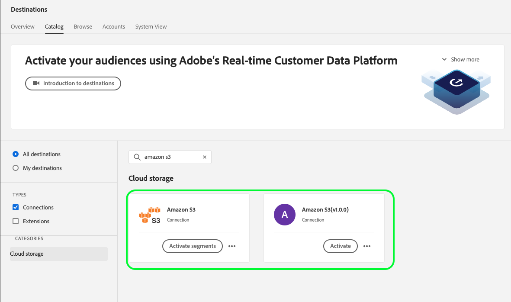

# API migration guide for cloud storage destinations

>[!IMPORTANT]
>
>* The functionality described on this page is available to customers who have purchased the Real-Time CDP Prime and Ultimate packages. Please contact your Adobe representative for more information. 

## Migration context {#migration-context}

Starting [October 2022](/help/release-notes/2022/october-2022.md#new-or-updated-destinations), you can use the new file export capabilities to access enhanced customization functionality when exporting files out of Experience Platform: 

* Additional [file naming options](/help/destinations/ui/activate-batch-profile-destinations.md#file-names).
* Ability to set custom file headers in your exported files via the [new mapping step](/help/destinations/ui/activate-batch-profile-destinations.md#mapping).
* Ability to select the [file type](/help/destinations/ui/connect-destination.md#file-formatting-and-compression-options) of the exported file.
* Ability to [customize the formatting of exported CSV data files](/help/destinations/ui/batch-destinations-file-formatting-options.md).

This functionality is supported by the beta cloud storage cards listed below: 

* [[!DNL (Beta) Amazon S3]](../../destinations/catalog/cloud-storage/amazon-s3.md#changelog)
* [[!DNL (Beta) Azure Blob]](../../destinations/catalog/cloud-storage/azure-blob.md#changelog) 
* [[!DNL (Beta) SFTP]](../../destinations/catalog/cloud-storage/sftp.md#changelog)

<!--

Commenting out the three net new cloud storage destinations

* [[!DNL (Beta) Azure Data Lake Storage Gen2]](../../destinations/catalog/cloud-storage/adls-gen2.md)
* [[!DNL (Beta) Data Landing Zone]](../../destinations/catalog/cloud-storage/data-landing-zone.md)
* [[!DNL (Beta) Google Cloud Storage]](../../destinations/catalog/cloud-storage/google-cloud-storage.md)

-->

Note that currently in the Experience Platform UI, you can see two side-by-side destination cards of the three destinations. Shown below are the [!DNL Amazon S3] legacy and new destinations. In all cases, the cards marked with **Beta** are the new destination cards.



While these destinations with enhanced functionality were offered initially as a beta, *Adobe is now moving all Real-Time CDP customers to the new cloud storage destinations*. For customers who were already using [!DNL Amazon S3], [!DNL Azure Blob], or SFTP, this means that existing dataflows will be migrated to the new cards. Read on for more information about the specific changes as part of the migration.

## Who this page applies to {#who-this-applies-to}

If you are already using the [Flow Service API](https://developer.adobe.com/experience-platform-apis/references/destinations/) to export profiles to the Amazon S3, Azure Blob, or SFTP cloud storage destinations, then this API migration guide applies to you. 

If you have scripts running in your [!DNL Amazon S3], [!DNL Azure Blob], or SFTP cloud storage locations on top of the exported files from Experience Platform, be aware that some parameters are changing with regards to the connection and flow specs of the new cards, as well as with regard to the mapping step.

For example, if you were using a script to filter destination dataflows to the [!DNL Amazon S3] destination, based on the connection spec of the [!DNL Amazon S3] destination, be aware that the connection spec will change so you will need to update your filters. 

## Relevant documentation links {#relevant-documentation-links}

This section includes the relevant API tutorial and reference documentation for the enhanced functionality to export data to cloud storage destinations.

<!--

TBD if we keep this link but will likely remove it

[Legacy API tutorial to export data to cloud storage destinations](/help/destinations/api/connect-activate-batch-destinations.md) (outdated, do not use anymore)

--> 
* [API tutorial to export segments to cloud storage destinations](/help/destinations/api/activate-segments-file-based-destinations.md)
* [Destinations Flow Service API reference documentation](https://developer.adobe.com/experience-platform-apis/references/destinations/) 

## Summary of backwards-incompatible changes {#summary-backwards-incompatible-changes}

With the migration to the new destinations, all your existing dataflows to [!DNL Amazon S3], [!DNL Azure Blob], and SFTP destinations will now be assigned new target connections and base connections. The profile mapping step also changes. Backwards-incompatible changes are summarized in the sections below for each destination. View also the [destinations glossary](https://developer.adobe.com/experience-platform-apis/references/destinations/#tag/Glossary) for more information on the terms in the diagram below.


### Backwards-incompatible changes to the [!DNL Amazon S3] destination {#changes-amazon-s3-destination}

The backwards-incompatible changes for the API users are an updated `connection spec ID` and `flow spec ID` as shown in the table below:

|[!DNL Amazon S3] | Legacy | New |
|---------|----------|---------|
| Flow spec | 71471eba-b620-49e4-90fd-23f1fa0174d8 | 1a0514a6-33d4-4c7f-aff8-594799c47549 |
| Connection spec | 4890fc95-5a1f-4983-94bb-e060c08e3f81 | 4fce964d-3f37-408f-9778-e597338a21ee |

View the complete legacy and new base connection and target connection examples for [!DNL Amazon S3] in the tabs below. The parameters required to create base connections for [!DNL Amazon S3] destinations do not change. 

Similarly, there are no backwards-incompatible changes in the parameters required to create target connections.

>[!BEGINTABS]

>[!TAB Legacy base connection and target connection]

+++View legacy [!DNL base connection] for [!DNL Amazon S3]

```json {line-numbers="true" start-line="1" highlight="5"}
{
  ...
  "name": "amazon-s3",
  "connectionSpec": {
    "id": "4890fc95-5a1f-4983-94bb-e060c08e3f81",
    "version": "1.0"
  },
  "state": "enabled",
  "auth": {
    "specName": "Access Key",
    "params": {
      "authorizedDate": "2022-10-26",
      "s3SecretKey": "<your-secret-key>",
      "s3AccessKey": "<your-access-key>"
    }
  },
  "encryption": {
    "specName": "File Encryption",
    "params": {
      "encryptionAlgo": "PGP/GPG",
      "publicKey": "<publicKey>"
    }
  },
  "version": "\"640418e2-0000-0200-0000-6359b9ef0000\"",
  "etag": "\"640418e2-0000-0200-0000-6359b9ef0000\""
}
```

+++

+++View legacy [!DNL target connection] for [!DNL Amazon S3]

```json {line-numbers="true" start-line="1" highlight="12"}
{
  ...
  "name": "test 121",
  "baseConnectionId": "ee86d122-10d3-434b-81c7-7252e4d747a7",
  "state": "enabled",
  "data": {
    "format": "CSV",
    "schema": null,
    "properties": null
  },
  "connectionSpec": {
    "id": "4890fc95-5a1f-4983-94bb-e060c08e3f81",
    "version": "1.0"
  },
  "params": {
    "mode": "S3",
    "path": "testpath",
    "bucketName": "test"
  },
  "version": "\"1609cd86-0000-0200-0000-63892cbb0000\"",
  "etag": "\"1609cd86-0000-0200-0000-63892cbb0000\"",
  "inheritedAttributes": {
    "baseConnection": {
      "id": "ee86d122-10d3-434b-81c7-7252e4d747a7",
      "connectionSpec": {
        "id": "4890fc95-5a1f-4983-94bb-e060c08e3f81",
        "version": "1.0"
      }
    }
  }
}
```

+++

>[!TAB New base connection and target connection]

+++View new [!DNL base connection] for [!DNL Amazon S3]

```json {line-numbers="true" start-line="1" highlight="5"}
{
  ...
  "name": "Amazon S3",
  "connectionSpec": {
    "id": "4fce964d-3f37-408f-9778-e597338a21ee",
    "version": "1.0"
  },
  "state": "enabled",
  "auth": {
    "specName": "Access Key",
    "params": {
      "authorizedDate": "2022-10-26",
      "s3SecretKey": "<your-secret-key>",
      "s3AccessKey": "<your-access-key>"
    }
  },
  "encryption": {
    "specName": "File Encryption",
    "params": {
      "encryptionAlgo": "PGP/GPG",
      "publicKey": "<publicKey>"
    }
  },
  "version": "\"3708da21-0000-0200-0000-638940b10000\"",
  "etag": "\"3708da21-0000-0200-0000-638940b10000\""
}
```

+++

+++View new [!DNL target connection] for [!DNL Amazon S3]

```json {line-numbers="true" start-line="1" highlight="12, 16-27"}
{
  ...
  "name": "test 121",
  "baseConnectionId": "d114c86f-fd47-4bb6-846c-cb1d15a00fe9",
  "state": "enabled",
  "data": {
    "format": "CSV",
    "schema": null,
    "properties": null
  },
  "connectionSpec": {
    "id": "4fce964d-3f37-408f-9778-e597338a21ee",
    "version": "1.0"
  },
  "params": {
    "csvOptions": {
      "nullValue": "null",
      "emptyValue": "",
      "escape": "\\",
      "quote": "",
      "delimiter": ","
    },
    "compression": "NONE",
    "fileType": "CSV",
    "mode": "Server-to-server",
    "path": "testpath",
    "bucketName": "test"
  },
  "version": "\"1b0985c6-0000-0200-0000-638940b10000\"",
  "etag": "\"1b0985c6-0000-0200-0000-638940b10000\"",
  "inheritedAttributes": {
    "baseConnection": {
      "id": "d114c86f-fd47-4bb6-846c-cb1d15a00fe9",
      "connectionSpec": {
        "id": "4fce964d-3f37-408f-9778-e597338a21ee",
        "version": "1.0"
      }
    }
  }
}
```

+++

>[!ENDTABS]

### Backwards-incompatible changes to [!DNL Azure Blob] destination {#changes-azure-blob-destination}

The backwards-incompatible changes for the API users are an updated `connection spec ID` and `flow spec ID` as shown in the table below:

|[!DNL Azure Blob] | Legacy | New |
|---------|----------|---------|
| Flow spec | 71471eba-b620-49e4-90fd-23f1fa0174d8 | 752d422f-b16f-4f0d-b1c6-26e448e3b388 |
| Connection spec | e258278b-a4cf-43ac-b158-4fa0ca0d948b | 6d6b59bf-fb58-4107-9064-4d246c0e5bb2 |

View the complete legacy and new base connection and target connection examples for [!DNL Azure Blob] in the tabs below. The parameters required to create base connections for Azure Blob destinations do not change. 

Similarly, there are no backwards-incompatible changes in the parameters required to create target connections.

>[!BEGINTABS]

>[!TAB Legacy base connection and target connection]

+++View legacy [!DNL base connection] for [!DNL Azure Blob]

```json {line-numbers="true" start-line="1" highlight="5"}
{
  ...
  "name": "azure-blob",
  "connectionSpec": {
    "id": "e258278b-a4cf-43ac-b158-4fa0ca0d948b",
    "version": "1.0"
  },
  "state": "enabled",
  "auth": {
    "specName": "ConnectionString",
    "params": {
      "authorizedDate": "2022-06-02",
      "connectionString": "<your-connection-string>"
    }
  },
  "encryption": {
    "specName": "File Encryption",
    "params": {
      "encryptionAlgo": "PGP/GPG",
      "publicKey": "<publicKey>"
    }
  }, 
  "version": "\"d000d23c-0000-0200-0000-6299051c0000\"",
  "etag": "\"d000d23c-0000-0200-0000-6299051c0000\""
}
```

+++

+++View legacy [!DNL target connection] for [!DNL Azure Blob]

```json {line-numbers="true" start-line="1" highlight="13"}
{
  ...
  "name": "v1",
  "description": "v2",
  "baseConnectionId": "d10fcecf-9963-4062-820c-0f878be98805",
  "state": "enabled",
  "data": {
    "format": "CSV",
    "schema": null,
    "properties": null
  },
  "connectionSpec": {
    "id": "e258278b-a4cf-43ac-b158-4fa0ca0d948b",
    "version": "1.0"
  },
  "params": {
    "mode": "AZURE_BLOB",
    "container": "usdasda",
    "path": "v3"
  },
  "version": "\"cb0468ba-0000-0200-0000-631ab0790000\"",
  "etag": "\"cb0468ba-0000-0200-0000-631ab0790000\"",
  "inheritedAttributes": {
    "baseConnection": {
      "id": "d10fcecf-9963-4062-820c-0f878be98805",
      "connectionSpec": {
        "id": "e258278b-a4cf-43ac-b158-4fa0ca0d948b",
        "version": "1.0"
      }
    }
  }
}
```

+++

>[!TAB New base connection and target connection]

+++View new [!DNL base connection] for [!DNL Azure Blob]

```json {line-numbers="true" start-line="1" highlight="5"}
{
  ...
  "name": "Azure Blob Storage",
  "connectionSpec": {
    "id": "6d6b59bf-fb58-4107-9064-4d246c0e5bb2",
    "version": "1.0"
  },
  "state": "enabled",
  "auth": {
    "specName": "ConnectionString",
    "params": {
      "authorizedDate": "2022-06-02",      
      "connectionString": "<your-connection-string>"
    }
  },
  "encryption": {
    "specName": "File Encryption",
    "params": {
      "encryptionAlgo": "PGP/GPG",
      "publicKey": "<publicKey>"
    }
  },
  "version": "\"4008a892-0000-0200-0000-6389890d0000\"",
  "etag": "\"4008a892-0000-0200-0000-6389890d0000\""
}
```

+++

+++View new [!DNL target connection] for [!DNL Azure Blob]

```json {line-numbers="true" start-line="1" highlight="13, 17-25"}
{
  ...
  "name": "v1",
  "description": "v2",
  "baseConnectionId": "1329d183-a3ee-4454-ab3f-e2388082bf29",
  "state": "enabled",
  "data": {
    "format": "CSV",
    "schema": null,
    "properties": null
  },
  "connectionSpec": {
    "id": "6d6b59bf-fb58-4107-9064-4d246c0e5bb2",
    "version": "1.0"
  },
  "params": {
    "csvOptions": {
      "nullValue": "null",
      "emptyValue": "",
      "escape": "\\",
      "quote": "",
      "delimiter": ","
    },
    "compression": "NONE",
    "fileType": "CSV",
    "mode": "Server-to-server",
    "container": "usdasda",
    "path": "v3"
  },
  "version": "\"5509fe3f-0000-0200-0000-638a28880000\"",
  "etag": "\"5509fe3f-0000-0200-0000-638a28880000\"",
  "inheritedAttributes": {
    "baseConnection": {
      "id": "1329d183-a3ee-4454-ab3f-e2388082bf29",
      "connectionSpec": {
        "id": "6d6b59bf-fb58-4107-9064-4d246c0e5bb2",
        "version": "1.0"
      }
    }
  }
}
```

+++

>[!ENDTABS]

### Backwards-incompatible changes to SFTP destination {#changes-sftp-destination}

The backwards-incompatible changes for the API users are an updated `connection spec ID` and `flow spec ID` as shown in the table below:

|SFTP | Legacy | New |
|---------|----------|---------|
| Flow spec | 71471eba-b620-49e4-90fd-23f1fa0174d8 | fd36aaa4-bf2b-43fb-9387-43785eeeb799 |
| Connection spec | 64ef4b8b-a6e0-41b5-9677-3805d1ee5dd0 | 36965a81-b1c6-401b-99f8-22508f1e6a26 |

In addition to the updated flow and connection spec above, there are changes to the parameters required when creating SFTP base connections.

* Previously, the base connection for SFTP destinations required a `host` parameter. This parameter has now been renamed to `domain`.

View the complete legacy and new base connection and target connection examples for SFTP in the tabs below, with the lines that change highlighted. The parameters required to create target connections for SFTP destinations do not change. 

>[!BEGINTABS]

>[!TAB Legacy base connection and target connection]

+++View legacy [!DNL base connection] for SFTP - password authentication

```json {line-numbers="true" start-line="1" highlight="5,15"}
{
  ...
  "name": "sftp",
  "connectionSpec": {
    "id": "64ef4b8b-a6e0-41b5-9677-3805d1ee5dd0",
    "version": "1.0"
  },
  "state": "enabled",
  "auth": {
    "specName": "Basic Authentication for sftp",
    "params": {
      "authorizedDate": "2022-06-02",
      "password": "<your-password>",
      "userName": "DPID12345",
      "host": "ftp-out.demdex.com"
    }
  },
  "encryption": {
    "specName": "File Encryption",
    "params": {
      "encryptionAlgo": "PGP/GPG",
      "publicKey": "<publicKey>"
    }
  },
  "version": "\"d000013c-0000-0200-0000-629903bd0000\"",
  "etag": "\"d000013c-0000-0200-0000-629903bd0000\""
}
```

+++

+++View legacy [!DNL base connection] for [!DNL SFTP - SSH key] authentication

```json {line-numbers="true" start-line="1" highlight="5,15"}
{
  ...
  "name": "sftp",
  "connectionSpec": {
    "id": "64ef4b8b-a6e0-41b5-9677-3805d1ee5dd0",
    "version": "1.0"
  },
  "state": "enabled",
  "auth": {
    "specName": "Basic Authentication for sftp",
    "params": {
      "authorizedDate": "2022-06-02",
      "sshKey": "<your-ssh-key>",
      "userName": "DPID12345",
      "port": 22
      "domain": "ftp-out.demdex.com"
    }
  },
  "encryption": {
    "specName": "File Encryption",
    "params": {
      "encryptionAlgo": "PGP/GPG",
      "publicKey": "<publicKey>"
    }
  },
  "version": "\"d000013c-0000-0200-0000-629903bd0000\"",
  "etag": "\"d000013c-0000-0200-0000-629903bd0000\""
}
```

+++

+++View legacy [!DNL target connection] for SFTP

```json {line-numbers="true" start-line="1" highlight="13"}
{
  ...
  "name": "test sftp 6/2",
  "description": "",
  "baseConnectionId": "e6f3a300-0bf7-4755-b7f8-308dc2a99133",
  "state": "enabled",
  "data": {
    "format": "CSV",
    "schema": null,
    "properties": null
  },
  "connectionSpec": {
    "id": "64ef4b8b-a6e0-41b5-9677-3805d1ee5dd0",
    "version": "1.0"
  },
  "params": {
    "mode": "FTP",
    "remotePath": "test"
  },
  "version": "\"8503ab91-0000-0200-0000-629903ce0000\"",
  "etag": "\"8503ab91-0000-0200-0000-629903ce0000\"",
  "inheritedAttributes": {
    "baseConnection": {
      "id": "e6f3a300-0bf7-4755-b7f8-308dc2a99133",
      "connectionSpec": {
        "id": "64ef4b8b-a6e0-41b5-9677-3805d1ee5dd0",
        "version": "1.0"
      }
    }
  }
}
```

+++

>[!TAB New base connection and target connection]

+++View new [!DNL base connection] for [!DNL SFTP - password authentication]

```json {line-numbers="true" start-line="1" highlight="5"}
{
  ...
  "name": "SFTP",
  "connectionSpec": {
    "id": "36965a81-b1c6-401b-99f8-22508f1e6a26",
    "version": "1.0"
  },
  "state": "enabled",
  "auth": {
    "specName": "SFTP with Password",
    "params": {
      "authorizedDate": "2022-06-02",
      "domain": "ftp-out.demdex.com",
      "username": "DPID12345",
      "password": "<your-password>",
      "port": 22      
    }
  },
  "encryption": {
    "specName": "File Encryption",
    "params": {
      "encryptionAlgo": "PGP/GPG",
      "publicKey": "<publicKey>"
    }
  },
  "version": "\"420826cc-0000-0200-0000-638999a60000\"",
  "etag": "\"420826cc-0000-0200-0000-638999a60000\""
}
```

+++

+++View new [!DNL base connection] for [!DNL SFTP - SSH key] authentication

```json {line-numbers="true" start-line="1" highlight="5,12"}
{
  ...
  "name": "SFTP",
  "connectionSpec": {
    "id": "36965a81-b1c6-401b-99f8-22508f1e6a26",
    "version": "1.0"
  },
  "state": "enabled",
  "auth": {
    "specName": "Basic Authentication for sftp",
    "params": {
      "authorizedDate": "2022-06-02",
      "domain": "ftp-out.demdex.com",
      "username": "DPID12345",
      "sshKey": "<your-ssh-key>",
    }
  },
  "encryption": {
    "specName": "File Encryption",
    "params": {
      "encryptionAlgo": "PGP/GPG",
      "publicKey": "<publicKey>"
    }
  },
  "version": "\"420826cc-0000-0200-0000-638999a60000\"",
  "etag": "\"420826cc-0000-0200-0000-638999a60000\""
}
```

+++

+++View new [!DNL target connection] for SFTP

```json {line-numbers="true" start-line="1" highlight="13, 17-25"}
{
  ...
  "name": "test sftp 6/2",
  "description": "",
  "baseConnectionId": "af63fbe1-45ff-4722-a9de-fbbe789dc7b0",
  "state": "enabled",
  "data": {
    "format": "CSV",
    "schema": null,
    "properties": null
  },
  "connectionSpec": {
    "id": "36965a81-b1c6-401b-99f8-22508f1e6a26",
    "version": "1.0"
  },
  "params": {
    "csvOptions": {
      "nullValue": "null",
      "emptyValue": "",
      "escape": "\\",
      "quote": "",
      "delimiter": ","
    },
    "compression": "NONE",
    "fileType": "CSV",
    "mode": "FTP",
    "remotePath": "test"
  },
  "version": "\"5509b5cf-0000-0200-0000-638a2ab60000\"",
  "etag": "\"5509b5cf-0000-0200-0000-638a2ab60000\"",
  "inheritedAttributes": {
    "baseConnection": {
      "id": "af63fbe1-45ff-4722-a9de-fbbe789dc7b0",
      "connectionSpec": {
        "id": "36965a81-b1c6-401b-99f8-22508f1e6a26",
        "version": "1.0"
      }
    }
  }
}
```

+++

>[!ENDTABS]

### Backwards-incompatible changes common to [!DNL Amazon S3], [!DNL Azure Blob], and SFTP destinations {#changes-all-destinations}

The profile selector step in all three destinations is replaced by a mapping step which allows you to rename the column headers in your exported files, if desired. See the side-by-side image below with the old attribute selector step on the left and the new mapping step on the right.


Notice how the `profileSelectors` object in the legacy examples is replaced by the new `profileMapping` object. 

Find complete information about setting up the `profileMapping` object in the [API tutorial to export data to cloud storage destinations](/help/destinations/api/activate-segments-file-based-destinations.md#attribute-and-identity-mapping).

>[!BEGINTABS]

>[!TAB Old transformation parameters]

+++View an example of old transformation parameters

```json{line-numbers="true" start-line="1" highlight="4-40, 45-53"}

{
  "segmentSelectors": { // shortened for brevity since nothing changes in the segment selectors
  },  
  "profileSelectors": {
    "selectors": [
      {
        "type": "JSON_PATH",
        "value": {
          "path": "CORE",
          "operator": "EXISTS",
          "mapping": {
            "sourceType": "text/x.schema-path",
            "source": "CORE",
            "destination": "CORE",
            "identity": false,
            "primaryIdentity": false,
            "functionVersion": 0,
            "sourceAttribute": "CORE",
            "destinationXdmPath": "CORE"
          },
          "identity": {
            "namespace": "CORE"
          }
        }
      },
      ...
      {
        "type": "JSON_PATH",
        "value": {
          "path": "segmentMembership.status",
          "operator": "EXISTS",
          "mapping": {
            "sourceType": "text/x.schema-path",
            "source": "segmentMembership.status",
            "destination": "segmentMembership.status",
            "identity": false,
            "primaryIdentity": false,
            "functionVersion": 0,
            "sourceAttribute": "segmentMembership.status",
            "destinationXdmPath": "segmentMembership.status"
          }
        }
      }
    ],
    "mandatoryFields": [
      "CORE",
      "person.name.lastName",
      "personalEmail.address"
    ],
    "primaryFields": [
      {
        "identityNamespace": "CORE",
        "fieldType": "IDENTITY"
      }
    ]
  }
}

```

+++

>[!TAB New transformation parameters]

+++View an example of transformation parameters after the migration

Notice in the configuration example below how `profileSelectors` fields have been replaced by a `profileMapping` object.

```json {line-numbers="true" start-line="1" highlight="4-12, 18-20"}

{
  "segmentSelectors": { // shortened for brevity since nothing changes in the segment selectors
  },  
  "mandatoryFields": [
    "CORE",
    "person_name_lastName",
    "personalEmail_address"
  ],
  "primaryFields": [
    {
      "identityNamespace": "CORE",
      "fieldType": "IDENTITY"
    }
  ],
  "identityMapping": {
    "mappings": []
  },
  "profileMapping": {
    "mappingId": "40dfd952fe09498ba65145c7a5de3e07",
    "mappingVersion": 0
  },
  "attributeMapping": {}
}

```

+++

>[!ENDTABS]

## Migration timeline and action items {#timeline-and-action-items}

The migration of legacy dataflows to the new destination cards for [!DNL Amazon S3], [!DNL Azure Blob], and SFTP destinations will occur as soon as your organization is ready to migrate and no later than **July 26th, 2023**.

You will receive reminder emails from Adobe as the migration date approaches. In preparation, read the Action items section below to get ready for the migration. 

### Action items {#action-items}

In preparation for the migration of the [!DNL Amazon S3], [!DNL Azure Blob], and SFTP cloud storage destinations to the new cards, please prepare to update your scripts and automated API calls as suggested below. 

1. Update any scripts or automated API calls for any existing [!DNL Amazon S3], [!DNL Azure Blob], or SFTP cloud storage destinations by July 26, 2023. Any automated API calls or scripts which leverage the legacy connection specs or flow specs need to be updated to the new connection specs or flow specs.
2. Reach out to your Adobe account representative when your scripts have been updated before July 26th.
3. For example, the `targetConnectionSpecId` can be used as a flag to determine if the dataflow has been migrated to the new destination card. You could update your scripts with an `if` condition to look at the legacy and updated target connection specs in `flow.inheritedAttributes.targetConnections[0].connectionSpec.id` and determine if your dataflow has been migrated. You can see the legacy and new connection spec IDs in the specific sections on this page for each destination.
4. Your Adobe account team will reach out with further information about when your dataflows will be migrated.
5. After July 26th, all dataflows will be migrated. All your exiting dataflows will now have new flow entities (connection specs, flow specs, base connections, and target connections). Any scripts or API calls on your side that use the legacy flow entities will stop working.

## Other migration considerations {#other-considerations}

Note that there is no impact on your existing schedule for exports during or after the migration.

## Next steps {#next-steps}

By reading this page, you now know if you need to take any action in preparation for the migration of the cloud storage destinations. You also know which documentation pages to reference as you set up API-based workflows to export files out of Experience Platform to your preferred cloud storage destinations. Next, you can view the API tutorial to [export data to cloud storage destinations](/help/destinations/api/activate-segments-file-based-destinations.md).
