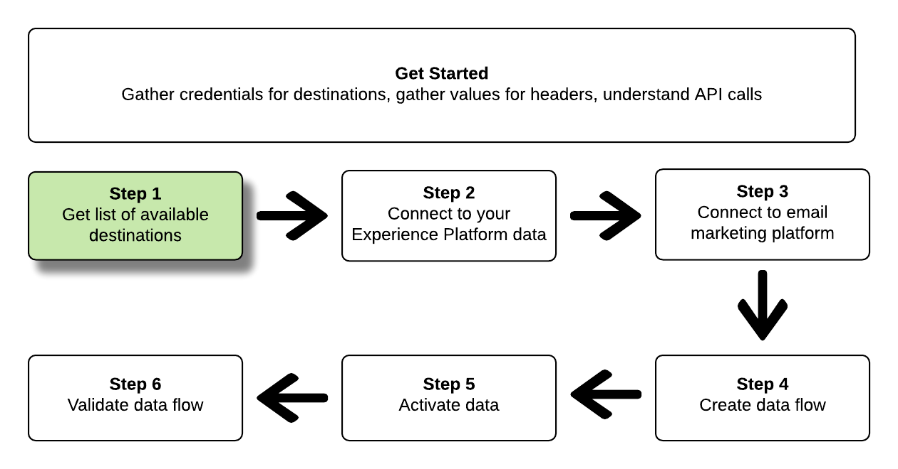

# Connect to email marketing destinations and activate data using the Flow Service API

This tutorial demonstrates how to use API calls to connect to your Adobe Experience Platform data, create an [email marketing destination](../catalog/email-marketing/overview.md), create a dataflow to your new created destination, and activate data to your new created destination.

This tutorial uses the Adobe Campaign destination in all examples, but the steps are identical for all email marketing destinations.


If you prefer to use the user interface in Platform to connect a destination and activate data, see the [Connect a destination](../ui/connect-destination.md) and [Activate profiles and segments to a destination](../ui/activate-destinations.md) tutorials.

## Get started

This guide requires a working understanding of the following components of Adobe Experience Platform:

*   [[!DNL Experience Data Model (XDM) System]](../../xdm/home.md): The standardized framework by which [!DNL Experience Platform] organizes customer experience data.
*   [[!DNL Catalog Service]](../../catalog/home.md): [!DNL Catalog] is the system of record for data location and lineage within [!DNL Experience Platform].
*   [[!DNL Sandboxes]](../../sandboxes/home.md): [!DNL Experience Platform] provides virtual sandboxes which partition a single [!DNL Platform] instance into separate virtual environments to help develop and evolve digital experience applications.

The following sections provide additional information that you will need to know in order to activate data to email marketing destinations in Platform.

### Gather required credentials

To complete the steps in this tutorial, you should have the following credentials ready, depending on the type of destinations that you are connecting and activating segments to.

* For [!DNL Amazon] S3 connections to email marketing platforms: `accessId`, `secretKey`
* For SFTP connections to email marketing platforms: `domain`, `port`, `username`, `password` or `ssh key` (depending on the connection method to the FTP location)

### Reading sample API calls

This tutorial provides example API calls to demonstrate how to format your requests. These include paths, required headers, and properly formatted request payloads. Sample JSON returned in API responses is also provided. For information on the conventions used in documentation for sample API calls, see the section on [how to read example API calls](../../landing/troubleshooting.md#how-do-i-format-an-api-request) in the [!DNL Experience Platform] troubleshooting guide.

### Gather values for required and optional headers

In order to make calls to [!DNL Platform] APIs, you must first complete the [authentication tutorial](https://www.adobe.com/go/platform-api-authentication-en). Completing the authentication tutorial provides the values for each of the required headers in all [!DNL Experience Platform] API calls, as shown below:

*   Authorization: Bearer `{ACCESS_TOKEN}`
*   x-api-key: `{API_KEY}`
*   x-gw-ims-org-id: `{IMS_ORG}`

Resources in [!DNL Experience Platform] can be isolated to specific virtual sandboxes. In requests to [!DNL Platform] APIs, you can specify the name and ID of the sandbox that the operation will take place in. These are optional parameters.

*   x-sandbox-name: `{SANDBOX_NAME}`

>[!NOTE]
>
>For more information on sandboxes in [!DNL Experience Platform], see the [sandbox overview documentation](../../sandboxes/home.md).

All requests that contain a payload (POST, PUT, PATCH) require an additional media type header:

*   Content-Type: `application/json`

### Swagger documentation 

You can find accompanying reference documentation for all the API calls in this tutorial in Swagger. See the [Flow Service API documentation on Adobe I/O](https://www.adobe.io/apis/experienceplatform/home/api-reference.html#!acpdr/swagger-specs/flow-service.yaml). We recommend that you use this tutorial and the Swagger documentation page in parallel.

## Get the list of available destinations {#get-the-list-of-available-destinations}



As a first step, you should decide which email marketing destination to activate data to. To begin with, perform a call to request a list of available destinations that you can connect and activate segments to. Perform the following GET request to the `connectionSpecs` endpoint to return a list of available destinations:

**API format**

```http
GET /connectionSpecs
```

**Request** 

<!--

```shell
curl -X GET \
    'http://platform.adobe.io/data/foundation/flowservice/connectionSpecs' \
    -H 'Authorization: Bearer {ACCESS_TOKEN}' \
    -H 'x-api-key: {API_KEY}' \
    -H 'x-gw-ims-org-id: {IMS_ORG}' \
    -H 'x-sandbox-name: {SANDBOX_NAME}' \
    -H 'x-sandbox-id: {SANDBOX_ID}' \    
    -H 'Content-Type: application/json' \
```

-->

```shell
curl --location --request GET 'https://platform.adobe.io/data/foundation/flowservice/connectionSpecs' \
--header 'accept: application/json' \
--header 'x-gw-ims-org-id: {IMS_ORG}' \
--header 'x-api-key: {API_KEY}' \
--header 'x-sandbox-name: {SANDBOX_NAME}' \
--header 'Authorization: Bearer {ACCESS_TOKEN}'
```


**Response**

A successful response contains a list of available destinations and their unique identifiers (`id`). Store the value of the destination that you plan to use, as it will be required in further steps. For example, if you want to connect and deliver segments to Adobe Campaign, look for the following snippet in the response:

```json
{
    "id": "0b23e41a-cb4a-4321-a78f-3b654f5d7d97",
  "name": "Adobe Campaign",
  ...
  ...
}
```

## Connect to your [!DNL Experience Platform] data {#connect-to-your-experience-platform-data}


Next, you must connect to your [!DNL Experience Platform] data, so you can export profile data and activate it in your preferred destination. This consists of two substeps which are described below.

1. First, you must perform a call to authorize access to your data in [!DNL Experience Platform], by setting up a base connection.
2. Then, using the base connection ID, you will make another call in which you create a source connection, which establishes the connection to your [!DNL Experience Platform] data.


### Authorize access to your data in [!DNL Experience Platform]

**API format**

```http
POST /connections
```

**Request**

<!--

```shell
curl -X POST \
    'http://platform.adobe.io/data/foundation/flowservice/connections' \
    -H 'Authorization: Bearer {ACCESS_TOKEN}' \
    -H 'x-api-key: {API_KEY}' \
    -H 'x-gw-ims-org-id: {IMS_ORG}' \
    -H 'x-sandbox-name: {SANDBOX_NAME}' \
    -H 'x-sandbox-id: {SANDBOX_ID}' \ 
    -H 'Content-Type: application/json' \
    -d  '{
            
            "name": "Base connection to Experience Platform",
            "description": "This call establishes the connection to Experience Platform data",
            "connectionSpec": {
                "id": "{CONNECTION_SPEC}",
                "version": "1.0"
            }
           }'
```

-->

```shell
curl --location --request POST 'https://platform.adobe.io/data/foundation/flowservice/connections' \
--header 'Authorization: Bearer {ACCESS_TOKEN}' \
--header 'x-api-key: {API_KEY}' \
--header 'x-gw-ims-org-id: {IMS_ORG}' \
--header 'x-sandbox-name: {SANDBOX_NAME}' \
--header 'Content-Type: application/json' \
--data-raw '{
            "name": "Base connection to Experience Platform",
            "description": "This call establishes the connection to Experience Platform data",
            "connectionSpec": {
                "id": "{CONNECTION_SPEC_ID}",
                "version": "1.0"
            }
}'
```


*   `{CONNECTION_SPEC_ID}`: Use the connection spec ID for Unified Profile Service - `8a9c3494-9708-43d7-ae3f-cda01e5030e1`.

**Response**

A successful response contains the base connection's unique identifier (`id`). Store this value as it is required in the next step to create the source connection.

```json
{
    "id": "1ed86558-59b5-42f7-9865-5859b552f7f4"
}
```

### Connect to your [!DNL Experience Platform] data {#connect-to-platform-data}

**API format**

```http
POST /sourceConnections
```

**Request**

<!--

```shell
curl -X POST \
    'http://platform.adobe.io/data/foundation/flowservice/sourceConnections' \
    -H 'Authorization: Bearer {ACCESS_TOKEN}' \
    -H 'x-api-key: {API_KEY}' \
    -H 'x-gw-ims-org-id: {IMS_ORG}' \
    -H 'x-sandbox-id: {SANDBOX_ID}' \ 
    -H 'x-sandbox-name: {SANDBOX_NAME}' \
    -H 'Content-Type: application/json' \
    -d  '{
  "name": "Connecting to Unified Profile Service",
  "description": "Optional",
  "baseConnectionId": "{BASE_CONNECTION_ID}",
  "connectionSpec": {
    "id": "{CONNECTION_SPEC}",
    "version": "1.0"
  },
  "data": {
    "format": "CSV",
    "schema": null
  }
  }
```

-->

```shell
curl --location --request POST 'https://platform.adobe.io/data/foundation/flowservice/sourceConnections' \
--header 'Authorization: Bearer {ACCESS_TOKEN}' \
--header 'x-api-key: {API_KEY}' \
--header 'x-gw-ims-org-id: {IMS_ORG}' \
--header 'x-sandbox-name: {SANDBOX_NAME}' \
--header 'Content-Type: application/json' \
--data-raw '{
            "name": "Connecting to Unified Profile Service",
            "description": "Optional",
            "connectionSpec": {
                "id": "{CONNECTION_SPEC_ID}",
                "version": "1.0"
            },
            "baseConnectionId": "{BASE_CONNECTION_ID}",
            "data": {
                "format": "CSV",
                "schema": null
            },
            "params" : {}
}'
```

*   `{BASE_CONNECTION_ID}`: Use the Id you have obtained in the previous step.
*   `{CONNECTION_SPEC_ID}`: Use the connection spec ID for [!DNL Unified Profile Service] - `8a9c3494-9708-43d7-ae3f-cda01e5030e1`.

**Response**

A successful response returns the unique identifier (`id`) for the newly created source connection to [!DNL Unified Profile Service]. This confirms that you have successfully connected to your [!DNL Experience Platform] data. Store this value as it is required in a later step.

```json
{
    "id": "ed48ae9b-c774-4b6e-88ae-9bc7748b6e97"
}
```


## Connect to email marketing destination {#connect-to-email-marketing-destination}


In this step, you are setting up a connection to your desired email marketing destination. This consists of two substeps which are described below. 

1. First, you must perform a call to authorize access to the email service provider, by setting up a base connection. 
2. Then, using the base connection ID, you will make another call in which you create a target connection, which specifies the location in your storage account where the exported data will be delivered, as well as the format of the data that will be exported.

### Authorize access to the email marketing destination

**API format**

```http
POST /connections
```

**Request**

<!--

```shell
curl -X POST \
    'http://platform.adobe.io/data/foundation/flowservice/connections' \
    -H 'Authorization: Bearer {ACCESS_TOKEN}' \
    -H 'x-api-key: {API_KEY}' \
    -H 'x-gw-ims-org-id: {IMS_ORG}' \
    -H 'x-sandbox-name: {SANDBOX_NAME}' \
    -H 'x-sandbox-id: {SANDBOX_ID}' \ 
    -H 'Content-Type: application/json' \
    -d  '{
            
            "name": "S3 Connection for Adobe Campaign",
            "description": "ACME company holiday campaign",
            "connectionSpec": {
                "id": "{CONNECTION_SPEC}",
                "version": "1.0"
            },
            "auth": {
                "specName": "{S3 or SFTP}",
                "params": {
                    "accessId": "{ACCESS_ID}",
                    "secretKey": "{SECRET_KEY}"
                }
            }
           }'
```

-->

```shell
curl --location --request POST 'https://platform.adobe.io/data/foundation/flowservice/connections' \
--header 'Authorization: Bearer {ACCESS_TOKEN}' \
--header 'x-api-key: {API_KEY}' \
--header 'x-gw-ims-org-id: {IMS_ORG}' \
--header 'x-sandbox-name: {SANDBOX_NAME}' \
--header 'Content-Type: application/json' \
--data-raw '{
    "name": "S3 Connection for Adobe Campaign",
    "description": "summer advertising campaign",
    "connectionSpec": {
        "id": "{_CONNECTION_SPEC_ID}",
        "version": "1.0"
    },
    "auth": {
        "specName": "{S3 or SFTP}",
        "params": {
            "accessId": "{ACCESS_ID}",
            "secretKey": "{SECRET_KEY}"
        }
    }
}'
```

*   `{CONNECTION_SPEC_ID}`: Use the connection spec ID you obtained in the step [Get the list of available destinations](#get-the-list-of-available-destinations).
*   `{S3 or SFTP}`: fill in the desired connection type for this destination. In the [destination catalog](../catalog/overview.md), scroll to your preferred destination to see if S3 and/or SFTP connection types are supported. 
*   `{ACCESS_ID}`: Your access ID for your [!DNL Amazon] S3 storage location.
*   `{SECRET_KEY}`: Your secret key for your [!DNL Amazon] S3 storage location.

**Response**

A successful response contains the base connection's unique identifier (`id`). Store this value as it is required in the next step to create a target connection.

```json
{
    "id": "1ed86558-59b5-42f7-9865-5859b552f7f4"
}
```

### Specify storage location and data format

[!DNL Adobe Experience Platform] exports data for email marketing and cloud storage destinations in the form of [!DNL CSV] files.

>[!IMPORTANT]
> 
>[!DNL Adobe Experience Platform] automatically splits the export files at 5 million records (rows) per file. Each row represents one profile.
>
>Split file names are appended with a number that indicates the file is part of a larger export, as such: `filename.csv`, `filename_2.csv`, `filename_3.csv`.

**API format**

```http
POST /targetConnections
```

**Request**

<!--

```shell
curl -X POST \
    'http://platform.adobe.io/data/foundation/flowservice/targetConnections' \
    -H 'Authorization: Bearer {ACCESS_TOKEN}' \
    -H 'x-api-key: {API_KEY}' \
    -H 'x-gw-ims-org-id: {IMS_ORG}' \
    -H 'x-sandbox-name: {SANDBOX_NAME}' \    
    -H 'x-sandbox-id: {SANDBOX_ID}' \ 
    -H 'Content-Type: application/json' \
    -d  '{
   "baseConnectionId": "{BASE_CONNECTION_ID}",
   "name": "TargetConnection for Adobe Campaign",
   "data": {
       "format": "CSV",
       "schema": {
           "id": "1.0",
           "version": "1.0"
       },
    "connectionSpec": {
    "id": "{CONNECTION_SPEC_ID}",
    "version": "1.0"
   },
   "params": {
       "mode": "S3",
       "bucketName": "{BUCKETNAME}",
       "path": "{FILEPATH}"
    }
    }
```

-->

```shell
curl --location --request POST 'https://platform.adobe.io/data/foundation/flowservice/targetConnections' \
--header 'Authorization: Bearer {ACCESS_TOKEN}' \
--header 'x-api-key: {API_KEY}' \
--header 'x-gw-ims-org-id: {IMS_ORG}' \
--header 'Content-Type: application/json' \
--data-raw '{
    "name": "TargetConnection for Adobe Campaign",
    "description": "Connection to Adobe Campaign",
    "baseConnectionId": "{BASE_CONNECTION_ID}",
    "connectionSpec": {
        "id": "{CONNECTION_SPEC_ID}",
        "version": "1.0"
    },
    "data": {
        "format": "json",
        "schema": {
            "id": "1.0",
            "version": "1.0"
        }
    },
    "params": {
        "mode": "S3",
        "bucketName": "{BUCKETNAME}",
        "path": "{FILEPATH}",
        "format": "CSV"
    }
}'
```

*   `{BASE_CONNECTION_ID}`: Use the base connection ID you obtained in the step above.
*   `{CONNECTION_SPEC_ID}`: Use the connection spec you obtained in the step [Get the list of available destinations](#get-the-list-of-available-destinations).
*   `{BUCKETNAME}`: Your [!DNL Amazon] S3 bucket, where Platform will deposit the data export.
*   `{FILEPATH}`: The path in your [!DNL Amazon] S3 bucket directory where Platform will deposit the data export.

**Response**

A successful response returns the unique identifier (`id`) for the newly created target connection to your email marketing destination. Store this value as it is required in later steps.

```json
{
    "id": "12ab90c7-519c-4291-bd20-d64186b62da8"
}
```

## Create a dataflow


Using the IDs you obtained in the previous steps, you can now create a dataflow between your [!DNL Experience Platform] data and the destination where you will activate data to. Think of this step as constructing the pipeline, through which data will later flow, between [!DNL Experience Platform] and your desired destination.

To create a dataflow, perform a POST request, as shown below, while providing the values mentioned below within the payload.

Perform the following POST request to create a dataflow.

**API format**

```http
POST /flows
```

**Request**

```shell
curl -X POST \
'https://platform.adobe.io/data/foundation/flowservice/flows' \
-H 'Authorization: Bearer {ACCESS_TOKEN}' \
-H 'x-api-key: {API_KEY}' \
-H 'x-gw-ims-org-id: {IMS_ORG}' \
-H 'x-sandbox-name: {SANDBOX_NAME}' \
-H 'Content-Type: application/json' \
-d  '{
   
        "name": "Activate segments to Adobe Campaign",
        "description": "This operation creates a dataflow which we will later use to activate segments to Adobe Campaign",
        "flowSpec": {
            "id": "{FLOW_SPEC_ID}",
            "version": "1.0"
        },
        "sourceConnectionIds": [
            "{SOURCE_CONNECTION_ID}"
        ],
        "targetConnectionIds": [
            "{TARGET_CONNECTION_ID}"
        ],
        "transformations": [
            {
                "name": "GeneralTransform",
                "params": {
                    "segmentSelectors": {
                        "selectors": []
                    },
                    "profileSelectors": {
                        "selectors": []
                    }
                }
            }
        ]
    }
```

*   `{FLOW_SPEC_ID}`: Use the flow for the email marketing destination that you want to connect to. To get the flow spec, perform a GET operation on the `flowspecs` endpoint. See Swagger documentation here: https://platform.adobe.io/data/foundation/flowservice/swagger#/Flow%20Specs%20API/getFlowSpecs. In the response, look for `upsTo` and copy the corresponding ID of the email marketing destination that you want to connect to. For example, for Adobe Campaign, look for `upsToCampaign` and copy the `id` parameter.
*   `{SOURCE_CONNECTION_ID}`: Use the source connection ID you obtained in the step [Connect to your Experience Platform](#connect-to-your-experience-platform-data).
*   `{TARGET_CONNECTION_ID}`: Use the target connection ID you obtained in the step [Connect to email marketing destination](#connect-to-email-marketing-destination).

**Response**

A successful response returns the ID (`id`) of the newly created dataflow and an `etag`. Note down both values. as you will them in the next step, to activate segments.

```json
{
    "id": "8256cfb4-17e6-432c-a469-6aedafb16cd5",
    "etag": "8256cfb4-17e6-432c-a469-6aedafb16cd5"
}
```


## Activate data to your new destination


Having created all the connections and the data flow, now you can activate your profile data to the email marketing platform. In this step, you select which segments and which profile attributes you are sending to the destination and you can schedule and send data to the destination.

To activate segments to your new destination, you must perform a JSON PATCH operation, similar to the example below. You can activate mutiple segments and profile attributes in one call. To learn more about JSON PATCH, see the [RFC specification](https://tools.ietf.org/html/rfc6902). 

**API format**

```http
PATCH /flows
```

**Request**

```shell
curl --location --request PATCH 'https://platform.adobe.io/data/foundation/flowservice/flows/{DATAFLOW_ID}' \
--header 'Authorization: Bearer {ACCESS_TOKEN}' \
--header 'x-api-key: {API_KEY}' \
--header 'x-gw-ims-org-id: {IMS_ORG}' \
--header 'Content-Type: application/json' \
--header 'x-sandbox-name: {SANDBOX_NAME}' \
--header 'If-Match: "{ETAG}"' \
--data-raw '[
    {
        "op": "add",
        "path": "/transformations/0/params/segmentSelectors/selectors/-",
        "value": {
            "type": "PLATFORM_SEGMENT",
            "value": {
                "name": "Name of the segment that you are activating",
                "description": "Description of the segment that you are activating",
                "id": "{SEGMENT_ID}"
            }
        }
    },
        {
        "op": "add",
        "path": "/transformations/0/params/segmentSelectors/selectors/-",
        "value": {
            "type": "PLATFORM_SEGMENT",
            "value": {
                "name": "Name of the segment that you are activating",
                "description": "Description of the segment that you are activating",
                "id": "{SEGMENT_ID}"
            }
        }
    },
        {
        "op": "add",
        "path": "/transformations/0/params/profileSelectors/selectors/-",
        "value": {
            "type": "JSON_PATH",
            "value": {
                "operator": "EXISTS",
                "path": "{PROFILE_ATTRIBUTE}"
            }
        }
    }
]
```

*   `{DATAFLOW_ID}`: Use the data flow you obtained in the previous step.
*   `{ETAG}`: Use the etag that you obtained in the previous step.
*   `{SEGMENT_ID}`: Provide the segment ID that you want to export to this destination. To retrieve segment IDs for the segments that you want to activate, go to **https://www.adobe.io/apis/experienceplatform/home/api-reference.html#/**, select **[!UICONTROL Segmentation Service API]** in the left navigation menu, and look for the `GET /segment/definitions` operation in **[!UICONTROL Segment Definitions]**.
*   `{PROFILE_ATTRIBUTE}`: For example, `"person.lastName"`

**Response**

Look for a 202 OK response. No response body is returned. To validate that the request was correct, see the next step, Validate the data flow.

## Validate the data flow


As a final step in the tutorial, you should validate that the segments and profile attributes have indeed been correctly mapped to the data flow.

To validate this, perform the following GET request:

**API format**

```http
GET /flows
```

**Request**

```shell
curl --location --request PATCH 'https://platform.adobe.io/data/foundation/flowservice/flows/{DATAFLOW_ID}' \
--header 'Authorization: Bearer {ACCESS_TOKEN}' \
--header 'x-api-key: {API_KEY}' \
--header 'x-gw-ims-org-id: {IMS_ORG}' \
--header 'Content-Type: application/json' \
--header 'x-sandbox-name: prod' \
--header 'If-Match: "{ETAG}"' 
```

*   `{DATAFLOW_ID}`: Use the data flow from the previous step.
*   `{ETAG}`: Use the etag from the previous step.

**Response**

The returned response should include in the `transformations` parameter the segments and profile attributes that you submitted in the previous step. A sample `transformations` parameter in the response could look like below:

```json
"transformations": [
    {
        "name": "GeneralTransform",
        "params": {
            "profileSelectors": {
                "selectors": []
            },
            "segmentSelectors": {
                "selectors": [
                    {
                        "type": "PLATFORM_SEGMENT",
                        "value": {
                            "name": "Men over 50",
                            "description": "",
                            "id": "72ddd79b-6b0a-4e97-a8d2-112ccd81bd02"
                        }
                    }
                ]
            }
        }
    }
],
```

## Next steps

By following this tutorial, you have successfully connected Platform to one of your preferred email marketing destinations and set up a dataflow to the respective destination. Outgoing data can now be used in the destination for email campaigns, targeted advertising, and many other use cases. See the following pages for more details:

*   [Destinations overview](../home.md)
*   [Destinations Catalog overview](../catalog/overview.md)
