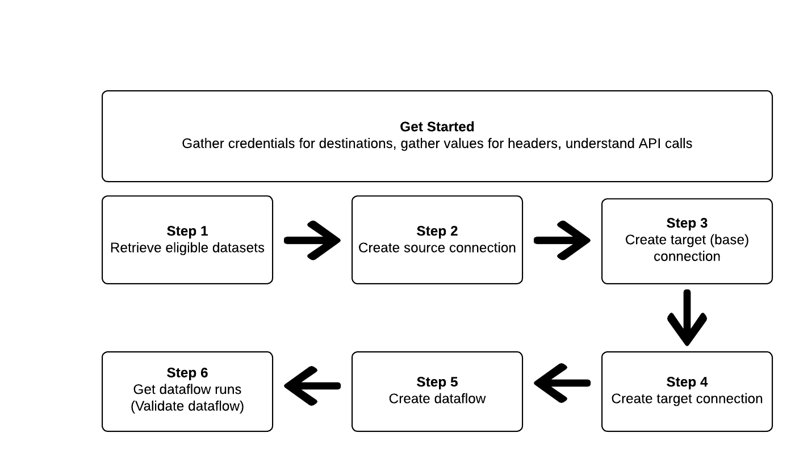

# Export datasets by using the Flow Service API

>[!IMPORTANT]
>
>* The functionality to export datasets is currently in Beta and is not available to all users. The documentation and the functionality are subject to change.
>* This beta functionality supports the export of first generation data, as defined in the Real-Time Customer Data Platform [product description](https://helpx.adobe.com/legal/product-descriptions/real-time-customer-data-platform-b2c-edition-prime-and-ultimate-packages.html).
>* This functionality is available to customers who have purchased the Real-Time CDP Prime and Ultimate package. Please contact your Adobe representative for more information. 

This article explains the workflow required to use the Flow Service API to export [datasets](/help/catalog/datasets/overview.md) from Adobe Experience Platform to your preferred cloud storage location, such as [!DNL Amazon S3], SFTP locations, or [!DNL Google Cloud Storage].

>[!TIP]
>
>You can also use the Experience Platform user interface to export datasets. Read the [export datasets UI tutorial](/help/destinations/ui/export-datasets.md) for more information.



## Getting started {#get-started}

This guide requires a working understanding of the following components of Adobe Experience Platform:

*   [[!DNL Experience Platform datasets]](/help/catalog/datasets/overview.md): All data that is successfully ingested into Adobe Experience Platform is persisted within the [!DNL Data Lake] as datasets. A dataset is a storage and management construct for a collection of data, typically a table, that contains a schema (columns) and fields (rows). Datasets also contain metadata that describes various aspects of the data they store. 
*   [[!DNL Sandboxes]](../../sandboxes/home.md): [!DNL Experience Platform] provides virtual sandboxes which partition a single [!DNL Platform] instance into separate virtual environments to help develop and evolve digital experience applications.

The following sections provide additional information that you need to know in order to export datasets to cloud storage destinations in Platform.

### Required permissions {#permissions}

To export datasets, you need the **[!UICONTROL Manage Destinations]**, **[!UICONTROL View Destinations]**, **[!UICONTROL Activate Destinations]**, and **[!UICONTROL Manage and Activate Dataset Destinations]** [access control permissions](/help/access-control/home.md#permissions). Read the [access control overview](/help/access-control/ui/overview.md) or contact your product administrator to obtain the required permissions.

To ensure that you have the necessary permissions to export datasets and that the destination supports exporting datasets, browse the destinations catalog. If a destination has an **[!UICONTROL Activate]** or an **[!UICONTROL Export datasets]** control, then you have the appropriate permissions.

### Reading sample API calls {#reading-sample-api-calls}

This tutorial provides example API calls to demonstrate how to format your requests. These include paths, required headers, and properly formatted request payloads. Sample JSON returned in API responses is also provided. For information on the conventions used in documentation for sample API calls, see the section on [how to read example API calls](../../landing/troubleshooting.md#how-do-i-format-an-api-request) in the [!DNL Experience Platform] troubleshooting guide.

### Gather values for required and optional headers {#gather-values-headers}

In order to make calls to [!DNL Platform] APIs, you must first complete the [Experience Platform authentication tutorial](https://www.adobe.com/go/platform-api-authentication-en). Completing the authentication tutorial provides the values for each of the required headers in all [!DNL Experience Platform] API calls, as shown below:

* Authorization: Bearer `{ACCESS_TOKEN}`
* x-api-key: `{API_KEY}`
* x-gw-ims-org-id: `{ORG_ID}`

Resources in [!DNL Experience Platform] can be isolated to specific virtual sandboxes. In requests to [!DNL Platform] APIs, you can specify the name and ID of the sandbox that the operation will take place in. These are optional parameters.

* x-sandbox-name: `{SANDBOX_NAME}`

>[!NOTE]
>
>For more information on sandboxes in [!DNL Experience Platform], see the [sandbox overview documentation](../../sandboxes/home.md).

All requests that contain a payload (POST, PUT, PATCH) require an additional media type header:

* Content-Type: `application/json`

### API reference documentation {#api-reference-documentation}

You can find accompanying reference documentation for all the API operations in this tutorial. Refer to the [Flow Service - Destinations API documentation on Adobe I/O](https://developer.adobe.com/experience-platform-apis/references/destinations/). We recommend that you use this tutorial and the API reference documentation in parallel.

### Glossary {#glossary}

For descriptions of the terms that you will be encountering in this API tutorial, read the [glossary section](https://developer.adobe.com/experience-platform-apis/references/destinations/#tag/Glossary) of the API reference documentation.

### Gather connection specs and flow specs for your preferred destination {#gather-connection-spec-flow-spec}

Before starting the workflow to export a dataset, identify the Connection and Flow Spec IDs of the destination to which you are intending to export datasets to. Use below table for reference.

INSERT TABLE HERE

You need these IDs to construct various Flow Service entities. You also need to refer to parts of the Connection Spec itself to set up certain entities so you can fetch the Connection Spec from Flow Service APIs. See below examples of fetching connection specs for all the destinations in the table:

>[!BEGINTABS]

>[!TAB Amazon S3]

**Request** 

+++Fetch Connection Spec for Amazon S3

```shell
curl --location --request GET 'https://platform-stage.adobe.io/data/foundation/flowservice/connectionSpecs/4fce964d-3f37-408f-9778-e597338a21ee' \
--header 'accept: application/json' \
--header 'x-api-key: acp_xql_gateway' \
--header 'x-gw-ims-org-id: 5555467B5D8013E50A494220@AdobeOrg' \
--header 'x-sandbox-name: sand-1' \
--header 'Authorization: Bearer <TOKEN>'
```

+++

**Response**

+++Amazon S3 - Connection Spec

```json
{
    "items": [
        {
            "id": "4fce964d-3f37-408f-9778-e597338a21ee",
            "name": "Amazon S3",
            "providerId": "14e34fac-d307-11e9-bb65-2a2ae2dbcce4",
            "version": "1.0",
//...
```

+++

>[!TAB Azure Blob Storage]

+++Fetch Connection Spec for Azure Blob Storage

```shell
curl --location --request GET 'https://platform.adobe.io/data/foundation/flowservice/connectionSpecs/6d6b59bf-fb58-4107-9064-4d246c0e5bb2' \
--header 'accept: application/json' \
--header 'x-api-key: acp_xql_gateway' \
--header 'x-gw-ims-org-id: 5555467B5D8013E50A494220@AdobeOrg' \
--header 'x-sandbox-name: sand-1' \
--header 'Authorization: Bearer <TOKEN>'
```

+++

**Response**

+++Amazon S3 - Connection Spec

```json
{
    "items": [
        {
            "id": "6d6b59bf-fb58-4107-9064-4d246c0e5bb2",
            "name": "Azure Blob Storage",
            "providerId": "14e34fac-d307-11e9-bb65-2a2ae2dbcce4",
            "version": "1.0",
//...
```

+++

>[!TAB Azure Data Lake Gen 2(ADLS Gen2)]

This content appears in the Windows tab.

>[!TAB Data Landing Zone(DLZ)]

This content appears in the MacOS tab.

>[!TAB Google Cloud Storage]

This content appears in the Linux tab.

>[!TAB SFTP]

This content appears in the Linux tab.

>[!ENDTABS]

Follow the steps below to set up a dataset dataflow to a cloud storage destination. The examples below show how to configure an Amazon S3 destination but the process is similar for the other destinations in the table above. Be sure to use the correct connection spec and flow spec for the destination you are configuring.

## Retrieve a list of datasets {#retrieve-list-of-available-destinations}


To retrieve a list of datasets eligible for activation, start by making an API call to the below endpoint. 

**Request** 

+++Retrieve eligible datasets - request

```shell
curl curl --location --request GET 'https://platform.adobe.io/data/foundation/flowservice/connectionSpecs/23598e46-f560-407b-88d5-ea6207e49db0/configs?outputType=activationDatasets&outputField=datasets&start=0&limit=20&properties=name,state' \
--header 'accept: application/json' \
--header 'x-gw-ims-org-id: {ORG_ID}' \
--header 'x-api-key: {API_KEY}' \
--header 'x-sandbox-name: {SANDBOX_NAME}' \
--header 'Authorization: Bearer {ACCESS_TOKEN}'
```

+++

Note that to retrieve eligible datasets, the connection spec ID used in the request URL should be the data lake source connection spec ID,  `23598e46-f560-407b-88d5-ea6207e49db0` and the two query parameters `outputField=datasets` and `outputType=activationDatasets` must be specified. All other query parameters are the standard ones supported by the Catalog Datasets API. 

**Response**

A successful response contains a list of datasets eligible for activation. These datasets can be used when constructing the source connection in the next step.

+++Retrieve datasets - response

```json
{
    "items": [
        {
            "id": "5ef3e324052581191aa6a466",
            "name": "AAM Authenticated Profiles Meta Data",
            "description": "Activation profile export dataset",
            "fileDescription": {
                "persisted": true,
                "containerFormat": "parquet",
                "format": "parquet"
            },
            "aspect": "production",
            "state": "DRAFT"
        },
        {
            "id": "5ef3e3259ad2a1191ab7dd7d",
            "name": "AAM Devices Data",
            "description": "Activation profile export dataset",
            "fileDescription": {
                "persisted": true,
                "containerFormat": "parquet",
                "format": "parquet"
            },
            "aspect": "production",
            "state": "DRAFT"
        },
        {
            "id": "5ef3e325582424191b1beb42",
            "name": "AAM Devices Profile Meta Data",
            "description": "Activation profile export dataset",
            "fileDescription": {
                "persisted": true,
                "containerFormat": "parquet",
                "format": "parquet"
            },
            "aspect": "production",
            "state": "DRAFT"
        },
        {
            "id": "5ef3e328582424191b1beb44",
            "name": "AAM Realtime",
            "description": "Activation profile export dataset",
            "fileDescription": {
                "persisted": true,
                "containerFormat": "parquet",
                "format": "parquet"
            },
            "aspect": "production",
            "state": "DRAFT"
        },
        {
            "id": "5ef3e328fe742a191b2b3ea5",
            "name": "AAM Realtime Profile Updates",
            "description": "Activation profile export dataset",
            "fileDescription": {
                "persisted": true,
                "containerFormat": "parquet",
                "format": "parquet"
            },
            "aspect": "production",
            "state": "DRAFT"
        }
    ],
    "pageInfo": {
        "start": 0,
        "end": 4,
        "total": 149,
        "hasNext": true
    }
}
```

+++

For information about the various response parameters for each returned dataset, refer to the Datasets API documentation.

## Create a Source Connection

Once you have the list of datasets to activate, you can create a source connection with those dataset IDs.


**Request** 

+++Create Source Connection - Request

```shell
curl --location --request POST 'https://platform.adobe.io/data/foundation/flowservice/sourceConnections' \
--header 'accept: application/json' \
--header 'x-api-key: acp_xql_gateway' \
--header 'x-gw-ims-org-id: 5555467B5D8013E50A494220@AdobeOrg' \
--header 'x-sandbox-name: prod' \
--header 'Content-Type: application/json' \
--header 'Authorization: Bearer <TOKEN>' \
--data-raw '{
  "name": "Connecting to Data Lake",
  "description": "Data Lake source connection to export datasets",
  "connectionSpec": {
    "id": "23598e46-f560-407b-88d5-ea6207e49db0", // this connection spec ID is always the same for Source Connections
    "version": "1.0"
  },
  "params": {
    "datasets": [ // datasets to activate
      {
        "dataSetId": "5ef3e3259ad2a1191ab7dd7d",
        "name": "AAM Devices Data"
      }
    ]
  }
}'
```

+++


**Response**

+++Create Source Connection - Response

```json
{
    "id": "900df191-b983-45cd-90d5-4c7a0326d650",
    "etag": "\"0500ebe1-0000-0200-0000-63e28d060000\""
}
```

+++

A successful response returns the ID (`id`) of the newly created source connection and an `etag`. Note down both values as you will need them later when creating the dataflow. 

Please also remember that:

The Source Connection created in this step needs to be linked to a dataflow for its datasets to be activated to a destination. See the Create a Dataflow section for information on how to link a Source Connection to a dataflow.

The dataset IDs of a Source Connection cannot be modified after creation. If you need to add or remove datasets from a Source Connection, you must create a new source connection and link the new Source Connection's Id to the dataflow). 

## Create a (Target) Base Connection

A base connection securely stores the credentials to your destination. Depending on the destination type, the credentials needed to authenticate against that destination can vary. To find these authentication parameters, first fetch the connection spec as described in the section [Gather connection specs and flow specs](#gather-connection-spec-flow-spec) for your preferred destination and then look at the `authSpec` of the response. For example, below is the `authSpec` for Amazon S3:


Response:

+++Amazon S3 - Connection Spec

```json
{
    "items": [
        {
            "id": "4fce964d-3f37-408f-9778-e597338a21ee",
            "name": "Amazon S3",
            "providerId": "14e34fac-d307-11e9-bb65-2a2ae2dbcce4",
            "version": "1.0",
            "authSpec": [ // describes the authentication parameters
                {
                    "name": "Access Key",
                    "type": "KeyBased",
                    "spec": {
                        "$schema": "http://json-schema.org/draft-07/schema#",
                        "description": "Defines auth params required for connecting to amazon-s3",
                        "type": "object",
                        "properties": {
                            "s3AccessKey": {
                                "description": "Access key id",
                                "type": "string",
                                "pattern": "^[A-Z2-7]{20}$"
                            },
                            "s3SecretKey": {
                                "description": "Secret access key for the user account",
                                "type": "string",
                                "format": "password",
                                "pattern": "^[A-Za-z0-9\/\\+]{40}$"
                            }
                        },
                        "required": [
                            "s3SecretKey",
                            "s3AccessKey"
                        ]
                    }
                }
            ],
//...
```

Using the properties specified in the authentication spec (i.e. `authSpec` from the response) you can create a base connection with the credentials:

**Request** 

+++Amazon S3 - Base Connection Request

```shell
curl --location --request POST 'https://platform.adobe.io/data/foundation/flowservice/connections' \
--header 'accept: application/json' \
--header 'Authorization: Bearer <TOKEN>' \
--header 'x-api-key: <API-KEY>' \
--header 'x-gw-ims-org-id: <IMS-ORG-ID>' \
--header 'x-sandbox-name: <SANDBOX-NAME>' \
--header 'Content-Type: application/json' \
--data-raw '{
  "name": "Amazon S3 Base Connection",
  "auth": {
    "specName": "Access Key",
    "params": {
      "s3SecretKey": "<Add secret key>",
      "s3AccessKey": "<Add access key>"
    }
  },
  "connectionSpec": {
    "id": "4fce964d-3f37-408f-9778-e597338a21ee", // amazon s3 connection spec
    "version": "1.0"
  }
}'
```

+++

## Create a Target Connection

Next, you need to create a target connection which will store the export parameters for your datasets (for example: location, file format, compression, and others). You can refer to the `targetSpec` properties provided in the of the destination's Connection Spec to understand the supported properties. For example, Amazon S3 targetSpec looks like:


+++Amazon S3 - Target Connection Parameters

```json
{
    "items": [
        {
            "id": "4fce964d-3f37-408f-9778-e597338a21ee",
            "name": "Amazon S3",
            "providerId": "14e34fac-d307-11e9-bb65-2a2ae2dbcce4",
            "version": "1.0",
            "authSpec": [...],
            "encryptionSpecs": [...],
            "targetSpec": { // describes the target connection parameters
                "name": "User based target",
                "type": "UserNamespace",
                "spec": {
                    "$schema": "http://json-schema.org/draft-07/schema#",
                    "type": "object",
                    "properties": {
                        "bucketName": {
                            "title": "Bucket name",
                            "description": "Bucket name",
                            "type": "string",
                            "pattern": "(?=^.{3,63}$)(?!^(\\d+\\.)+\\d+$)(^(([a-z0-9]|[a-z0-9][a-z0-9\\-]*[a-z0-9])\\.)*([a-z0-9]|[a-z0-9][a-z0-9\\-]*[a-z0-9])$)",
                            "uiAttributes": {
                                "tooltip": {
                                    "id": "platform_destinations_connect_s3_bucket",
                                    "fallbackUrl": "http://www.adobe.com/go/destinations-amazon-s3-connection-parameters-en"
                                }
                            }
                        },
                        "path": {
                            "title": "Folder path",
                            "description": "Output path for copying files",
                            "type": "string",
                            "pattern": "^[0-9a-zA-Z\/\\!\\-_\\.\\*\\''\\(\\)]*((\\%SEGMENT_(NAME|ID)\\%)?\/?)+$",
                            "uiAttributes": {
                                "tooltip": {
                                    "id": "platform_destinations_connect_s3_folderpath",
                                    "fallbackUrl": "http://www.adobe.com/go/destinations-amazon-s3-connection-parameters-en"
                                }
                            }
                        },
                        "fileType": {...}, // not applicable to dataset destinations
                        "datasetFileType": {
                            "conditional": {
                                "field": "flowSpec.attributes._workflow",
                                "operator": "CONTAINS",
                                "value": "DATASETS"
                            },
                            "title": "File Type",
                            "description": "Select file format",
                            "type": "string",
                            "enum": [
                                "JSON",
                                "PARQUET"
                            ]
                        },
                        "csvOptions": {...}, // not applicable to dataset destinations
                        "compression": {
                            "title": "Compression format",
                            "description": "Select the desired file compression format.",
                            "type": "string",
                            "enum": [
                                "NONE",
                                "GZIP"
                            ]
                        }
                    },
                    "required": [
                        "bucketName",
                        "path",
                        "datasetFileType",
                        "compression",
                        "fileType"
                    ]
                }
//...
```

Using the above spec, you can construct a Target Connection request for Amazon S3, as shown below.

**Request** 

+++Amazon S3 - Target Connection Request

```shell
curl --location --request POST 'https://platform.adobe.io/data/foundation/flowservice/targetConnections' \
--header 'accept: application/json' \
--header 'x-api-key: acp_xql_gateway' \
--header 'x-gw-ims-org-id: 5555467B5D8013E50A494220@AdobeOrg' \
--header 'x-sandbox-name: sand-1' \
--header 'Content-Type: application/json' \
--header 'Authorization: Bearer <TOKEN>' \
--data-raw '{
    "name": "Amazon S3 Beta Target Connection",
    "baseConnectionId": "<FROM_STEP_CREATE_TARGET_BASE_CONNECTION>",
    "params": {
        "mode": "Server-to-server",
        "bucketName": "your-bucket-name",
        "path": "folder/subfolder",
        "compression": "NONE",
        "datasetFileType": "JSON"
    },
    "connectionSpec": {
        "id": "4fce964d-3f37-408f-9778-e597338a21ee", // Amazon S3 connection spec id
        "version": "1.0"
    }
}'
```

+++

For other datasetFileTypes, see the API reference documentation.

**Response**

+++Target Connection - Response

```json
{
    "id": "12401496-2573-4ca7-8137-fef1aeb9dd4c",
    "etag": "\"0000d781-0000-0200-0000-63e29f420000\""
}
```

+++

Note the Target Connection ID from the response. This ID will be required in the next step when creating the dataflow to export datasets. 

## Create a Dataflow

The final step in the destination configuration is to set up a dataflow. A dataflow ties together previously created entities and also provides options for configuring the dataset export schedule. To create the dataflow, use the payload below and replace the entity IDs from previous steps.


**Request** 

+++Create Dataset Dataflow - Request

```json
curl --location --request POST 'https://platform.adobe.io/data/foundation/flowservice/flows' \
--header 'accept: application/json' \
--header 'x-api-key: acp_xql_gateway' \
--header 'x-gw-ims-org-id: 5555467B5D8013E50A494220@AdobeOrg' \
--header 'x-sandbox-name: sand-1' \
--header 'Content-Type: application/json' \
--header 'Authorization: Bearer <TOKEN>' \
--data-raw '{
    "name": "Activate datasets to a batch destination",
    "description": "This operation creates a dataflow to activate datasets to a batch destination (e.g. Amazon S3)",
    "flowSpec": {
        "id": "269ba276-16fc-47db-92b0-c1049a3c131f", // Amazon S3 flow spec ID
        "version": "1.0"
    },
    "sourceConnectionIds": [
        "<FROM_STEP_CREATE_SOURCE_CONNECTION>"
    ],
    "targetConnectionIds": [
        "<FROM_STEP_CREATE_TARGET_CONNECTION>"
    ],
    "transformations": [],
    "scheduleParams": { // specify the scheduling info
        "interval": 3, // also supports 6, 9, 12, 24 hour increments
        "timeUnit": "hour",
        "startTime": 1675901210 // UNIX timestamp start time(in seconds)
    }
}'
```

**Response**

+++Create dataflow - Response

```json
{
    "id": "eb54b3b3-3949-4f12-89c8-64eafaba858f",
    "etag": "\"0000d781-0000-0200-0000-63e29f420000\""
}
```

+++

Note the Dataflow ID from the response. This ID will be required in the next step when retrieving the dataflow runs.

## Get the dataflow runs

To check the executions of the data flow, use the Dataflow Runs API:


**Request** 

+++Get Dataflow Runs - Request

```shell
curl --location --request GET 'https://platform.adobe.io/data/foundation/flowservice/runs?property=flowId==eb54b3b3-3949-4f12-89c8-64eafaba858f' \
--header 'accept: application/json' \
--header 'x-api-key: acp_xql_gateway' \
--header 'x-gw-ims-org-id: 5555467B5D8013E50A494220@AdobeOrg' \
--header 'x-sandbox-name: sand-1' \
--header 'Authorization: Bearer <TOKEN>' \
--data-raw ''
```

**Response**

+++Get Dataflow Runs - Response

```json
{
    "items": [
        {
            "id": "4b7728dd-83c9-4c38-95a4-24ddab545404",
            "createdAt": 1675807718296,
            "updatedAt": 1675807731834,
            "createdBy": "aep_activation_batch@AdobeID",
            "updatedBy": "acp_foundation_connectors@AdobeID",
            "createdClient": "aep_activation_batch",
            "updatedClient": "acp_foundation_connectors",
            "sandboxId": "7dfdcd30-0a09-11ea-8ea6-7bf93ce86c28",
            "sandboxName": "sand-1",
            "imsOrgId": "5555467B5D8013E50A494220@AdobeOrg",
            "flowId": "aae5ec63-b0ac-4808-9a44-abf2ea67bd5a",
            "flowSpec": {
                "id": "615d3489-36d2-4671-9467-4ae1129facd3",
                "version": "1.0"
            },
            "providerRefId": "ba56f98e0c49b572adb249980c39b1c7",
            "etag": "\"08005e9e-0000-0200-0000-63e2cbf30000\"",
            "metrics": {
                "durationSummary": {
                    "startedAtUTC": 1675807719411,
                    "completedAtUTC": 1675807719416
                },
                "sizeSummary": {
                    "inputBytes": 0
                },
                "recordSummary": {
                    "inputRecordCount": 0,
                    "skippedRecordCount": 0,
                    "sourceSummaries": [
                        {
                            "id": "ea2b1205-4692-49de-b448-ebf75b1d188a",
                            "inputRecordCount": 0,
                            "skippedRecordCount": 0,
                            "entitySummaries": [
                                {
//...
```

+++

For [information about the various parameters returned by the Dataflow runs API](https://developer.adobe.com/experience-platform-apis/references/destinations/#tag/Dataflow-runs/operation/getFlowRuns), refer the API reference documentation. 

## API error handling {#api-error-handling}

The API endpoints in this tutorial follow the general Experience Platform API error message principles. Refer to [API status codes](/help/landing/troubleshooting.md#api-status-codes) and [request header errors](/help/landing/troubleshooting.md#request-header-errors) in the Platform troubleshooting guide for more information on interpreting error responses.

## Next steps {#next-steps}

By following this tutorial, you have successfully connected Platform to one of your preferred batch cloud storage destinations and set up a dataflow to the respective destination to export datasets. See the following pages for more details, such as how to edit existing dataflows using the Flow Service API:

* [Destinations overview](../home.md)
* [Destinations Catalog overview](../catalog/overview.md)
* [Update destination dataflows using the Flow Service API](../api/update-destination-dataflows.md)
