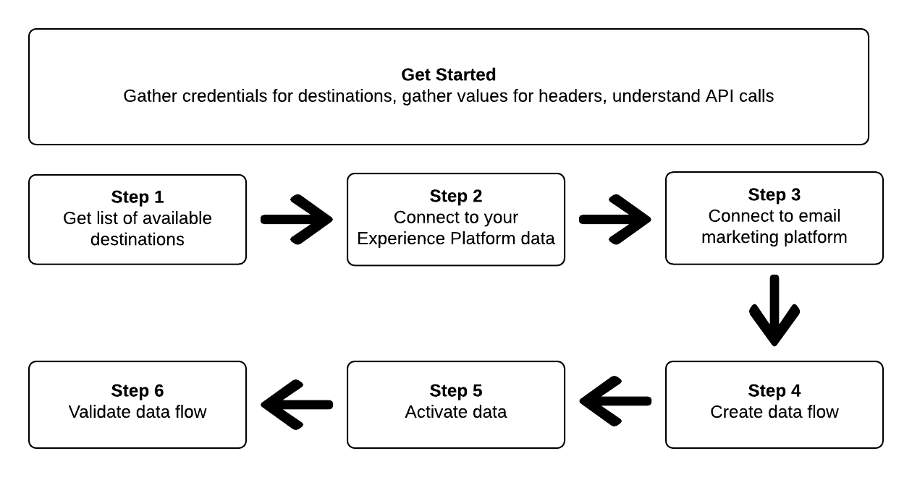
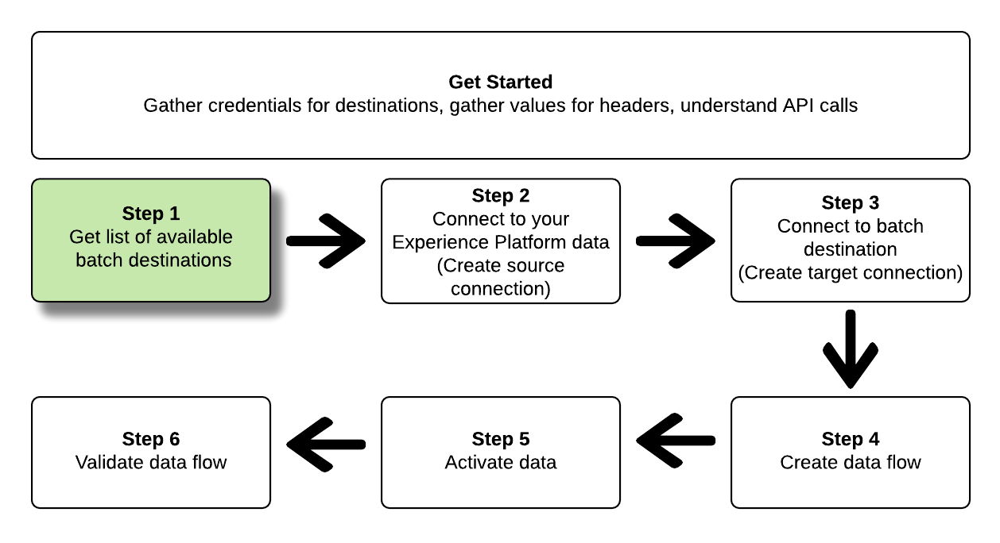
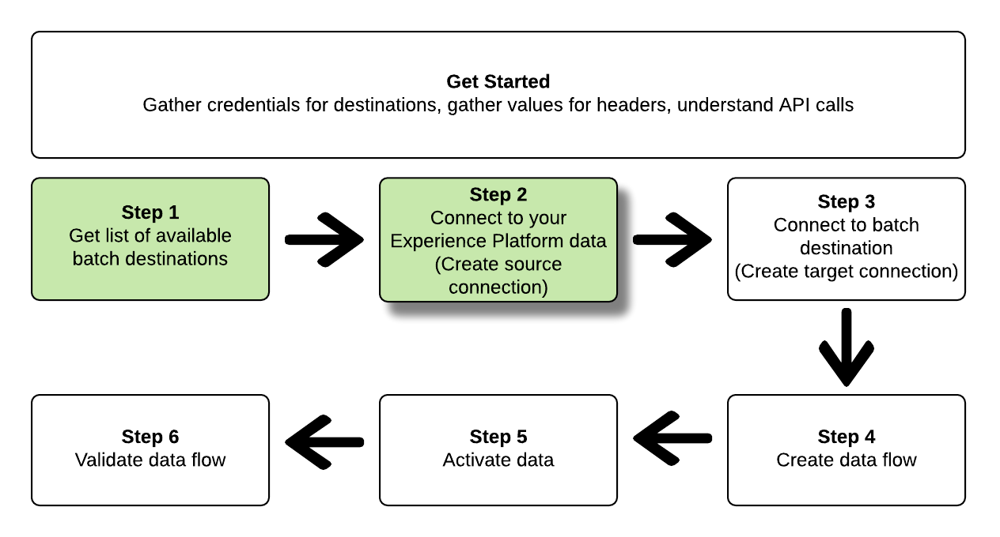
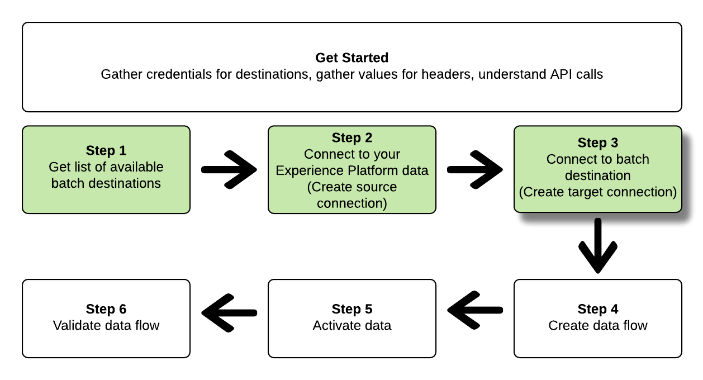
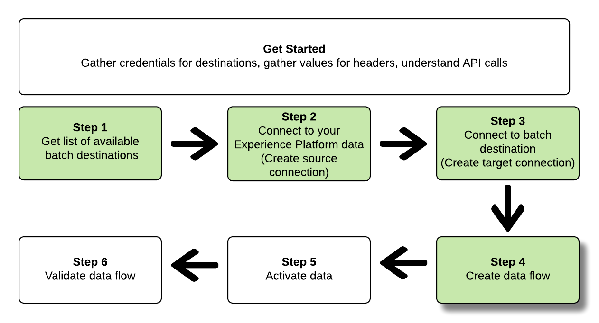
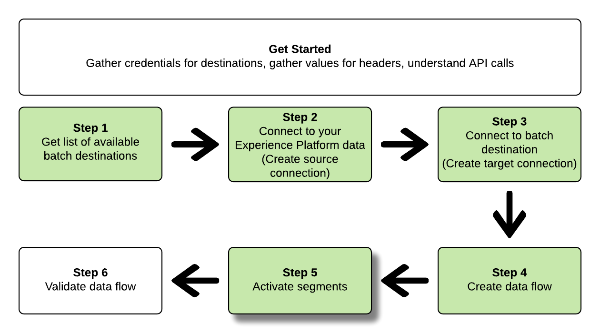
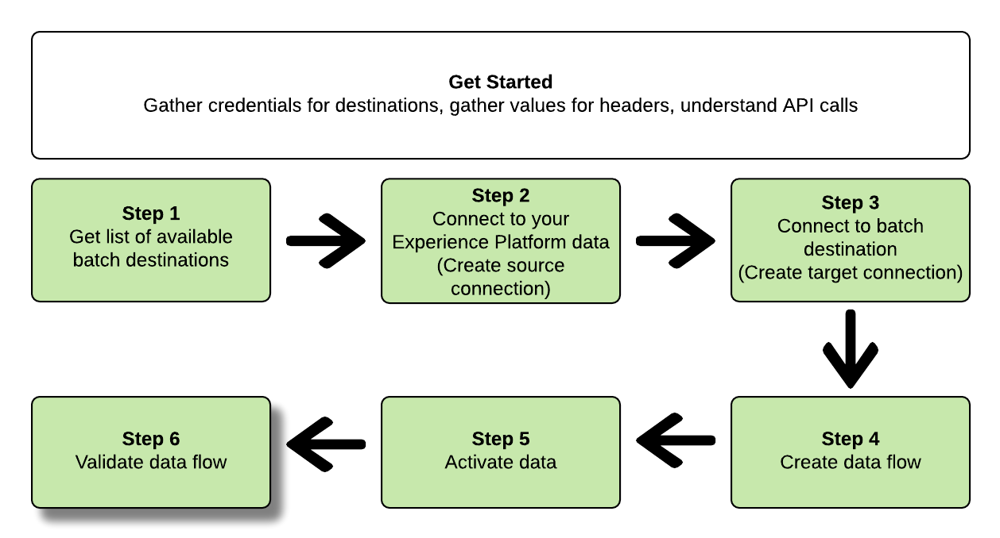

# Export datasets by using the Flow Service API

>[!IMPORTANT]
>
>* The functionality to export datasets is currently in Beta and is not available to all users. The documentation and the functionality are subject to change.
>* This beta functionality supports the export of first generation data, as defined in the Real-Time Customer Data Platform [product description](https://helpx.adobe.com/legal/product-descriptions/real-time-customer-data-platform-b2c-edition-prime-and-ultimate-packages.html).
>* This functionality is available to customers who have purchased the Real-Time CDP Prime and Ultimate package. Please contact your Adobe representative for more information. 

>[!IMPORTANT]
> 
>To connect to a destination, you need the **[!UICONTROL Manage Destinations]** [access control permission](/help/access-control/home.md#permissions). 
>
>To activate data, you need the **[!UICONTROL Manage Destinations]**, **[!UICONTROL Activate Destinations]**, **[!UICONTROL View Profiles]**, and **[!UICONTROL View Segments]** [access control permissions](/help/access-control/home.md#permissions).
>
>Read the [access control overview](/help/access-control/ui/overview.md) or contact your product administrator to obtain the required permissions.

This article explains the workflow required to use the Flow Service API to export [datasets](/help/catalog/datasets/overview.md) from Adobe Experience Platform to your preferred cloud storage location, such as [!DNL Amazon S3], SFTP locations, or [!DNL Google Cloud Storage].



If you prefer to use the Platform user interface to connect to a destination and activate data, see the [Connect a destination](../ui/connect-destination.md) and [Activate audience data to batch profile export destinations](../ui/activate-batch-profile-destinations.md) tutorials.

## Getting started {#get-started}

This guide requires a working understanding of the following components of Adobe Experience Platform:

*   [[!DNL Experience Platform datasets]](/help/catalog/datasets/overview.md): All data that is successfully ingested into Adobe Experience Platform is persisted within the [!DNL Data Lake] as datasets. A dataset is a storage and management construct for a collection of data, typically a table, that contains a schema (columns) and fields (rows). Datasets also contain metadata that describes various aspects of the data they store. 
*   [[!DNL Segmentation Service]](../../segmentation/api/overview.md): [!DNL Adobe Experience Platform Segmentation Service] allows you to build segments and generate audiences in [!DNL Adobe Experience Platform] from your [!DNL Real-Time Customer Profile] data.
*   [[!DNL Sandboxes]](../../sandboxes/home.md): [!DNL Experience Platform] provides virtual sandboxes which partition a single [!DNL Platform] instance into separate virtual environments to help develop and evolve digital experience applications.

The following sections provide additional information that you need to know in order to activate data to batch destinations in Platform.

### Gather connection spec and flow spec for your preferred destination

Before starting the workflow to export a dataset, identify the Connection and Flow Spec IDs of the destination to which you are trying activate data to. Use below table for reference.


### Reading sample API calls {#reading-sample-api-calls}

This tutorial provides example API calls to demonstrate how to format your requests. These include paths, required headers, and properly formatted request payloads. Sample JSON returned in API responses is also provided. For information on the conventions used in documentation for sample API calls, see the section on [how to read example API calls](../../landing/troubleshooting.md#how-do-i-format-an-api-request) in the [!DNL Experience Platform] troubleshooting guide.

### Gather values for required and optional headers {#gather-values-headers}

In order to make calls to [!DNL Platform] APIs, you must first complete the [authentication tutorial](https://www.adobe.com/go/platform-api-authentication-en). Completing the authentication tutorial provides the values for each of the required headers in all [!DNL Experience Platform] API calls, as shown below:

* Authorization: Bearer `{ACCESS_TOKEN}`
* x-api-key: `{API_KEY}`
* x-gw-ims-org-id: `{ORG_ID}`

Resources in [!DNL Experience Platform] can be isolated to specific virtual sandboxes. In requests to [!DNL Platform] APIs, you can specify the name and ID of the sandbox that the operation will take place in. These are optional parameters.

* x-sandbox-name: `{SANDBOX_NAME}`

>[!NOTE]
>
>For more information on sandboxes in [!DNL Experience Platform], see the [sandbox overview documentation](../../sandboxes/home.md).

All requests that contain a payload (POST, PUT, PATCH) require an additional media type header:

* Content-Type: `application/json`

### API reference documentation {#api-reference-documentation}

You can find accompanying reference documentation for all the API operations in this tutorial. Refer to the [Flow Service - Destinations API documentation on Adobe I/O](https://developer.adobe.com/experience-platform-apis/references/destinations/). We recommend that you use this tutorial and the API reference documentation in parallel.

## Get the list of available destinations {#get-the-list-of-available-destinations}



As a first step, you should decide which destination to activate data to. To begin with, perform a call to request a list of available destinations that you can connect and activate segments to. Perform the following GET request to the `connectionSpecs` endpoint to return a list of available destinations:

**API format**

```http
GET /connectionSpecs
```

**Request** 

```shell
curl --location --request GET 'https://platform.adobe.io/data/foundation/flowservice/connectionSpecs' \
--header 'accept: application/json' \
--header 'x-gw-ims-org-id: {ORG_ID}' \
--header 'x-api-key: {API_KEY}' \
--header 'x-sandbox-name: {SANDBOX_NAME}' \
--header 'Authorization: Bearer {ACCESS_TOKEN}'
```


**Response**

A successful response contains a list of available destinations and their unique identifiers (`id`). Store the value of the destination that you plan to use, as it will be required in further steps. For example, if you want to connect and deliver segments to [!DNL Adobe Campaign], look for the following snippet in the response:

```json
{
    "id": "0b23e41a-cb4a-4321-a78f-3b654f5d7d97",
  "name": "Adobe Campaign",
  ...
  ...
}
```

For your reference, the table below contains the connection spec IDs for commonly used batch destinations:

| Destination | Connection spec ID |
---------|----------|
| [!DNL Adobe Campaign] | `0b23e41a-cb4a-4321-a78f-3b654f5d7d97` |
| [!DNL Amazon S3] | `4890fc95-5a1f-4983-94bb-e060c08e3f81` |
| [!DNL Azure Blob] | `e258278b-a4cf-43ac-b158-4fa0ca0d948b` |
| [!DNL Oracle Eloqua] | `c1e44b6b-e7c8-404b-9031-58f0ef760604` |
| [!DNL Oracle Responsys] | `a5e28ddf-e265-426e-83a1-9d03a3a6822b` |
| [!DNL Salesforce Marketing Cloud] | `f599a5b3-60a7-4951-950a-cc4115c7ea27` |
| SFTP | `64ef4b8b-a6e0-41b5-9677-3805d1ee5dd0` |

{style="table-layout:auto"}

## Connect to your [!DNL Experience Platform] data {#connect-to-your-experience-platform-data}



Next, you must connect to your [!DNL Experience Platform] data, so you can export profile data and activate it in your preferred destination. This consists of two substeps which are described below.

1. First, you must perform a call to authorize access to your data in [!DNL Experience Platform], by setting up a base connection.
2. Then, using the base connection ID, perform another call in which you create a *source connection*, which establishes the connection to your [!DNL Experience Platform] data.

### Authorize access to your data in [!DNL Experience Platform]

**API format**

```http
POST /connections
```

**Request**

```shell
curl --location --request POST 'https://platform.adobe.io/data/foundation/flowservice/connections' \
--header 'Authorization: Bearer {ACCESS_TOKEN}' \
--header 'x-api-key: {API_KEY}' \
--header 'x-gw-ims-org-id: {ORG_ID}' \
--header 'x-sandbox-name: {SANDBOX_NAME}' \
--header 'Content-Type: application/json' \
--data-raw '{
            "name": "Base connection to Experience Platform",
            "description": "This call establishes the connection to Experience Platform data",
            "connectionSpec": {
                "id": "{CONNECTION_SPEC_ID}",
                "version": "1.0"
            }
}'
```

| Property | Description |
| --------- | ----------- |
|`name`| Provide a name for the base connection to the Experience Platform [!DNL Profile Store]. |
|`description` | Optionally, you can provide a description for the base connection. |
| `connectionSpec.id`| Use the connection spec ID for the [Experience Platform Profile Store](/help/profile/home.md#profile-data-store) - `8a9c3494-9708-43d7-ae3f-cda01e5030e1`.|

{style="table-layout:auto"}

**Response**

A successful response contains the base connection's unique identifier (`id`). Store this value as it is required in the next step to create the source connection.

```json
{
    "id": "1ed86558-59b5-42f7-9865-5859b552f7f4"
}
```

### Connect to your [!DNL Experience Platform] data {#connect-to-platform-data}

**API format**

```http
POST /sourceConnections
```

**Request**

```shell
curl --location --request POST 'https://platform.adobe.io/data/foundation/flowservice/sourceConnections' \
--header 'Authorization: Bearer {ACCESS_TOKEN}' \
--header 'x-api-key: {API_KEY}' \
--header 'x-gw-ims-org-id: {ORG_ID}' \
--header 'x-sandbox-name: {SANDBOX_NAME}' \
--header 'Content-Type: application/json' \
--data-raw '{
            "name": "Connecting to Profile Store",
            "description": "Optional",
            "connectionSpec": {
                "id": "{CONNECTION_SPEC_ID}",
                "version": "1.0"
            },
            "baseConnectionId": "{BASE_CONNECTION_ID}",
            "data": {
                "format": "CSV",
                "schema": null
            },
            "params" : {}
}'
```

| Property | Description |
| --------- | ----------- |
|`name`| Provide a name for the source connection to the Experience Platform [!DNL Profile Store]. |
|`description` | Optionally, you can provide a description for the source connection. |
| `connectionSpec.id`| Use the connection spec ID for the [Experience Platform Profile Store](/help/profile/home.md#profile-data-store) - `8a9c3494-9708-43d7-ae3f-cda01e5030e1`.|
| `baseConnectionId`| Use the base connection ID you have obtained in the previous step.|
| `data.format`| `CSV` is currently the only supported file export format.|

{style="table-layout:auto"}

**Response**

A successful response returns the unique identifier (`id`) for the newly created source connection to [!DNL Profile Store]. This confirms that you have successfully connected to your [!DNL Experience Platform] data. Store this value as it is required in a later step.

```json
{
    "id": "ed48ae9b-c774-4b6e-88ae-9bc7748b6e97"
}
```

## Connect to batch destination {#connect-to-batch-destination}



In this step, you are setting up a connection to your desired batch cloud storage or email marketing destination. This consists of two substeps which are described below.

1. First, you must perform a call to authorize access to the destination platform, by setting up a base connection.
2. Then, using the base connection ID, you will make another call in which you create a *target connection*, which specifies the location in your storage account where the exported data files will be delivered, as well as the format of the data that will be exported.

### Authorize access to the batch destination {#authorize-access-to-batch-destination}

**API format**

```http
POST /connections
```

**Request**

The request below establishes a base connection to [!DNL Adobe Campaign] destinations. Depending on the storage location where you want to export files to ([!DNL Amazon S3], SFTP, [!DNL Azure Blob]), keep the appropriate `auth` specification and delete the others.

```shell
curl --location --request POST 'https://platform.adobe.io/data/foundation/flowservice/connections' \
--header 'Authorization: Bearer {ACCESS_TOKEN}' \
--header 'x-api-key: {API_KEY}' \
--header 'x-gw-ims-org-id: {ORG_ID}' \
--header 'x-sandbox-name: {SANDBOX_NAME}' \
--header 'Content-Type: application/json' \
--data-raw '{
    "name": "S3 Connection for Adobe Campaign",
    "description": "summer advertising campaign",
    "connectionSpec": {
        "id": "0b23e41a-cb4a-4321-a78f-3b654f5d7d97",
        "version": "1.0"
    },
    "auth": {
        "specName": "S3",
        "params": {
            "accessId": "{ACCESS_ID}",
            "secretKey": "{SECRET_KEY}"
        }
    }
    "auth": {
        "specName": "SFTP with Password",
        "params": {
            "domain": "{DOMAIN}",
            "host": "{HOST}",
            "username": "{USERNAME}",
            "password": "{PASSWORD}"
        }
    }
    "auth": {
        "specName": "SFTP with SSH Key",
        "params": {
            "domain": "{DOMAIN}",
            "host": "{HOST}",
            "username": "{USERNAME}",
            "sshKey": "{SSH_KEY}"
        }
    }        
    "auth": {
        "specName": "Azure Blob",
        "params": {
            "connectionString": "{AZURE_BLOB_CONNECTION_STRING}"
        }
    }    
}'
```

See the example requests below to connect to other supported batch cloud storage and email marketing destinations.

+++ Example request to connect to [!DNL Amazon S3] destinations

The request below establishes a base connection to [!DNL Amazon S3] destinations.

```shell
curl --location --request POST 'https://platform.adobe.io/data/foundation/flowservice/connections' \
--header 'Authorization: Bearer {ACCESS_TOKEN}' \
--header 'x-api-key: {API_KEY}' \
--header 'x-gw-ims-org-id: {ORG_ID}' \
--header 'x-sandbox-name: {SANDBOX_NAME}' \
--header 'Content-Type: application/json' \
--data-raw '{
    "name": "Connect to Amazon S3",
    "description": "summer advertising campaign",
    "connectionSpec": {
        "id": "4890fc95-5a1f-4983-94bb-e060c08e3f81",
        "version": "1.0"
    },
    "auth": {
        "specName": "Access Key",
        "params": {
            "s3AccessKey": "{AMAZON_S3_ACCESS_KEY}",
            "s3SecretKey": "{AMAZON_S3_SECRET_KEY}"
        }
    }
}'
```

+++

+++ Example request to connect to [!DNL Azure Blob] destinations

The request below establishes a base connection to [!DNL Azure Blob] destinations.

```shell
curl --location --request POST 'https://platform.adobe.io/data/foundation/flowservice/connections' \
--header 'Authorization: Bearer {ACCESS_TOKEN}' \
--header 'x-api-key: {API_KEY}' \
--header 'x-gw-ims-org-id: {ORG_ID}' \
--header 'x-sandbox-name: {SANDBOX_NAME}' \
--header 'Content-Type: application/json' \
--data-raw '{
    "name": "Connect to Azure Blob",
    "description": "Summer advertising campaign",
    "connectionSpec": {
        "id": "e258278b-a4cf-43ac-b158-4fa0ca0d948b",
        "version": "1.0"
    },
    "auth": {
        "specName": "ConnectionString",
        "params": {
            "connectionString": "{AZURE_BLOB_CONNECTION_STRING}"
        }
    }
}'
```

+++

+++ Example request to connect to [!DNL Oracle Eloqua] destinations

The request below establishes a base connection to [!DNL Oracle Eloqua] destinations. Depending on the storage location where you want to export files to, keep the appropriate `auth` specification and delete the others.

```shell
curl --location --request POST 'https://platform.adobe.io/data/foundation/flowservice/connections' \
--header 'Authorization: Bearer {ACCESS_TOKEN}' \
--header 'x-api-key: {API_KEY}' \
--header 'x-gw-ims-org-id: {ORG_ID}' \
--header 'x-sandbox-name: {SANDBOX_NAME}' \
--header 'Content-Type: application/json' \
--data-raw '{
    "name": "Connect to Eloqua destination",
    "description": "summer advertising campaign",
    "connectionSpec": {
        "id": "c1e44b6b-e7c8-404b-9031-58f0ef760604",
        "version": "1.0"
    },
    "auth": {
        "specName": "SFTP with Password",
        "params": {
            "domain": "{DOMAIN}",
            "host": "{HOST}",
            "username": "{USERNAME}",
            "password": "{PASSWORD}"
        }
    }
    "auth": {
        "specName": "SFTP with SSH Key",
        "params": {
            "domain": "{DOMAIN}",
            "host": "{HOST}",
            "username": "{USERNAME}",
            "sshKey": "{SSH_KEY}"
        }
    }    
}'
```

+++

+++ Example request to connect to [!DNL Oracle Responsys] destinations

The request below establishes a base connection to [!DNL Oracle Responsys] destinations. Depending on the storage location where you want to export files to, keep the appropriate `auth` specification and delete the others.

```shell
curl --location --request POST 'https://platform.adobe.io/data/foundation/flowservice/connections' \
--header 'Authorization: Bearer {ACCESS_TOKEN}' \
--header 'x-api-key: {API_KEY}' \
--header 'x-gw-ims-org-id: {ORG_ID}' \
--header 'x-sandbox-name: {SANDBOX_NAME}' \
--header 'Content-Type: application/json' \
--data-raw '{
    "name": "Connect to Responsys destination",
    "description": "summer advertising campaign",
    "connectionSpec": {
        "id": "a5e28ddf-e265-426e-83a1-9d03a3a6822b",
        "version": "1.0"
    },
    "auth": {
        "specName": "SFTP with Password",
        "params": {
            "domain": "{DOMAIN}",
            "host": "{HOST}",
            "username": "{USERNAME}",
            "password": "{PASSWORD}"
        }
    }
    "auth": {
        "specName": "SFTP with SSH Key",
        "params": {
            "domain": "{DOMAIN}",
            "host": "{HOST}",
            "username": "{USERNAME}",
            "sshKey": "{SSH_KEY}"
        }
    }    
}'
```

+++

+++ Example request to connect to [!DNL Salesforce Marketing Cloud] destinations

The request below establishes a base connection to [!DNL Salesforce Marketing Cloud] destinations. Depending on the storage location where you want to export files to, keep the appropriate `auth` specification and delete the others.

```shell
curl --location --request POST 'https://platform.adobe.io/data/foundation/flowservice/connections' \
--header 'Authorization: Bearer {ACCESS_TOKEN}' \
--header 'x-api-key: {API_KEY}' \
--header 'x-gw-ims-org-id: {ORG_ID}' \
--header 'x-sandbox-name: {SANDBOX_NAME}' \
--header 'Content-Type: application/json' \
--data-raw '{
    "name": "Connect to Salesforce Marketing Cloud",
    "description": "summer advertising campaign",
    "connectionSpec": {
        "id": "f599a5b3-60a7-4951-950a-cc4115c7ea27",
        "version": "1.0"
    },
    "auth": {
        "specName": "SFTP with Password",
        "params": {
            "domain": "{DOMAIN}",
            "host": "{HOST}",
            "username": "{USERNAME}",
            "password": "{PASSWORD}"
        }
    }
    "auth": {
        "specName": "SFTP with SSH Key",
        "params": {
            "domain": "{DOMAIN}",
            "host": "{HOST}",
            "username": "{USERNAME}",
            "sshKey": "{SSH_KEY}"
        }
    }    
}'
```

+++

+++ Example request to connect to SFTP with password destinations

The request below establishes a base connection to SFTP destinations.

```shell
curl --location --request POST 'https://platform.adobe.io/data/foundation/flowservice/connections' \
--header 'Authorization: Bearer {ACCESS_TOKEN}' \
--header 'x-api-key: {API_KEY}' \
--header 'x-gw-ims-org-id: {ORG_ID}' \
--header 'x-sandbox-name: {SANDBOX_NAME}' \
--header 'Content-Type: application/json' \
--data-raw '{
    "name": "Connect to SFTP with password",
    "description": "summer advertising campaign",
    "connectionSpec": {
        "id": "64ef4b8b-a6e0-41b5-9677-3805d1ee5dd0",
        "version": "1.0"
    },
    "auth": {
        "specName": "Basic Authentication for sftp",
        "params": {
            "host": "{HOST}",
            "username": "{USERNAME}",
            "password": "{PASSWORD}"
        }
    }
}'
```

+++

| Property | Description |
| --------- | ----------- |
|`name`| Provide a name for the base connection to the batch destination. |
|`description` | Optionally, you can provide a description for the base connection. |
| `connectionSpec.id`| Use the connection spec ID for your desired batch destination. You obtained this ID in the step [Get the list of available destinations](#get-the-list-of-available-destinations).|
| `auth.specname`| Indicates the authentication format for the destination. To find out the specName for your destination, perform a [GET call to the connection specs endpoint](https://developer.adobe.com/experience-platform-apis/references/flow-service/#operation/retrieveConnectionSpec), providing the connection spec of your desired destination. Look for the parameter `authSpec.name` in the response. <br> For example, for Adobe Campaign destinations, you can use any of `S3`, `SFTP with Password`, or `SFTP with SSH Key`. |
| `params`| Depending on the destination that you are connecting to, you must provide different required authentication parameters. For Amazon S3 connections, you must provide your access ID and secret key to your Amazon S3 storage location. <br> To find out the required parameters for your destination, perform a [GET call to the connection specs endpoint](https://developer.adobe.com/experience-platform-apis/references/flow-service/#operation/retrieveConnectionSpec), providing the connection spec of your desired destination. Look for the parameter `authSpec.spec.required` in the response. |

{style="table-layout:auto"}

**Response**

A successful response contains the base connection's unique identifier (`id`). Store this value as it is required in the next step to create a target connection.

```json
{
    "id": "1ed86558-59b5-42f7-9865-5859b552f7f4"
}
```

### Specify storage location and data format {#specify-storage-location-data-format}

[!DNL Adobe Experience Platform] exports data for batch email marketing and cloud storage destinations in the form of [!DNL CSV] files. In this step, you can determine the path in your storage location where the files will be exported.

>[!IMPORTANT]
> 
>[!DNL Adobe Experience Platform] automatically splits the export files at 5 million records (rows) per file. Each row represents one profile.
>
>Split file names are appended with a number that indicates the file is part of a larger export, as such: `filename.csv`, `filename_2.csv`, `filename_3.csv`.

**API format**

```http
POST /targetConnections
```

**Request**

The request below establishes a target connection to [!DNL Adobe Campaign] destinations, to determine where the exported files will land in your storage location. Depending on the storage location where you want to export files to, keep the appropriate `params` specification and delete the others.

```shell
curl --location --request POST 'https://platform.adobe.io/data/foundation/flowservice/targetConnections' \
--header 'Authorization: Bearer {ACCESS_TOKEN}' \
--header 'x-api-key: {API_KEY}' \
--header 'x-gw-ims-org-id: {ORG_ID}' \
--header 'Content-Type: application/json' \
--data-raw '{
    "name": "TargetConnection for Adobe Campaign",
    "description": "Connection to Adobe Campaign",
    "baseConnectionId": "{BASE_CONNECTION_ID}",
    "connectionSpec": {
        "id": "0b23e41a-cb4a-4321-a78f-3b654f5d7d97",
        "version": "1.0"
    },
    "data": {
        "format": "json",
        "schema": {
            "id": "1.0",
            "version": "1.0"
        }
    },
    "params": {
        "mode": "S3",
        "bucketName": "{BUCKET_NAME}",
        "path": "{FILEPATH}",
        "format": "CSV"
    }
    "params": {
        "mode": "AZURE_BLOB",
        "container": "{CONTAINER}",
        "path": "{FILEPATH}",
        "format": "CSV"
    }
    "params": {
        "mode": "FTP",
        "remotePath": "{REMOTE_PATH}",
        "format": "CSV"
    }        
}'
```

See the example requests below to set up a storage location for other supported batch cloud storage and email marketing destinations.

+++ Example request to set up a storage location for [!DNL Amazon S3] destinations

The request below establishes a target connection to [!DNL Amazon S3] destinations, to determine where the exported files will land in your storage location.

```shell
curl --location --request POST 'https://platform.adobe.io/data/foundation/flowservice/targetConnections' \
--header 'Authorization: Bearer {ACCESS_TOKEN}' \
--header 'x-api-key: {API_KEY}' \
--header 'x-gw-ims-org-id: {ORG_ID}' \
--header 'Content-Type: application/json' \
--data-raw '{
    "name": "TargetConnection for Amazon S3",
    "description": "Connection to Amazon S3",
    "baseConnectionId": "{BASE_CONNECTION_ID}",
    "connectionSpec": {
        "id": "4890fc95-5a1f-4983-94bb-e060c08e3f81",
        "version": "1.0"
    },
    "data": {
        "format": "json",
        "schema": {
            "id": "1.0",
            "version": "1.0"
        }
    },
    "params": {
        "mode": "S3",
        "bucketName": "{BUCKET_NAME}",
        "path": "{FILEPATH}",
        "format": "CSV"
    }
}'
```

+++

+++ Example request to set up a storage location for [!DNL Azure Blob] destinations

The request below establishes a target connection to [!DNL Azure Blob] destinations, to determine where the exported files will land in your storage location.

```shell
curl --location --request POST 'https://platform.adobe.io/data/foundation/flowservice/targetConnections' \
--header 'Authorization: Bearer {ACCESS_TOKEN}' \
--header 'x-api-key: {API_KEY}' \
--header 'x-gw-ims-org-id: {ORG_ID}' \
--header 'Content-Type: application/json' \
--data-raw '{
    "name": "TargetConnection for Azure Blob",
    "description": "Connection to Azure Blob",
    "baseConnectionId": "{BASE_CONNECTION_ID}",
    "connectionSpec": {
        "id": "e258278b-a4cf-43ac-b158-4fa0ca0d948b",
        "version": "1.0"
    },
    "data": {
        "format": "json",
        "schema": {
            "id": "1.0",
            "version": "1.0"
        }
    },
    "params": {
        "mode": "AZURE_BLOB",
        "container": "{CONTAINER}",
        "path": "{FILEPATH}",
        "format": "CSV"
    }
}'
```

+++

+++ Example request to set up a storage location for [!DNL Oracle Eloqua] destinations

The request below establishes a target connection to [!DNL Oracle Eloqua] destinations, to determine where the exported files will land in your storage location. Depending on the storage location where you want to export files to, keep the appropriate `params` specification and delete the others.

```shell
curl --location --request POST 'https://platform.adobe.io/data/foundation/flowservice/targetConnections' \
--header 'Authorization: Bearer {ACCESS_TOKEN}' \
--header 'x-api-key: {API_KEY}' \
--header 'x-gw-ims-org-id: {ORG_ID}' \
--header 'Content-Type: application/json' \
--data-raw '{
    "name": "TargetConnection for Oracle Eloqua",
    "description": "Connection to Oracle Eloqua",
    "baseConnectionId": "{BASE_CONNECTION_ID}",
    "connectionSpec": {
        "id": "c1e44b6b-e7c8-404b-9031-58f0ef760604",
        "version": "1.0"
    },
    "data": {
        "format": "json",
        "schema": {
            "id": "1.0",
            "version": "1.0"
        }
    },
    "params": {
        "mode": "S3",
        "bucketName": "{BUCKET_NAME}",
        "path": "{FILEPATH}",
        "format": "CSV"
    }
    "params": {
        "mode": "FTP",
        "remotePath": "{REMOTE_PATH}",
        "format": "CSV"
    }        
}'
```

+++

+++ Example request to set up a storage location for [!DNL Oracle Responsys] destinations

The request below establishes a target connection to [!DNL Oracle Responsys] destinations, to determine where the exported files will land in your storage location. Depending on the storage location where you want to export files to, keep the appropriate `params` specification and delete the others.

```shell
curl --location --request POST 'https://platform.adobe.io/data/foundation/flowservice/targetConnections' \
--header 'Authorization: Bearer {ACCESS_TOKEN}' \
--header 'x-api-key: {API_KEY}' \
--header 'x-gw-ims-org-id: {ORG_ID}' \
--header 'Content-Type: application/json' \
--data-raw '{
    "name": "TargetConnection for Oracle Responsys",
    "description": "Connection to Oracle Responsys",
    "baseConnectionId": "{BASE_CONNECTION_ID}",
    "connectionSpec": {
        "id": "a5e28ddf-e265-426e-83a1-9d03a3a6822b",
        "version": "1.0"
    },
    "data": {
        "format": "json",
        "schema": {
            "id": "1.0",
            "version": "1.0"
        }
    },
    "params": {
        "mode": "S3",
        "bucketName": "{BUCKET_NAME}",
        "path": "{FILEPATH}",
        "format": "CSV"
    }
    "params": {
        "mode": "FTP",
        "remotePath": "{REMOTE_PATH}",
        "format": "CSV"
    }        
}'
```

+++

+++ Example request to set up a storage location for [!DNL Salesforce Marketing Cloud] destinations

The request below establishes a target connection to [!DNL Salesforce Marketing Cloud] destinations, to determine where the exported files will land in your storage location. Depending on the storage location where you want to export files to, keep the appropriate `params` specification and delete the others.

```shell
curl --location --request POST 'https://platform.adobe.io/data/foundation/flowservice/targetConnections' \
--header 'Authorization: Bearer {ACCESS_TOKEN}' \
--header 'x-api-key: {API_KEY}' \
--header 'x-gw-ims-org-id: {ORG_ID}' \
--header 'Content-Type: application/json' \
--data-raw '{
    "name": "TargetConnection for Salesforce Marketing Cloud",
    "description": "Connection to Salesforce Marketing Cloud",
    "baseConnectionId": "{BASE_CONNECTION_ID}",
    "connectionSpec": {
        "id": "f599a5b3-60a7-4951-950a-cc4115c7ea27",
        "version": "1.0"
    },
    "data": {
        "format": "json",
        "schema": {
            "id": "1.0",
            "version": "1.0"
        }
    },
    "params": {
        "mode": "S3",
        "bucketName": "{BUCKET_NAME}",
        "path": "{FILEPATH}",
        "format": "CSV"
    }
    "params": {
        "mode": "FTP",
        "remotePath": "{REMOTE_PATH}",
        "format": "CSV"
    }        
}'
```

+++

+++ Example request to set up a storage location for SFTP destinations

The request below establishes a target connection to SFTP destinations, to determine where the exported files will land in your storage location.

```shell
curl --location --request POST 'https://platform.adobe.io/data/foundation/flowservice/targetConnections' \
--header 'Authorization: Bearer {ACCESS_TOKEN}' \
--header 'x-api-key: {API_KEY}' \
--header 'x-gw-ims-org-id: {ORG_ID}' \
--header 'Content-Type: application/json' \
--data-raw '{
    "name": "TargetConnection for SFTP",
    "description": "Connection to SFTP",
    "baseConnectionId": "{BASE_CONNECTION_ID}",
    "connectionSpec": {
        "id": "64ef4b8b-a6e0-41b5-9677-3805d1ee5dd0",
        "version": "1.0"
    },
    "data": {
        "format": "json",
        "schema": {
            "id": "1.0",
            "version": "1.0"
        }
    },
    "params": {
        "mode": "FTP",
        "remotePath": "{REMOTE_PATH}",
    }
}'
```

+++


| Property | Description |
| --------- | ----------- |
|`name`| Provide a name for the target connection to the batch destination. |
|`description` | Optionally, you can provide a description for the target connection. |
| `baseConnectionId`| Use the ID of the base connection you created in the step above.|
| `connectionSpec.id`| Use the connection spec ID for your desired batch destination. You obtained this ID in the step [Get the list of available destinations](#get-the-list-of-available-destinations).|
| `params`| Depending on the destination that you are connecting to, you must provide different required parameters to your storage location. For Amazon S3 connections, you must provide your access ID and secret key to your Amazon S3 storage location. <br> To find out the required parameters for your destination, perform a [GET call to the connection specs endpoint](https://developer.adobe.com/experience-platform-apis/references/flow-service/#operation/retrieveConnectionSpec), providing the connection spec of your desired destination. Look for the parameter `targetSpec.spec.required` in the response. |
| `params.mode`| Depending on the supported mode for your destination, you must provide a different value here. To find out the required parameters for your destination, perform a [GET call to the connection specs endpoint](https://developer.adobe.com/experience-platform-apis/references/flow-service/#operation/retrieveConnectionSpec), providing the connection spec of your desired destination. Look for the parameter `targetSpec.spec.properties.mode.enum` in the response and select the desired mode.   |
| `params.bucketName`| For S3 connections, provide the name of the bucket where files will be exported. |
| `params.path`| For S3 connections, provide the file path in your storage location where files will be exported. |
| `params.format`| `CSV` is currently the only supported file export type. |

{style="table-layout:auto"}

**Response**

A successful response returns the unique identifier (`id`) for the newly created target connection to your batch destination. Store this value as it is required in later steps.

```json
{
    "id": "12ab90c7-519c-4291-bd20-d64186b62da8"
}
```

## Create a dataflow {#create-dataflow}



Using the flow spec, source connection, and target connection IDs that you obtained in the previous steps, you can now create a dataflow between your [!DNL Experience Platform] data and the destination where you will export data files. Think of this step as constructing the pipeline through which data will later flow between [!DNL Experience Platform] and your desired destination.

To create a dataflow, perform a POST request as shown below, while providing the values mentioned below within the payload.

**API format**

```http
POST /flows
```

**Request**

```shell
curl -X POST \
'https://platform.adobe.io/data/foundation/flowservice/flows' \
-H 'Authorization: Bearer {ACCESS_TOKEN}' \
-H 'x-api-key: {API_KEY}' \
-H 'x-gw-ims-org-id: {ORG_ID}' \
-H 'x-sandbox-name: {SANDBOX_NAME}' \
-H 'Content-Type: application/json' \
-d  '{
   
        "name": "Activate segments to Adobe Campaign",
        "description": "This operation creates a dataflow which we will later use to activate segments to Adobe Campaign",
        "flowSpec": {
            "id": "{FLOW_SPEC_ID}",
            "version": "1.0"
        },
        "sourceConnectionIds": [
            "{SOURCE_CONNECTION_ID}"
        ],
        "targetConnectionIds": [
            "{TARGET_CONNECTION_ID}"
        ],
        "transformations": [
            {
                "name": "GeneralTransform",
                "params": {
                    "segmentSelectors": {
                        "selectors": []
                    },
                    "profileSelectors": {
                        "selectors": []
                    }
                }
            }
        ]
    }
```

| Property | Description |
| --------- | ----------- |
|`name`| Provide a name for the dataflow you are creating. |
|`description` | Optionally, you can provide a description for the dataflow. |
| `flowSpec.Id`| Use the flow spec ID for the batch destination that you want to connect to. To retrieve the flow spec ID, perform a GET operation on the `flowspecs` endpoint, as shown in the [flow specs API reference documentation](https://www.adobe.io/experience-platform-apis/references/flow-service/#operation/retrieveFlowSpec). In the response, look for `upsTo` and copy the corresponding ID of the batch destination that you want to connect to. For example, for Adobe Campaign, look for `upsToCampaign` and copy the `id` parameter.|
| `sourceConnectionIds`| Use the source connection ID you obtained in the step [Connect to your Experience Platform data](#connect-to-your-experience-platform-data).|
| `targetConnectionIds`| Use the target connection ID you obtained in the step [Connect to batch destination](#connect-to-batch-destination).|
| `transformations`| In the next step, you will populate this section with the segments and profile attributes to be activated. |

For your reference, the table below contains the flow spec IDs for commonly used batch destinations:

| Destination | Flow spec ID |
---------|----------|
| All cloud storage destinations ([!DNL Amazon S3], SFTP, [!DNL Azure Blob]) and [!DNL Oracle Eloqua] | `71471eba-b620-49e4-90fd-23f1fa0174d8` |
| [!DNL Oracle Responsys] | `51d675ce-e270-408d-91fc-22717bdf2148` |
| [!DNL Salesforce Marketing Cloud] | `493b2bd6-26e4-4167-ab3b-5e910bba44f0` |

**Response**

A successful response returns the ID (`id`) of the newly created dataflow and an `etag`. Note down both values as you will need them in the next step, to activate segments and export data files.

```json
{
    "id": "8256cfb4-17e6-432c-a469-6aedafb16cd5",
    "etag": "8256cfb4-17e6-432c-a469-6aedafb16cd5"
}
```


## Activate data to your new destination {#activate-data}



Having created all the connections and the dataflow, you now can activate your profile data to the destination platform. In this step, you select which segments and which profile attributes to export to the destination.

You can also determine the file naming format of the exported files and which attributes should be used as [deduplication keys](../ui/activate-batch-profile-destinations.md#mandatory-keys) or [mandatory attributes](../ui/activate-batch-profile-destinations.md#mandatory-attributes). In this step, you can also determine the schedule to send data to the destination.

To activate segments to your new destination, you must perform a JSON PATCH operation, similar to the example below. You can activate mutiple segments and profile attributes in one call. To learn more about JSON PATCH, see the [RFC specification](https://tools.ietf.org/html/rfc6902). 

**API format**

```http
PATCH /flows
```

**Request**

```shell
curl --location --request PATCH 'https://platform.adobe.io/data/foundation/flowservice/flows/{DATAFLOW_ID}' \
--header 'Authorization: Bearer {ACCESS_TOKEN}' \
--header 'x-api-key: {API_KEY}' \
--header 'x-gw-ims-org-id: {ORG_ID}' \
--header 'Content-Type: application/json' \
--header 'x-sandbox-name: {SANDBOX_NAME}' \
--header 'If-Match: "{ETAG}"' \
--data-raw '[
    {
        "op": "add",
        "path": "/transformations/0/params/segmentSelectors/selectors/-",
        "value": {
            "type": "PLATFORM_SEGMENT",
            "value": {
                "name": "Name of the segment that you are activating",
                "description": "Description of the segment that you are activating",
                "id": "{SEGMENT_ID}",
                "filenameTemplate": "%DESTINATION_NAME%_%SEGMENT_ID%_%DATETIME(YYYYMMdd_HHmmss)%",
                "exportMode": "DAILY_FULL_EXPORT",
                "schedule": {
                    "frequency": "ONCE",
                    "startDate": "2021-12-20",
                    "startTime": "17:00"
                } 
            }
        }
    },
{
        "op": "add",
        "path": "/transformations/0/params/segmentSelectors/selectors/-",
        "value": {
            "type": "PLATFORM_SEGMENT",
            "value": {
                "name": "Name of the segment that you are activating",
                "description": "Description of the segment that you are activating",
                "id": "{SEGMENT_ID}",
                "filenameTemplate": "%DESTINATION_NAME%_%SEGMENT_ID%_%DATETIME(YYYYMMdd_HHmmss)%",
                "exportMode": "DAILY_FULL_EXPORT",
                "schedule": {
                    "frequency": "ONCE",
                    "triggerType": "SCHEDULED",
                    "startDate": "2021-12-20",
                    "startTime": "17:00"
                },   
            }
        }
    },
{
        "op": "add",
        "path": "/transformations/0/params/profileSelectors/selectors/-",
        "value": {
            "type": "JSON_PATH",
            "value": {
                "path": "{PROFILE_ATTRIBUTE}"
            }
        }
    }
]

```

| Property | Description |
| --------- | ----------- |
|`{DATAFLOW_ID}`| In the URL, use the ID of the dataflow that you created in the previous step. |
|`{ETAG}` | Get the `{ETAG}` from the response in the previous step, [Create a dataflow](#create-dataflow). The response format in the previous step has escaped quotes. You must use the unescaped values in the header of the request. See the example below: <br> <ul><li>Response example: `"etag":""7400453a-0000-1a00-0000-62b1c7a90000""`</li><li>Value to use in your request: `"etag": "7400453a-0000-1a00-0000-62b1c7a90000"`</li></ul> <br> The etag value updates with every successful update of a dataflow. |
| `{SEGMENT_ID}`| Provide the segment ID that you want to export to this destination. To retrieve segment IDs for the segments that you want to activate, see [retrieve a segment definition](https://www.adobe.io/experience-platform-apis/references/segmentation/#operation/retrieveSegmentDefinitionById) in the Experience Platform API reference. |
| `{PROFILE_ATTRIBUTE}`| For example, `"person.lastName"` |
| `op` | The operation call used to define the action needed to update the dataflow. Operations include: `add`, `replace`, and `remove`. To add a segment to a dataflow, use the `add` operation. |
| `path` | Defines the part of the flow that is to be updated. When adding a segment to a dataflow, use the path specified in the example. |
| `value` | The new value you want to update your parameter with. |
| `id` | Specify the ID of the segment you are adding to the destination dataflow.  |
| `name` | *Optional*. Specify the name of the segment you are adding to the destination dataflow. Note that this field is not mandatory and you can successfully add a segment to the destination dataflow without providing its name. |
| `filenameTemplate` | This field determines the file name format of the files that are exported to your destination. <br> The following options are available: <br> <ul><li>`%DESTINATION_NAME%`: Mandatory. The exported files contain the destination name.</li><li>`%SEGMENT_ID%`: Mandatory. The exported files contain the ID of the exported segment.</li><li>`%SEGMENT_NAME%`: Optional. The exported files contain the name of the exported segment.</li><li>`DATETIME(YYYYMMdd_HHmmss)` or `%TIMESTAMP%`: Optional. Select one of these two options for your files to include the time when they are generated by Experience Platform.</li><li>`custom-text`: Optional. Replace this placeholder with any custom text that you would like to append at the end of your file names.</li></ul> <br> For more information about configuring file names, refer to the [configure file names](/help/destinations/ui/activate-batch-profile-destinations.md#file-names) section in the batch destinations activation tutorial.  |
| `exportMode` | Mandatory. Select `"DAILY_FULL_EXPORT"` or `"FIRST_FULL_THEN_INCREMENTAL"`. For more information about the two options, refer to [export full files](/help/destinations/ui/activate-batch-profile-destinations.md#export-full-files) and [export incremental files](/help/destinations/ui/activate-batch-profile-destinations.md#export-incremental-files) in the batch destinations activation tutorial. |
| `startDate` | Select the date when the segment should start exporting profiles to your destination. |
| `frequency` | Mandatory. <br> <ul><li>For the `"DAILY_FULL_EXPORT"` export mode, you can select `ONCE` or `DAILY`.</li><li>For the `"FIRST_FULL_THEN_INCREMENTAL"` export mode, you can select `"DAILY"`, `"EVERY_3_HOURS"`, `"EVERY_6_HOURS"`, `"EVERY_8_HOURS"`, `"EVERY_12_HOURS"`.</li></ul>   |
| `triggerType` | For *batch destinations* only. This field is required only when selecting the `"DAILY_FULL_EXPORT"` mode in the `frequency` selector. <br> Mandatory. <br> <ul><li>Select `"AFTER_SEGMENT_EVAL"` to have the activation job run immediately after the daily Platform batch segmentation job completes. This ensures that when the activation job runs, the most up-to-date profiles are exported to your destination.</li><li>Select `"SCHEDULED"` to have the activation job run at a fixed time. This ensures that Experience Platform profile data is exported at the same time each day, but the profiles you export may not be the most up-to-date, depending on whether the batch segmentation job has completed before the activation job starts. When selecting this option, you must also add a `startTime` to indicate at which time in UTC the daily exports should occur.</li></ul> |
| `endDate` | For *batch destinations* only. This field is required only when adding a segment to a dataflow in batch file export destinations like Amazon S3, SFTP, or Azure Blob. <br> Not applicable when selecting `"exportMode":"DAILY_FULL_EXPORT"` and `"frequency":"ONCE"`. <br> Sets the date when segment members stop being exported to the destination. |
| `startTime` | For *batch destinations* only. This field is required only when adding a segment to a dataflow in batch file export destinations like Amazon S3, SFTP, or Azure Blob. <br> Mandatory. Select the time when files containing members of the segment should be generated and exported to your destination. |

{style="table-layout:auto"}

>[!TIP]
>
> See [Update components of a segment in a dataflow](/help/destinations/api/update-destination-dataflows.md#update-segment) to learn how to update various components (file name template, export time, and so on) of exported segments.

**Response**

Look for a 202 Accepted response. No response body is returned. To validate that the request was correct, see the next step, [Validate the dataflow](#validate-dataflow).

## Validate the dataflow {#validate-dataflow}



As a final step in the tutorial, you should validate that the segments and profile attributes have indeed been correctly mapped to the dataflow.

To validate this, perform the following GET request:

**API format**

```http
GET /flows
```

**Request**

```shell
curl --location --request PATCH 'https://platform.adobe.io/data/foundation/flowservice/flows/{DATAFLOW_ID}' \
--header 'Authorization: Bearer {ACCESS_TOKEN}' \
--header 'x-api-key: {API_KEY}' \
--header 'x-gw-ims-org-id: {ORG_ID}' \
--header 'Content-Type: application/json' \
--header 'x-sandbox-name: prod' \
--header 'If-Match: "{ETAG}"' 
```

*   `{DATAFLOW_ID}`: Use the dataflow from the previous step.
*   `{ETAG}`: Use the etag from the previous step.

**Response**

The returned response should include in the `transformations` parameter the segments and profile attributes that you submitted in the previous step. A sample `transformations` parameter in the response could look like below:

```json
"transformations":[
   {
      "name":"GeneralTransform",
      "params":{
         "profileSelectors":{
            "selectors":[
               {
                  "type":"JSON_PATH",
                  "value":{
                     "path":"homeAddress.countryCode",
                     "operator":"EXISTS",
                     "mapping":{
                        "sourceType":"text/x.schema-path",
                        "source":"homeAddress.countryCode",
                        "destination":"homeAddress.countryCode",
                        "identity":false,
                        "primaryIdentity":false,
                        "functionVersion":0,
                        "copyModeMapping":false,
                        "sourceAttribute":"homeAddress.countryCode",
                        "destinationXdmPath":"homeAddress.countryCode"
                     }
                  }
               },
               {
                  "type":"JSON_PATH",
                  "value":{
                     "path":"person.name.firstName",
                     "operator":"EXISTS",
                     "mapping":{
                        "sourceType":"text/x.schema-path",
                        "source":"person.name.firstName",
                        "destination":"person.name.firstName",
                        "identity":false,
                        "primaryIdentity":false,
                        "functionVersion":0,
                        "copyModeMapping":false,
                        "sourceAttribute":"person.name.firstName",
                        "destinationXdmPath":"person.name.firstName"
                     }
                  }
               },
               {
                  "type":"JSON_PATH",
                  "value":{
                     "path":"person.name.lastName",
                     "operator":"EXISTS",
                     "mapping":{
                        "sourceType":"text/x.schema-path",
                        "source":"person.name.lastName",
                        "destination":"person.name.lastName",
                        "identity":false,
                        "primaryIdentity":false,
                        "functionVersion":0,
                        "copyModeMapping":false,
                        "sourceAttribute":"person.name.lastName",
                        "destinationXdmPath":"person.name.lastName"
                     }
                  }
               },
               {
                  "type":"JSON_PATH",
                  "value":{
                     "path":"personalEmail.address",
                     "operator":"EXISTS",
                     "mapping":{
                        "sourceType":"text/x.schema-path",
                        "source":"personalEmail.address",
                        "destination":"personalEmail.address",
                        "identity":false,
                        "primaryIdentity":false,
                        "functionVersion":0,
                        "copyModeMapping":false,
                        "sourceAttribute":"personalEmail.address",
                        "destinationXdmPath":"personalEmail.address"
                     }
                  }
               },
               {
                  "type":"JSON_PATH",
                  "value":{
                     "path":"segmentMembership.status",
                     "operator":"EXISTS",
                     "mapping":{
                        "sourceType":"text/x.schema-path",
                        "source":"segmentMembership.status",
                        "destination":"segmentMembership.status",
                        "identity":false,
                        "primaryIdentity":false,
                        "functionVersion":0,
                        "copyModeMapping":false,
                        "sourceAttribute":"segmentMembership.status",
                        "destinationXdmPath":"segmentMembership.status"
                     }
                  }
               }
            ],
            "mandatoryFields":[
               "person.name.firstName",
               "person.name.lastName"
            ],
            "primaryFields":[
               {
                  "fieldType":"ATTRIBUTE",
                  "attributePath":"personalEmail.address"
               }
            ]
         },
         "segmentSelectors":{
            "selectors":[
               {
                  "type":"PLATFORM_SEGMENT",
                  "value":{
                     "id":"9f7d37fd-7039-4454-94ef-2b0cd6c3206a",
                     "name":"Interested in Mountain Biking",
                     "filenameTemplate":"%DESTINATION_NAME%_%SEGMENT_ID%_%DATETIME(YYYYMMdd_HHmmss)%",
                     "exportMode":"DAILY_FULL_EXPORT",
                     "schedule":{
                        "frequency":"ONCE",
                        "startDate":"2021-12-20",
                        "startTime":"17:00"
                     },
                     "createTime":"1640016962",
                     "updateTime":"1642534355"
                  }
               },
               {
                  "type":"PLATFORM_SEGMENT",
                  "value":{
                     "id":"25768be6-ebd5-45cc-8913-12fb3f348613",
                     "name":"Loyalty Segment",
                     "filenameTemplate":"%DESTINATION_NAME%_%SEGMENT_ID%_%DATETIME(YYYYMMdd_HHmmss)%",
                     "exportMode":"FIRST_FULL_THEN_INCREMENTAL",
                     "schedule":{
                        "frequency":"EVERY_6_HOURS",
                        "startDate":"2021-12-22",
                        "endDate":"2021-12-31",
                        "startTime":"17:00"
                     },
                     "createTime":"1640016962",
                     "updateTime":"1642534355"
                  }
               }
            ]
         }
      }
   }
]
```

## API error handling {#api-error-handling}

The API endpoints in this tutorial follow the general Experience Platform API error message principles. Refer to [API status codes](/help/landing/troubleshooting.md#api-status-codes) and [request header errors](/help/landing/troubleshooting.md#request-header-errors) in the Platform troubleshooting guide for more information on interpreting error responses.

## Next steps {#next-steps}

By following this tutorial, you have successfully connected Platform to one of your preferred batch cloud storage or email marketing destinations and set up a dataflow to the respective destination to export data files. Outgoing data can now be used in the destination for email campaigns, targeted advertising, and many other use cases. See the following pages for more details, such as how to edit existing dataflows using the Flow Service API:

* [Destinations overview](../home.md)
* [Destinations Catalog overview](../catalog/overview.md)
* [Update destination dataflows using the Flow Service API](../api/update-destination-dataflows.md)
