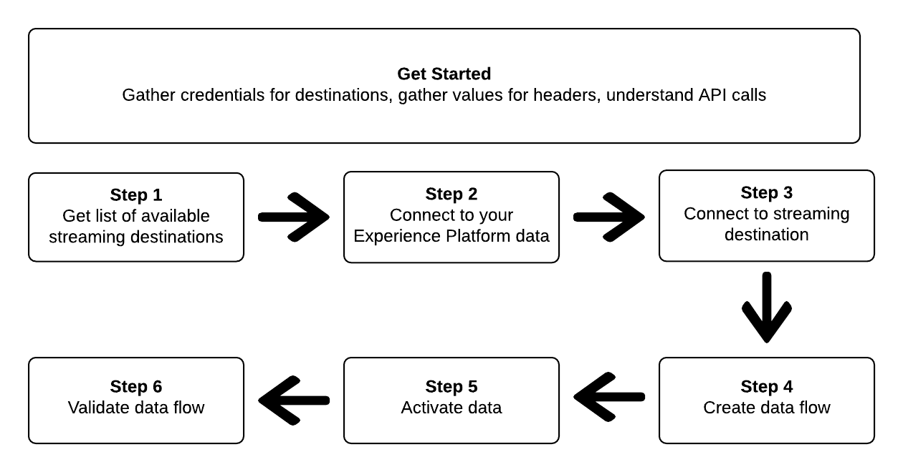
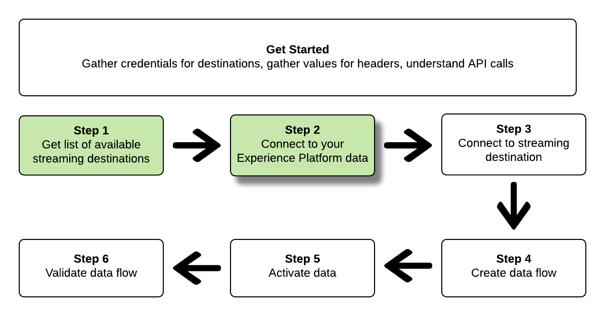
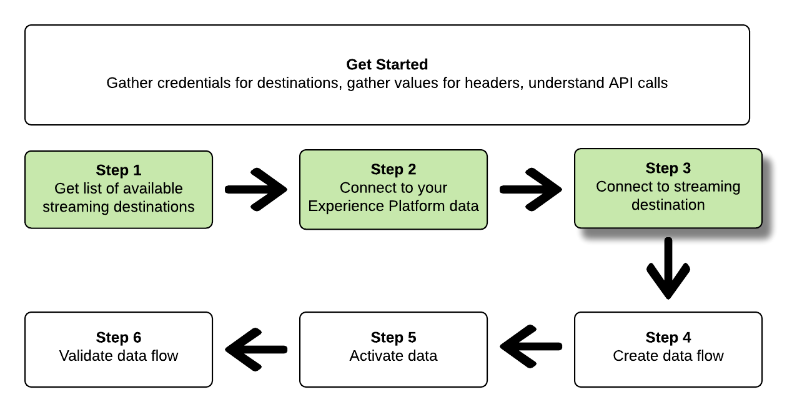

# Connect to streaming destinations and activate data using the Flow Service API

>[!IMPORTANT]
> 
>To connect to a destination, you need the **[!UICONTROL Manage Destinations]** [access control permission](/help/access-control/home.md#permissions). 
>
>To activate data, you need the **[!UICONTROL Manage Destinations]**, **[!UICONTROL Activate Destinations]**, **[!UICONTROL View Profiles]**, and **[!UICONTROL View Segments]** [access control permissions](/help/access-control/home.md#permissions).
>
>Read the [access control overview](/help/access-control/ui/overview.md) or contact your product administrator to obtain the required permissions.

This tutorial demonstrates how to use API calls to connect to your Adobe Experience Platform data, create a connection to a streaming cloud storage destination ([Amazon Kinesis](../catalog/cloud-storage/amazon-kinesis.md) or [Azure Event Hubs](../catalog/cloud-storage/azure-event-hubs.md)), create a dataflow to your new created destination, and activate data to your new created destination.

This tutorial uses the [!DNL Amazon Kinesis] destination in all examples, but the steps are identical for [!DNL Azure Event Hubs].



If you prefer to use the user interface in Platform to connect to a destination and activate data, see the [Connect a destination](../ui/connect-destination.md) and [Activate audience data to streaming segment export destinations](../ui/activate-segment-streaming-destinations.md) tutorials.

## Get started

This guide requires a working understanding of the following components of Adobe Experience Platform:

*   [[!DNL Experience Data Model (XDM) System]](../../xdm/home.md): The standardized framework by which Experience Platform organizes customer experience data.
*   [[!DNL Catalog Service]](../../catalog/home.md): [!DNL Catalog] is the system of record for data location and lineage within Experience Platform.
*   [Sandboxes](../../sandboxes/home.md): Experience Platform provides virtual sandboxes which partition a single Platform instance into separate virtual environments to help develop and evolve digital experience applications.

The following sections provide additional information that you will need to know in order to activate data to streaming destinations in Platform.

### Gather required credentials

To complete the steps in this tutorial, you should have the following credentials ready, depending on the type of destinations that you are connecting and activating segments to.

* For [!DNL Amazon Kinesis] connections: `accessKeyId`, `secretKey`, `region` or `connectionUrl`
* For [!DNL Azure Event Hubs] connections: `sasKeyName`, `sasKey`, `namespace`

### Reading sample API calls {#reading-sample-api-calls}

This tutorial provides example API calls to demonstrate how to format your requests. These include paths, required headers, and properly formatted request payloads. Sample JSON returned in API responses is also provided. For information on the conventions used in documentation for sample API calls, see the section on [how to read example API calls](../../landing/troubleshooting.md#how-do-i-format-an-api-request) in the Experience Platform troubleshooting guide.

### Gather values for required and optional headers {#gather-values}

In order to make calls to Platform APIs, you must first complete the [authentication tutorial](https://www.adobe.com/go/platform-api-authentication-en). Completing the authentication tutorial provides the values for each of the required headers in all Experience Platform API calls, as shown below:

*   Authorization: Bearer `{ACCESS_TOKEN}`
*   x-api-key: `{API_KEY}`
*   x-gw-ims-org-id: `{ORG_ID}`

Resources in Experience Platform can be isolated to specific virtual sandboxes. In requests to Platform APIs, you can specify the name and ID of the sandbox that the operation will take place in. These are optional parameters.

*   x-sandbox-name: `{SANDBOX_NAME}`

>[!NOTE]
>
>For more information on sandboxes in Experience Platform, see the [sandbox overview documentation](../../sandboxes/home.md).

All requests that contain a payload (POST, PUT, PATCH) require an additional media type header:

*   Content-Type: `application/json`

### Swagger documentation {#swagger-docs}

You can find accompanying reference documentation for all the API calls in this tutorial in Swagger. See the [Flow Service API documentation on Adobe I/O](https://www.adobe.io/experience-platform-apis/references/flow-service/). We recommend that you use this tutorial and the Swagger documentation page in parallel.

## Get the list of available streaming destinations {#get-the-list-of-available-streaming-destinations}


As a first step, you should decide which streaming destination to activate data to. To begin with, perform a call to request a list of available destinations that you can connect and activate segments to. Perform the following GET request to the `connectionSpecs` endpoint to return a list of available destinations:

**API format**

```http
GET /connectionSpecs
```

**Request** 

```shell
curl --location --request GET 'https://platform.adobe.io/data/foundation/flowservice/connectionSpecs' \
--header 'accept: application/json' \
--header 'x-gw-ims-org-id: {ORG_ID}' \
--header 'x-api-key: {API_KEY}' \
--header 'x-sandbox-name: {SANDBOX_NAME}' \
--header 'Authorization: Bearer {ACCESS_TOKEN}'
```


**Response**

A successful response contains a list of available destinations and their unique identifiers (`id`). Store the value of the destination that you plan to use, as it will be required in further steps. For example, if you want to connect and deliver segments to [!DNL Amazon Kinesis] or [!DNL Azure Event Hubs], look for the following snippet in the response:

```json
{
    "id": "86043421-563b-46ec-8e6c-e23184711bf6",
  "name": "Amazon Kinesis",
  ...
  ...
}

{
    "id": "bf9f5905-92b7-48bf-bf20-455bc6b60a4e",
  "name": "Azure Event Hubs",
  ...
  ...
}
```

## Connect to your Experience Platform data {#connect-to-your-experience-platform-data}



Next, you must connect to your Experience Platform data, so you can export profile data and activate it in your preferred destination. This consists of two substeps which are described below.

1. First, you must perform a call to authorize access to your data in Experience Platform, by setting up a base connection.
2. Then, using the base connection ID, you will make another call in which you create a source connection, which establishes the connection to your Experience Platform data.


### Authorize access to your data in Experience Platform

**API format**

```http
POST /connections
```

**Request**

```shell
curl --location --request POST 'https://platform.adobe.io/data/foundation/flowservice/connections' \
--header 'Authorization: Bearer {ACCESS_TOKEN}' \
--header 'x-api-key: {API_KEY}' \
--header 'x-gw-ims-org-id: {ORG_ID}' \
--header 'x-sandbox-name: {SANDBOX_NAME}' \
--header 'Content-Type: application/json' \
--data-raw '{
            "name": "Base connection to Experience Platform",
            "description": "This call establishes the connection to Experience Platform data",
            "connectionSpec": {
                "id": "{CONNECTION_SPEC_ID}",
                "version": "1.0"
            }
}'
```


*   `{CONNECTION_SPEC_ID}`: Use the connection spec ID for Profile Service - `8a9c3494-9708-43d7-ae3f-cda01e5030e1`.

**Response**

A successful response contains the base connection's unique identifier (`id`). Store this value as it is required in the next step to create the source connection.

```json
{
    "id": "1ed86558-59b5-42f7-9865-5859b552f7f4"
}
```

### Connect to your Experience Platform data {#connect-to-platform-data}

**API format**

```http
POST /sourceConnections
```

**Request**

```shell
curl --location --request POST 'https://platform.adobe.io/data/foundation/flowservice/sourceConnections' \
--header 'Authorization: Bearer {ACCESS_TOKEN}' \
--header 'x-api-key: {API_KEY}' \
--header 'x-gw-ims-org-id: {ORG_ID}' \
--header 'x-sandbox-name: {SANDBOX_NAME}' \
--header 'Content-Type: application/json' \
--data-raw '{
            "name": "Connecting to Profile Service",
            "description": "Optional",
            "connectionSpec": {
                "id": "{CONNECTION_SPEC_ID}",
                "version": "1.0"
            },
            "baseConnectionId": "{BASE_CONNECTION_ID}",
            "data": {
                "format": "json"
            },
            "params": {}
}'
```

*   `{BASE_CONNECTION_ID}`: Use the Id you have obtained in the previous step.
*   `{CONNECTION_SPEC_ID}`: Use the connection spec ID for Profile Service - `8a9c3494-9708-43d7-ae3f-cda01e5030e1`.

**Response**

A successful response returns the unique identifier (`id`) for the newly created source connection to Profile Service. This confirms that you have successfully connected to your Experience Platform data. Store this value as it is required in a later step.

```json
{
    "id": "ed48ae9b-c774-4b6e-88ae-9bc7748b6e97"
}
```


## Connect to streaming destination {#connect-to-streaming-destination}



In this step, you are setting up a connection to your desired streaming destination. This consists of two substeps which are described below.

1. First, you must perform a call to authorize access to the streaming destination, by setting up a base connection. 
2. Then, using the base connection ID, you will make another call in which you create a target connection, which specifies the location in your storage account where the exported data will be delivered, as well as the format of the data that will be exported.

### Authorize access to the streaming destination

**API format**

```http
POST /connections
```

**Request**

>[!IMPORTANT]
>
>The example below includes code comments prefixed with `//`. These comments highlight where different values must be used for different streaming destinations. Please remove the comments before using the snippet.

```shell
curl --location --request POST 'https://platform.adobe.io/data/foundation/flowservice/connections' \
--header 'Authorization: Bearer {ACCESS_TOKEN}' \
--header 'x-api-key: {API_KEY}' \
--header 'x-gw-ims-org-id: {ORG_ID}' \
--header 'x-sandbox-name: {SANDBOX_NAME}' \
--header 'Content-Type: application/json' \
--data-raw '{
    "name": "Connection for Amazon Kinesis/ Azure Event Hubs",
    "description": "summer advertising campaign",
    "connectionSpec": {
        "id": "{_CONNECTION_SPEC_ID}",
        "version": "1.0"
    },
    "auth": {
        "specName": "{AUTHENTICATION_CREDENTIALS}",
        "params": { // use these values for Amazon Kinesis connections
            "accessKeyId": "{ACCESS_ID}",
            "secretKey": "{SECRET_KEY}",
            "region": "{REGION}"
        },
        "params": { // use these values for Azure Event Hubs connections
            "sasKeyName": "{SAS_KEY_NAME}",
            "sasKey": "{SAS_KEY}",
            "namespace": "{EVENT_HUB_NAMESPACE}"
        }        
    }
}'
```

*   `{CONNECTION_SPEC_ID}`: Use the connection spec ID you obtained in the step [Get the list of available destinations](#get-the-list-of-available-destinations).
*   `{AUTHENTICATION_CREDENTIALS}`: fill in the name of your streaming destination: `Aws Kinesis authentication credentials` or `Azure EventHub authentication credentials`. 
*   `{ACCESS_ID}`: *For [!DNL Amazon Kinesis] connections.* Your access ID for your Amazon Kinesis storage location.
*   `{SECRET_KEY}`: *For [!DNL Amazon Kinesis] connections.* Your secret key for your Amazon Kinesis storage location.
*  `{REGION}`: *For [!DNL Amazon Kinesis] connections.* The region in your [!DNL Amazon Kinesis] account where Platform will stream your data.
*  `{SAS_KEY_NAME}`: *For [!DNL Azure Event Hubs] connections.* Fill in your SAS key name. Learn about authenticating to [!DNL Azure Event Hubs] with SAS keys in the [Microsoft documentation](https://docs.microsoft.com/en-us/azure/event-hubs/authenticate-shared-access-signature).
*  `{SAS_KEY}`: *For [!DNL Azure Event Hubs] connections.* Fill in your SAS key. Learn about authenticating to [!DNL Azure Event Hubs] with SAS keys in the [Microsoft documentation](https://docs.microsoft.com/en-us/azure/event-hubs/authenticate-shared-access-signature).
*  `{EVENT_HUB_NAMESPACE}`: *For [!DNL Azure Event Hubs] connections.* Fill in the [!DNL Azure Event Hubs] namespace where Platform will stream your data. For more information, see [Create an Event Hubs namespace](https://docs.microsoft.com/en-us/azure/event-hubs/event-hubs-create#create-an-event-hubs-namespace) in the [!DNL Microsoft] documentation.

**Response**

A successful response contains the base connection's unique identifier (`id`). Store this value as it is required in the next step to create a target connection.

```json
{
    "id": "1ed86558-59b5-42f7-9865-5859b552f7f4"
}
```

### Specify storage location and data format

**API format**

```http
POST /targetConnections
```

**Request**

>[!IMPORTANT]
>
>The example below includes code comments prefixed with `//`. These comments highlight where different values must be used for different streaming destinations. Please remove the comments before using the snippet.

```shell
curl --location --request POST 'https://platform.adobe.io/data/foundation/flowservice/targetConnections' \
--header 'Authorization: Bearer {ACCESS_TOKEN}' \
--header 'x-api-key: {API_KEY}' \
--header 'x-gw-ims-org-id: {ORG_ID}' \
--header 'Content-Type: application/json' \
--data-raw '{
    "name": "Amazon Kinesis/ Azure Event Hubs target connection",
    "description": "Connection to Amazon Kinesis/ Azure Event Hubs",
    "baseConnectionId": "{BASE_CONNECTION_ID}",
    "connectionSpec": {
        "id": "{CONNECTION_SPEC_ID}",
        "version": "1.0"
    },
    "data": {
        "format": "json"
    },
    "params": { // use these values for Amazon Kinesis connections
        "stream": "{NAME_OF_DATA_STREAM}", 
        "region": "{REGION}"
    },
    "params": { // use these values for Azure Event Hubs connections
        "eventHubName": "{EVENT_HUB_NAME}"
    }
}'
```

*   `{BASE_CONNECTION_ID}`: Use the base connection ID you obtained in the step above.
*   `{CONNECTION_SPEC_ID}`: Use the connection spec you obtained in the step [Get the list of available destinations](#get-the-list-of-available-destinations).
*   `{NAME_OF_DATA_STREAM}`: *For [!DNL Amazon Kinesis] connections.* Provide the name of your existing data stream in your [!DNL Amazon Kinesis] account. Platform will export data to this stream.
*   `{REGION}`: *For [!DNL Amazon Kinesis] connections.* The region in your Amazon Kinesis account where Platform will stream your data.
*   `{EVENT_HUB_NAME}`: *For [!DNL Azure Event Hubs] connections.* Fill in the [!DNL Azure Event Hub] name where Platform will stream your data. For more information, see [Create an event hub](https://docs.microsoft.com/en-us/azure/event-hubs/event-hubs-create#create-an-event-hub) in the [!DNL Microsoft] documentation.

**Response**

A successful response returns the unique identifier (`id`) for the newly created target connection to your streaming destination. Store this value as it is required in later steps.

```json
{
    "id": "12ab90c7-519c-4291-bd20-d64186b62da8"
}
```

## Create a data flow


Using the IDs you obtained in the previous steps, you can now create a dataflow between your Experience Platform data and the destination where you will activate data to. Think of this step as constructing the pipeline, through which data will later flow, between Experience Platform and your desired destination.

To create a dataflow, perform a POST request, as shown below, while providing the values mentioned below within the payload.

Perform the following POST request to create a dataflow.

**API format**

```http
POST /flows
```

**Request**

```shell
curl -X POST \
'https://platform.adobe.io/data/foundation/flowservice/flows' \
-H 'Authorization: Bearer {ACCESS_TOKEN}' \
-H 'x-api-key: {API_KEY}' \
-H 'x-gw-ims-org-id: {ORG_ID}' \
-H 'x-sandbox-name: {SANDBOX_NAME}' \
-H 'Content-Type: application/json' \
-d  '{
  "name": "Azure Event Hubs",
  "description": "Azure Event Hubs",
  "flowSpec": {
    "id": "{FLOW_SPEC_ID}",
    "version": "1.0"
  },
  "sourceConnectionIds": [
    "{SOURCE_CONNECTION_ID}"
  ],
  "targetConnectionIds": [
    "{TARGET_CONNECTION_ID}"
  ],
  "transformations": [
    {
      "name": "GeneralTransform",
      "params": {
        "profileSelectors": {
          "selectors": [
            
          ]
        },
        "segmentSelectors": {
          "selectors": [
            
          ]
        }
      }
    }
  ]
}
```

*   `{FLOW_SPEC_ID}`: The flow spec ID for profile based destinations is `71471eba-b620-49e4-90fd-23f1fa0174d8`. Use this value in the call. 
*   `{SOURCE_CONNECTION_ID}`: Use the source connection ID you obtained in the step [Connect to your Experience Platform](#connect-to-your-experience-platform-data).
*   `{TARGET_CONNECTION_ID}`: Use the target connection ID you obtained in the step [Connect to streaming destination](#connect-to-streaming-destination).

**Response**

A successful response returns the ID (`id`) of the newly created dataflow and an `etag`. Note down both values. as you will them in the next step, to activate segments.

```json
{
    "id": "8256cfb4-17e6-432c-a469-6aedafb16cd5",
    "etag": "8256cfb4-17e6-432c-a469-6aedafb16cd5"
}
```


## Activate data to your new destination {#activate-data}


Having created all the connections and the data flow, now you can activate your profile data to the streaming platform. In this step, you select which segments and which profile attributes you are sending to the destination and you can schedule and send data to the destination.

To activate segments to your new destination, you must perform a JSON PATCH operation, similar to the example below. You can activate mutiple segments and profile attributes in one call. To learn more about JSON PATCH, see the [RFC specification](https://tools.ietf.org/html/rfc6902). 

**API format**

```http
PATCH /flows
```

**Request**

```shell
curl --location --request PATCH 'https://platform.adobe.io/data/foundation/flowservice/flows/{DATAFLOW_ID}' \
--header 'Authorization: Bearer {ACCESS_TOKEN}' \
--header 'x-api-key: {API_KEY}' \
--header 'x-gw-ims-org-id: {ORG_ID}' \
--header 'Content-Type: application/json' \
--header 'x-sandbox-name: {SANDBOX_NAME}' \
--header 'If-Match: "{ETAG}"' \
--data-raw '[
  {
    "op": "add",
    "path": "/transformations/0/params/segmentSelectors/selectors/-",
    "value": {
      "type": "PLATFORM_SEGMENT",
      "value": {
        "name": "Name of the segment that you are activating",
        "description": "Description of the segment that you are activating",
        "id": "{SEGMENT_ID}"
      }
    }
  },
  {
    "op": "add",
    "path": "/transformations/0/params/profileSelectors/selectors/-",
    "value": {
      "type": "JSON_PATH",
      "value": {
        "operator": "EXISTS",
        "path": "{PROFILE_ATTRIBUTE}"
      }
    }
  }
]
```

| Property | Description |
| --------- | ----------- |
|`{DATAFLOW_ID}`| In the URL, use the ID of the dataflow that you created in the previous step. |
|`{ETAG}` | Get the `{ETAG}` from the response in the previous step, [Create a dataflow](#create-dataflow). The response format in the previous step has escaped quotes. You must use the unescaped values in the header of the request. See the example below: <br> <ul><li>Response example: `"etag":""7400453a-0000-1a00-0000-62b1c7a90000""`</li><li>Value to use in your request: `"etag": "7400453a-0000-1a00-0000-62b1c7a90000"`</li></ul> <br> The etag value updates with every successful update of a dataflow. |
| `{SEGMENT_ID}`| Provide the segment ID that you want to export to this destination. To retrieve segment IDs for the segments that you want to activate, see [retrieve a segment definition](https://www.adobe.io/experience-platform-apis/references/segmentation/#operation/retrieveSegmentDefinitionById) in the Experience Platform API reference. |
| `{PROFILE_ATTRIBUTE}`| For example, `"person.lastName"` |
| `op` | The operation call used to define the action needed to update the dataflow. Operations include: `add`, `replace`, and `remove`. To add a segment to a dataflow, use the `add` operation. |
| `path` | Defines the part of the flow that is to be updated. When adding a segment to a dataflow, use the path specified in the example. |
| `value` | The new value you want to update your parameter with. |
| `id` | Specify the ID of the segment you are adding to the destination dataflow.  |
| `name` | *Optional*. Specify the name of the segment you are adding to the destination dataflow. Note that this field is not mandatory and you can successfully add a segment to the destination dataflow without providing its name. |

**Response**

Look for a 202 OK response. No response body is returned. To validate that the request was correct, see the next step, Validate the data flow. 

## Validate the data flow


As a final step in the tutorial, you should validate that the segments and profile attributes have indeed been correctly mapped to the data flow.

To validate this, perform the following GET request:

**API format**

```http
GET /flows
```

**Request**

```shell
curl --location --request PATCH 'https://platform.adobe.io/data/foundation/flowservice/flows/{DATAFLOW_ID}' \
--header 'Authorization: Bearer {ACCESS_TOKEN}' \
--header 'x-api-key: {API_KEY}' \
--header 'x-gw-ims-org-id: {ORG_ID}' \
--header 'Content-Type: application/json' \
--header 'x-sandbox-name: prod' \
--header 'If-Match: "{ETAG}"' 
```

*   `{DATAFLOW_ID}`: Use the data flow from the previous step.
*   `{ETAG}`: Use the etag from the previous step.

**Response**

The returned response should include in the `transformations` parameter the segments and profile attributes that you submitted in the previous step. A sample `transformations` parameter in the response could look like below:

```json
"transformations": [
    {
        "name": "GeneralTransform",
        "params": {
            "profileSelectors": {
                        "selectors": [
                            {
                                "type": "JSON_PATH",
                                "value": {
                                    "path": "personalEmail.address",
                                    "operator": "EXISTS"
                                }
                            },
                            {
                                "type": "JSON_PATH",
                                "value": {
                                    "path": "person.lastname",
                                    "operator": "EXISTS"
                                }
                            }
                        ]
                    },
            "segmentSelectors": {
                "selectors": [
                    {
                        "type": "PLATFORM_SEGMENT",
                        "value": {
                            "name": "Men over 50",
                            "description": "",
                            "id": "72ddd79b-6b0a-4e97-a8d2-112ccd81bd02"
                        }
                    }
                ]
            }
        }
    }
],
```

**Exported Data**

>[!IMPORTANT]
>
> In addition to the profile attributes and the segments in the step [Activate data to your new destination](#activate-data), the exported data in [!DNL AWS Kinesis] and [!DNL Azure Event Hubs] will also include information about the identity map. This represents the identities of the exported profiles (for example [ECID](https://experienceleague.adobe.com/docs/id-service/using/intro/id-request.html), mobile ID, Google ID, email address, etc.). See an example below.

```json
{
  "person": {
    "email": "yourstruly@adobe.com"
  },
  "segmentMembership": {
    "ups": {
      "72ddd79b-6b0a-4e97-a8d2-112ccd81bd02": {
        "lastQualificationTime": "2020-03-03T21:24:39Z",
        "status": "exited"
      },
      "7841ba61-23c1-4bb3-a495-00d695fe1e93": {
        "lastQualificationTime": "2020-03-04T23:37:33Z",
        "status": "existing"
      }
    }
  },
  "identityMap": {
    "ecid": [
      {
        "id": "14575006536349286404619648085736425115"
      },
      {
        "id": "66478888669296734530114754794777368480"
      }
    ],
    "email_lc_sha256": [
      {
        "id": "655332b5fa2aea4498bf7a290cff017cb4"
      },
      {
        "id": "66baf76ef9de8b42df8903f00e0e3dc0b7"
      }
    ]
  }
}
```

## Using [!DNL Postman] collections to connect to streaming destinations  {#collections}

To connect to the streaming destinations described in this tutorial in a more streamlined way, you can use [[!DNL Postman]](https://www.postman.com/). 

[!DNL Postman] is a tool that you can use to make API calls and manage libraries of predefined calls and environments.

For this specific tutorial, the following [!DNL Postman] collections have been attached:

* [!DNL AWS Kinesis] [!DNL Postman] collection
* [!DNL Azure Event Hubs] [!DNL Postman] collection

Click [here](../assets/api/streaming-destination/DestinationPostmanCollection.zip) to download the collections archive.

Each collection includes the necessary requests and environment variables, for [!DNL AWS Kinesis], and [!DNL Azure Event Hub], respectively.

### How to use the [!DNL Postman] collections {#how-to-use-postman-collections}

To successfully connect to the destinations using the attached [!DNL Postman] collections, follow these steps:

* Download and install [!DNL Postman];
* [Download](../assets/api/streaming-destination/DestinationPostmanCollection.zip) and unzip the attached collections;
* Import the collections from their corresponding folders into [!DNL Postman];
* Fill in the environment variables according to the instructions in this article;
* Run the [!DNL API] requests from [!DNL Postman], based on the instructions in this article.

## API error handling {#api-error-handling}

The API endpoints in this tutorial follow the general Experience Platform API error message principles. Refer to [API status codes](/help/landing/troubleshooting.md#api-status-codes) and [request header errors](/help/landing/troubleshooting.md#request-header-errors) in the Platform troubleshooting guide for more information on interpreting error responses.

## Next steps {#next-steps}

By following this tutorial, you have successfully connected Platform to one of your preferred streaming destinations and set up a data flow to the respective destination. Outgoing data can now be used in the destination for customer analytics or any other data operations you may wish to perform. See the following pages for more details:

*   [Destinations overview](../home.md)
*   [Destinations Catalog overview](../catalog/overview.md)
