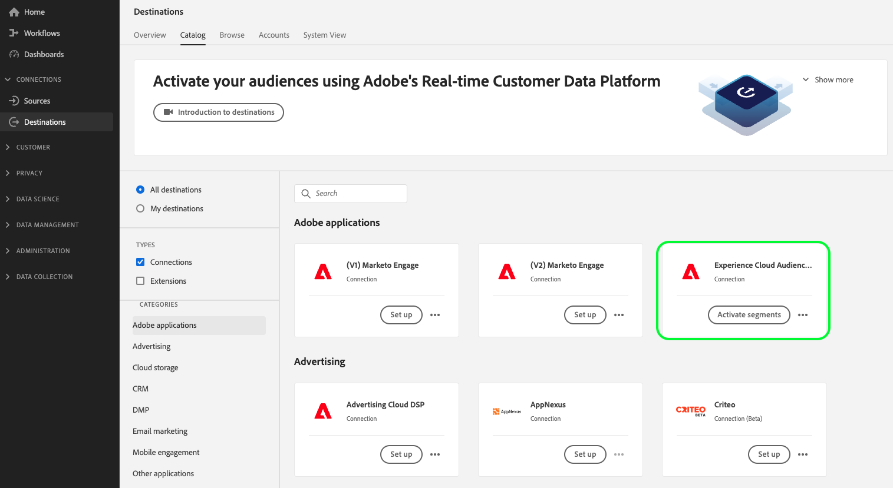
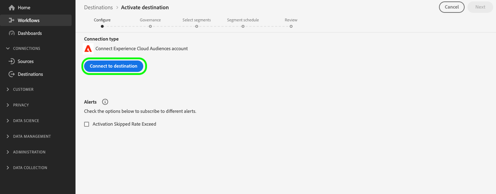
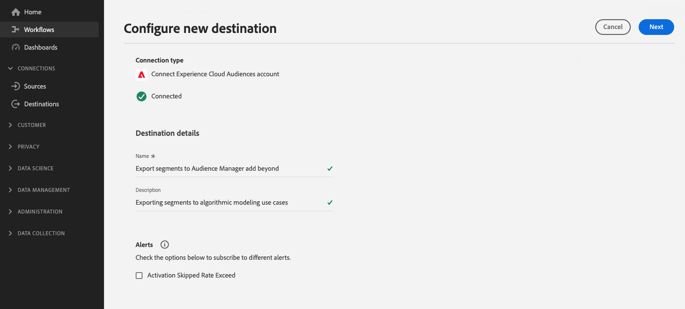

# [!UICONTROL Experience Cloud Audiences] connection

>[!AVAILABILITY]
>
> This destination is available to [Adobe Real-Time Customer Data Platform Prime and Ultimate](https://helpx.adobe.com/legal/product-descriptions/real-time-customer-data-platform.html) customers.

Use this destination to activate audiences from Real-Time CDP to Audience Manager and Adobe Analytics. You need an Audience Manager license to send audiences to Adobe Analytics.

To send audiences to other Adobe solutions, use the direct connections from Real-Time CDP to [Adobe Target](../personalization/adobe-target-connection.md), [Adobe Advertising](../advertising/adobe-advertising-cloud-connection.md), [Adobe Campaign](../email-marketing/adobe-campaign.md) and [Marketo Engage](../adobe/marketo-engage.md).

>[!IMPORTANT]
>
>This destination replaces the [legacy audience sharing integration](https://experienceleague.adobe.com/docs/audience-manager/user-guide/implementation-integration-guides/integration-experience-platform/aam-aep-audience-sharing.html#aep-segments-in-aam) from Real-Time Customer Data Platform to various Experience Cloud solutions.
> 
>If you are already sharing audiences from Real-Time CDP to Audience Manager and other Experience Cloud solutions via the [legacy audience sharing integration](https://experienceleague.adobe.com/docs/audience-manager/user-guide/implementation-integration-guides/integration-experience-platform/aam-aep-audience-sharing.html#aep-segments-in-aam), you must contact Customer Care to disable the legacy integration before using this destination.

## Use cases and benefits {#use-cases}

To help you better understand how and when you should use the [!UICONTROL Experience Cloud Audiences] destination, here are sample use cases that Real-Time CDP customers can solve by using this destination.

### Enable Data Management Platform use cases {#dmp-use-cases}

In Audience Manager, you can use Real-Time CDP audiences for Data Management Platform use cases, such as:

* Adding [third party data](https://experienceleague.adobe.com/docs/audience-manager/user-guide/overview/data-types-collected.html#third-party-data) to your segments;
* [Algorithmic modeling](https://experienceleague.adobe.com/docs/audience-manager/user-guide/features/algorithmic-models/look-alike-modeling/understanding-models.html);
* Activating your audiences to cookie-based destinations that are not yet supported in the Real-Time CDP destinations catalog.

### Granular control of exported audiences {#segments-control}

Use the new self-service audience sharing integration via the Experience Cloud Audiences destination to select which audiences to export to Audience Manager and beyond. This allows you to determine which audiences you want to share with other Experience Cloud solutions and which audiences you want to keep in Real-Time CDP exclusively.

The legacy audience sharing integration did not allow for a granular control of which audiences should be exported to Audience Manager and beyond.

### Share Real-Time CDP audiences with further Experience Cloud solutions {#share-segments-with-other-solutions}

Apart from sharing audiences with Audience Manager, the Real-Time CDP Audiences destination card enables you to share audiences with any other Experience Cloud solution that you are provisioned for, including: 

* Adobe Campaign
* Adobe Target
* Advertising Cloud
* Analytics
* Marketo

<!--

Note: briefly talk about when to share audiences to these destinations using the existing destination cards and when to share using the new Experience Cloud Audiences destination. 

-->

## Prerequisites {#prerequisites}

>[!IMPORTANT]
>
> * You need an Audience Manager license to enable the [Data Management Platform use cases](#dmp-use-cases) mentioned further above.
> * You *do not need* an Audience Manager license to share Real-Time CDP audiences with Adobe Advertising Cloud, Adobe Target, Marketo, and other Experience Cloud solutions, mentioned in the [section above](#share-segments-with-other-solutions).

### For customers who are using the legacy audience sharing solution

If you are already sharing audiences from Real-Time CDP to Audience Manager and other Experience Cloud solutions via the [legacy audience sharing integration](https://experienceleague.adobe.com/docs/audience-manager/user-guide/implementation-integration-guides/integration-experience-platform/aam-aep-audience-sharing.html#aep-segments-in-aam), you must contact Customer Care to disable the legacy integration.

The turnaround time to resolve the deprovisioning ticket is six business days or less. After the existing legacy integration has been disabled, you can proceed to [creating a connection](#connect) via the self-service destination card. 

>[!IMPORTANT]
>
>The audience export from Real-Time CDP to your other solutions will be stopped in the time between the ticket resolution and the time a new connection is established through the destination card. You can minimize this downtime by creating the connection via the destination card as soon as the ticket is closed.  

## Known limitations and callouts {#known-limitations}

Note the following known limitations and important callouts while using the Experience Cloud Audiences card:

* Currently, a single Experience Cloud Audiences destination is supported. Attempting to configure a second destination connection will result in an error.
* When connecting to the destination, you can see an option to [enable dataflow alerts](../../ui/alerts.md). Though visible in the UI, the **enable alerts option is not currently supported**.
* **Audience backfill support**: The first export to Audience Manager or other Experience Cloud solutions includes a historical population of the audiences. Users of the [legacy audience sharing integration](https://experienceleague.adobe.com/docs/audience-manager/user-guide/implementation-integration-guides/integration-experience-platform/aam-aep-audience-sharing.html#aep-segments-in-aam) who are configuring this destination should expect a backfill difference of approximately 6 hours.

### Latency when activating audiences {#audience-activation-latency}

There is a four-hour latency between the time that audiences are first activated in Real-Time CDP and the time that they are ready to be used in Audience Manager and other Experience Cloud solutions for certain use cases. 

It can take up to 24 hours for audiences to be fully available in Audience Manager for all use-cases and up to 48 hours for audiences from the Experience Cloud Audiences to appear in Audience Manager reports.

Metadata, such as audience names, is available in Audience Manager within minutes of setting up the export to the Experience Cloud Audiences destination.

## Supported identities {#supported-identities}

The profiles that are exported to the [!UICONTROL Experience Cloud Audiences] destination are mapped to the identities described in the table below. Learn more about [identities](/help/identity-service/namespaces.md).

|Target Identity|Description|Considerations|
|---|---|---|
|ECID|Experience Cloud ID| A namespace that represents ECID. This namespace can also be referred to by the following aliases: "Adobe Marketing Cloud ID", "Adobe Experience Cloud ID", "Adobe Experience Platform ID". See the following document on [ECID](/help/identity-service/ecid.md) for more information.|
|GAID|Google Advertising ID| Profiles ingested into Real-Time CDP with a primary identity of Google Advertising ID (GAID) can be exported to this destination.|
|IDFA|Apple ID for Advertisers| Profiles ingested into Real-Time CDP with a primary identity of Apple ID for Advertisers (IDFA) can be exported to this destination.|
|email_lc_sha256| Email addresses hashed with the SHA256 algorithm|Profiles ingested into Real-Time CDP with a primary identity of hashed email address can be exported to this destination.|

{style="table-layout:auto"}

## Supported audiences {#supported-audiences}

This section describes which type of audiences you can export to this destination.

| Audience origin | Supported | Description | 
---------|----------|----------|
| [!DNL Segmentation Service] | ✓ | Audiences generated through the Experience Platform [Segmentation Service](../../../segmentation/home.md).|
| Custom uploads | ✓ | Audiences [imported](../../../segmentation/ui/overview.md#import-audience) into Experience Platform from CSV files. |

{style="table-layout:auto"}

## Export type and frequency {#export-type-frequency}

Refer to the table below for information about the destination export type and frequency.

| Item | Type | Notes |
|---------|----------|---------|
| Export type | **[!UICONTROL Audience export]** | You are exporting all members of an audience keyed off the identities listed in the section above.|
| Export frequency | **[!UICONTROL Streaming]** | Streaming destinations are "always on" API-based connections. As soon as a profile is updated in Real-Time CDP based on audience evaluation, the connector sends the update downstream to the destination platform. Read more about [streaming destinations](/help/destinations/destination-types.md#streaming-destinations).|

{style="table-layout:auto"}

## Connect to the destination {#connect}

>[!IMPORTANT]
> 
>To connect to the destination, you need the **[!UICONTROL Manage Destinations]** [access control permission](/help/access-control/home.md#permissions). Read the [access control overview](/help/access-control/ui/overview.md) or contact your product administrator to obtain the required permissions.

To connect to this destination, follow the steps described in the [destination configuration tutorial](../../ui/connect-destination.md). In the configure destination workflow, fill in the fields listed in the two sections below.

### Authenticate to destination {#authenticate}

To authenticate to the destination, select **[!UICONTROL Set up]** in the destination card view in the catalog and select **[!UICONTROL Connect to destination]**.

### Fill in destination details {#destination-details}

To configure details for the destination, fill in the required and optional fields below. An asterisk next to a field in the UI indicates that the field is required.

* **[!UICONTROL Name]**: A name by which you will recognize this destination in the future.
* **[!UICONTROL Description]**: A description that will help you identify this destination in the future.

## Activate audiences to this destination {#activate}

>[!IMPORTANT]
> 
>To activate data, you need the **[!UICONTROL Manage Destinations]**, **[!UICONTROL Activate Destinations]**, **[!UICONTROL View Profiles]**, and **[!UICONTROL View Segments]** [access control permissions](/help/access-control/home.md#permissions). Read the [access control overview](/help/access-control/ui/overview.md) or contact your product administrator to obtain the required permissions.

Read [Activate profiles and audiences to streaming audience export destinations](/help/destinations/ui/activate-segment-streaming-destinations.md) for instructions on activating audiences to this destination. Note that no [mapping step](/help/destinations/ui/activate-segment-streaming-destinations.md#mapping) is required and no [scheduling step](/help/destinations/ui/activate-segment-streaming-destinations.md#scheduling) is available for this destination.

## Validate data export {#exported-data}

To validate successful data export, you can check that your audiences have successfully made it through to your desired Experience Cloud solution.

### Validate data in Audience Manager

Your Real-Time CDP audiences appear in Audience Manager as [signals](https://experienceleague.adobe.com/docs/audience-manager/user-guide/implementation-integration-guides/integration-experience-platform/aam-aep-audience-sharing.html#aep-segments-as-aam-signals), [traits](https://experienceleague.adobe.com/docs/audience-manager/user-guide/implementation-integration-guides/integration-experience-platform/aam-aep-audience-sharing.html#aep-segments-as-aam-traits), and [segments](https://experienceleague.adobe.com/docs/audience-manager/user-guide/implementation-integration-guides/integration-experience-platform/aam-aep-audience-sharing.html#aep-segments-as-aam-segments). You can verify in Audience Manager if the data has appeared as described in the documentation links above. 

Segment names begin populating in Audience Manager 15 minutes after the audiences have been sent from Real-Time CDP.

Segment population begins flowing into Audience Manager within 6 hours from being sent from Real-Time CDP, and will be updated every 24 hours in Audience Manager.

The full population will be visible in Audience Manager after 72 hours, and populations will continue to flow to Audience Manager unless the audience is removed from the destination in Real-Time CDP.

## Data usage and governance {#data-usage-governance}

All [!DNL Real-Time CDP] destinations are compliant with data usage policies when handling your data. For detailed information on how [!DNL Adobe Experience Platform] enforces data governance, read the [Data Governance overview](/help/data-governance/home.md).

Data governance in Real-Time CDP is enforced by both [data usage labels](/help/data-governance/labels/reference.md) and marketing actions.
Data usage labels will transfer to applications but marketing actions will not. This means that once they land in Audience Manager, audiences from Real-Time CDP can be exported to any available destinations. In Audience Manager, you can use [data export controls](https://experienceleague.adobe.com/docs/audience-manager/user-guide/features/data-export-controls.html) to block audiences from being exported to certain destinations.

Audiences marked with the [!DNL HIPAA] marketing action will not be sent from Real-Time CDP to Audience Manager.

### Permissions management in Audience Manager

Audiences and traits in Audience Manager are subject to [Role-Based Access Controls](https://experienceleague.adobe.com/docs/audience-manager/user-guide/features/administration/administration-overview.html) (RBAC). 

Audiences exported from Real-Time CDP are assigned to a specific datasource in Audience Manager called **[!UICONTROL Experience Platform Segments]**.

To allow only certain users access to the audiences, you can apply access controls to the audiences belonging to the datasource. You must set new access control permissions in Audience Manager for these audiences and traits created from Real-Time CDP segments.
