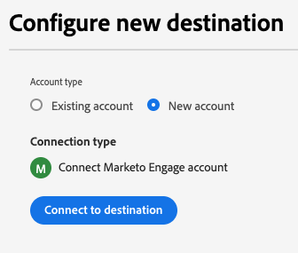
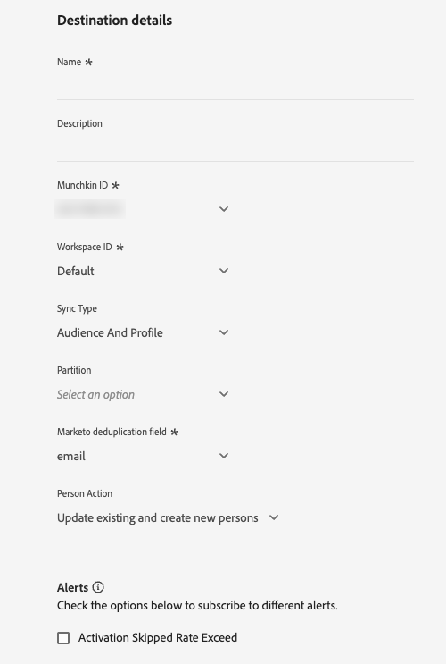
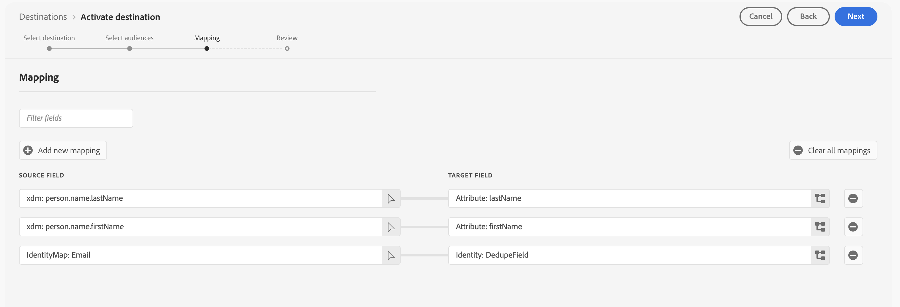
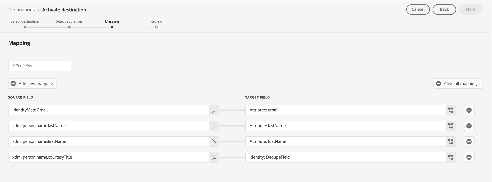

# Marketo Engage connection {#beta-marketo-engage-destination}

## Overview {#overview}

[!DNL Marketo Engage] is the only end-to-end customer experience management (CXM) solution for marketing, advertising, analytics, and commerce. It lets you automate and manage activities from CRM lead management and customer engagement to account-based marketing and revenue attribution.

The destination enables marketers to push audiences created in Adobe Experience Platform to Marketo where they will appear as static lists.

## Use cases {#use-cases}

To help you better understand how and when you should use the [!DNL Marketo Engage] destination, here are sample use cases that Adobe Experience Platform customers can solve by using this destination.

### Audience sync use cases {#audience-sync-use-cases}

**Re-engage known leads only**

The marketing team wants to run a win-back campaign targeting leads who have not engaged in 90+ days but already exist in Marketo.

They can activate the audiences to Marketo Engage and use the **[!UICONTROL Audience Only]** sync type.

### Audience and profile sync use cases {#audience-profile-sync-use-cases}

**Re-engage known leads and update leads**

The marketing team wants to launch a re-engagement campaign for existing Marketo contacts who have shown interest based on website visits. They also want to update the leads information (like preferences, demographics information), but not create any new people in Marketo.

They can activate the audiences to Marketo Engage and use the **[!UICONTROL Audience and Profile]** sync type combined with the **[!UICONTROL Update existing persons only]** action to make sure they target only the audiences that already exist in Marketo.

**Re-engage and expand reach with full profile sync**

The marketing team wants to activate a product interest audience for a new campaign. While many of the profiles already exist in Marketo, some are new and only present in Real-Time CDP. For the existing people, they want to make sure they update those people in Marketo, but also create new profiles.

They can activate their audiences in Marketo Engage and use the **[!UICONTROL Audience and Profile]** sync type combined with the **[!UICONTROL Update existing and create new persons]** action to make sure they target existing leads from Marketo and create new ones for the new audiences exported from Real-Time CDP.

## Prerequisites {#prerequisites}

The user setting up the destination must have the [Edit Person](https://experienceleague.adobe.com/en/docs/marketo/using/product-docs/administration/users-and-roles/descriptions-of-role-permissions#access-database) permission in their Marketo instance and partition.

## Supported identities {#supported-identities}

[!DNL Marketo Engage] supports the activation of identities described in the table below. Learn more about [identities](/help/identity-service/features/namespaces.md).

|Target Identity|Description|Considerations|
|---|---|---|
| `DedupeField` | The field used to identify and match existing leads in Marketo. | During the [mapping](#mapping) step, map any source field (such as `Email` or other custom identifiers) that you want to use as the deduplication field to this target identity. For best results, choose a field that is consistently available and unique across all your customer profiles. `ECID` is not supported as a deduplication field. |

{style="table-layout:auto"}

## Supported audiences {#supported-audiences}

This section describes which types of audiences you can export to this destination. The two tables below indicate which audiences this connector supports, by _audience origin_ and _profile types included in the audience_:

| Audience origin | Supported | Description | 
|---------|----------|----------|
| [!DNL Segmentation Service] | ✓ | Audiences generated through the Experience Platform [Segmentation Service](../../../segmentation/home.md).|
| All other audience origins | ✓ | This category includes all audience origins outside of audiences generated through the [!DNL Segmentation Service]. Read about the [various audience origins](/help/segmentation/ui/audience-portal.md#customize). Some examples include: <ul><li> custom upload audiences [imported](../../../segmentation/ui/audience-portal.md#import-audience) into Experience Platform from CSV files,</li><li> look-alike audiences, </li><li> federated audiences, </li><li> audiences generated in other Experience Platform apps such as Adobe Journey Optimizer, </li><li> and more. </li></ul>  |

{style="table-layout:auto"}

Supported audiences by audience data type:

| Audience data type | Supported | Description | Use cases |
|--------------------|-----------|-------------|-----------|
| [People audiences](/help/segmentation/types/people-audiences.md) | Yes | Based on customer profiles, allowing you to target specific groups of people for marketing campaigns. | Frequent buyers, cart abandoners |
| [Account audiences](/help/segmentation/types/account-audiences.md) | No | Target individuals within specific organizations for account-based marketing strategies. | B2B marketing |
| [Prospect audiences](/help/segmentation/types/prospect-audiences.md) | No | Target individuals who are not yet customers but share characteristics with your target audience. | Prospecting with third-party data |
| [Dataset exports](/help/catalog/datasets/overview.md) | No | Collections of structured data stored in the Adobe Experience Platform Data Lake. | Reporting, data science workflows |

{style="table-layout:auto"}

## Export type and frequency {#export-type-frequency}

Refer to the table below for information about the destination export type and frequency.

| Item | Type | Notes |
---------|----------|---------|
| Export type | **[!UICONTROL Audience export]** | You are exporting all members of an audience with the identifiers (email, ECID) used in the [!DNL Marketo Engage] destination.|
| Export frequency | **[!UICONTROL Streaming]** | Streaming destinations are "always on" API-based connections. As soon as a profile is updated in Experience Platform based on audience evaluation, the connector sends the update downstream to the destination platform. Read more about [streaming destinations](/help/destinations/destination-types.md#streaming-destinations).|

{style="table-layout:auto"}

## Lead matching behavior {#lead-matching}

Understanding how Marketo lead matching works helps you choose the right configuration for your use case. The matching behavior depends on your selected **[!UICONTROL Sync Type]** and **[!UICONTROL Person Action]** settings.

Marketo uses the **[!UICONTROL Marketo deduplication field]** you select to match Experience Platform profiles with existing Marketo leads. The matching process searches across all partitions in your Marketo instance to find existing leads. Refer to the table below to understand how leads are created and updated in your Marketo instance depending on your selected configuration.

| Sync Type | Person Action | Matching behavior |
|-----------|---------------|-------------------|
| **[!UICONTROL Profile Only]** | **[!UICONTROL Update existing and create new persons]** | <ul><li>Updates existing leads with new profile data</li><li>Creates new leads in selected partition for unmatched profiles</li></ul> |
| **[!UICONTROL Profile Only]** | **[!UICONTROL Update existing persons only]** | <ul><li>Updates existing leads with new profile data</li><li>No new leads created for unmatched profiles</li></ul> |
| **[!UICONTROL Audience Only]** | **[!UICONTROL Update existing and create new persons]** | <ul><li>Adds existing leads to audience lists</li><li>Creates new leads in selected partition for unmatched profiles</li><li>Adds new leads to audience lists</li></ul> |
| **[!UICONTROL Audience Only]** | **[!UICONTROL Update existing persons only]** | <ul><li>Adds existing leads to audience lists</li><li>No new leads created for unmatched profiles</li></ul> |
| **[!UICONTROL Audience and Profile]** | **[!UICONTROL Update existing and create new persons]** | <ul><li>Updates existing leads with new profile data</li><li>Adds existing leads to audience lists</li><li>Creates new leads in selected partition for unmatched profiles</li><li>Adds new leads to audience lists</li></ul> |
| **[!UICONTROL Audience and Profile]** | **[!UICONTROL Update existing persons only]** | <ul><li>Updates existing leads with new profile data</li><li>Adds existing leads to audience lists</li><li>No new leads created for unmatched profiles</li></ul> |

{style="table-layout:auto"}

### Important considerations

* **Deduplication field selection**: Choose a field that is consistently available and unique across your customer profiles (for example: email address, customer ID)
* **Partition handling**: When creating new leads, they are placed in your selected partition (or **[!UICONTROL Default]** partition if you did not select a partition)
* **Duplicate handling**: If multiple Marketo leads match the same profile, only the most recently updated lead will be updated
* **Cross-partition matching**: The system searches across all partitions to find existing leads, regardless of which partition you've selected for new leads

## Connect to the destination {#connect}

>[!IMPORTANT]
> 
>* To connect to the destination, you need the **[!UICONTROL View Destinations]** and **[!UICONTROL Manage Destinations]** [access control permissions](/help/access-control/home.md#permissions).
>
>* To activate data, you need the **[!UICONTROL View Destinations]**, **[!UICONTROL Activate Destinations]**, **[!UICONTROL View Profiles]**, and **[!UICONTROL View Segments]** [access control permissions](/help/access-control/home.md#permissions). Read the [access control overview](/help/access-control/ui/overview.md) or contact your product administrator to obtain the required permissions.

To connect to this destination, follow the steps described in the [destination configuration tutorial](../../ui/connect-destination.md). In the configure destination workflow, fill in the fields listed in the two sections below.

### Authenticate to destination {#authenticate}

To authenticate to the destination, select **[!UICONTROL Connect to destination]**.

### Fill in destination details {#destination-details}

To configure details for the destination, fill in the required and optional fields below. An asterisk next to a field in the UI indicates that the field is required.

* **[!UICONTROL Name]**: A name by which you will recognize this destination in the future.
* **[!UICONTROL Description]**: A description that will help you identify this destination in the future.
* **[!UICONTROL Munchkin ID]**: Select the [!DNL Marketo Munchkin ID] that you want to use for this destination. 
* **[!UICONTROL Workspace ID]**: Select your Marketo workspace ID.
* **[!UICONTROL Sync Type]**: Select the sync type that you want to use for this destination:
    * **[!UICONTROL Profile Only]**: Select this option when you want to keep Marketo lead profiles up to date with the latest information from Experience Platform.
    * **[!UICONTROL Audience Only]**: Select this option when you want to add audience members to Marketo lists without updating their profile information.
    * **[!UICONTROL Audience and Profile]**: Select this option when you want to both add audience members to Marketo lists and keep their profile information current.
* **[!UICONTROL Partition]**: *Partition selection is available only when choosing **[!UICONTROL Profile Only]** or **[!UICONTROL Audience and Profile]** sync types*. Select a Marketo partition ID associated with your chosen workspace. This allows you to specify which lead partition in Marketo will receive the exported data. If you don't choose a specific partition, your data will be sent to the **[!UICONTROL Default]** partition in Marketo.
* **[!UICONTROL Marketo deduplication field]**: Select the Marketo deduplication field that you want to use when updating existing Marketo leads. This selector shows the fields that you marked as deduplication fields in Marketo. If you want a specific field from Marketo to show up as a deduplication field, you must mark the field as a [searchable field](https://experienceleague.adobe.com/en/docs/marketo-developer/marketo/rest/lead-database/lead-database) in Marketo.
    
    >[!NOTE]
    >
    >Marketo `Lead ID` and Experience Cloud IDs (`ECID`) are not supported for deduplication.

* **[!UICONTROL Person Action]**: Select the Marketo action that you want to perform when exporting data.
    * **[!UICONTROL Update existing and create new persons]**: Select this option to update existing Marketo leads and create new leads for audience members who aren't already in Marketo. New leads will be created in your selected partition. If you did not select a partition, new leads are created in the **[!UICONTROL Default]** partition.
    * **[!UICONTROL Update existing persons only]**: Select this option when you only want to update existing Marketo leads without creating new ones. If multiple leads match the same profile, only the most recently updated Marketo lead will be updated with your Experience Platform data.
 
### Enable alerts {#enable-alerts}

You can enable alerts to receive notifications on the status of the dataflow to your destination. Select an alert from the list to subscribe to receive notifications on the status of your dataflow. For more information on alerts, read the guide on [subscribing to destinations alerts using the UI](../../ui/alerts.md).

When you are finished providing details for your destination connection, select **[!UICONTROL Next]**.

## Activate audiences to this destination {#activate}

>[!IMPORTANT]
> 
>* To activate data, you need the **[!UICONTROL View Destinations]**, **[!UICONTROL Activate Destinations]**, **[!UICONTROL View Profiles]**, and **[!UICONTROL View Segments]** [access control permissions](/help/access-control/home.md#permissions). Read the [access control overview](/help/access-control/ui/overview.md) or contact your product administrator to obtain the required permissions.
>* To export *identities*, you need the **[!UICONTROL View Identity Graph]** [access control permission](/help/access-control/home.md#permissions).   {width="100" zoomable="yes"}

Read [Activate profiles and audiences to streaming audience export destinations](/help/destinations/ui/activate-segment-streaming-destinations.md) for instructions on activating audiences to this destination.

### Required mappings {#required-mappings}

During the mapping step, map any source field (such as `email` or other custom identifiers) that you want to use as the deduplication field to the `DedupeField` target identity. For best results, choose a field that is consistently available and unique across all your customer profiles.

For Marketo to successfully create leads, you must also map the following required target attributes:

* `firstName`: The first name of the lead
* `lastName`: The last name of the lead  
* `email`: The email address of the lead

If you are using `email` as a deduplication field, you must also map the `firstName` and `lastName` attributes as shown in the image below.

If you are using a different deduplication field, you must manually map all three required attributes (`firstName`, `lastName`, `email`) as shown in the image below.

## Exported data / Validate data export {#exported-data}

After exporting audiences to Marketo Engage, you should log in to your Marketo account to verify that the audiences have been activated as expected. Check the relevant lead partitions and workspaces in Marketo to confirm that the audience data appears correctly and that the intended actions (such as updating or creating persons) have been performed. 

If you do not see the expected data, review your mapping and export settings in Adobe Experience Platform and try the export again.

## Data usage and governance {#data-usage-governance}

All [!DNL Adobe Experience Platform] destinations are compliant with data usage policies when handling your data. For detailed information on how [!DNL Adobe Experience Platform] enforces data governance, read the [Data Governance overview](/help/data-governance/home.md).
