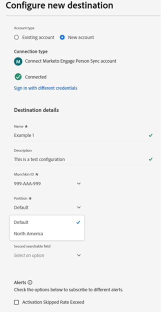
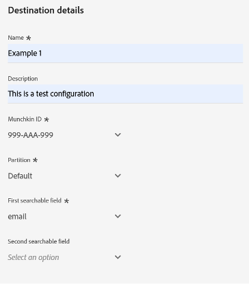
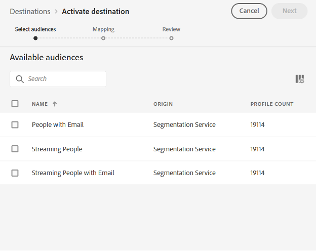
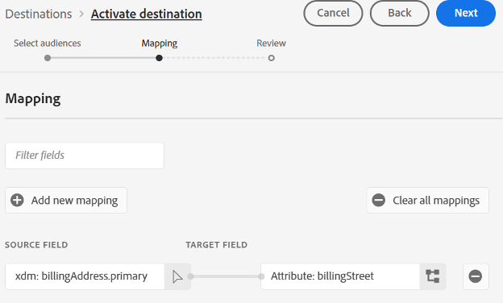
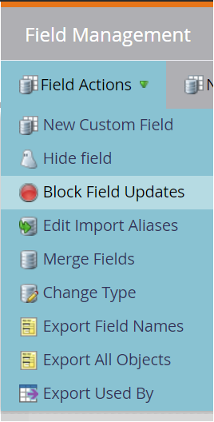
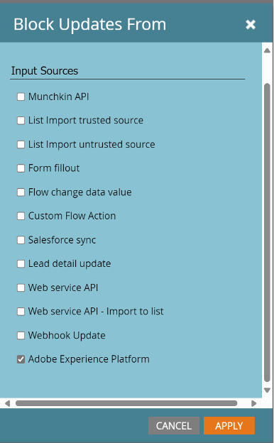

# Marketo Engage Person Sync connection {#marketo-engage-person-sync}

>[!IMPORTANT]
>
>This destination connector is in beta and only available to select customers. To request access, contact your Adobe representative.

## Migration to unified Marketo Engage destination {#migration}

Adobe is consolidating the **[[!UICONTROL (V2) Marketo Engage]](marketo-engage.md)** and **[!UICONTROL Marketo Engage Person Sync]** destinations into a single, unified **[!UICONTROL Marketo Engage]** destination card.

>[!IMPORTANT]
>
>The current **[!UICONTROL (V2) Marketo Engage]** and **[!UICONTROL Marketo Engage Person Sync]** destination cards will be deprecated in **March 2026**.

This new destination offers all features from both previous versions, making it easier to manage your Marketo integrations with a single, streamlined workflow:

* **Two sync actions in one place:** Both **[!UICONTROL Profile Sync]** and **[!UICONTROL Audience Sync]** are available and enabled by default. You can choose to use either or both, depending on your requirements.
* **Simplified authentication:** You no longer need to provide a [!UICONTROL Client ID] or [!UICONTROL Client Secret]. Only your [!DNL Munchkin ID] and [!DNL Workspace ID] are required.

### Migration steps {#what-you-need-to-do}

To ensure a smooth transition to the new destination, review the following key points and required actions:

* All users of the existing **[!UICONTROL (V2) Marketo Engage]** and **[!UICONTROL Marketo Engage Person Sync]** destinations must migrate to the new **[!UICONTROL Marketo Engage]** destination by March 2026.
* **Existing dataflows will not be migrated automatically.** You must [set up a new connection](../../ui/connect-destination.md) to the new **[!UICONTROL Marketo Engage]** destination and activate your audiences there. You can continue to use your existing audiences.

**To preserve your current sync behavior after migration:**

* If you only use **[!UICONTROL Audience Sync]** in the old **[!UICONTROL (V2) Marketo Engage]** and do not want to use **[!UICONTROL Profile Sync]**, make sure to disable **[!UICONTROL Profile Sync]** in your new destination setup.
* If you use **[!UICONTROL Profile Sync]** in the [[!UICONTROL Marketo Engage Person Sync]](marketo-engage-person-sync.md) destination and do not want to use **[!UICONTROL Audience Sync]**, make sure to disable **[!UICONTROL Audience Sync]** in your new destination setup.

## Overview {#overview}

Use the Marketo Engage Person Sync connector to stream updates from person audiences to the corresponding records in your Marketo Engage instance.

>[!IMPORTANT]
> 
>The [Marketo V2 Audience Sync Connector](/help/destinations/catalog/adobe/marketo-engage.md) should not be used in Create mode in conjunction with the Profile Update Sync Connector 

## Supported Identities and Attributes {#support-identities-and-attributes}

### Supported Identities {#supported-identities}

| Target Identity | Description                                                                                                                                                                              |
| --------------- | ---------------------------------------------------------------------------------------------------------------------------------------------------------------------------------------- |
| Email           | A namespace that represents an email address. This type of namespace is often associated to a single person and therefore can be used to identify that person across different channels. |

{style="table-layout:auto"}

### Supported Attributes {#supported-attributes}

You can map attributes from Experience Platform to any of the attributes that your organization has access to in Marketo. In Marketo, you can use the [Describe API](https://developer.adobe.com/marketo-apis/api/mapi/#tag/Leads/operation/describeUsingGET_6) request to retrieve the attribute fields that your organization has access to.

## Supported Audiences {#supported-audiences}

This section describes which types of audiences you can export to this destination.

| Audience origin      | Supported | Description                                                                                                                                                   |
| -------------------- | :-------: | ------------------------------------------------------------------------------------------------------------------------------------------------------------- |
| Segmentation Service |     ✓     | Audiences generated through the Experience Platform [Segmentation Service](https://experienceleague.adobe.com/en/docs/experience-platform/segmentation/home). |
| Custom uploads       |     ✓     | Audiences imported into Experience Platform from CSV files.                                                                                                   |

## Export Type and Frequency {#export-type-and-frequency}

Refer to the table below for information about the destination export type and frequency.

| Item             | Type      | Notes                                                                                                                                                                                                                                                                                                                                                                                     |
| ---------------- | --------- | ----------------------------------------------------------------------------------------------------------------------------------------------------------------------------------------------------------------------------------------------------------------------------------------------------------------------------------------------------------------------------------------- |
| Export frequency | Streaming | Streaming destinations are "always on" API-based connections. As soon as a profile is updated in Experience Platform based on audience evaluation, the connector sends the update downstream to the destination platform. Read more about [streaming destinations](/help/destinations/destination-types.md#streaming-destinations). |

{style="table-layout:auto"}

## Set up Destination {#set-up-destination}

>[!IMPORTANT]
>
>* To connect to the destination, you need the **[!UICONTROL View Destinations]** and **[!UICONTROL Manage Destinations]** [access control permissions](/help/access-control/home.md#permissions).

If your company has access to multiple organizations, make sure that you use the same organization in both Marketo Engage and Real-Time CDP, where you are setting up the destination connector to Marketo.  If you have already configured a destination, you may select an existing Marketo account to use with your new configuration.  If not, click the Connector to Destination prompt, which will allow you to set the name, description, and Marketo Munchkin ID of the desired destination.  Your Marketo Instance's Munchkin ID can be found in the Admin->Munchkin menu. 

>[!IMPORTANT]
>
>The user setting up the destination must have [Edit Person](https://experienceleague.adobe.com/en/docs/marketo/using/product-docs/administration/users-and-roles/descriptions-of-role-permissions#access-database) permission in the Marketo instance and partition.

*  **[!UICONTROL Name]**: A name by which you will recognize this destination in the future.
*  **[!UICONTROL Description]**: A description that will help you identify this destination in the future.
*  **[!UICONTROL Munchkin ID]**: The Munchkin ID is the unique identifier for a specific Marketo instance.
*  **[!UICONTROL Partition]**: a concept in Marketo Engage used to separate lead records by business concern
*  **[!UICONTROL First searchable field]**: Field to deduplicate on. The field must be present in each lead record of the input. Defaults to email
*  **[!UICONTROL First searchable field]**: A secondary field to deduplicate on. The field must be present in each lead record of the input. Optional

Once you have selected your instance, you will also need to select the Lead Partition which you want the configuration to integrate with. A [Lead Partition](https://experienceleague.adobe.com/en/docs/marketo/using/product-docs/administration/workspaces-and-person-partitions/understanding-workspaces-and-person-partitions) is a concept in Marketo Engage used to separate lead records by business concern, such as a brand or a sales region. If your Marketo subscription does not have the Workspaces and Partitions feature, or if no additional partitions have been created in your subscription, then only the Default partition will be available. A single configuration can only update lead records which exist in its configured partition.

>[!IMPORTANT]
> 
>After an audience has been activated to the Marketo destination for the first time, backfilling profiles that already existed in the audience prior to Marketo destination activation can take *up to 24 hours*. Going forward, any time profiles are added to the audience, they'll be added to Marketo immediately.

### Deduplication Fields {#deduplication-fields}

When sending updates to Marketo engage, records are selected based on the selected partition and one or two user-selected fields. If your destination is configured with the North America partition, and has Email Address and Company Name configured as deduplication fields, then all three fields must match to apply changes to an existing record. For example:

* The destination is configured with the North America partition
* Person with Email <test@example.com> and Company name Example Inc. in Experience Platform matches the destination audience
* Unless a record with those values already exists in the North America partition in Marketo, a new lead record will be created

If no matching lead record is found, a new record will be created.

## Activate Audiences {#activate-audiences}

>[!IMPORTANT]
> 
>* To activate data, you need the **[!UICONTROL View Destinations]**, **[!UICONTROL Activate Destinations]**, **[!UICONTROL View Profiles]**, and **[!UICONTROL View Segments]** [access control permissions](/help/access-control/home.md#permissions). Read the [access control overview](/help/access-control/ui/overview.md) or contact your product administrator to obtain the required permissions.

Read [Activate profiles and segments to streaming segment export destinations](/help/destinations/ui/activate-segment-streaming-destinations.md) for instructions on activating audience segments to this destination.

In the Activate Audiences step, you will be able to select from any person audiences which are visible to you.

## Field Mapping {#field-mapping}

For changes to a particular person attribute to be sent to Marketo Engage, the field must be mapped from a Real-Time CDP field to Marketo Field.

Experience Platform datatypes and Marketo datatypes can be mapped in the following ways:

| Experience Platform Data Type | Marketo Data Type                    |
| ----------------------------- | ------------------------------------ |
| String                        | String, Text Area, Url, Phone, Email |
| Enum                          | String                               |
| Date                          | Date                                 |
| Date-time                     | Datetime                             |
| Integer                       | Integer                              |
| Short                         | Integer                              |
| Long                          | Float                                |
| Double                        | Currency, Float, Percent             |
| Boolean                       | Boolean                              |
| Array                         | Not supported                        |
| Object                        | Not supported                        |
| Map                           | Not supported                        |
| Byte                          | Not supported                        |

{style="table-layout:auto"}

In some cases it is desirable to allow integrations to set the value of a field if there is none, while preventing integrations from making updates to fields which already have a value.  If you need to prevent the destination connector from overwriting existing values in your Marketo Engage instance, you can configure fields to block updates in the Admin->Field Management section of your Marketo instance and toggling the Adobe Experience Platform source type.

## Data Usage and Governance {#data-usage-and-governance}

All Adobe Experience Platform destinations are compliant with data usage policies when handling your data. For detailed information on how Adobe Experience Platform enforces data governance, see the [data governance overview](/help/data-governance/home.md).
