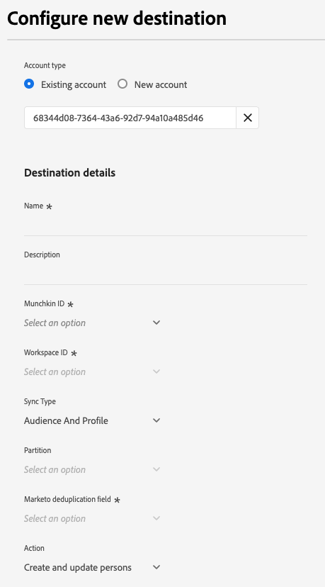
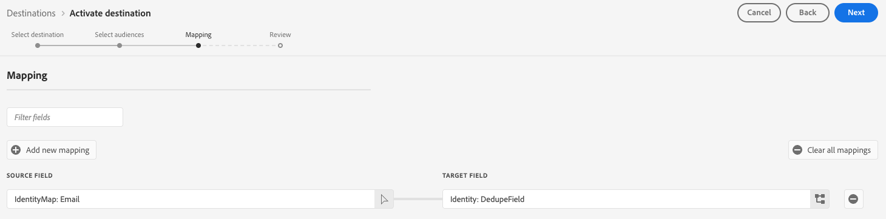

# Marketo Engage destination {#beta-marketo-engage-destination}

## Migration to unified Marketo Engage destination {#migration}

Adobe is consolidating the **[!UICONTROL (V2) Marketo Engage]** and **[[!UICONTROL Marketo Engage Person Sync]](marketo-engage-person-sync.md)** destinations into a single, unified **[!UICONTROL Marketo Engage]** destination card.

>[!IMPORTANT]
>
>The current **[!UICONTROL (V2) Marketo Engage]** and **[!UICONTROL Marketo Engage Person Sync]** destination cards will be deprecated in **December 2025**.

This new destination offers all features from both previous versions, making it easier to manage your Marketo integrations with a single, streamlined workflow:

* **Two sync actions in one place:** Both **[!UICONTROL Profile Sync]** and **[!UICONTROL Audience Sync]** are available and enabled by default. You can choose to use either or both, depending on your requirements.
* **Simplified authentication:** You no longer need to provide a [!UICONTROL Client ID] or [!UICONTROL Client Secret]. Only your [!DNL Munchkin ID] and [!DNL Workspace ID] are required.

### Migration steps {#what-you-need-to-do}

To ensure a smooth transition to the new destination, review the following key points and required actions:

* All users of the existing **[!UICONTROL (V2) Marketo Engage]** destination must migrate to the new **[!UICONTROL Marketo Engage]** destination by December 2025.
* **Existing dataflows will not be migrated automatically.** You must [set up a new connection](../../ui/connect-destination.md) to the new **[!UICONTROL Marketo Engage]** destination and activate your audiences there. You can continue to use your existing audiences.

**To preserve your current sync behavior after migration:**

* If you only use **[!UICONTROL Audience Sync]** in the old **[!UICONTROL (V2) Marketo Engage]** and do not want to use **[!UICONTROL Profile Sync]**, select the **[!UICONTROL Audience Only]** sync type in your new destination setup.
* If you use **[!UICONTROL Profile Sync]** in the [[!UICONTROL Marketo Engage Person Sync]](marketo-engage-person-sync.md) destination and do not want to use **[!UICONTROL Audience Sync]**, select the **[!UICONTROL Profile Only]** sync type in your new destination setup.

## Overview {#overview}

[!DNL Marketo Engage] is the only end-to-end customer experience management (CXM) solution for marketing, advertising, analytics, and commerce. It lets you automate and manage activities from CRM lead management and customer engagement to account-based marketing and revenue attribution.

The destination enables marketers to push audiences created in Adobe Experience Platform to Marketo where they will appear as static lists.

## Use cases {#use-cases}

To help you better understand how and when you should use the [!DNL Marketo Engage] destination, here are sample use cases that Adobe Experience Platform customers can solve by using this destination.

### Audience sync use cases {#audience-sync-use-cases}

**Re-engage known leads only**

The marketing team wants to run a win-back campaign targeting leads who have not engaged in 90+ days but already exist in Marketo. They want to avoid adding any new people.

They can activate the audiences to Marketo Engage and use the **[!UICONTROL Audience Only]** sync type combined with the **[!UICONTROL Update existing persons only]** action to make sure they target only the audiences that already exist in Marketo.

**Engage new and existing leads**

The marketing team wants to launch a targeted campaign based on product interest targeting existing leads and new leads that do not exist in Marketo.

They can activate their audiences in Marketo Engage and use the **[!UICONTROL Audience Only]** sync type combined with the **[!UICONTROL Update existing and create new persons]** action to make sure they target existing leads from Marketo and create new ones for the new audiences exported from Real-Time CDP.

### Audience and profile sync use cases {#audience-profile-sync-use-cases}

**Re-engage known leads and update leads**

The marketing team wants to launch a re-engagement campaign for existing Marketo contacts who have shown interest based on website visits. They also want to update the leads information (like preferences, demographics information), but not create any new people.

They can activate the audiences to Marketo Engage and use the **[!UICONTROL Audience and Profile]** sync type combined with the **[!UICONTROL Update existing persons only]** action to make sure they target only the audiences that already exist in Marketo.

**Re-engage and expand reach with full profile sync**

The marketing team wants to activate a product interest audience for a new campaign. While many of the profiles already exist in Marketo, some are new and only present in Real-Time CDP. For the existing people, they want to make sure they update those people in Marketo, but also create new profiles.

They can activate their audiences in Marketo Engage and use the **[!UICONTROL Audience and Profile]** sync type combined with the **[!UICONTROL Update existing and create new persons]** action to make sure they target existing leads from Marketo and create new ones for the new audiences exported from Real-Time CDP.

## Prerequisites {#prerequisites}

The user setting up the destination must have the [Edit Person](https://experienceleague.adobe.com/en/docs/marketo/using/product-docs/administration/users-and-roles/descriptions-of-role-permissions#access-database) permission in their Marketo instance and partition.

## Supported identities {#supported-identities}

[!DNL Marketo Engage] supports the activation of identities described in the table below. Learn more about [identities](/help/identity-service/features/namespaces.md).

|Target Identity|Description|Considerations|
|---|---|---|
| `DedupeField` | The field used to identify and match existing leads in Marketo. | During the [mapping](#mapping) step, map any source field (such as `Email` or other custom identifiers) that you want to use as the deduplication field to this target identity. For best results, choose a field that is consistently available and unique across all your customer profiles. |

{style="table-layout:auto"}

## Supported audiences {#supported-audiences}

This section describes which types of audiences you can export to this destination. The two tables below indicate which audiences this connector supports, by _audience origin_ and _profile types included in the audience_:

| Audience origin | Supported | Description | 
|---------|----------|----------|
| [!DNL Segmentation Service] | ✓ | Audiences generated through the Experience Platform [Segmentation Service](../../../segmentation/home.md).|
| All other audience origins | ✓ | This category includes all audience origins outside of audiences generated through the [!DNL Segmentation Service]. Read about the [various audience origins](/help/segmentation/ui/audience-portal.md#customize). Some examples include: <ul><li> custom upload audiences [imported](../../../segmentation/ui/audience-portal.md#import-audience) into Experience Platform from CSV files,</li><li> look-alike audiences, </li><li> federated audiences, </li><li> audiences generated in other Experience Platform apps such as Adobe Journey Optimizer, </li><li> and more. </li></ul>  |

{style="table-layout:auto"}

Supported audiences by audience data type:

| Audience data type | Supported | Description | Use cases |
|--------------------|-----------|-------------|-----------|
| [People audiences](/help/segmentation/types/people-audiences.md) | Yes | Based on customer profiles, allowing you to target specific groups of people for marketing campaigns. | Frequent buyers, cart abandoners |
| [Account audiences](/help/segmentation/types/account-audiences.md) | No | Target individuals within specific organizations for account-based marketing strategies. | B2B marketing |
| [Prospect audiences](/help/segmentation/types/prospect-audiences.md) | No | Target individuals who are not yet customers but share characteristics with your target audience. | Prospecting with third-party data |
| [Dataset exports](/help/catalog/datasets/overview.md) | No | Collections of structured data stored in the Adobe Experience Platform Data Lake. | Reporting, data science workflows |

{style="table-layout:auto"}

## Export type and frequency {#export-type-frequency}

Refer to the table below for information about the destination export type and frequency.

| Item | Type | Notes |
---------|----------|---------|
| Export type | **[!UICONTROL Audience export]** | You are exporting all members of an audience with the identifiers (email, ECID) used in the [!DNL Marketo Engage] destination.|
| Export frequency | **[!UICONTROL Streaming]** | Streaming destinations are "always on" API-based connections. As soon as a profile is updated in Experience Platform based on audience evaluation, the connector sends the update downstream to the destination platform. Read more about [streaming destinations](/help/destinations/destination-types.md#streaming-destinations).|

{style="table-layout:auto"}

## Connect to the destination {#connect}

>[!IMPORTANT]
> 
>* To connect to the destination, you need the **[!UICONTROL View Destinations]** and **[!UICONTROL Manage Destinations]** [access control permissions](/help/access-control/home.md#permissions).
>
>* To activate data, you need the **[!UICONTROL View Destinations]**, **[!UICONTROL Activate Destinations]**, **[!UICONTROL View Profiles]**, and **[!UICONTROL View Segments]** [access control permissions](/help/access-control/home.md#permissions). Read the [access control overview](/help/access-control/ui/overview.md) or contact your product administrator to obtain the required permissions.

To connect to this destination, follow the steps described in the [destination configuration tutorial](../../ui/connect-destination.md). In the configure destination workflow, fill in the fields listed in the two sections below.

### Authenticate to destination {#authenticate}

To authenticate to the destination, select **[!UICONTROL Connect to destination]**.

### Fill in destination details {#destination-details}

To configure details for the destination, fill in the required and optional fields below. An asterisk next to a field in the UI indicates that the field is required.

* **[!UICONTROL Name]**: A name by which you will recognize this destination in the future.
* **[!UICONTROL Description]**: A description that will help you identify this destination in the future.
* **[!UICONTROL Munchkin ID]**: Select the Marketo Munchkin ID that you want to use for this destination. 
* **[!UICONTROL Workspace ID]**: Select your Marketo workspace ID.
* **[!UICONTROL Sync Type]**: Select the sync type that you want to use for this destination:
    * **[!UICONTROL Profile Only]**: Select this option to sync profile data.
    * **[!UICONTROL Audience Only]**: Select this option to sync audience data.
    * **[!UICONTROL Audience and Profile]**: Select this option to sync both profile and audience data.
* **[!UICONTROL Partition]**: Optional. Select a Marketo lead partition ID associated with your chosen workspace. This allows you to specify which lead partition in Marketo will receive the exported audience data.
* **[!UICONTROL Marketo deduplication field]**: Select the Marketo deduplication field that you want to use. This selector shows the fields that you marked as deduplication fields in Marketo.
* **[!UICONTROL Action]**: Select the Marketo action that you want to perform when exporting audiences:
    * **[!UICONTROL Update existing persons only]**: Select this option to only update the audiences that have a match in Marketo.
    * **[!UICONTROL Update existing and create new persons]**: Select this option to update the audiences that have a match in Marketo and create matching ones for the rest.

### Enable alerts {#enable-alerts}

You can enable alerts to receive notifications on the status of the dataflow to your destination. Select an alert from the list to subscribe to receive notifications on the status of your dataflow. For more information on alerts, read the guide on [subscribing to destinations alerts using the UI](../../ui/alerts.md).

When you are finished providing details for your destination connection, select **[!UICONTROL Next]**.

## Activate audiences to this destination {#activate}

>[!IMPORTANT]
> 
>* To activate data, you need the **[!UICONTROL View Destinations]**, **[!UICONTROL Activate Destinations]**, **[!UICONTROL View Profiles]**, and **[!UICONTROL View Segments]** [access control permissions](/help/access-control/home.md#permissions). Read the [access control overview](/help/access-control/ui/overview.md) or contact your product administrator to obtain the required permissions.
>* To export *identities*, you need the **[!UICONTROL View Identity Graph]** [access control permission](/help/access-control/home.md#permissions).   {width="100" zoomable="yes"}

Read [Activate profiles and audiences to streaming audience export destinations](/help/destinations/ui/activate-segment-streaming-destinations.md) for instructions on activating audiences to this destination.

### Map attributes and identities {#mapping}

During the mapping step, map any source field (such as `Email` or other custom identifiers) that you want to use as the deduplication field to this target identity. For best results, choose a field that is consistently available and unique across all your customer profiles.

## Exported data / Validate data export {#exported-data}

After exporting audiences to Marketo Engage, you should log in to your Marketo account to verify that the audiences have been activated as expected. Check the relevant lead partitions and workspaces in Marketo to confirm that the audience data appears correctly and that the intended actions (such as updating or creating persons) have been performed. 

If you do not see the expected data, review your mapping and export settings in Adobe Experience Platform and try the export again.

## Data usage and governance {#data-usage-governance}

All [!DNL Adobe Experience Platform] destinations are compliant with data usage policies when handling your data. For detailed information on how [!DNL Adobe Experience Platform] enforces data governance, read the [Data Governance overview](/help/data-governance/home.md).
