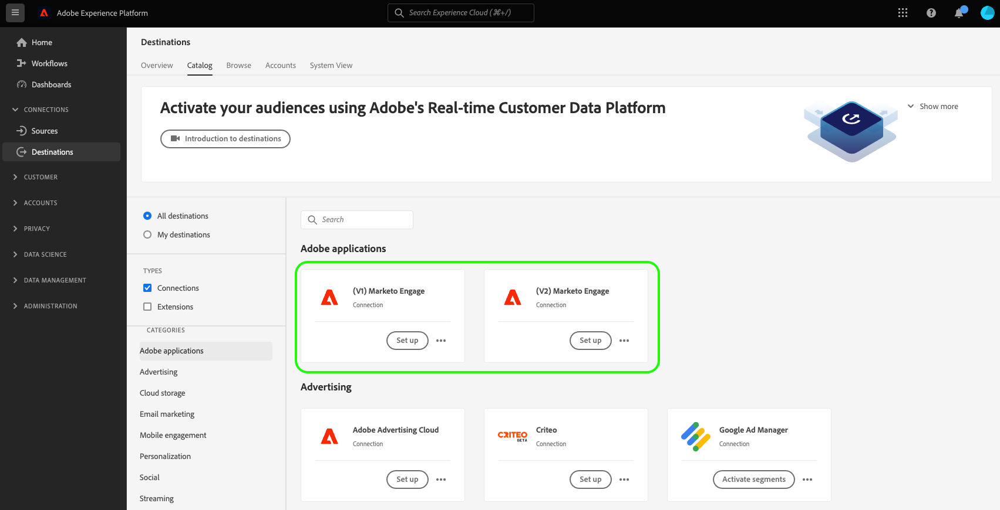

# Marketo Engage destination {#beta-marketo-engage-destination}

## Destination changelog {#changelog}

>[!IMPORTANT]
>
>With the release of the [enhanced Marketo V2 destination connector](/help/release-notes/2022/july-2022.md#destinations), you are now seeing two Marketo cards in the destinations catalog.
>* If you are already activating data to the **[!UICONTROL Marketo V1]** destination: Please create new dataflows to the **[!UICONTROL Marketo V2]** destination and delete existing dataflows to the **[!UICONTROL Marketo V1]** destination by February 2023. As of that date, the **[!UICONTROL Marketo V1]** destination card will be removed.
>* If you have not yet created any dataflows to the **[!UICONTROL Marketo V1]** destination, please use the new **[!UICONTROL Marketo V2]** card to connect to and export data to Marketo.

Improvements in the Marketo V2 destination include:

* In the **[!UICONTROL Schedule segment]** step of the activation workflow, in Marketo V1, you needed to manually add a **Mapping ID** to successfully export data to Marketo. This manual step is not required anymore in Marketo V2.
* In the **[!UICONTROL Mapping]** step of the activation workflow, in Marketo V1, you were able to map XDM fields to only three target fields in Marketo: `firstName`, `lastName`, and `companyName`. With the Marketo V2 release, you can now map XDM fields to many more fields in Marketo. For more information, read the [supported attributes](#supported-attributes) section further below.

## Overview {#overview}

[!DNL Marketo Engage] is the only end-to-end customer experience management (CXM) solution for marketing, advertising, analytics, and commerce. It lets you automate and manage activities from CRM lead management and customer engagement to account-based marketing and revenue attribution.

The destination enables marketers to push audiences created in Adobe Experience Platform to Marketo where they will appear as static lists.

## Supported identities and attributes {#supported-identities-attributes}

>[!NOTE]
>
>In the [mapping step](/help/destinations/ui/activate-segment-streaming-destinations.md#mapping) of the activate destination workflow, it is *mandatory* to map identities and *optional* to map attributes. Mapping Email and/or ECID from the Identity Namespace tab is the most important thing to do to ensure the person is matched in Marketo. Mapping Email ensures the highest match rate.

### Supported identities {#supported-identities}

|Target Identity|Description|
|---|---|
|ECID|A namespace that represents ECID. This namespace can also be referred to by the following aliases: "Adobe Marketing Cloud ID", "Adobe Experience Cloud ID", "Adobe Experience Platform ID". See the following document on [ECID](/help/identity-service/ecid.md) for more information.|
|Email|A namespace that represents an email address. This type of namespace is often associated to a single person and therefore can be used to identify that person across different channels.|

{style="table-layout:auto"}

### Supported attributes {#supported-attributes}

You can map attributes from Experience Platform to any of the attributes that your organization has access to in Marketo. In Marketo, you can use the [Describe API request](https://developers.marketo.com/rest-api/lead-database/leads/#describe) to retrieve the attribute fields that your organization has access to.

## External audiences support {#external-audiences-support}

All destinations support the activation of audiences generated through the Experience Platform [Segmentation Service](../../../segmentation/home.md).

Additionally, this destination also supports the activation of the external audiences described in the table below.

| External audience type | Description | 
---------|----------|
| Custom uploads | Audiences ingested into Experience Platform from CSV files. | 

{style="table-layout:auto"}

## Export type and frequency {#export-type-frequency}

Refer to the table below for information about the destination export type and frequency.

| Item | Type | Notes |
---------|----------|---------|
| Export type | **[!UICONTROL Audience export]** | You are exporting all members of an audience with the identifiers (email, ECID) used in the [!DNL Marketo Engage] destination.|
| Export frequency | **[!UICONTROL Streaming]** | Streaming destinations are "always on" API-based connections. As soon as a profile is updated in Experience Platform based on audience evaluation, the connector sends the update downstream to the destination platform. Read more about [streaming destinations](/help/destinations/destination-types.md#streaming-destinations).|

{style="table-layout:auto"}

## Set up destination and activate audiences {#set-up}

>[!IMPORTANT]
> 
>* To connect to the destination, you need the **[!UICONTROL Manage Destinations]** [access control permission](/help/access-control/home.md#permissions).
>* To activate data, you need the **[!UICONTROL Manage Destinations]**, **[!UICONTROL Activate Destinations]**, **[!UICONTROL View Profiles]**, and **[!UICONTROL View Segments]** [access control permissions](/help/access-control/home.md#permissions). Read the [access control overview](/help/access-control/ui/overview.md) or contact your product administrator to obtain the required permissions.

For detailed instructions on how to set up the destination and activate audiences, read [Push an Adobe Experience Platform Audience to a Marketo Static List](https://experienceleague.adobe.com/docs/marketo/using/product-docs/core-marketo-concepts/smart-lists-and-static-lists/static-lists/push-an-adobe-experience-cloud-segment-to-a-marketo-static-list.html?lang=en) in the Marketo documentation.

The video below also demonstrates the steps to configure a Marketo destination and activate audiences.

>[!IMPORTANT]
>
>The video does not entirely reflect current capability. For the most up-to-date information, please refer to the guide linked above. The following parts of the video are outdated:
> 
>* The destination card that you should use in the Experience Platform UI is **[!UICONTROL Marketo V2]**.
>* The video does not show the new **[!UICONTROL Person creation]** selector field in the connect to destination workflow.
>* The two limitations called out in the video do not apply anymore. You can now map many other profile attribute fields in addition to the audience membership information that was supported at the time the video was recorded. You can also export audience members to Marketo who do not yet exist in your Marketo static lists, and these will be added to the lists.
>* In the **[!UICONTROL Schedule audience step]** of the activation workflow, in Marketo V1, you needed to manually add a **[!UICONTROL Mapping ID]** to successfully export data to Marketo. This manual step is not required anymore in Marketo V2.

>[!VIDEO](https://video.tv.adobe.com/v/338248?quality=12)

<!--

## Connect to the destination {#connect}

To connect to this destination, follow the steps described in the [destination configuration tutorial](../../ui/connect-destination.md).

-->

## Data usage and governance {#data-usage-governance}

All [!DNL Adobe Experience Platform] destinations are compliant with data usage policies when handling your data. For detailed information on how [!DNL Adobe Experience Platform] enforces data governance, see the [data governance overview](https://experienceleague.adobe.com/docs/experience-platform/data-governance/home.html).

<!--

## Activate audiences to this destination {#activate}

See [Activate audience data to streaming audience export destinations](../../ui/activate-segment-streaming-destinations.md) for instructions on activating audiences to this destination.

-->
