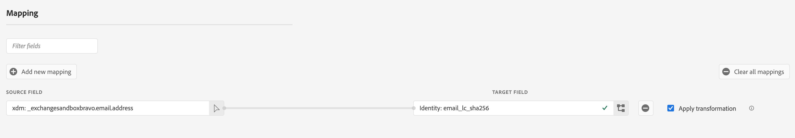
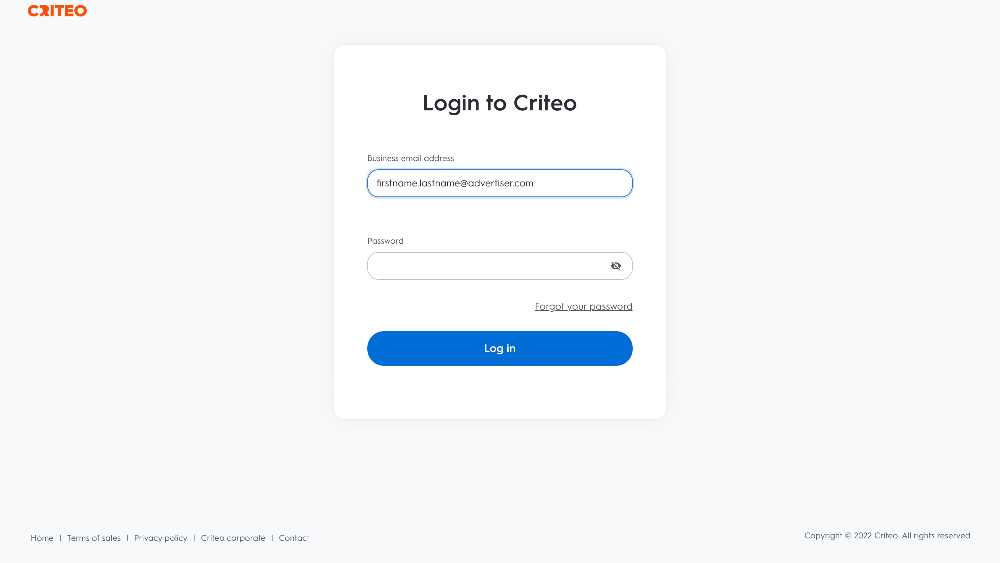
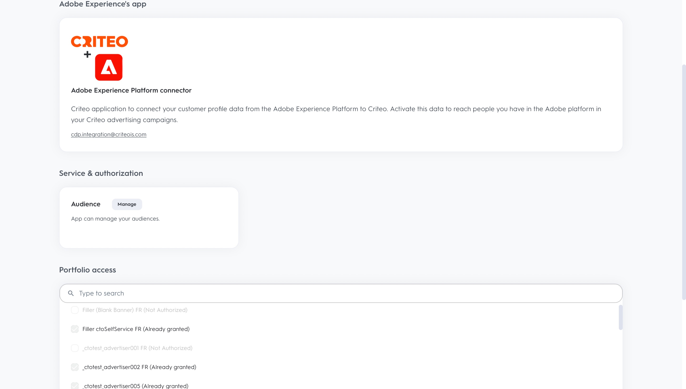
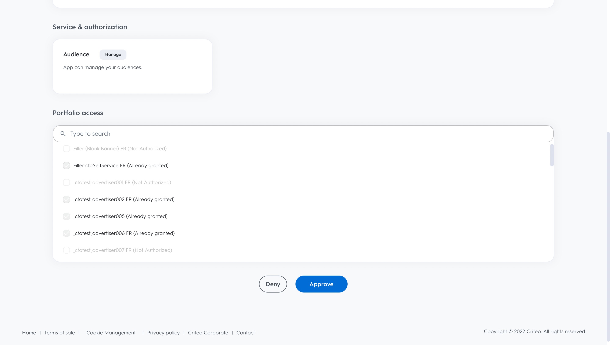
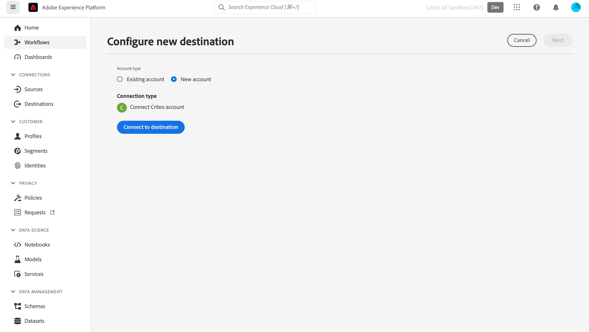
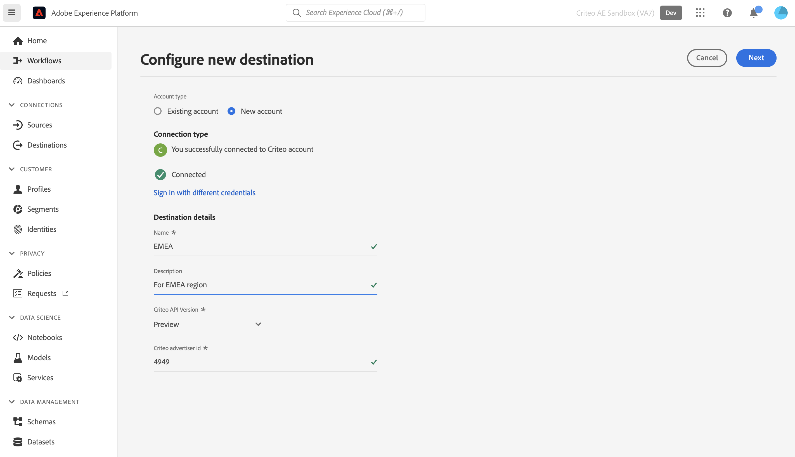

> [IMPORTANT]
> This is currently a beta product. Get in touch with your Criteo representative if you would like more details about what this means.

# CRITEO DESTINATION

## Overview

Criteo powers trusted and impactful advertising to bring richer experiences to every consumer across the open internet. With the world's largest commerce data set and best-in-class AI, Criteo ensures each touchpoint across the shopping journey is personalized to reach customers with the right ad, at the right time.

>[IMPORTANT]
>
>This documentation page was created by Criteo. For any inquiries or update requests, please contact Criteo directly [here](https://marketing.criteo.com/).


## Prerequisites

- You need to have an administrator user account on [Criteo Management Center](https://marketing.criteo.com).
- You'll need your Criteo Advertiser ID (Ask your Criteo contact if you don't have this in hand).
- Criteo only accepts SHA-256 and plain text emails (to be transformed into SHA-256 before sending). Please do not send any PII (Personal Identifiable Information such as individual's names or phone numbers).




## Supported identities

Criteo supports the activation of identities described in the table below. Learn more about [identities](https://experienceleague.adobe.com/docs/experience-platform/identity/namespaces.html?lang=en#getting-started).

| Target Identity | Description | Considerations |
| --- | --- | --- |
| email\_sha256 | Email addresses hashed with the SHA-256 algorithm | Both plain text and SHA-256 hashed email addresses are supported by Adobe Experience Platform. When your source field contains unhashed attributes, check the  Apply transformation  option, to have Platform automatically hash the data on activation. |


## Export type and frequency

Refer to the table below for information about the destination export type and frequency.

| Item | Type | Notes |
| --- | --- | --- |
| Export type | Profile-based | You are exporting all members of a segment, together with the desired schema fields (for example: email address, phone number, last name), as chosen in the select profile attributes screen of the [destination activation workflow](https://experienceleague.adobe.com/docs/experience-platform/destinations/ui/activate/activate-batch-profile-destinations.html?lang=en#select-attributes). |
| Export frequency | Streaming | Streaming destinations are "always on" API-based connections. As soon as a profile is updated in Experience Platform based on segment evaluation, the connector sends the update downstream to the destination platform. Read more about [streaming destinations](https://experienceleague.adobe.com/docs/experience-platform/destinations/destination-types.html?lang=en#streaming-destinations). |

## Use cases

To help you better understand how to use Criteo's destination, here are some goals that Adobe Experience Platform customers can achieve with Criteo.

### Use case 1 : Get traffic

Showcase your business with relevant product offers and flexible creatives. With intelligent product recommendations, your ads will automatically feature the products most likely to trigger visits and engagement. Flexible targeting allows you to build audiences from Criteo's commerce data set or from your own prospect lists and Adobe CDP segments

### Use case 2 : Increase website conversions

When visitors leave your website, remind them what they're missing with retargeting ads that increase conversions by showing special deals and hyper-relevant offers, wherever they go next. Connect your Adobe CDP segment to re-engage existing customers or target consumers similar to your most loyal shoppers.

## Connect to Criteo

### Authenticate to Criteo

Steps to connect are as follows:

1. Login to Adobe Experience Platform and connect to Criteo's destination


2. You will be redirected to Criteo to authorize the connection. You may need to first login with your Criteo credentials :








3. Fill out the details below marked with \*:
   1. Name : A name to help you recognize this destination in the future
   2. Description : A description to help you identify this destination in the future
   3. API Version: Preview
   4. Advertiser ID : Your Criteo advertiser ID






## Activate segments to this destination

Read [Activate profiles and segments to streaming segment export destinations](https://experienceleague.adobe.com/docs/experience-platform/destinations/ui/activate/activate-segment-streaming-destinations.html?lang=en) for instructions on activating audience segments to this destination.

## Exported data

The body of request sent by Adobe Destination Testing API is:
```json
{ 
    "profiles": [ 
        { 
            "segmentMembership": { 
                "ups": { 
                    "043ca8ba-3bad-4f9b-885e-5a80e61afce3": { 
                        "lastQualificationTime": "2022-03-28T13:27:44.110638Z", 
                        "status": "realized" 
                    } 
                } 
            }, 
            "identityMap": {}, 
            "_exchangesandboxbravo": { 
                "customValue": 1, 
                "emailSha256": "1c8494bbc4968277345133cca6ba257b9b3431b8a84833a99613cf075a62a16d" 
            } 
        } 
    ] 
} 
```


And, the body received by Criteo Destination is as follows:

```json
{ 
  "data": { 
    "type": "ContactlistWithUserAttributesAmendment", 
    "attributes": { 
      "operation": "add", 
      "identifierType": "sha256email", 
      "identifiers": [ 
        { 
          "identifier": "1c8494bbc4968277345133cca6ba257b9b3431b8a84833a99613cf075a62a16d", 
          "attributes": [{ "key": "customValue", "value": "1" }] 
        } 
      ] 
    } 
  } 
} 
```

## Data usage and governance

All Adobe Experience Platform destinations are compliant with data usage policies when handling your data. For detailed information on how Adobe Experience Platform enforces data governance, read the [Data Governance overview](https://experienceleague.adobe.com/docs/experience-platform/data-governance/home.html?lang=en).

## Additional resources

- [Criteo Help Center](https://help.criteo.com/kb/en)
- [Criteo Developer Portal](https://developers.criteo.com/marketing-solutions/v2022.04/reference/modifyaudienceuserswithattributes)
