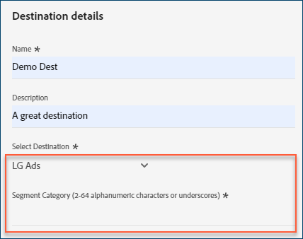
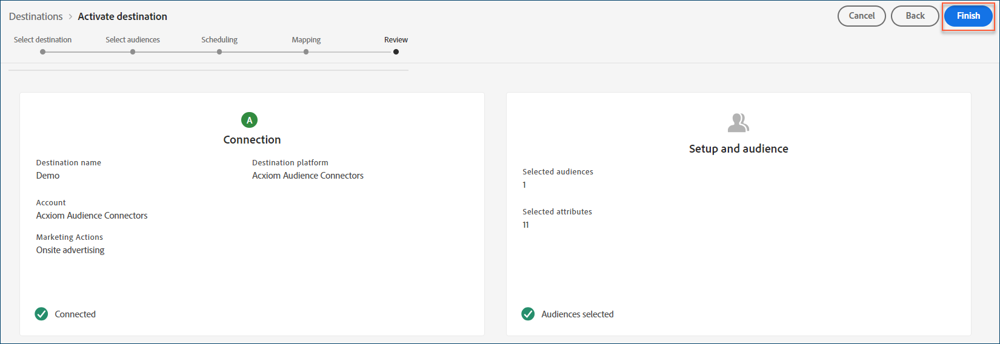

# [!DNL Acxiom Audience Connection] destination 

>[!NOTE]
>
>The [!DNL Acxiom Audience Connection] destination is in beta. This destination connector and documentation page are created and maintained by the [!DNL Acxiom] team. For any inquiries or update requests, contact Acxiom directly [here](mailto:acxiom-adobe-help@acxiom.com).

Use the [!DNL Acxiom Audience Connection] destination to enhance audiences with [!DNL Acxiom's] [Real ID&trade;](https://www.acxiom.com/real-id/real-id/) technology and activate audiences to multiple platforms, such as [!DNL Altice], [!DNL Ampersand], [!DNL Comcast], and more.

This tutorial provides instructions to create an [!DNL Acxiom Audience Connection] destination connector using the [!DNL Adobe Experience Platform] user interface. This connector is used to build and distribute audiences to selected destinations.

## Use cases {#use-cases}

To help you better understand how and when you should use the [!DNL Acxiom Audience Connection] destination, here is a sample use case that [!DNL Adobe Experience Platform] customers can solve by using this connector.

### Send audiences from Experience Platform to your Acxiom account {#send-audiences}

Use this destination connector if you are a marketing professional who wants to send audiences from [!DNL Experience Platform] to your [!DNL Acxiom] account, for cross-channel acquisition.

For example, the Marketing Operations department at a global financial services brand is interested in cross-channel customer acquisition through multiple advertising platforms. They can use the [!DNL Acxiom Audience Connection] destination connector to send audiences from [!DNL Experience Platform] to [!DNL Acxiom], enhance the audiences with [!DNL Acxiom's Real ID] technology, and activate the audiences to multiple platforms, such as [!DNL Altice], [!DNL Ampersand], [!DNL Comcast], and more.

## Prerequisites {#prerequisites}

* **Confirm Terms of Use:** Before you can configure a new [!DNL Acxiom Audience Connection] destination, you must read and sign [!DNL Acxiom's] Terms of Use Agreement. You will receive the link to the agreement once your executed sales order is complete.
* **Know your Adobe organization ID:** Your [!DNL Adobe] organization ID is needed to complete your Terms of User Agreement. See [!DNL Adobe's] *Organizations in Experience Cloud* topic for details on how to [view your organization ID](https://experienceleague.adobe.com/en/docs/core-services/interface/administration/organizations#concept_EA8AEE5B02CF46ACBDAD6A8508646255).

## Supported Destinations {#supported-destinations}

The [!DNL Acxiom Audience Connection] destination currently supports audience activation to the following platforms.  
    
* [!DNL Altice]
* [!DNL Ampersand]
* [!DNL Comcast]
* [!DNL Cox]
* [[!DNL LG Ads]](#lg-ads)
* [!DNL Spectrum]
* [!DNL Viant]

## Connect to the destination {#connect}

Authentication to [!DNL Acxiom's Audience Connection] destination is automatically handled behind the scenes for your convenience.

## Destination-specific settings {#destination-settings}

Some [!DNL Acxiom Audience Connection] destinations require additional information. The sections below provide detailed guidance on how to configure these options.

### [!DNL LG Ads] {#lg-ads}

To configure details for the destination, fill in the fields below.

* **Segment Category**: The target category or vertical that your segment falls into. Example: financial services, automotive, health, etc.
    

## Activate audiences to this destination {#activate}

>[!IMPORTANT]
> 
>* To activate data, you need the **[!UICONTROL View Destinations]**, **[!UICONTROL Activate Destinations]**, **[!UICONTROL View Profiles]**, and **[!UICONTROL View Segments]** [access control permissions](/help/access-control/home.md#permissions). Read the [access control overview](/help/access-control/ui/overview.md) or contact your product administrator to obtain the required permissions.
>* To export *identities*, you need the **[!UICONTROL View Identity Graph]** [access control permission](/help/access-control/home.md#permissions).   {width="100" zoomable="yes"}

Read [Activate audience data to batch profile export destinations](/help/destinations/ui/activate-batch-profile-destinations.md) for instructions on activating audiences to this destination.

>[!NOTE]
>
>The [!DNL Acxiom Audience Connection] destination only supports full file exports.

### Map attributes and identities {#map}

For the [!DNL Acxiom Audience Connection] destination to correctly receive the audience data, you must map the source fields from Experience Platform to the correct [!DNL Acxiom Audience Connection] target fields.

[!DNL Acxiom Audience Connection] only allows mapping to the following target fields. The target fields described in the table below must be mapped in the order shown below. 

| Field Name | Description|Required | Field Order | Max Length |
|---|---|---|---|---|          
|First Name|First name of individual|No|1|255|
|Middle|Middle name or initial of the individual|No|2|50|
|Last Name|Last name of the individual|Yes|3|255|
|Generational Suffix |Suffix of the individual|No|4|10|
|Address Line 1|Address 1 field of primary residence|Yes|5|255|
|Address Line 2|Address 2 field of primary residence|No|6|255|
|City|City of primary residence|Yes|7|255|
|State|State abbreviation of primary residence|Yes|8|2|
|Zip Code|Full zip code of primary residence|Yes|9|10|
|Email|Primary email By default, this field is used as a deduplication key to make the records unique|No|10|255|
|Phone|Phone number of individual (area code + number)  By default, this field is used as a deduplication key to make the records unique.|No|11|10|

In the **[!UICONTROL Source Field]** column, enter the name of each of the source attributes that you want to map to the corresponding target field, or select the arrow icon to open the **[!UICONTROL  Select source field]** screen. 

After you have mapped all the fields, select **[!UICONTROL Next]**.

If you are not using [!DNL Adobe's] standard schema, see the [Query Service UI guide](../../../query-service/ui/overview.md) documentation for information on how to use the query service to populate the [!DNL Adobe] standard schema with your field names. 

### Review {#review}

Once you have completed all the steps above, you have an opportunity to review your destination connection status and audience details before activating (distributing) it. The audiences you selected will show up at the bottom in a list. Each audience will be a separate call to the [!DNL Acxiom Audience Connection] API. 

If you are happy with the results, select **[!UICONTROL Finish]** to activate your destination. 

## Troubleshooting {#troubleshooting}

If your destination representative is unable to locate your audience, contact your [!DNL Adobe] representative for assistance. 

You will need to provide the following information to your [!DNL Adobe] representative:

* Audience name
* Destination name
* Audience activation date
* Exported file name

## Next steps {#next-steps}

By following this tutorial, you have successfully activated an audience to the selected destination platform. Next, contact your destination platform representative to begin setting up your campaign.

## Data usage and governance {#data-usage-governance}

All [!DNL Adobe Experience Platform] destinations are compliant with data usage policies when handling your data. For detailed information on how [!DNL Adobe Experience Platform] enforces data governance, read the [Data Governance overview](https://experienceleague.adobe.com/en/docs/experience-platform/data-governance/home).
