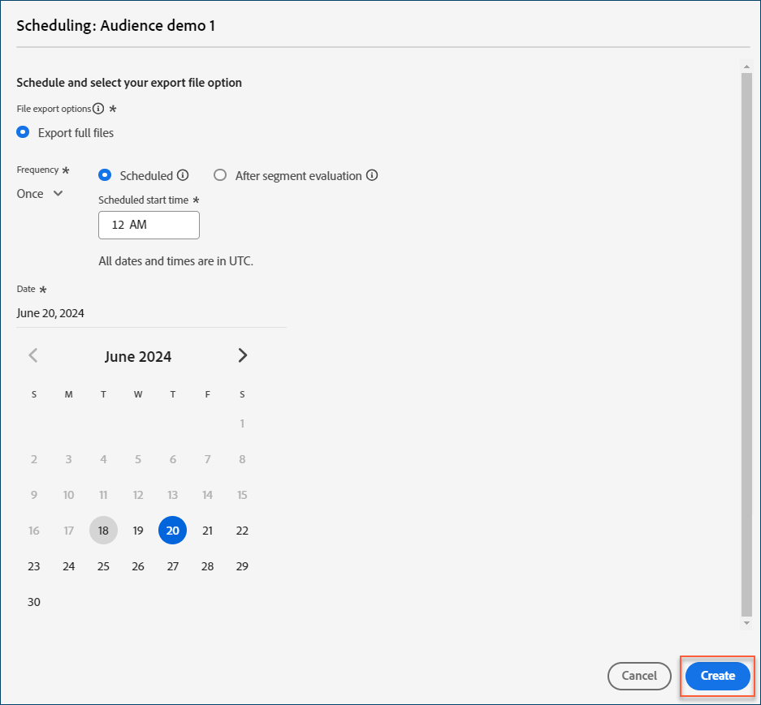
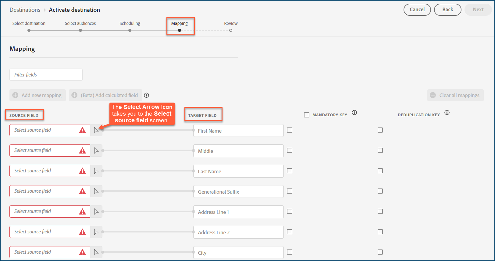

# [!DNL Acxiom Audience Connectors] destination 

>[!NOTE]
>
>The [!DNL Acxiom Audience Connectors] destination is in beta. This destination connector and documentation page are created and maintained by the [!DNL Acxiom] team. 

Use the [!DNL Acxiom Audience Connectors] destination to build an audience--hydrated by [!DNL Acxiom's Real ID] technology for improved match rates and precise scale--and send that audience to selected destinations.

This tutorial provides instructions to create an [!DNL Acxiom Audience Connectors] destination connector using the [!DNL Adobe Experience Platform] user interface. This connector is used to build and distribute audiences to selected destinations.

## Use cases {#use-cases}

To help you better understand how and when you should use the [!DNL Acxiom Audience Connectors] destination, here is a sample use case that [!DNL Adobe Experience Platform] customers can solve by using this connector.

### Send audiences from Experience Platform to your Acxiom account {#send-audiences}

Use this destination connector if you are a marketing professional who wants to send audiences from [!DNL Experience Platform] to your [!DNL Acxiom] account, for cross-channel acquisition.

For example, the Marketing Operations department at a global financial services brand uses the [!DNL Acxiom Audience Connectors] to send audiences from [!DNL Experience Platform] to [!DNL Acxiom] for cross-channel acquisition.

[!DNL Adobe] users start by creating an audience segment that they want to send to [!DNL Acxiom] for distribution. Once the [!DNL Adobe] segmentation service has run and the segment has been created, that segment can then be selected as the audience for a destination. 

While the segmentation runs you must set up the connection to a specific destination (e.g., [!DNL LG Ads], [!DNL Spectrum], [!DNL Altrice], etc.).

Once the connection is set up and the audience is created you can schedule the data flow within the destination card.

## Prerequisites {#prerequisites}
- **Set up sources and profiles:** Before you can send profile data from the [!DNL Adobe Experience Platform] to a destination, you must configure sources and profiles to populate your audiences. Read [!DNL Adobe’s] [Source connectors overview](https://experienceleague.adobe.com/en/docs/experience-platform/sources/home) for more information on setting up sources and ingesting data, and/or [Real-Time Customer Profile Overview](https://experienceleague.adobe.com/en/docs/experience-platform/profile/home) for more information on real-time customer profiles.
- **Create or import audiences:** [!DNL Acxiom’s Audience Connectors] activates (distributes) to audiences. Read the [Segmentation Service UI guide](https://experienceleague.adobe.com/en/docs/experience-platform/segmentation/ui/overview#create-audience) for additional information on creating and managing audiences and segment definitions.
- **Confirm Terms of Use:** Before you can configure a new [!DNL Acxiom Audience Connectors] destination, you must read and sign [!DNL Acxiom’s] Terms of Use Agreement. You will receive the link to the agreement once your executed sales order is complete. Until you sign the agreement, you will not see the [!DNL Acxiom Audience Connectors] destination card in the Experience Platform destination catalog. After you accept and sign the agreement, [!DNL Adobe] will complete your onboarding process and you will see the [!DNL Acxiom Audience Connectors] destination card.
- **Know your Adobe organization ID:** Your [!DNL Adobe] organization ID is needed to complete your Terms of User Agreement. See [!DNL Adobe's] *Organizations in Experience Cloud* topic for details on how to [view your organization ID](https://experienceleague.adobe.com/en/docs/core-services/interface/administration/organizations#concept_EA8AEE5B02CF46ACBDAD6A8508646255).

## Supported Destinations {#supported-destinations}

[!DNL Acxiom’s Audience Connectors] currently supports audience activation to the following platforms.  
	
- [!DNL Altice]
- [!DNL Ampersand]
- [!DNL Comcast]
- [!DNL Cox]
- [[!DNL LG Ads]](#lg-ads)
- [!DNL Spectrum]
- [!DNL Viant]

## Connect to a new destination {#connect}

>[!IMPORTANT]
>
>To connect to this destination, follow the steps described in the [destination configuration tutorial](https://experienceleague.adobe.com/en/docs/experience-platform/destinations/ui/connect-destination). In the configure destination workflow, fill in the fields listed in the two sections below. 

### Authenticate to destination {#authenticate}
To authenticate to the destination, select [!UICONTROL Connect to destination]. The connection details to [!DNL Acxiom Audience Connectors] are already configured by Acxiom.

### Fill in destination details {#destination-details}
After you have successfully connected to your Acxiom account, enter the required information to connect to the destination that you want to activate audiences to. 

- [!UICONTROL Name]: A name by which you will recognize this destination in the future.
- [!UICONTROL Description]: A description that will help you identify this destination in the future.
- [!UICONTROL Select Destination]: Use the drop-down menu to select the destination platform to which you want to activate audiences. The destination you select here directly affects what you see in the [destination-specific settings](#destination-specific-settings).

## Destinations specific settings {#destination-specific-settings}
Some [!DNL Acxiom Audience Connectors] destinations require additional information. The sections below provide detailed guidance on how to setup the destinations that have specific configuration options.

### [!DNL LG Ads] {#lg-ads}
To configure details for the destination, fill in the fields below.
- **Segment Category**: The target category or vertical that your segment falls into. Example: financial services, automotive, health, etc.
	

## Activate audiences to this destination {#activate} 
>[!IMPORTANT]
>
>- To activate data, you need the [!UICONTROL View Destinations], [!UICONTROL Activate Destinations], [!UICONTROL View Profiles], and [!UICONTROL View Segments] [access control permissions](../../../access-control/home.md#permissions). Read the [access control overview](../../../access-control/ui/overview.md) or contact your product administrator to obtain the required permissions.

**Scheduling**
1. Define the campaign schedule for your audience.  

[!DNL Acxiom Audience Connectors] autogenerates a file name, so you do not have to configure it yourself. By default, the naming schema for file names is: `<Adobe Audience ID>_<DateTime Stamp>`.
2. Once your schedule is defined, select **[!UICONTROL Create]** to save it.
3. Select **[!UICONTROL Next]**.

| Scheduling configuration  | Description                                |
|---------------------------|-------------------------------------------------------------|
| Export full files         | Select **Export full files**, as opposed to incremental files.  **Note** [!DNL Acxiom’s Audience Connectors] does not currently support [Incremental file exports](https://experienceleague.adobe.com/en/docs/experience-platform/destinations/ui/activate/activate-batch-profile-destinations).    |
| Frequency                 | By default, the scheduling frequency is set to once and creates a one-time distribution. This option indicates how often the destination connection is invoked for distribution. Currently it is limited to one run. |
| Scheduled                 | Select this option if you want to run your distributions at a scheduled time. Processing time is approximate.      |
| Scheduled start time      | The timestamp for the projected run is presented in a UTC time zone. This tells [!DNL Acxiom] when to distribute the audience to the selected destination.  
| After segment evaluation  | Select this option to have your distribution run right after it clears [!DNL Adobe’s] segment evaluation.    |
| Date                      | Select the start date from the calendar display. Use the left and right carrot brackets (< and >) to move through the months of the calendar and select the date to set the start date.       |
                                                          

Once your audience is distributed to the selected destination, contact your destination representative to begin setting up your campaign.

### Map attributes and identities {#map}
For the [!DNL Acxiom Audience Connectors] destination to correctly receive the audience data, you must map the source fields from Experience Platform to correct the [!DNL Acxiom Audience Connectors] target fields.

[!DNL Acxiom Audience Connectors] only allows mapping with the following fields and requires the profiles that come through our system to be in the following order: 

| Field Name         | Description|Required| Field Order | Max Length |
|--------------------|------------|--------|-------------|------------|          
|First Name          |First name of individual                                                                                                         |N|1           |255         |
|Middle              |Middle name or initial of the individual                                                                                         |N|2           |50          |
|Last Name           |Last name of the individual                                                                                                      |Y|3           |255         |
|Generational Suffix |Suffix of the individual                                                                                                         |N|4            |10          |
|Address Line 1      |Address 1 field of primary residence                                                                                             |Y|5            |255         |
|Address Line 2      |Address 2 field of primary residence                                                                                             |N|6            |255         |
|City                |City of primary residence                                                                                                        |Y|7           |255         |
|State               |State abbreviation of primary residence                                                                                          |Y|8           |2           |
|Zip Code            |Full zip code of primary residence                                                                                               |Y|9            |10          |
|Email               |Primary email By default, this field is used as a deduplication key to make the records unique                                   |N|10         |255         |
|Phone               |Phone number of individual (area code + number) By default, this field is used as a deduplication key to make the records unique |N|11          |10          |

1. Under the **Source Field** column, in the red select source field boxes, enter the name of each of the attributes you want to map from your input file to the corresponding target field. If you do not know the attribute name you can search for the attribute by selecting the **Select Arrow** icon and then selecting the source field from the directory on the **Select source field** screen. 

2. Once all your fields are mapped, select **[!UICONTROL Next]**.

For additional information on mapping custom audiences in [!DNL Adobe Experience Platform], see the Mapping section in the [Data Prep UI Guide](https://experienceleague.adobe.com/en/docs/experience-platform/data-prep/ui/mapping). The Source Fields are [!DNL Adobe] standard fields that come from the [!DNL Adobe] schema. The Target Fields are the predefined fields required by [!DNL Acxiom’s Audience Connectors].

If you are not using [!DNL Adobe’s] standard schema, see the [Query Service UI guide](../../../query-service/ui/overview.md) documentation for information on how to use the query service to populate the [!DNL Adobe] standard schema with your field names. 

### Review {#review}
Once you have completed all the steps above, you have an opportunity to review your destination connection status and audience details before activating (distributing) it. The audiences you selected will show up at the bottom in a list. Each audience will be a separate call to the [!DNL Acxiom Audience Connectors] API. 

If you are happy with the results, select **Finish** to activate your destination. 

## Troubleshooting {#troubleshooting}
If your destination representative is unable to locate the audience, contact [!DNL Adobe] support for assistance in troubleshooting the delivery. 

You will need the following information to provide to [!DNL Adobe] support:
- Segment name
- Destination name
- Date of distribution
- File name

## Next steps

By following this tutorial, you have successfully distributed an audience to the selected destination. Next, contact your destination representative to begin setting up your campaign.

## Data usage and governance {#data-usage-governance}

All [!DNL Adobe Experience Platform] destinations are compliant with data usage policies when handling your data. For detailed information on how [!DNL Adobe Experience Platform] enforces data governance, read the [Data Governance overview](https://experienceleague.adobe.com/en/docs/experience-platform/data-governance/home).

